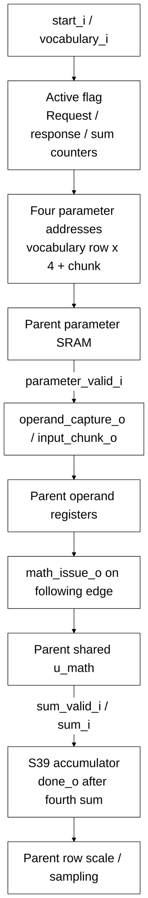

# llm_head_engine.sv

[Documentation](../../README.md) → [Source guide](../full_graph.md) → [RTL index](README.md)

**Source:** [llm_head_engine.sv](<../../../Verilog%20Source%20code/llm_head_engine.sv>). **Số dòng:** 48. **SHA-256:** `54fc2ea9fd0dd045caf6bdaf9e963fd8951180026d9770576f66c25b594fd080`.

## Khối này làm gì?

Issue four ordered parameter reads for a vocabulary row, request parent operand capture and shared SIMD issue, then accumulate four sum_valid responses into S39. The parent owns row-scale caching, RNE, PRNG order and token selection.

## Sơ đồ kiến trúc



## Cách hoạt động chi tiết

Issue four ordered parameter reads for a vocabulary row, request parent operand capture and shared SIMD issue, then accumulate four sum_valid responses into S39. The parent owns row-scale caching, RNE, PRNG order and token selection.

## Các nhóm logic trong source

### [Dòng 1–18: Parent-facing ports and counters](<../../../Verilog%20Source%20code/llm_head_engine.sv#L1>)

<!-- source-range:1:18 -->
```systemverilog
// Four ordered int8 weight chunks per vocabulary row. The parent owns scaling
// and sampling; this engine owns memory issue, SIMD response count and dot sum.
module llm_head_engine (
    input logic clk, rst_n, start_i, cancel_i,
    input logic [11:0] vocabulary_i,
    output logic parameter_req_o,
    output logic [14:0] parameter_address_o,
    input logic parameter_valid_i,
    output logic operand_capture_o, math_issue_o,
    output logic [1:0] input_chunk_o,
    input logic sum_valid_i,
    input logic signed [60:0] sum_i,
    output logic done_o,
    output logic signed [38:0] accumulator_o
);
    logic active_q;
    logic [11:0] vocabulary_q;
    logic [2:0] request_q, response_q, sum_q;
```

### [Dòng 19–41: Ordered request/capture and response completion](<../../../Verilog%20Source%20code/llm_head_engine.sv#L19>)

<!-- source-range:19:41 -->
```systemverilog
    assign parameter_req_o = active_q && request_q < 4;
    assign parameter_address_o = {1'b0, vocabulary_q, request_q[1:0]};
    assign operand_capture_o = active_q && parameter_valid_i && response_q < 4;
    assign input_chunk_o = response_q[1:0];
    always_ff @(posedge clk or negedge rst_n) begin
        if (!rst_n) begin
            active_q <= 0; done_o <= 0; math_issue_o <= 0;
            request_q <= 0; response_q <= 0; sum_q <= 0;
        end else begin
            done_o <= 0;
            math_issue_o <= operand_capture_o;
            if (cancel_i) begin active_q <= 0; math_issue_o <= 0; end
            else if (start_i && !active_q) begin
                active_q <= 1; request_q <= 0; response_q <= 0; sum_q <= 0;
            end else if (active_q) begin
                if (parameter_req_o) request_q <= request_q + 1'b1;
                if (operand_capture_o) response_q <= response_q + 1'b1;
                if (sum_valid_i) begin
                    sum_q <= sum_q + 1'b1;
                    if (sum_q == 3) begin active_q <= 0; done_o <= 1; end
                end
            end
        end
```

### [Dòng 42–48: Vocabulary and accumulator registers](<../../../Verilog%20Source%20code/llm_head_engine.sv#L42>)

<!-- source-range:42:48 -->
```systemverilog
    end
    always_ff @(posedge clk)
        if (rst_n && !cancel_i) begin
            if (start_i && !active_q) begin vocabulary_q <= vocabulary_i; accumulator_o <= 0; end
            else if (active_q && sum_valid_i) accumulator_o <= accumulator_o + $signed(sum_i[38:0]);
        end
endmodule
```
