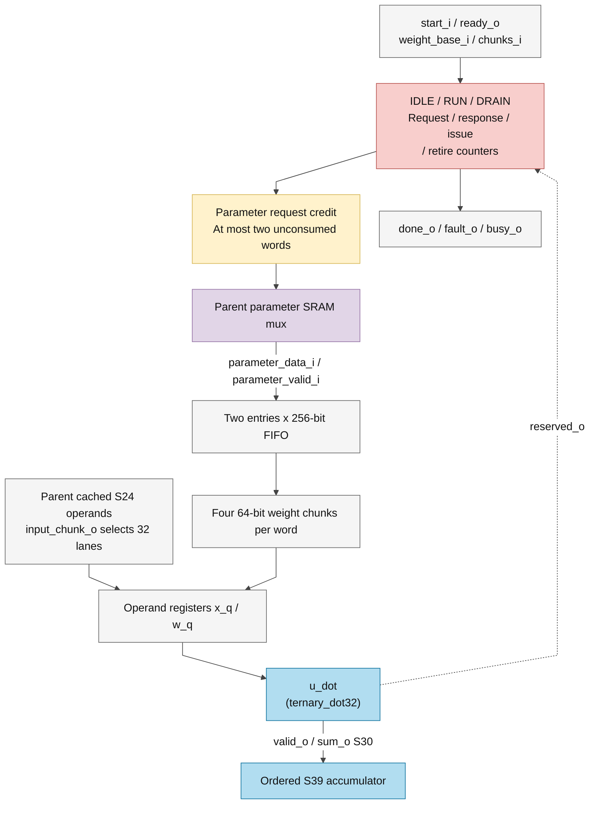

# llm_linear_engine.sv

> **Category: GUIDE. Scope: CURRENT (may also have legacy callers).** RTL is authoritative; diagrams use the [shared visual style](../../diagrams/diagram_style.md).
[Documentation](../../README.md) → [Source guide](../full_graph.md) → [RTL index](README.md)

**Source:** [llm_linear_engine.sv](<../../../Verilog%20Source%20code/llm_linear_engine.sv>).

## At a glance

| Item | Description |
|---|---|
| Responsibility | Streams the validated matrix rows without resetting the two-word parameter credit window at row boundaries. Dot sums retire in order into an S39 row accumulator. Four result slots are reserved before row issue; `result_valid_o/result_ready_i` transfer each sum and its fault together. Reserved code 10 stops issue and drains accepted memory/dot transactions; cancellation discards queued results and reset invalidates all work. |

`start_i/ready_o` launches `rows_i` rows with four or twelve chunks each. The input chunk index wraps at issue boundaries; the independent retirement chunk index resets the accumulator only after its last sum has been included in the queued result. A fault entry follows all completed older rows; younger dot responses drain without producing results. `done_o` marks transaction drain, while `busy_o` also covers unconsumed results. The parent must drain its epilogue and accepted writes before architectural completion.

Diagram follow-up required: the existing diagram omits continuous row progress and the four reserved result slots.

## Sơ đồ kiến trúc

