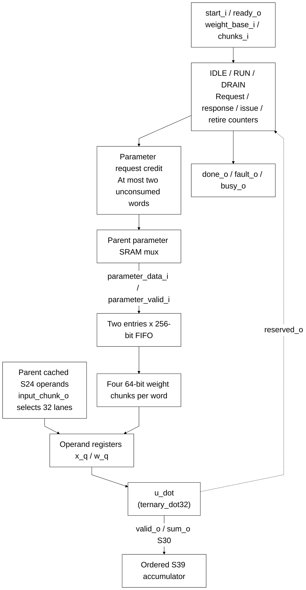

# llm_linear_engine.sv

[Documentation](../../README.md) → [Source guide](../full_graph.md) → [RTL index](README.md)

**Source:** [llm_linear_engine.sv](<../../../Verilog%20Source%20code/llm_linear_engine.sv>). **Số dòng:** 92. **SHA-256:** `db4e5b2122af2dda953ed8e31d263cb44b0ed222a851fa05773b3d8d82262266`.

## Khối này làm gì?

A bounded two-word credit window overlaps parameter reads with four ternary chunks per word. Operands and returned dot sums remain ordered. The engine accumulates S39, faults on reserved code 10, and drains outstanding memory and dot responses on cancellation or fault.

## Sơ đồ kiến trúc



## Cách hoạt động chi tiết

A bounded two-word credit window overlaps parameter reads with four ternary chunks per word. Operands and returned dot sums remain ordered. The engine accumulates S39, faults on reserved code 10, and drains outstanding memory and dot responses on cancellation or fault.

## Các nhóm logic trong source

### [Dòng 1–29: Interface and credit-window state](<../../../Verilog%20Source%20code/llm_linear_engine.sv#L1>)

<!-- source-range:1:29 -->
```systemverilog
// Exact ternary row engine. A two-word credit window overlaps parameter SRAM
// latency with four SIMD chunks per word; operands and results remain ordered.
module llm_linear_engine (
    input logic clk, rst_n, start_i, cancel_i,
    input logic [14:0] weight_base_i,
    input logic [3:0] chunks_i,
    output logic ready_o, busy_o, done_o, fault_o,
    output logic parameter_req_o,
    output logic [14:0] parameter_address_o,
    input logic parameter_valid_i,
    input logic [255:0] parameter_data_i,
    output logic [3:0] input_chunk_o,
    input logic signed [23:0] x_i [0:31],
    output logic dot_issue_o,
    output logic signed [38:0] accumulator_o
);
    genvar lane;
    typedef enum logic [1:0] {IDLE, RUN, DRAIN} state_t;
    state_t state;
    logic [14:0] base_q;
    logic [3:0] chunks_q, issue_q, retired_q;
    logic [1:0] request_q, response_q, fifo_valid_q;
    logic [255:0] fifo_q [0:1];
    logic launch_q;
    logic signed [23:0] x_q [0:31];
    logic [1:0] w_q [0:31];
    wire dot_valid, dot_reserved;
    wire signed [29:0] dot_sum;
    wire [1:0] words_consumed = issue_q[3:2];
```

### [Dòng 30–41: Requests and ternary pipeline wiring](<../../../Verilog%20Source%20code/llm_linear_engine.sv#L30>)

<!-- source-range:30:41 -->
```systemverilog
    wire [1:0] words_required = chunks_q[3:2];
    wire operand_capture = state == RUN && !(dot_valid && dot_reserved) &&
        issue_q < chunks_q && fifo_valid_q[issue_q[2]];
    assign ready_o = rst_n && state == IDLE;
    assign busy_o = state != IDLE;
    assign parameter_req_o = state == RUN && !cancel_i && !(dot_valid && dot_reserved) &&
        request_q < words_required && (request_q - words_consumed) < 2;
    assign parameter_address_o = base_q + 15'(request_q);
    assign input_chunk_o = issue_q < chunks_q ? issue_q : 4'd0;
    assign dot_issue_o = launch_q;
    ternary_dot32 u_dot(.clk(clk), .rst_n(rst_n), .valid_i(launch_q),
        .x_i(x_q), .w_i(w_q), .valid_o(dot_valid), .reserved_o(dot_reserved), .sum_o(dot_sum));
```

### [Dòng 42–73: Fault, cancellation and drain control](<../../../Verilog%20Source%20code/llm_linear_engine.sv#L42>)

<!-- source-range:42:73 -->
```systemverilog
    always_ff @(posedge clk or negedge rst_n) begin
        if (!rst_n) begin
            state <= IDLE; done_o <= 0; fault_o <= 0; launch_q <= 0;
            issue_q <= 0; retired_q <= 0; request_q <= 0; response_q <= 0; fifo_valid_q <= 0;
        end else begin
            done_o <= 0;
            launch_q <= operand_capture && !cancel_i;
            if (state == IDLE && start_i && !cancel_i) begin
                state <= RUN; issue_q <= 0; retired_q <= 0; request_q <= 0; response_q <= 0;
                fifo_valid_q <= 0; fault_o <= 0;
            end else if (state != IDLE) begin
                if (parameter_req_o) request_q <= request_q + 1'b1;
                if (parameter_valid_i && response_q < request_q) begin
                    response_q <= response_q + 1'b1;
                    fifo_valid_q[response_q[0]] <= 1;
                end
                if (operand_capture && !cancel_i) begin
                    issue_q <= issue_q + 1'b1;
                    if (issue_q[1:0] == 3) fifo_valid_q[issue_q[2]] <= 0;
                end
                if (dot_valid) begin
                    retired_q <= retired_q + 1'b1;
                    if (dot_reserved) begin state <= DRAIN; fault_o <= 1; end
                    else if (state == RUN && retired_q + 1'b1 == chunks_q) begin state <= IDLE; done_o <= 1; end
                end
                if (cancel_i && state == RUN) begin state <= DRAIN; fault_o <= 1; end
                else if (state == DRAIN && response_q == request_q && retired_q == issue_q && !launch_q) begin
                    state <= IDLE; done_o <= 1;
                end
            end
        end
    end
```

### [Dòng 74–92: FIFO payload and operand registers](<../../../Verilog%20Source%20code/llm_linear_engine.sv#L74>)

<!-- source-range:74:92 -->
```systemverilog
    always_ff @(posedge clk)
        if (rst_n) begin
            if (state == IDLE && start_i && !cancel_i) begin
                base_q <= weight_base_i; chunks_q <= chunks_i; accumulator_o <= 0;
            end else if (state == RUN && dot_valid && !dot_reserved && !cancel_i)
                accumulator_o <= accumulator_o + 39'(dot_sum);
            if (state != IDLE && parameter_valid_i && response_q < request_q)
                fifo_q[response_q[0]] <= parameter_data_i;
        end
    generate
    for (lane = 0; lane < 32; lane = lane + 1) begin : g_operand
        always_ff @(posedge clk)
            if (rst_n && operand_capture && !cancel_i) begin
                x_q[lane] <= x_i[lane];
                w_q[lane] <= fifo_q[issue_q[2]][(int'(issue_q[1:0]) << 6) + lane * 2 +: 2];
            end
    end
    endgenerate
endmodule
```
