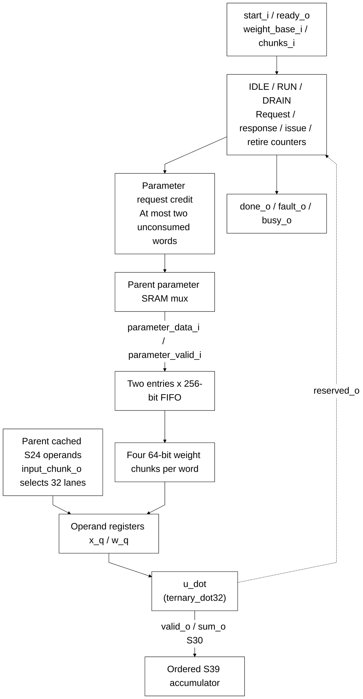

# llm_linear_engine.sv

> **Category: GUIDE. Scope: CURRENT (may also have legacy callers).** RTL is authoritative; diagrams are preserved from the existing guide.
[Documentation](../../README.md) → [Source guide](../full_graph.md) → [RTL index](README.md)

**Source:** [llm_linear_engine.sv](<../../../Verilog%20Source%20code/llm_linear_engine.sv>).

## At a glance

| Item | Description |
|---|---|
| Responsibility | A bounded two-word credit window overlaps parameter reads with four ternary chunks per word. Operands and returned dot sums remain ordered. The engine accumulates S39, faults on reserved code 10, and drains outstanding memory and dot responses on cancellation or fault. |

## Sơ đồ kiến trúc

