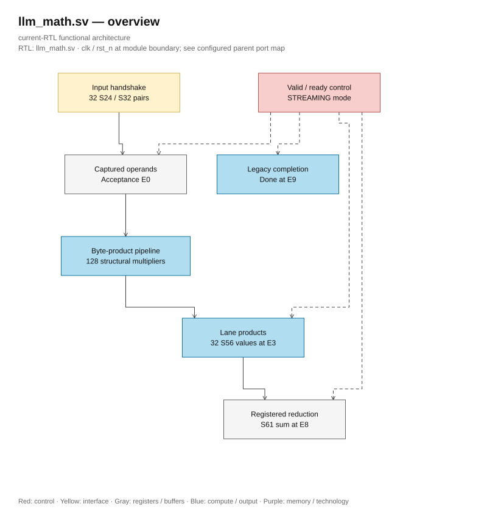
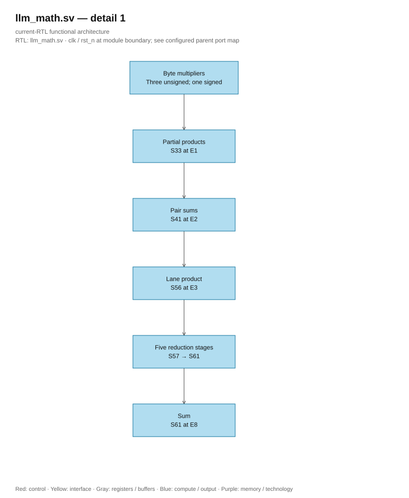

# llm_math.sv

<!-- reading-navigation:start -->
[Documentation](../../README.md) → [02 · Architecture](../../02-architecture/README.md) → [Module catalog](README.md)

| Reading guide | Document |
|---|---|
| New to the subject | [NPU and RTL fundamentals](../../00-start-here/fundamentals.md) · [Glossary](../../00-start-here/glossary.md) |
| Read first | [Full RTL graph](../full_graph.md) |
| Related implementation | [logic_mul.sv](logic_mul.sv.md) |
<!-- reading-navigation:end -->

**Structural generation.** Named SystemVerilog generate constructs are retained without the optional `generate`/`endgenerate` regions, following lowRISC. Loop bounds, conditional branches, instance names and lane ownership are unchanged.

> **Category: GUIDE. Scope: CURRENT (may also have legacy callers).** RTL is authoritative; diagrams use the [shared visual style](../../diagrams/diagram_style.md).

**Source:** [llm_math.sv](<../../../Verilog%20Source%20code/llm_math.sv>).

## At a glance

| Item | Description |
|---|---|
| Responsibility | Thirty-two S24 by S32 lanes use four structural byte multipliers per lane. Captured operands feed continuously clocked product/reduction stages. STREAMING=1 accepts every cycle while reset is released; STREAMING=0 admits one outstanding transaction. Relative to acceptance E0, product_valid is E3, sum_valid E8 and legacy done E9. |

## Architecture diagram

[Editable draw.io — llm_math.sv — overview](../../diagrams/architecture.drawio) · Page `27_llm_math.sv_1`.

## Internal arithmetic pipeline

[Editable draw.io — llm_math.sv — detail 1](../../diagrams/architecture.drawio) · Page `28_llm_math.sv_2`.
