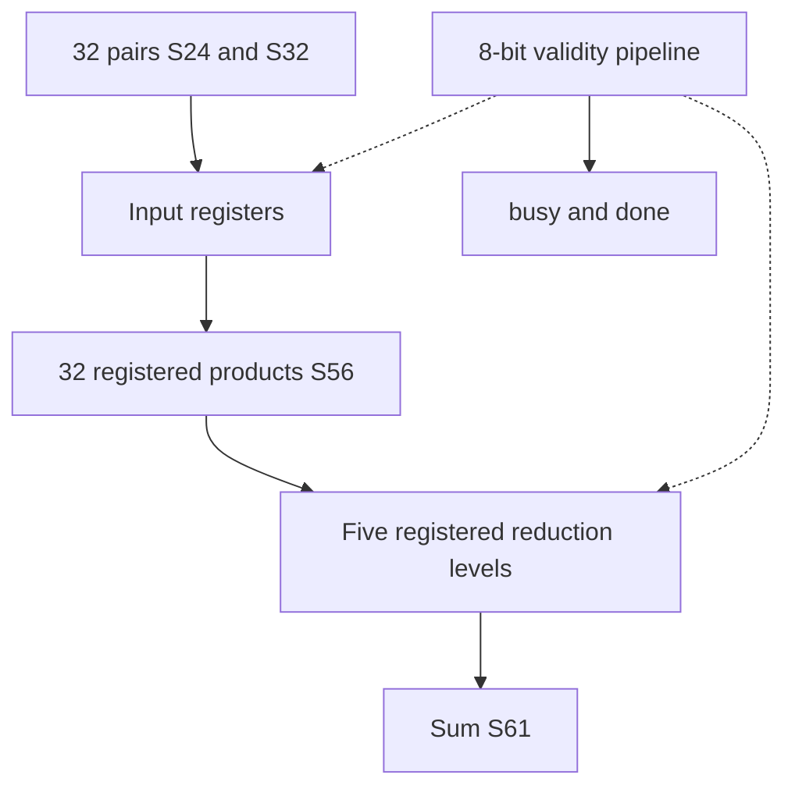

# llm_math.sv — SIMD signed multiply và reduction

[Tài liệu](../../README.md) → [Source guide](../README.md) → [Mục lục](README.md)

**Source:** [llm_math.sv](<../../../Verilog%20Source%20code/llm_math.sv>). **Số dòng:** 46. **SHA-256:** `d249f138a627eee4075377f3de9c5ed2fcd5888160968b6b6b8a78092f749f3a`.

## Khối này làm gì?

32 tích S24×S32 tạo S56; cây cộng cân bằng mở rộng đến S61. Input chốt khi start và không busy. Payload không reset; pipeline valid reset để hủy transaction.

## Sơ đồ kiến trúc



## Cách hoạt động chi tiết

32 tích S24×S32 tạo S56; cây cộng cân bằng mở rộng đến S61. Input chốt khi start và không busy. Payload không reset; pipeline valid reset để hủy transaction.

## Các nhóm logic trong source

### [Dòng 1–18: Interface and payload](<../../../Verilog%20Source%20code/llm_math.sv#L1>)

<!-- source-range:1:18 -->
```systemverilog
// Shared fixed-point SIMD arithmetic for autonomous language inference.
// Payload registers are valid only while the control pipeline is active.
module llm_math (
    input logic clk, rst_n, start,
    input logic signed [23:0] a [0:31],
    input logic signed [31:0] b [0:31],
    output logic busy, done,
    output logic signed [55:0] product [0:31],
    output logic signed [60:0] sum
);
    logic [7:0] valid_q;
    logic signed [23:0] a_q [0:31];
    logic signed [31:0] b_q [0:31];
    logic signed [56:0] level1 [0:15];
    logic signed [57:0] level2 [0:7];
    logic signed [58:0] level3 [0:3];
    logic signed [59:0] level4 [0:1];
    assign busy = |valid_q;
```

Dải product và sum đủ cho signed extremes; payload chỉ hợp lệ sau transaction đã hoàn thành.

### [Dòng 19–26: Control pipeline](<../../../Verilog%20Source%20code/llm_math.sv#L19>)

<!-- source-range:19:26 -->
```systemverilog
    assign done = valid_q[7];
    always_ff @(posedge clk or negedge rst_n) begin
        if (!rst_n) valid_q <= 0;
        else valid_q <= {valid_q[6:0], start && !busy};
    end
    always_ff @(posedge clk) begin
        if (rst_n && start && !busy)
            for (int i = 0; i < 32; i = i + 1) begin
```

busy là OR valid; request trong busy bị bỏ qua. done tại valid_q[7], bảy cạnh sau cạnh nhận start.

### [Dòng 27–46: Arithmetic stages](<../../../Verilog%20Source%20code/llm_math.sv#L27>)

<!-- source-range:27:46 -->
```systemverilog
                a_q[i] <= a[i];
                b_q[i] <= b[i];
            end
        if (valid_q[0])
            for (int i = 0; i < 32; i = i + 1) product[i] <= a_q[i] * b_q[i];
        if (valid_q[1])
            for (int i = 0; i < 16; i = i + 1)
                level1[i] <= 57'(product[2 * i]) + 57'(product[2 * i + 1]);
        if (valid_q[2])
            for (int i = 0; i < 8; i = i + 1)
                level2[i] <= 58'(level1[2 * i]) + 58'(level1[2 * i + 1]);
        if (valid_q[3])
            for (int i = 0; i < 4; i = i + 1)
                level3[i] <= 59'(level2[2 * i]) + 59'(level2[2 * i + 1]);
        if (valid_q[4])
            for (int i = 0; i < 2; i = i + 1)
                level4[i] <= 60'(level3[2 * i]) + 60'(level3[2 * i + 1]);
        if (valid_q[5]) sum <= 61'(level4[0]) + 61'(level4[1]);
    end
endmodule
```

Casts giữ dấu và tăng một bit mỗi mức reduction. product giữ nguyên cho client dùng kết quả từng lane.
