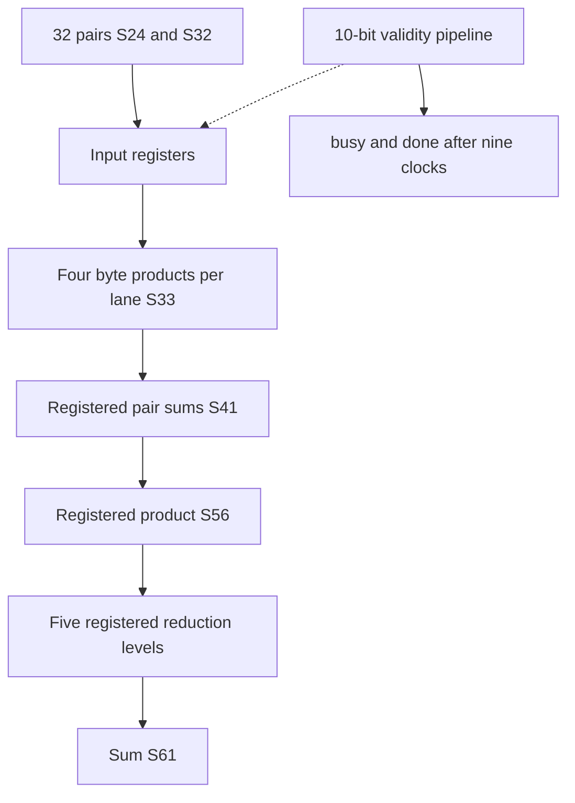

# llm_math.sv — SIMD byte-product pipeline và reduction

[Tài liệu](../../README.md) → [Source guide](../README.md) → [Mục lục](README.md)

**Source:** [llm_math.sv](<../../../Verilog%20Source%20code/llm_math.sv>). **Số dòng:** 72. **SHA-256:** `9d4d44be0bfe5d44cb196ffdc5e812710640989fb43f23adbcb62a0e48bae8ed`.

## Khối này làm gì?

32 tích S24×S32 tạo S56 bằng partial products byte: ba byte thấp U8, byte cao S8. Partial S33, cặp S41, ghép product S56 rồi cây cộng cân bằng tới S61. Done chín cạnh sau cạnh nhận start. Chỉ dùng logic cells; input chốt khi start và không busy. Payload không reset và mọi stage chạy liên tục từ input đã chốt; valid reset hủy transaction. Không có enable rộng từ valid_q đến partial/reduction FF.

## Sơ đồ kiến trúc



## Cách hoạt động chi tiết

32 tích S24×S32 tạo S56 bằng partial products byte: ba byte thấp U8, byte cao S8. Partial S33, cặp S41, ghép product S56 rồi cây cộng cân bằng tới S61. Done chín cạnh sau cạnh nhận start. Chỉ dùng logic cells; input chốt khi start và không busy. Payload không reset và mọi stage chạy liên tục từ input đã chốt; valid reset hủy transaction. Không có enable rộng từ valid_q đến partial/reduction FF.

## Các nhóm logic trong source

### [Dòng 1–11: Interface and payload](<../../../Verilog%20Source%20code/llm_math.sv#L1>)

<!-- source-range:1:11 -->
```systemverilog
// Shared fixed-point SIMD arithmetic for autonomous language inference.
// Captured operands stay stable until the next accepted transaction. Payload
// stages run continuously; only valid_q defines a response. This removes a
// high-fanout enable from each wide pipeline stage without changing latency.
module llm_math (
    input logic clk, rst_n, start,
    input logic signed [23:0] a [0:31],
    input logic signed [31:0] b [0:31],
    output logic busy, done,
    output logic signed [55:0] product [0:31],
    output logic signed [60:0] sum
```

Dải product và sum đủ cho signed extremes; payload chỉ hợp lệ sau transaction đã hoàn thành.

### [Dòng 12–26: Widths and control pipeline](<../../../Verilog%20Source%20code/llm_math.sv#L12>)

<!-- source-range:12:26 -->
```systemverilog
);
    // Bit-product compressor trees and pair sums split arithmetic across edges.
    logic [9:0] valid_q;
    logic signed [23:0] a_q [0:31];
    logic signed [31:0] b_q [0:31];
    logic signed [32:0] partial_q [0:31][0:3];
    wire [32:0] partial_comb [0:31][0:3];
    genvar mul_lane, mul_part;
    generate
    for (mul_lane = 0; mul_lane < 32; mul_lane = mul_lane + 1) begin : g_mul_lane
        for (mul_part = 0; mul_part < 4; mul_part = mul_part + 1) begin : g_byte
            logic_mul #(.A_W(24), .B_W(8), .OUT_W(33), .SIGNED_A(1), .SIGNED_B(mul_part == 3)) u_mul
                (.a(a_q[mul_lane]), .b(b_q[mul_lane][(mul_part << 3) +: 8]), .product(partial_comb[mul_lane][mul_part]));
        end
    end
```

busy là OR valid; request trong busy bị bỏ qua. done tại valid_q[9], chín cạnh sau cạnh nhận start. Signed casts giữ sign extension.

### [Dòng 27–38: Operand capture and byte multiplication](<../../../Verilog%20Source%20code/llm_math.sv#L27>)

<!-- source-range:27:38 -->
```systemverilog
    endgenerate
    logic signed [40:0] pair_q [0:31][0:1];
    logic signed [56:0] level1 [0:15];
    logic signed [57:0] level2 [0:7];
    logic signed [58:0] level3 [0:3];
    logic signed [59:0] level4 [0:1];
    assign busy = |valid_q;
    assign done = valid_q[9];
    always_ff @(posedge clk or negedge rst_n) begin
        if (!rst_n) valid_q <= 0;
        else valid_q <= {valid_q[8:0], start && !busy};
    end
```

Các byte thấp có leadingzero trước signed cast; byte cao giữ dấu. Partial products giữ đủ S33 trước shift.

### [Dòng 39–47: Pair and product reconstruction](<../../../Verilog%20Source%20code/llm_math.sv#L39>)

<!-- source-range:39:47 -->
```systemverilog
    genvar pipe_lane, pipe_part, reduction_node;
    generate
    for (pipe_lane = 0; pipe_lane < 32; pipe_lane = pipe_lane + 1) begin : g_lane_pipeline
        always_ff @(posedge clk) begin
            if (rst_n && start && !busy) begin a_q[pipe_lane] <= a[pipe_lane]; b_q[pipe_lane] <= b[pipe_lane]; end
            pair_q[pipe_lane][0] <= 41'(partial_q[pipe_lane][0]) + (41'(partial_q[pipe_lane][1]) <<< 8);
            pair_q[pipe_lane][1] <= 41'(partial_q[pipe_lane][2]) + (41'(partial_q[pipe_lane][3]) <<< 8);
            product[pipe_lane] <= 56'(pair_q[pipe_lane][0]) + (56'(pair_q[pipe_lane][1]) <<< 16);
        end
```

Hai pair dùng shift8/S41; product ghép shift16/S56. Không truncate intermediate trước khi dấu và độ rộng đã đúng.

### [Dòng 48–72: Balanced reduction](<../../../Verilog%20Source%20code/llm_math.sv#L48>)

<!-- source-range:48:72 -->
```systemverilog
        for (pipe_part = 0; pipe_part < 4; pipe_part = pipe_part + 1) begin : g_partial_register
            always_ff @(posedge clk)
                partial_q[pipe_lane][pipe_part] <= partial_comb[pipe_lane][pipe_part];
        end
    end
    for (reduction_node = 0; reduction_node < 16; reduction_node = reduction_node + 1) begin : g_reduce1
        always_ff @(posedge clk)
            level1[reduction_node] <= 57'(product[2 * reduction_node]) + 57'(product[2 * reduction_node + 1]);
    end
    for (reduction_node = 0; reduction_node < 8; reduction_node = reduction_node + 1) begin : g_reduce2
        always_ff @(posedge clk)
            level2[reduction_node] <= 58'(level1[2 * reduction_node]) + 58'(level1[2 * reduction_node + 1]);
    end
    for (reduction_node = 0; reduction_node < 4; reduction_node = reduction_node + 1) begin : g_reduce3
        always_ff @(posedge clk)
            level3[reduction_node] <= 59'(level2[2 * reduction_node]) + 59'(level2[2 * reduction_node + 1]);
    end
    for (reduction_node = 0; reduction_node < 2; reduction_node = reduction_node + 1) begin : g_reduce4
        always_ff @(posedge clk)
            level4[reduction_node] <= 60'(level3[2 * reduction_node]) + 60'(level3[2 * reduction_node + 1]);
    end
    endgenerate
    always_ff @(posedge clk)
        sum <= 61'(level4[0]) + 61'(level4[1]);
endmodule
```

Mỗi level tăng một bit; S61 chứa tổng32tích. Numeric expectations S128 giữ nguyên, chỉ latency/reset coverage đổi7→9.
