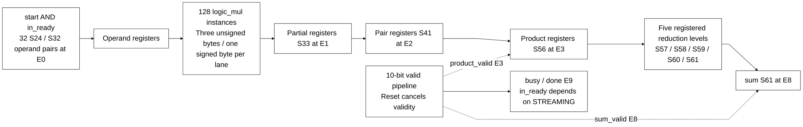

# llm_math.sv

> **Category: GUIDE. Scope: CURRENT (may also have legacy callers).** RTL is authoritative; diagrams are preserved from the existing guide.
[Documentation](../../README.md) → [Source guide](../full_graph.md) → [RTL index](README.md)

**Source:** [llm_math.sv](<../../../Verilog%20Source%20code/llm_math.sv>).

## At a glance

| Item | Description |
|---|---|
| Responsibility | Thirty-two S24 by S32 lanes use four structural byte multipliers per lane. Captured operands feed continuously clocked product/reduction stages. STREAMING=1 accepts every cycle while reset is released; STREAMING=0 admits one outstanding transaction. Relative to acceptance E0, product_valid is E3, sum_valid E8 and legacy done E9. |

## Sơ đồ kiến trúc

