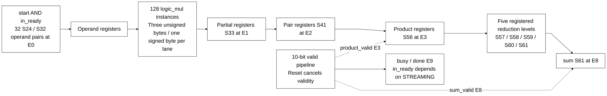

# llm_math.sv

[Documentation](../../README.md) → [Source guide](../full_graph.md) → [RTL index](README.md)

**Source:** [llm_math.sv](<../../../Verilog%20Source%20code/llm_math.sv>). **Số dòng:** 76. **SHA-256:** `1280302be8a07422c547c62b470b51f43324e92519cc0d69b55dd58f94c5d0bd`.

## Khối này làm gì?

Thirty-two S24 by S32 lanes use four structural byte multipliers per lane. Captured operands feed continuously clocked product/reduction stages. STREAMING=1 accepts every cycle while reset is released; STREAMING=0 admits one outstanding transaction. Relative to acceptance E0, product_valid is E3, sum_valid E8 and legacy done E9.

## Sơ đồ kiến trúc



## Cách hoạt động chi tiết

Thirty-two S24 by S32 lanes use four structural byte multipliers per lane. Captured operands feed continuously clocked product/reduction stages. STREAMING=1 accepts every cycle while reset is released; STREAMING=0 admits one outstanding transaction. Relative to acceptance E0, product_valid is E3, sum_valid E8 and legacy done E9.

## Các nhóm logic trong source

### [Dòng 1–18: Interface and operand widths](<../../../Verilog%20Source%20code/llm_math.sv#L1>)

<!-- source-range:1:18 -->
```systemverilog
// Shared fixed-point SIMD arithmetic for autonomous language inference.
// Captured operands stay stable until the next accepted transaction. Payload
// stages run continuously; only valid_q defines a response. This removes a
// high-fanout enable from each wide pipeline stage without changing latency.
module llm_math #(parameter bit STREAMING = 0) (
    input logic clk, rst_n, start,
    input logic signed [23:0] a [0:31],
    input logic signed [31:0] b [0:31],
    output logic busy, done, in_ready, product_valid, sum_valid,
    output logic signed [55:0] product [0:31],
    output logic signed [60:0] sum
);
    // Bit-product compressor trees and pair sums split arithmetic across edges.
    logic [9:0] valid_q;
    logic signed [23:0] a_q [0:31];
    logic signed [31:0] b_q [0:31];
    logic signed [32:0] partial_q [0:31][0:3];
    wire [32:0] partial_comb [0:31][0:3];
```

### [Dòng 19–27: Generated structural byte multipliers](<../../../Verilog%20Source%20code/llm_math.sv#L19>)

<!-- source-range:19:27 -->
```systemverilog
    genvar mul_lane, mul_part;
    generate
    for (mul_lane = 0; mul_lane < 32; mul_lane = mul_lane + 1) begin : g_mul_lane
        for (mul_part = 0; mul_part < 4; mul_part = mul_part + 1) begin : g_byte
            logic_mul #(.A_W(24), .B_W(8), .OUT_W(33), .SIGNED_A(1), .SIGNED_B(mul_part == 3)) u_mul
                (.a(a_q[mul_lane]), .b(b_q[mul_lane][(mul_part << 3) +: 8]), .product(partial_comb[mul_lane][mul_part]));
        end
    end
    endgenerate
```

### [Dòng 28–41: Streaming acceptance and response validity](<../../../Verilog%20Source%20code/llm_math.sv#L28>)

<!-- source-range:28:41 -->
```systemverilog
    logic signed [40:0] pair_q [0:31][0:1];
    logic signed [56:0] level1 [0:15];
    logic signed [57:0] level2 [0:7];
    logic signed [58:0] level3 [0:3];
    logic signed [59:0] level4 [0:1];
    assign busy = |valid_q;
    // Product and reduction responses have separate validity; their pipeline depths differ.
    assign in_ready = rst_n && (STREAMING || !busy);
    assign product_valid = valid_q[3];
    assign sum_valid = valid_q[8];
    assign done = valid_q[9]; // Legacy completion remains unchanged for one outstanding request.
    always_ff @(posedge clk or negedge rst_n) begin
        if (!rst_n) valid_q <= 0;
        else valid_q <= {valid_q[8:0], start && in_ready};
```

### [Dòng 42–76: Registered product and reduction stages](<../../../Verilog%20Source%20code/llm_math.sv#L42>)

<!-- source-range:42:76 -->
```systemverilog
    end
    genvar pipe_lane, pipe_part, reduction_node;
    generate
    for (pipe_lane = 0; pipe_lane < 32; pipe_lane = pipe_lane + 1) begin : g_lane_pipeline
        always_ff @(posedge clk) begin
            if (rst_n && start && in_ready) begin a_q[pipe_lane] <= a[pipe_lane]; b_q[pipe_lane] <= b[pipe_lane]; end
            pair_q[pipe_lane][0] <= 41'(partial_q[pipe_lane][0]) + (41'(partial_q[pipe_lane][1]) <<< 8);
            pair_q[pipe_lane][1] <= 41'(partial_q[pipe_lane][2]) + (41'(partial_q[pipe_lane][3]) <<< 8);
            product[pipe_lane] <= 56'(pair_q[pipe_lane][0]) + (56'(pair_q[pipe_lane][1]) <<< 16);
        end
        for (pipe_part = 0; pipe_part < 4; pipe_part = pipe_part + 1) begin : g_partial_register
            always_ff @(posedge clk)
                partial_q[pipe_lane][pipe_part] <= partial_comb[pipe_lane][pipe_part];
        end
    end
    for (reduction_node = 0; reduction_node < 16; reduction_node = reduction_node + 1) begin : g_reduce1
        always_ff @(posedge clk)
            level1[reduction_node] <= 57'(product[2 * reduction_node]) + 57'(product[2 * reduction_node + 1]);
    end
    for (reduction_node = 0; reduction_node < 8; reduction_node = reduction_node + 1) begin : g_reduce2
        always_ff @(posedge clk)
            level2[reduction_node] <= 58'(level1[2 * reduction_node]) + 58'(level1[2 * reduction_node + 1]);
    end
    for (reduction_node = 0; reduction_node < 4; reduction_node = reduction_node + 1) begin : g_reduce3
        always_ff @(posedge clk)
            level3[reduction_node] <= 59'(level2[2 * reduction_node]) + 59'(level2[2 * reduction_node + 1]);
    end
    for (reduction_node = 0; reduction_node < 2; reduction_node = reduction_node + 1) begin : g_reduce4
        always_ff @(posedge clk)
            level4[reduction_node] <= 60'(level3[2 * reduction_node]) + 60'(level3[2 * reduction_node + 1]);
    end
    endgenerate
    always_ff @(posedge clk)
        sum <= 61'(level4[0]) + 61'(level4[1]);
endmodule
```
