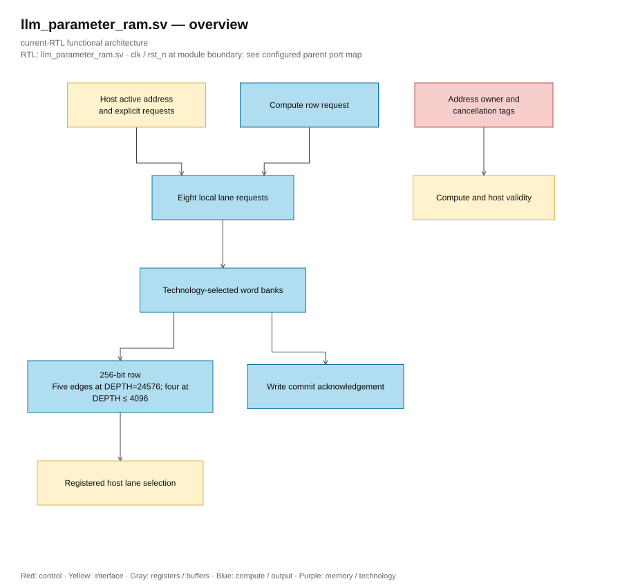

# llm_parameter_ram.sv — SRam parameters and host commit

**Structural generation.** Named SystemVerilog generate constructs are retained without the optional `generate`/`endgenerate` regions, following lowRISC. Loop bounds, conditional branches, instance names and lane ownership are unchanged.

> **Category: GUIDE. Scope: CURRENT (may also have legacy callers).** RTL is authoritative; diagrams use the [shared visual style](../../diagrams/diagram_style.md).
[Documents](../../README.md) → [Source guide](../README.md) → [Table of contents](README.md)

**Source:** [llm_parameter_ram.sv](<../../../Verilog%20Source%20code/llm_parameter_ram.sv>).

## At a glance

| Item | Description |
|---|---|
| Responsibility | USE_QUARTUS_MEMORY selects FPGA IP or ASIC model via word adapter. Compute read four corners when DEPTH≤4096, five corners at configuration 24576. Host reads an additional corner selecting lane before frontend ACK. Write ACK only after leaf commit. Valid/tag pipeline discards host response that was canceled or at a different address; reset preserves SRAM but clears queue. |

## Architecture diagram

[Editable draw.io — llm_parameter_ram.sv — overview](../../diagrams/architecture.drawio) · Page `29_llm_parameter_ram.sv_1`.

## Important state / datapath groups

### [Lines 1–29: Interface and ownership](<../../../Verilog%20Source%20code/llm_parameter_ram.sv#L1>)

Compute and host exclusive access by top arbitration. Host data/config is not an intermediate graph.

### [Lines 30–50: Validity and cancellation](<../../../Verilog%20Source%20code/llm_parameter_ram.sv#L30>)

Host response is only valid when active, read/write type and address still match. ACK write according to wr_valid from leaf, avoiding reporting done before commit.

### [Lines 51–60: Tags and host payload](<../../../Verilog%20Source%20code/llm_parameter_ram.sv#L51>)

Address/lane along with latency deduced according to DEPTH; output host register separates tile reduction from host_rdata pin.

### [Lines 61–95: Local lane banks](<../../../Verilog%20Source%20code/llm_parameter_ram.sv#L61>)

Eight U32 lanes have separate request registers, then a technology adapter. The content and payload do not reset; reset only cancels enables/valid.
