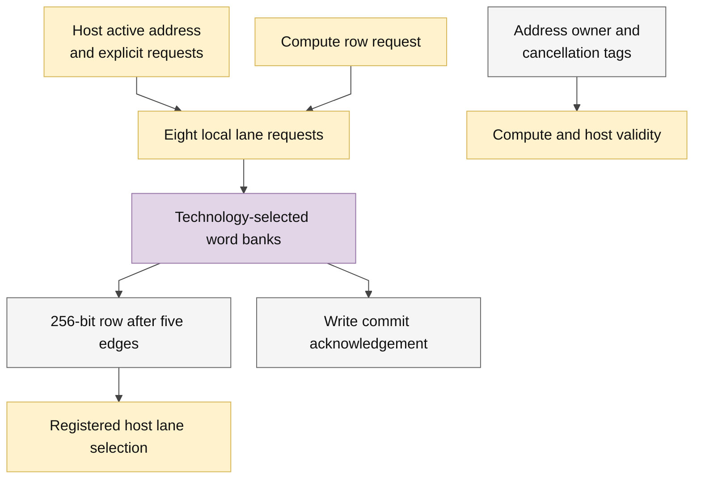

# llm_parameter_ram.sv — Parameter SRAM và host commit

> **Category: GUIDE. Scope: CURRENT (may also have legacy callers).** RTL is authoritative; diagrams use the [shared visual style](../../diagrams/diagram_style.md).
[Tài liệu](../../README.md) → [Source guide](../README.md) → [Mục lục](README.md)

**Source:** [llm_parameter_ram.sv](<../../../Verilog%20Source%20code/llm_parameter_ram.sv>).

## At a glance

| Item | Description |
|---|---|
| Responsibility | USE_QUARTUS_MEMORY chọn FPGA IP hoặc model ASIC qua word adapter. Compute read bốn cạnh khi DEPTH≤4096, năm cạnh ở cấu hình24576. Host read thêm một cạnh chọn lane trước frontend ACK. Write ACK chỉ sau leaf commit. Valid/tag pipeline loại response host đã hủy hoặc khác địa chỉ; reset giữ SRAM nhưng hủy queue. |

## Sơ đồ kiến trúc

## Important state / datapath groups

### [Dòng 1–29: Interface and ownership](<../../../Verilog%20Source%20code/llm_parameter_ram.sv#L1>)

Compute và host truy cập độc quyền do top arbitration. Host data/config không phải intermediate graph.

### [Dòng 30–50: Validity and cancellation](<../../../Verilog%20Source%20code/llm_parameter_ram.sv#L30>)

Host response chỉ hợp lệ khi active, loại read/write và địa chỉ vẫn khớp. ACK write theo wr_valid từ leaf, tránh báo xong trước commit.

### [Dòng 51–60: Tags and host payload](<../../../Verilog%20Source%20code/llm_parameter_ram.sv#L51>)

Địa chỉ/lane đi cùng latency suy ra theo DEPTH; output host register tách tile reduction khỏi pin host_rdata.

### [Dòng 61–95: Local lane banks](<../../../Verilog%20Source%20code/llm_parameter_ram.sv#L61>)

Tám lane U32 có request registers riêng, rồi technology adapter. Nội dung và payload không reset; reset chỉ hủy enables/valid.
