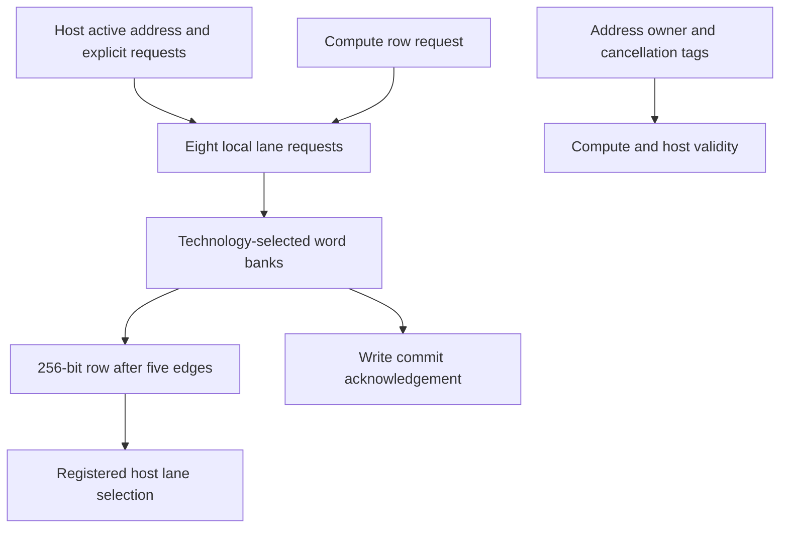

# llm_parameter_ram.sv — Parameter SRAM và host commit

[Tài liệu](../../README.md) → [Source guide](../README.md) → [Mục lục](README.md)

**Source:** [llm_parameter_ram.sv](<../../../Verilog%20Source%20code/llm_parameter_ram.sv>). **Số dòng:** 87. **SHA-256:** `b4258f0ff8379b54672ae3b285af10d4f6c10a52bc2f463cfa5225988cd1959c`.

## Khối này làm gì?

USE_QUARTUS_MEMORY chọn FPGA IP hoặc model ASIC qua word adapter. Compute read bốn cạnh khi DEPTH≤4096, năm cạnh ở cấu hình24576. Host read thêm một cạnh chọn lane trước frontend ACK. Write ACK chỉ sau leaf commit. Valid/tag pipeline loại response host đã hủy hoặc khác địa chỉ; reset giữ SRAM nhưng hủy queue.

## Sơ đồ kiến trúc



## Cách hoạt động chi tiết

USE_QUARTUS_MEMORY chọn FPGA IP hoặc model ASIC qua word adapter. Compute read bốn cạnh khi DEPTH≤4096, năm cạnh ở cấu hình24576. Host read thêm một cạnh chọn lane trước frontend ACK. Write ACK chỉ sau leaf commit. Valid/tag pipeline loại response host đã hủy hoặc khác địa chỉ; reset giữ SRAM nhưng hủy queue.

## Các nhóm logic trong source

### [Dòng 1–29: Interface and ownership](<../../../Verilog%20Source%20code/llm_parameter_ram.sv#L1>)

<!-- source-range:1:29 -->
```systemverilog
// Parameter SRAM boundary. Compute reads: four edges for <=4096 rows, otherwise
// five; host lane selection adds one edge, followed by the controller response.
// Writes acknowledge after leaf commit.
// Contents/payloads are unreset; reset cancels all queued requests and validity.
module llm_parameter_ram #(
    parameter int ADDR_W = 15,
    parameter int DEPTH = 24576,
    parameter bit USE_QUARTUS_MEMORY = 0
) (
    input logic clk, rst_n, rd_en,
    input logic [ADDR_W - 1:0] rd_addr,
    output logic [255:0] rd_data,
    output logic rd_valid,
    input logic host_active, host_we, host_read_req, host_write_req,
    input logic [ADDR_W + 2:0] host_addr,
    input logic [31:0] host_wdata,
    output logic [31:0] host_rdata,
    output logic host_rvalid
);
    localparam int READ_LATENCY = DEPTH <= 4096 ? 4 : 5;
    localparam int LAST_READ = READ_LATENCY - 1;
    logic [READ_LATENCY - 1:0] read_valid_q, read_host_q;
    logic [ADDR_W + 2:0] read_address_q [0:LAST_READ];
    logic [7:0] lane_read_valid, lane_write_valid;
    logic [255:0] read_row;
    logic host_read_valid_q, host_write_valid_q;
    logic [ADDR_W + 2:0] response_address_q;
    wire read_request = rd_en || host_read_req;
    wire [ADDR_W - 1:0] read_address = host_read_req ? host_addr[ADDR_W + 2:3] : rd_addr;
```

Compute và host truy cập độc quyền do top arbitration. Host data/config không phải intermediate graph.

### [Dòng 30–50: Validity and cancellation](<../../../Verilog%20Source%20code/llm_parameter_ram.sv#L30>)

<!-- source-range:30:50 -->
```systemverilog
    assign rd_data = read_row;
    assign rd_valid = read_valid_q[LAST_READ] && !read_host_q[LAST_READ];
    assign host_rvalid = host_active && (host_we ? host_write_valid_q :
        host_read_valid_q && response_address_q == host_addr);
    always_ff @(posedge clk or negedge rst_n) begin
        if (!rst_n) begin
            read_valid_q <= 0; read_host_q <= 0;
            host_read_valid_q <= 0; host_write_valid_q <= 0;
        end else begin
            read_valid_q[0] <= read_request;
            read_host_q[0] <= host_read_req;
            for (int stage = 1; stage < READ_LATENCY; stage = stage + 1) begin
                read_valid_q[stage] <= read_valid_q[stage - 1] &&
                    (!read_host_q[stage - 1] ||
                        (host_active && !host_we && host_addr == read_address_q[stage - 1]));
                read_host_q[stage] <= read_host_q[stage - 1];
            end
            host_read_valid_q <= read_valid_q[LAST_READ] && read_host_q[LAST_READ] &&
                host_active && !host_we && host_addr == read_address_q[LAST_READ];
            host_write_valid_q <= (|lane_write_valid) && host_active && host_we;
        end
```

Host response chỉ hợp lệ khi active, loại read/write và địa chỉ vẫn khớp. ACK write theo wr_valid từ leaf, tránh báo xong trước commit.

### [Dòng 51–60: Tags and host payload](<../../../Verilog%20Source%20code/llm_parameter_ram.sv#L51>)

<!-- source-range:51:60 -->
```systemverilog
    end
    always_ff @(posedge clk) begin
        read_address_q[0] <= host_addr;
        for (int stage = 1; stage < READ_LATENCY; stage = stage + 1)
            read_address_q[stage] <= read_address_q[stage - 1];
        if (read_valid_q[LAST_READ] && read_host_q[LAST_READ]) begin
            response_address_q <= read_address_q[LAST_READ];
            host_rdata <= read_row[read_address_q[LAST_READ][2:0] * 32 +: 32];
        end
    end
```

Địa chỉ/lane đi cùng latency suy ra theo DEPTH; output host register tách tile reduction khỏi pin host_rdata.

### [Dòng 61–87: Local lane banks](<../../../Verilog%20Source%20code/llm_parameter_ram.sv#L61>)

<!-- source-range:61:87 -->
```systemverilog
    genvar lane;
    generate
    for (lane = 0; lane < 8; lane = lane + 1) begin : g_ram_lane
        (* dont_merge *) logic [ADDR_W - 1:0] read_address_local_q, write_address_q;
        (* dont_merge *) logic [31:0] write_data_q;
        logic read_enable_q, write_enable_q;
        always_ff @(posedge clk) begin
            read_address_local_q <= read_address;
            write_address_q <= host_addr[ADDR_W + 2:3];
            write_data_q <= host_wdata;
        end
        always_ff @(posedge clk or negedge rst_n) begin
            if (!rst_n) begin read_enable_q <= 0; write_enable_q <= 0; end
            else begin
                read_enable_q <= read_request;
                write_enable_q <= host_write_req && host_addr[2:0] == 3'(lane);
            end
        end
        pipelined_word_ram #(.WIDTH(32), .ROWS(DEPTH), .ADDR_W(ADDR_W),
            .USE_QUARTUS_MEMORY(USE_QUARTUS_MEMORY)) u_storage(
            .clk(clk), .rst_n(rst_n), .rd_en(read_enable_q), .wr_en(write_enable_q),
            .rd_addr(read_address_local_q), .wr_addr(write_address_q), .wr_data(write_data_q),
            .rd_data(read_row[lane * 32 +: 32]), .rd_valid(lane_read_valid[lane]),
            .wr_valid(lane_write_valid[lane]));
    end
    endgenerate
endmodule
```

Tám lane U32 có request registers riêng, rồi technology adapter. Nội dung và payload không reset; reset chỉ hủy enables/valid.
