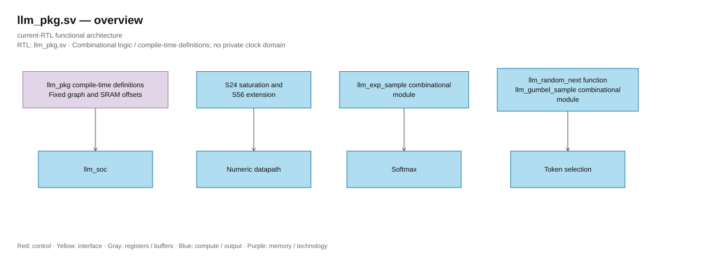

# llm_pkg.sv — Layout, saturation và sampler

> **Category: GUIDE. Scope: CURRENT (may also have legacy callers).** RTL is authoritative; diagrams use the [shared visual style](../../diagrams/diagram_style.md).
[Tài liệu](../../README.md) → [Source guide](../README.md) → [Mục lục](README.md)

**Source:** [llm_pkg.sv](<../../../Verilog%20Source%20code/llm_pkg.sv>).

## At a glance

| Item | Description |
|---|---|
| Responsibility | Hằng số graph cố định NanoFable, địa chỉ parameter rows, S24 saturation, sign extension và xorshift32. LUT exp/Gumbel được include thành logic portable. |

## Sơ đồ kiến trúc

[Editable draw.io — llm_pkg.sv — overview](../../diagrams/architecture.drawio) · Page `30_llm_pkg.sv_1`.

## Important state / datapath groups

### [Dòng 1–10: Layout constants](<../../../Verilog%20Source%20code/llm_pkg.sv#L1>)

PARAM_ROWS=24576; địa chỉ tính theo row 256 bit. EMB_SCALE, matrix metadata, gains và RoPE nằm sau trọng số.

### [Dòng 11–20: Numeric helpers](<../../../Verilog%20Source%20code/llm_pkg.sv#L11>)

Saturation ở biên ±2^23; llm_extend56 giữ sign của SIMD product trước RNE64.

### [Dòng 21–31: Sampler](<../../../Verilog%20Source%20code/llm_pkg.sv#L21>)

Xorshift32 deterministic, seed zero được controller thay bằng one. Temperature zero cho greedy argmax.
