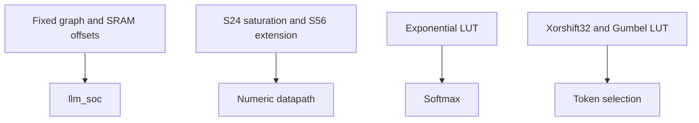

# llm_pkg.sv — Layout, saturation và sampler

[Tài liệu](../../README.md) → [Source guide](../README.md) → [Mục lục](README.md)

**Source:** [llm_pkg.sv](<../../../Verilog%20Source%20code/llm_pkg.sv>). **Số dòng:** 30. **SHA-256:** `d66c690e47020bdda3375fe8d626ff4b476fb881cd6cf8b1cc2ec47498a7aa87`.

## Khối này làm gì?

Hằng số graph cố định NanoFable, địa chỉ parameter rows, S24 saturation, sign extension và xorshift32. LUT exp/Gumbel được include thành logic portable.

## Sơ đồ kiến trúc



## Cách hoạt động chi tiết

Hằng số graph cố định NanoFable, địa chỉ parameter rows, S24 saturation, sign extension và xorshift32. LUT exp/Gumbel được include thành logic portable.

## Các nhóm logic trong source

### [Dòng 1–10: Layout constants](<../../../Verilog%20Source%20code/llm_pkg.sv#L1>)

<!-- source-range:1:10 -->
```systemverilog
package llm_pkg;
    // Fixed NanoFable graph: four blocks, 128 channels, four 32-channel heads.
    localparam int CONTEXT = 128;
    localparam int PARAM_ROWS = 24576;
    localparam int EMB_SCALE_BASE = 23040;
    localparam int MATRIX_META_BASE = 23552;
    localparam int GAIN_BASE = 23580;
    localparam int ROPE_BASE = 23652;

    function automatic logic signed [23:0] llm_sat24(input logic signed [63:0] x);
```

PARAM_ROWS=24576; địa chỉ tính theo row 256 bit. EMB_SCALE, matrix metadata, gains và RoPE nằm sau trọng số.

### [Dòng 11–21: Numeric helpers](<../../../Verilog%20Source%20code/llm_pkg.sv#L11>)

<!-- source-range:11:21 -->
```systemverilog
        if (x > 64'sd8388607) llm_sat24 = 24'sh7fffff;
        else if (x < -64'sd8388608) llm_sat24 = 24'sh800000;
        else llm_sat24 = x[23:0];
    endfunction

    function automatic logic signed [63:0] llm_extend56(input logic signed [55:0] x);
        llm_extend56 = {{8{x[55]}}, x};
    endfunction

    `include "llm_exp_lut.svh"
    `include "llm_gumbel_lut.svh"
```

Saturation ở biên ±2^23; llm_extend56 giữ sign của SIMD product trước RNE64.

### [Dòng 22–30: Sampler](<../../../Verilog%20Source%20code/llm_pkg.sv#L22>)

<!-- source-range:22:30 -->
```systemverilog
    function automatic logic [31:0] llm_random_next(input logic [31:0] previous);
        logic [31:0] x;
        begin
            x = previous ^ (previous << 13);
            x = x ^ (x >> 17);
            llm_random_next = x ^ (x << 5);
        end
    endfunction
endpackage
```

Xorshift32 deterministic, seed zero được controller thay bằng one. Temperature zero cho greedy argmax.
