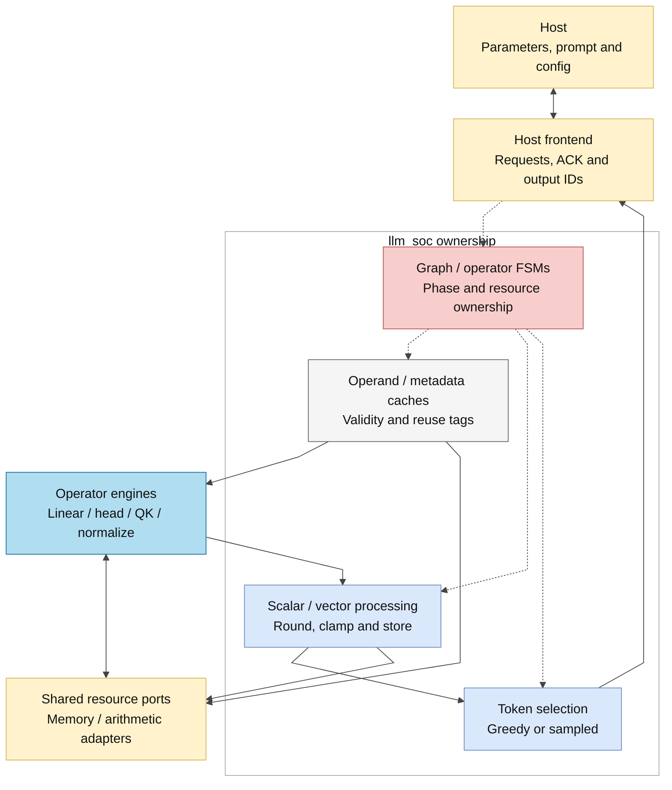
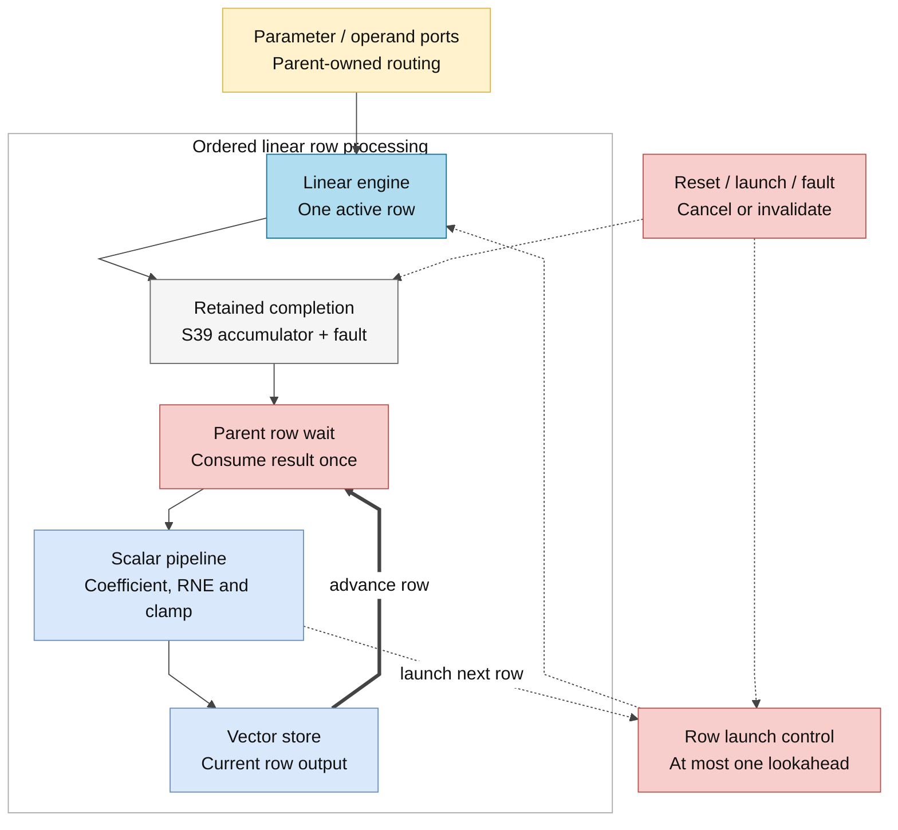
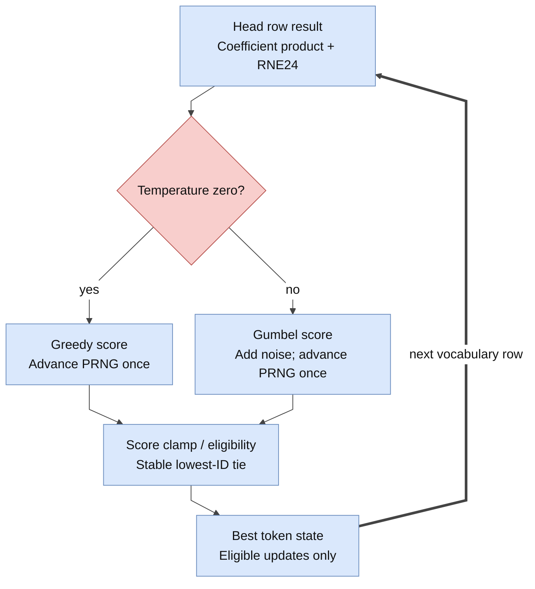

# llm_soc

> **Role:** Own autonomous fixed-point inference and route shared resources.
> **Scope:** CURRENT. **Category:** GUIDE.
> **Source:** [llm_soc.sv](<../../../Verilog Source code/llm_soc.sv>).

## At a glance

| Item | Description |
|---|---|
| Responsibility | Host transactions, prefill/decode sequencing and ordered operator completion |
| Inputs | Clock/reset; host enable/write/address/data |
| Outputs | Host data/acknowledgement; running/ready/error/overflow; debug signals |
| Owns | Graph/operator/host FSMs, metadata, operand/cache tags, scaling, vector writes, softmax/value passes and token selection |
| Delegates | Linear/head/QK/normalization engines, structural arithmetic and parameter/vector/KV memory adapters |

## Architecture

## Main flow

1. Accept host parameters, prompt IDs and configuration; validate START.
2. Select each graph phase and route its memory/arithmetic requests.
3. Consume valid engine responses; finish rounding, saturation and ordered vector writes.
4. Select a token, append its ID and either feed it back or complete generation.

## Important state / datapath groups

| Group | Purpose |
|---|---|
| `graph`, `op` | Phase selection and explicit operator states |
| `layer_q`, `position_q`, `generated_q` | Layer, context position and output progress |
| Input/scale/RoPE tags | Reuse only operands compatible with the next phase |
| `linear_prefetched_q` and retained completion | At most one next row while the current row finishes scalar/store work |
| `temperature_q`, `random_q`, selection score | Greedy or sampled selection; stable ID ordering |

## Important contracts

Linear lookahead preserves ordered accumulator/fault consumption and drains pending work on cancellation. Memory acceptance and write commitment are different events; host acknowledgement follows commitment. Shared-resource muxes are owned here, rather than direct engine-to-engine wiring.

## Easy to misunderstand

- SIMD lanes form one reduction, not independent completed outputs.
- Zero temperature skips noise/sample states but still advances PRNG once per row, including excluded IDs.
- Host supplies prompt/configuration, not hidden activations or continuation IDs.
- A prefetched row may finish before the parent is ready; the retained accumulator and fault remain paired until consumed.

## Related docs

[Architecture/numeric contracts](../../design/full_rtl_language.md) · [Host interface](../../design/host_interface.md) · [Cache contracts](../../design/exact_throughput_optimization.md) · [Full graph module map](../full_graph.md) · [Implementation rationale](../../../review/architecture_optimization_20261007.md)
