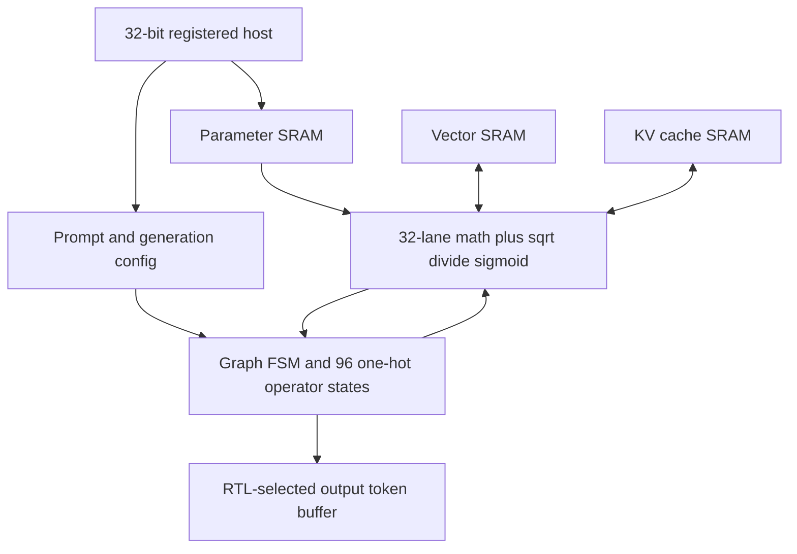

# llm_soc.sv — Autonomous autoregressive graph

[Tài liệu](../../README.md) → [Source guide](../README.md) → [Mục lục](README.md)

**Source:** [llm_soc.sv](<../../../Verilog%20Source%20code/llm_soc.sv>). **Số dòng:** 962. **SHA-256:** `70e7444fe5ce22d5dfbd4a45c83c5dd9eb7eb30b7180daed474195878b7e277f`.

## Khối này làm gì?

Host chỉ cấp parameter words, prompt IDs và cấu hình. Graph FSM chạy prefill và decode qua bốn transformer block rồi head; operator FSM điều phối SRAM, SIMD, sqrt, divide và sigmoid. Xem full_rtl_language.md cho memory map và numeric contracts.

## Sơ đồ kiến trúc



## Cách hoạt động chi tiết

Host chỉ cấp parameter words, prompt IDs và cấu hình. Graph FSM chạy prefill và decode qua bốn transformer block rồi head; operator FSM điều phối SRAM, SIMD, sqrt, divide và sigmoid. Xem full_rtl_language.md cho memory map và numeric contracts.

Per-lane payload chốt raw S64, RNE S64 và S24 clamp ở các bước riêng để tách
critical path. Linear và attention chốt saturation scalar theo tám nhóm, mỗi
nhóm bốn lane có enable riêng để giảm fanout/routing, rồi chỉ cập nhật lane
được chọn; các lane không ghi được giữ và write mask bảo vệ SRAM. Reciprocal
U25 có upper-bound từ epsilon/root. `A_SCALE` cast part-select sang signed để
giữ score âm. Reset chỉ hủy control, không clear payload. Các thay đổi không
thay công thức hoặc expected numeric values; latency tăng theo FSM handshake.
Operator dùng 96 trạng thái one-hot với reverse-case decode. Shared scalar
multiplier chốt hai operand signed trước phép nhân. Vector/KV adapter có
request pipeline group/lane/tile và read valid năm cạnh; parameter read năm
cạnh, host lane selection thêm một cạnh. O_FINISH chờ mọi write drain trước
op_done. Sigmoid chuẩn bị RNE4 song song, clamp S16 rồi chọn lane qua hai tầng mux có register (8:1 và4:1); không gộp chọn lane với rounding/clamp. Các payload second_q và write_vector_q chỉ decode state thực sự ghi chúng. Selection khởi tạo
token thấp nhất hợp lệ để tie S32_MIN không trả token bị mask; mã ternary `10`
báo format fault. Reset phải bao phủ một cạnh lên để hủy operator state.
Host FSM chốt transaction payload nội bộ. Public host_rdata là register luôn
chốt payload ở mỗi cạnh; H_DONE báo ACK ở cùng cạnh dữ liệu đã chốt. Không thêm
latency ACK quan sát được; reset vẫn xóa response và hủy transaction.

## Các nhóm logic trong source

### [Dòng 1–274: Interface and FSM state](<../../../Verilog%20Source%20code/llm_soc.sv#L1>)

<!-- source-range:1:274 -->
```systemverilog
// Autonomous fixed-point NanoFable inference. The host loads parameters and
// prompt IDs; this controller owns prefill, attention, head and decode.
module llm_soc #(parameter bit USE_QUARTUS_MEMORY = 1) (
    input logic clk, rst_n, host_en, host_we,
    input logic [31:0] host_addr, host_wdata,
    output logic [31:0] host_rdata,
    output logic host_ready, running, ready, error, overflow_out,
    output logic [8:0] pc_debug,
    output logic [12:0] instr_debug
);
    import npu_pkg::*;
    import llm_pkg::*;
    typedef enum logic [4:0] {G_IDLE, G_EMBED, G_ANORM, G_Q, G_K, G_V,
        G_RQ, G_RK, G_CACHE, G_ATTENTION, G_O, G_AADD, G_MNORM, G_GATE,
        G_UP, G_SILU, G_GMUL, G_DOWN, G_MADD, G_NEXT, G_FNORM, G_HEAD,
        G_ADVANCE, G_DONE} graph_t;
    graph_t graph;
    localparam int OP_COUNT = 96;
    localparam int O_IDLE_IDX = 0;
    localparam int O_P_REQ_IDX = 1;
    localparam int O_P_WAIT_IDX = 2;
    localparam int O_V_REQ_IDX = 3;
    localparam int O_V_WAIT_IDX = 4;
    localparam int O_K_REQ_IDX = 5;
    localparam int O_K_WAIT_IDX = 6;
    localparam int O_M_START_IDX = 7;
    localparam int O_M_WAIT_IDX = 8;
    localparam int O_WRITE_IDX = 9;
    localparam int O_FINISH_IDX = 10;
    localparam int E_SCALE_IDX = 11;
    localparam int E_DATA_IDX = 12;
    localparam int E_CALC_IDX = 13;
    localparam int E_PACK_IDX = 14;
    localparam int L_META_IDX = 15;
    localparam int L_WEIGHT_IDX = 16;
    localparam int L_INPUT_IDX = 17;
    localparam int L_MAC_IDX = 18;
    localparam int L_COEFF_IDX = 19;
    localparam int L_ROUND_IDX = 20;
    localparam int L_STORE_IDX = 21;
    localparam int N_SQUARE_IDX = 22;
    localparam int N_ACC_IDX = 23;
    localparam int N_ROOT_IDX = 24;
    localparam int N_ROOT_WAIT_IDX = 25;
    localparam int N_DIV_IDX = 26;
    localparam int N_DIV_WAIT_IDX = 27;
    localparam int N_GAIN0_IDX = 28;
    localparam int N_GAIN1_IDX = 29;
    localparam int N_INPUT_IDX = 30;
    localparam int N_RECIP_IDX = 31;
    localparam int N_GAIN_IDX = 32;
    localparam int N_PACK_IDX = 33;
    localparam int R_TABLE0_IDX = 34;
    localparam int R_TABLE1_IDX = 35;
    localparam int R_INPUT_IDX = 36;
    localparam int R_COS_IDX = 37;
    localparam int R_SIN_IDX = 38;
    localparam int R_PACK_IDX = 39;
    localparam int C_INPUT_IDX = 40;
    localparam int C_STORE_IDX = 41;
    localparam int A_QUERY_IDX = 42;
    localparam int A_KEY_IDX = 43;
    localparam int A_DOT_IDX = 44;
    localparam int A_SCALE_IDX = 45;
    localparam int A_SCORE_IDX = 46;
    localparam int A_NEXT_SCORE_IDX = 47;
    localparam int A_EXP_READ_IDX = 48;
    localparam int A_EXP_PREP_IDX = 49;
    localparam int A_EXP_MUL_IDX = 50;
    localparam int A_EXP_STORE_IDX = 51;
    localparam int A_VALUE_IDX = 52;
    localparam int A_WEIGHT_IDX = 53;
    localparam int A_ACC_IDX = 54;
    localparam int A_DIV_IDX = 55;
    localparam int A_DIV_WAIT_IDX = 56;
    localparam int A_LANE_IDX = 57;
    localparam int A_PACK_IDX = 58;
    localparam int B_INPUT0_IDX = 59;
    localparam int B_INPUT1_IDX = 60;
    localparam int B_CALC_IDX = 61;
    localparam int B_PACK_IDX = 62;
    localparam int S_INPUT_IDX = 63;
    localparam int S_SIG_IDX = 64;
    localparam int S_SIG_WAIT_IDX = 65;
    localparam int S_MUL_IDX = 66;
    localparam int S_PACK_IDX = 67;
    localparam int H_SCALE_IDX = 68;
    localparam int H_WEIGHT_IDX = 69;
    localparam int H_INPUT_IDX = 70;
    localparam int H_MAC_IDX = 71;
    localparam int H_COEFF_IDX = 72;
    localparam int H_ROUND_IDX = 73;
    localparam int H_NOISE_IDX = 74;
    localparam int H_SAMPLE_IDX = 75;
    localparam int H_SELECT_IDX = 76;
    localparam int E_ROUND_IDX = 77;
    localparam int E_CLAMP_IDX = 78;
    localparam int L_SAT_IDX = 79;
    localparam int NR_ROUND_IDX = 80;
    localparam int NR_CLAMP_IDX = 81;
    localparam int N_ROUND_IDX = 82;
    localparam int N_CLAMP_IDX = 83;
    localparam int R_ROUND_IDX = 84;
    localparam int R_CLAMP_IDX = 85;
    localparam int A_SAT_IDX = 86;
    localparam int B_ADD_CLAMP_IDX = 87;
    localparam int B_ROUND_IDX = 88;
    localparam int B_CLAMP_IDX = 89;
    localparam int S_ROUND_IDX = 90;
    localparam int S_CLAMP_IDX = 91;
    localparam int SC_MULTIPLY_IDX = 92;
    localparam int SG_CLAMP_IDX = 93;
    localparam int SG_GROUP_IDX = 94;
    localparam int SG_PICK_IDX = 95;
    typedef enum logic [OP_COUNT - 1:0] {
        O_IDLE = OP_COUNT'(1) << O_IDLE_IDX,
        O_P_REQ = OP_COUNT'(1) << O_P_REQ_IDX,
        O_P_WAIT = OP_COUNT'(1) << O_P_WAIT_IDX,
        O_V_REQ = OP_COUNT'(1) << O_V_REQ_IDX,
        O_V_WAIT = OP_COUNT'(1) << O_V_WAIT_IDX,
        O_K_REQ = OP_COUNT'(1) << O_K_REQ_IDX,
        O_K_WAIT = OP_COUNT'(1) << O_K_WAIT_IDX,
        O_M_START = OP_COUNT'(1) << O_M_START_IDX,
        O_M_WAIT = OP_COUNT'(1) << O_M_WAIT_IDX,
        O_WRITE = OP_COUNT'(1) << O_WRITE_IDX,
        O_FINISH = OP_COUNT'(1) << O_FINISH_IDX,
        E_SCALE = OP_COUNT'(1) << E_SCALE_IDX,
        E_DATA = OP_COUNT'(1) << E_DATA_IDX,
        E_CALC = OP_COUNT'(1) << E_CALC_IDX,
        E_PACK = OP_COUNT'(1) << E_PACK_IDX,
        L_META = OP_COUNT'(1) << L_META_IDX,
        L_WEIGHT = OP_COUNT'(1) << L_WEIGHT_IDX,
        L_INPUT = OP_COUNT'(1) << L_INPUT_IDX,
        L_MAC = OP_COUNT'(1) << L_MAC_IDX,
        L_COEFF = OP_COUNT'(1) << L_COEFF_IDX,
        L_ROUND = OP_COUNT'(1) << L_ROUND_IDX,
        L_STORE = OP_COUNT'(1) << L_STORE_IDX,
        N_SQUARE = OP_COUNT'(1) << N_SQUARE_IDX,
        N_ACC = OP_COUNT'(1) << N_ACC_IDX,
        N_ROOT = OP_COUNT'(1) << N_ROOT_IDX,
        N_ROOT_WAIT = OP_COUNT'(1) << N_ROOT_WAIT_IDX,
        N_DIV = OP_COUNT'(1) << N_DIV_IDX,
        N_DIV_WAIT = OP_COUNT'(1) << N_DIV_WAIT_IDX,
        N_GAIN0 = OP_COUNT'(1) << N_GAIN0_IDX,
        N_GAIN1 = OP_COUNT'(1) << N_GAIN1_IDX,
        N_INPUT = OP_COUNT'(1) << N_INPUT_IDX,
        N_RECIP = OP_COUNT'(1) << N_RECIP_IDX,
        N_GAIN = OP_COUNT'(1) << N_GAIN_IDX,
        N_PACK = OP_COUNT'(1) << N_PACK_IDX,
        R_TABLE0 = OP_COUNT'(1) << R_TABLE0_IDX,
        R_TABLE1 = OP_COUNT'(1) << R_TABLE1_IDX,
        R_INPUT = OP_COUNT'(1) << R_INPUT_IDX,
        R_COS = OP_COUNT'(1) << R_COS_IDX,
        R_SIN = OP_COUNT'(1) << R_SIN_IDX,
        R_PACK = OP_COUNT'(1) << R_PACK_IDX,
        C_INPUT = OP_COUNT'(1) << C_INPUT_IDX,
        C_STORE = OP_COUNT'(1) << C_STORE_IDX,
        A_QUERY = OP_COUNT'(1) << A_QUERY_IDX,
        A_KEY = OP_COUNT'(1) << A_KEY_IDX,
        A_DOT = OP_COUNT'(1) << A_DOT_IDX,
        A_SCALE = OP_COUNT'(1) << A_SCALE_IDX,
        A_SCORE = OP_COUNT'(1) << A_SCORE_IDX,
        A_NEXT_SCORE = OP_COUNT'(1) << A_NEXT_SCORE_IDX,
        A_EXP_READ = OP_COUNT'(1) << A_EXP_READ_IDX,
        A_EXP_PREP = OP_COUNT'(1) << A_EXP_PREP_IDX,
        A_EXP_MUL = OP_COUNT'(1) << A_EXP_MUL_IDX,
        A_EXP_STORE = OP_COUNT'(1) << A_EXP_STORE_IDX,
        A_VALUE = OP_COUNT'(1) << A_VALUE_IDX,
        A_WEIGHT = OP_COUNT'(1) << A_WEIGHT_IDX,
        A_ACC = OP_COUNT'(1) << A_ACC_IDX,
        A_DIV = OP_COUNT'(1) << A_DIV_IDX,
        A_DIV_WAIT = OP_COUNT'(1) << A_DIV_WAIT_IDX,
        A_LANE = OP_COUNT'(1) << A_LANE_IDX,
        A_PACK = OP_COUNT'(1) << A_PACK_IDX,
        B_INPUT0 = OP_COUNT'(1) << B_INPUT0_IDX,
        B_INPUT1 = OP_COUNT'(1) << B_INPUT1_IDX,
        B_CALC = OP_COUNT'(1) << B_CALC_IDX,
        B_PACK = OP_COUNT'(1) << B_PACK_IDX,
        S_INPUT = OP_COUNT'(1) << S_INPUT_IDX,
        S_SIG = OP_COUNT'(1) << S_SIG_IDX,
        S_SIG_WAIT = OP_COUNT'(1) << S_SIG_WAIT_IDX,
        S_MUL = OP_COUNT'(1) << S_MUL_IDX,
        S_PACK = OP_COUNT'(1) << S_PACK_IDX,
        H_SCALE = OP_COUNT'(1) << H_SCALE_IDX,
        H_WEIGHT = OP_COUNT'(1) << H_WEIGHT_IDX,
        H_INPUT = OP_COUNT'(1) << H_INPUT_IDX,
        H_MAC = OP_COUNT'(1) << H_MAC_IDX,
        H_COEFF = OP_COUNT'(1) << H_COEFF_IDX,
        H_ROUND = OP_COUNT'(1) << H_ROUND_IDX,
        H_NOISE = OP_COUNT'(1) << H_NOISE_IDX,
        H_SAMPLE = OP_COUNT'(1) << H_SAMPLE_IDX,
        H_SELECT = OP_COUNT'(1) << H_SELECT_IDX,
        E_ROUND = OP_COUNT'(1) << E_ROUND_IDX,
        E_CLAMP = OP_COUNT'(1) << E_CLAMP_IDX,
        L_SAT = OP_COUNT'(1) << L_SAT_IDX,
        NR_ROUND = OP_COUNT'(1) << NR_ROUND_IDX,
        NR_CLAMP = OP_COUNT'(1) << NR_CLAMP_IDX,
        N_ROUND = OP_COUNT'(1) << N_ROUND_IDX,
        N_CLAMP = OP_COUNT'(1) << N_CLAMP_IDX,
        R_ROUND = OP_COUNT'(1) << R_ROUND_IDX,
        R_CLAMP = OP_COUNT'(1) << R_CLAMP_IDX,
        A_SAT = OP_COUNT'(1) << A_SAT_IDX,
        B_ADD_CLAMP = OP_COUNT'(1) << B_ADD_CLAMP_IDX,
        B_ROUND = OP_COUNT'(1) << B_ROUND_IDX,
        B_CLAMP = OP_COUNT'(1) << B_CLAMP_IDX,
        S_ROUND = OP_COUNT'(1) << S_ROUND_IDX,
        S_CLAMP = OP_COUNT'(1) << S_CLAMP_IDX,
        SC_MULTIPLY = OP_COUNT'(1) << SC_MULTIPLY_IDX,
        SG_CLAMP = OP_COUNT'(1) << SG_CLAMP_IDX,
        SG_GROUP = OP_COUNT'(1) << SG_GROUP_IDX,
        SG_PICK = OP_COUNT'(1) << SG_PICK_IDX
    } op_t;
    op_t op, return_p, return_v, return_k, return_m, return_w, return_scalar;
    logic op_done, launch, core_running, op_fault_q;
    logic [1:0] layer_q, head_q;
    logic [6:0] position_q, time_q;
    logic [7:0] prompt_count_q, max_new_q, generated_q;
    logic [7:0] temperature_q, min_new_q;
    logic [31:0] seed_q, random_q;
    logic signed [32:0] noise_product_q;
    logic signed [63:0] sampled_score_q;
    logic [11:0] token_q, best_token_q, vocabulary_row_q;
    logic [11:0] prompt_memory [0:127], output_memory [0:127];
    logic [3:0] row_q, chunk_q;
    logic [4:0] lane_q;
    logic [2:0] source_q, destination_q;
    logic [9:0] matrix_row_q, matrix_rows_q;
    logic [3:0] matrix_chunks_q;
    logic [14:0] weight_row_q;
    logic [23:0] coefficient_q;
    logic [255:0] parameter_word_q, weights_q;
    logic reserved_weight;
    always_comb begin
        reserved_weight = 0;
        for (int lane_id = 0; lane_id < 32; lane_id = lane_id + 1)
            reserved_weight = reserved_weight |
                (weights_q[chunk_q[1:0] * 64 + lane_id * 2 +: 2] == 2'b10);
    end
    logic [511:0] table_q;
    logic [767:0] vector_q, second_q, write_vector_q, query_q;
    logic [6:0] write_vector_addr_q;
    logic [31:0] write_vector_mask_q;
    logic signed [38:0] linear_acc_q;
    logic signed [63:0] scalar_product_q, scalar_round_q;
    logic signed [38:0] scalar_a_q;
    logic signed [24:0] scalar_b_q;
    logic signed [23:0] scalar_group_q [0:7];
    logic signed [63:0] lane_raw_q [0:31], lane_round_q [0:31];
    logic [63:0] square_sum_q, root_input_q;
    // epsilon >=42950 makes root>=207, so rounded 2^32/root fits U25.
    // Avoid distributing seven redundant sign/zero bits across all SIMD lanes.
    logic [24:0] reciprocal_q;
    logic signed [55:0] rotation_cos_q [0:31];
    logic signed [55:0] attention_acc_q [0:31];
    logic signed [31:0] score_memory [0:127], max_score_q, best_score_q;
    logic [24:0] probability_memory [0:127], exp_hi_q, exp_lo_q, probability_q;
    logic [31:0] probability_sum_q;
    logic [32:0] exp_difference_q;
    logic [36:0] exp_interpolation_q;
    logic divide_negative_q;

    function automatic logic [6:0] op_index(input op_t value);
        op_index = 0;
        for (int index = 0; index < OP_COUNT; index = index + 1)
            op_index = op_index | (7'(index) & {7{value[index]}});
    endfunction

    // Registered host transactions. Hold address/data until ready, then deassert
    // host_en for at least one clock before issuing another transaction.
    typedef enum logic [2:0] {H_IDLE, H_EXEC, H_READ, H_WAIT, H_DONE} host_t;
    host_t host_state;
    logic [31:0] host_payload_q;
    logic [31:0] host_address_q, host_data_q;
    logic host_write_q, host_parameter_q;
```

graph_t biểu diễn toàn graph; op_t biểu diễn micro-operations và return states. Fixed graph không có instruction CPU trong execution path.

### [Dòng 275–366: Host and parameter SRAM](<../../../Verilog%20Source%20code/llm_soc.sv#L275>)

<!-- source-range:275:366 -->
```systemverilog
    logic [14:0] p_address_q;
    logic p_read, p_valid, p_host_valid;
    logic [255:0] p_data;
    logic [31:0] p_host_data;
    llm_parameter_ram #(.ADDR_W(15), .DEPTH(PARAM_ROWS),
        .USE_QUARTUS_MEMORY(USE_QUARTUS_MEMORY)) u_parameters(
        .clk(clk), .rst_n(rst_n), .rd_en(p_read), .rd_addr(p_address_q),
        .rd_data(p_data), .rd_valid(p_valid),
        .host_active(host_en && !core_running && host_parameter_q),
        .host_write_req(host_en && !core_running && host_parameter_q &&
            host_state == H_EXEC && host_write_q),
        .host_read_req(host_en && !core_running && host_parameter_q &&
            (host_state == H_READ || host_state == H_WAIT) && !host_write_q),
        .host_we(host_write_q), .host_addr(host_address_q[19:2]),
        .host_wdata(host_data_q), .host_rdata(p_host_data), .host_rvalid(p_host_valid));
    assign p_read = op[O_P_REQ_IDX];
    always_ff @(posedge clk or negedge rst_n) begin
        if (!rst_n) begin
            host_state <= H_IDLE;
            host_ready <= 0;
            host_payload_q <= 0;
            launch <= 0;
            prompt_count_q <= 0;
            max_new_q <= 96;
            temperature_q <= 166;
            min_new_q <= 64;
            seed_q <= 32'd1;
            host_parameter_q <= 0;
            host_write_q <= 0;
            host_address_q <= 0;
            host_data_q <= 0;
        end else begin
            launch <= 0;
            if (!host_en) begin host_state <= H_IDLE; host_ready <= 0; end
            else case (host_state)
                H_IDLE : begin
                    host_address_q <= host_addr;
                    host_data_q <= host_wdata;
                    host_write_q <= host_we;
                    host_parameter_q <= host_addr < 32'h000c0000 && host_addr[1:0] == 0;
                    host_state <= H_EXEC;
                end
                H_EXEC : begin
                    host_payload_q <= 0;
                    if (host_address_q[1:0] != 0) host_state <= H_DONE;
                    else if (host_write_q) begin
                        if (!core_running) begin
                            if (host_address_q[31:9] == 23'h800)
                                prompt_memory[host_address_q[8:2]] <= host_data_q[11:0];
                            if (host_address_q[31:5] == 27'h0020000)
                                case (host_address_q[4:2])
                                    3'd1 : prompt_count_q <= host_data_q[7:0];
                                    3'd2 : max_new_q <= host_data_q[7:0];
                                    3'd3 : launch <= host_data_q[0];
                                    3'd4 : temperature_q <= host_data_q[7:0];
                                    3'd5 : seed_q <= host_data_q == 0 ? 32'd1 : host_data_q;
                                    3'd6 : min_new_q <= host_data_q[7:0];
                                    default : ;
                                endcase
                        end
                        host_state <= host_parameter_q && !core_running ? H_WAIT : H_DONE;
                    end else if (host_parameter_q && !core_running) host_state <= H_READ;
                    else begin
                        if (host_address_q == 32'h00400000)
                            host_payload_q <= {20'h0, generated_q, overflow_out, error, ready, running};
                        else if (host_address_q[31:9] == 23'h1000 && !core_running)
                            host_payload_q <= {20'h0, output_memory[host_address_q[8:2]]};
                        host_state <= H_DONE;
                    end
                end
                H_READ : host_state <= H_WAIT;
                H_WAIT : if (p_host_valid) begin
                    if (!host_write_q) host_payload_q <= p_host_data;
                    host_state <= H_DONE;
                end
                H_DONE : host_ready <= 1;
                default : host_state <= H_IDLE;
            endcase
        end
    end

    // H_DONE already follows payload capture. This unconditional public
    // register has valid data on the same edge as host_ready, with a simple D
    // input rather than simultaneous synchronous clear/load output controls.
    always_ff @(posedge clk or negedge rst_n)
        if (!rst_n) host_rdata <= 0;
        else host_rdata <= host_payload_q;

    logic v_read, v_valid, v_write_busy;
    logic [6:0] v_address_q;
    logic [767:0] v_data;
    llm_bank_ram #(.ROWS(96), .ADDR_W(7), .USE_QUARTUS_MEMORY(USE_QUARTUS_MEMORY)) u_vectors(
```

Request chốt trước decode, response giữ đến host_en hạ. Host write bị chặn trong core_running. Reset chỉ xóa control/config, không clear parameter SRAM.

### [Dòng 367–421: Compute memories and arithmetic](<../../../Verilog%20Source%20code/llm_soc.sv#L367>)

<!-- source-range:367:421 -->
```systemverilog
        .clk(clk), .rst_n(rst_n), .rd_en(v_read), .rd_addr(v_address_q),
        .rd_data(v_data), .rd_valid(v_valid), .wr_busy(v_write_busy), .wr_addr(write_vector_addr_q),
        .wr_mask(op[O_WRITE_IDX] ? write_vector_mask_q : 32'h0), .wr_data(write_vector_q));
    assign v_read = op[O_V_REQ_IDX];
    logic k_read, k_valid, k_write_busy;
    logic [11:0] k_address_q, k_write_address_q;
    logic [767:0] k_data;
    // Address = layer*1024 + position*8 + K/V*4 + head.
    llm_bank_ram #(.USE_QUARTUS_MEMORY(USE_QUARTUS_MEMORY)) u_cache(
        .clk(clk), .rst_n(rst_n), .rd_en(k_read), .rd_addr(k_address_q),
        .rd_data(k_data), .rd_valid(k_valid), .wr_busy(k_write_busy), .wr_addr(k_write_address_q),
        .wr_mask(op[C_STORE_IDX] ? 32'hffffffff : 32'h0), .wr_data(vector_q));
    assign k_read = op[O_K_REQ_IDX];

    logic math_start, math_busy, math_done;
    logic signed [23:0] math_a_q [0:31];
    logic signed [31:0] math_b_q [0:31];
    logic signed [55:0] math_product [0:31];
    logic signed [60:0] math_sum;
    llm_math u_math(.clk(clk), .rst_n(rst_n), .start(math_start),
        .a(math_a_q), .b(math_b_q), .busy(math_busy), .done(math_done),
        .product(math_product), .sum(math_sum));
    assign math_start = op[O_M_START_IDX];
    logic root_busy, root_done;
    logic [31:0] root;
    isqrt_u64 u_root(.clk(clk), .rst_n(rst_n), .start(op[N_ROOT_IDX]),
        .radicand(root_input_q), .busy(root_busy), .done(root_done), .root(root));
    logic div_busy, div_done, div_zero;
    logic [63:0] div_numerator_q, div_quotient;
    logic [31:0] div_denominator_q, div_remainder;
    logic [32:0] twice_remainder;
    logic divide_round_up;
    div #(.NUM_W(64), .DEN_W(32)) u_div(.clk(clk), .rst_n(rst_n),
        .start(op[N_DIV_IDX] || op[A_DIV_IDX]), .numerator(div_numerator_q),
        .denominator(div_denominator_q), .busy(div_busy), .done(div_done),
        .div_zero(div_zero), .quotient(div_quotient), .remainder(div_remainder));
    assign twice_remainder = {div_remainder, 1'b0};
    assign divide_round_up = twice_remainder > {1'b0, div_denominator_q} ||
        (twice_remainder == {1'b0, div_denominator_q} && div_quotient[0]);
    logic sig_busy, sig_done;
    logic signed [15:0] sig_x_q;
    logic signed [15:0] sigmoid_inputs_q [0:31];
    logic signed [15:0] sigmoid_pick_q [0:3];
    logic [15:0] sig_y;
    logic [15:0] sigmoid_values_q [0:31];
    sigmoid u_sig(.clk(clk), .rst_n(rst_n), .start(op[S_SIG_IDX]),
        .x_raw(sig_x_q), .frac_bits(5'd12), .busy(sig_busy), .done(sig_done), .y_raw(sig_y));
    assign core_running = graph != G_IDLE;
    always_ff @(posedge clk or negedge rst_n) begin
        if (!rst_n) begin running <= 0; ready <= 1; pc_debug <= 0; instr_debug <= 0; end
        else begin
            running <= core_running; ready <= !core_running;
            pc_debug <= {2'b0, position_q}; instr_debug <= {1'b0, graph, op_index(op)};
        end
    end
```

Vector/KV và parameter read valid năm cạnh qua request/response pipeline. Host parameter writes ACK sau leaf commit, host reads thêm lane register; SRAM payload/storage không reset. Shared SIMD có transaction valid; sqrt/div/sigmoid dùng busy/done.

### [Dòng 422–511: Request helpers and graph sequencing](<../../../Verilog%20Source%20code/llm_soc.sv#L422>)

<!-- source-range:422:511 -->
```systemverilog

    // Request helpers set registered addresses before the corresponding enable.
    task automatic read_parameter(input logic [14:0] address, input op_t next_op);
        p_address_q <= address; return_p <= next_op; op <= O_P_REQ;
    endtask
    task automatic read_vector(input logic [2:0] buffer_id, input logic [3:0] row_id,
                               input op_t next_op);
        v_address_q <= 7'(buffer_id * 12 + row_id); return_v <= next_op; op <= O_V_REQ;
    endtask
    task automatic read_cache(input logic [11:0] address, input op_t next_op);
        k_address_q <= address; return_k <= next_op; op <= O_K_REQ;
    endtask
    task automatic run_math(input op_t next_op);
        return_m <= next_op; op <= O_M_START;
    endtask
    task automatic write_vector(input logic [2:0] buffer_id, input logic [3:0] row_id,
                                input logic [31:0] mask, input op_t next_op);
        write_vector_addr_q <= 7'(buffer_id * 12 + row_id);
        write_vector_mask_q <= mask; return_w <= next_op; op <= O_WRITE;
    endtask
    function automatic logic [14:0] matrix_meta(input logic [1:0] layer_id, input logic [2:0] matrix_id);
        matrix_meta = 15'(MATRIX_META_BASE + layer_id * 7 + matrix_id);
    endfunction
    function automatic logic [14:0] gain_address(input graph_t phase, input logic [1:0] layer_id,
                                                input logic [3:0] row_id);
        if (phase == G_FNORM) gain_address = 15'(GAIN_BASE + 64 + row_id * 2);
        else gain_address = 15'(GAIN_BASE + layer_id * 16 + (phase == G_MNORM ? 8 : 0) + row_id * 2);
    endfunction

    always_ff @(posedge clk or negedge rst_n) begin
        if (!rst_n) begin
            graph <= G_IDLE; layer_q <= 0; position_q <= 0; generated_q <= 0;
            token_q <= 0; error <= 0;
        end else begin
            if (graph == G_IDLE && launch) begin
                error <= 0; layer_q <= 0; position_q <= 0; generated_q <= 0;
                token_q <= prompt_memory[0];
                if (prompt_count_q == 0 || max_new_q == 0 ||
                    {1'b0, prompt_count_q} + {1'b0, max_new_q} > 128) error <= 1;
                else graph <= G_EMBED;
            end else if (op_fault_q && core_running && graph != G_DONE) begin graph <= G_DONE; error <= 1; end
            else if (op_done) begin
                case (graph)
                    G_EMBED : graph <= G_ANORM;
                    G_ANORM : graph <= G_Q;
                    G_Q : graph <= G_K;
                    G_K : graph <= G_V;
                    G_V : graph <= G_RQ;
                    G_RQ : graph <= G_RK;
                    G_RK : graph <= G_CACHE;
                    G_CACHE : graph <= G_ATTENTION;
                    G_ATTENTION : graph <= G_O;
                    G_O : graph <= G_AADD;
                    G_AADD : graph <= G_MNORM;
                    G_MNORM : graph <= G_GATE;
                    G_GATE : graph <= G_UP;
                    G_UP : graph <= G_SILU;
                    G_SILU : graph <= G_GMUL;
                    G_GMUL : graph <= G_DOWN;
                    G_DOWN : graph <= G_MADD;
                    G_MADD : graph <= G_NEXT;
                    G_FNORM : graph <= G_HEAD;
                    G_HEAD : graph <= G_ADVANCE;
                    default : ;
                endcase
            end else case (graph)
                G_NEXT : begin
                    if (layer_q != 3) begin layer_q <= layer_q + 1'b1; graph <= G_ANORM; end
                    else if ({1'b0, position_q} + 1 < prompt_count_q) begin
                        position_q <= position_q + 1'b1; token_q <= prompt_memory[position_q + 1'b1];
                        layer_q <= 0; graph <= G_EMBED;
                    end else graph <= G_FNORM;
                end
                G_ADVANCE : begin
                    output_memory[generated_q[6:0]] <= best_token_q;
                    generated_q <= generated_q + 1'b1;
                    if (generated_q + 1 >= max_new_q || best_token_q == 12'd1 || position_q == 127)
                        graph <= G_DONE;
                    else begin
                        token_q <= best_token_q; position_q <= position_q + 1'b1;
                        layer_q <= 0; graph <= G_EMBED;
                    end
                end
                G_DONE : graph <= G_IDLE;
                default : ;
            endcase
        end
    end

    // Independent lane registers keep constant slice boundaries visible to
```

Registered addresses xuất hiện trước enable. Graph xử lý mọi prompt position, bốn layer mỗi position, rồi chọn token và quay lại embedding.

### [Dòng 512–631: Per-lane datapath](<../../../Verilog%20Source%20code/llm_soc.sv#L512>)

<!-- source-range:512:631 -->
```systemverilog
    // synthesis. The FSM carries enables and addresses, while each lane owns
    // its arithmetic payload and its portion of the workspace write bus.
    genvar lane, scalar_group;
    generate
    for (lane = 0; lane < 32; lane = lane + 1) begin : g_simd
        always_ff @(posedge clk) begin
            if (rst_n) begin
                unique case (1'b1)
                    op[E_DATA_IDX] : begin
                        math_a_q[lane] <= 24'($signed(parameter_word_q[lane * 8 +: 8]));
                        math_b_q[lane] <= {8'h0, coefficient_q};
                    end
                    op[E_CALC_IDX] : lane_raw_q[lane] <= llm_extend56(math_product[lane]);
                    op[E_ROUND_IDX] : lane_round_q[lane] <= rne_shift64(lane_raw_q[lane], 6'd8);
                    op[L_INPUT_IDX] : begin
                        math_a_q[lane] <= vector_q[lane * 24 +: 24];
                        case (weights_q[chunk_q[1:0] * 64 + lane * 2 +: 2])
                            2'b01 : math_b_q[lane] <= 1;
                            2'b11 : math_b_q[lane] <= -32'sd1;
                            default : math_b_q[lane] <= 0;
                        endcase
                    end
                    op[N_SQUARE_IDX] : begin
                        math_a_q[lane] <= vector_q[lane * 24 +: 24];
                        math_b_q[lane] <= 32'($signed(vector_q[lane * 24 +: 24]));
                    end
                    op[N_INPUT_IDX] : begin
                        math_a_q[lane] <= vector_q[lane * 24 +: 24]; math_b_q[lane] <= {7'h0, reciprocal_q};
                    end
                    op[N_RECIP_IDX], op[N_GAIN_IDX], op[B_CALC_IDX], op[S_PACK_IDX] : lane_raw_q[lane] <= llm_extend56(math_product[lane]);
                    op[NR_ROUND_IDX], op[B_ROUND_IDX] : lane_round_q[lane] <= rne_shift64(lane_raw_q[lane], 6'd16);
                    op[NR_CLAMP_IDX] : begin
                        math_a_q[lane] <= llm_sat24(lane_round_q[lane]);
                        math_b_q[lane] <= 32'($signed(table_q[lane * 16 +: 16]));
                    end
                    op[N_ROUND_IDX] : lane_round_q[lane] <= rne_shift64(lane_raw_q[lane], 6'd12);
                    op[R_INPUT_IDX] : begin
                        math_a_q[lane] <= vector_q[lane * 24 +: 24];
                        math_b_q[lane] <= 32'($signed(table_q[(lane % 16) * 32 +: 16]));
                    end
                    op[R_COS_IDX] : begin
                        rotation_cos_q[lane] <= math_product[lane];
                        math_a_q[lane] <= vector_q[((lane + 16) % 32) * 24 +: 24];
                        math_b_q[lane] <= lane < 16 ?
                            -$signed(32'($signed(table_q[(lane % 16) * 32 + 16 +: 16]))) :
                            32'($signed(table_q[(lane % 16) * 32 + 16 +: 16]));
                    end
                    op[R_SIN_IDX] : lane_raw_q[lane] <=
                        llm_extend56(rotation_cos_q[lane]) + llm_extend56(math_product[lane]);
                    op[R_ROUND_IDX], op[S_ROUND_IDX] : lane_round_q[lane] <= rne_shift64(lane_raw_q[lane], 6'd15);
                    op[A_KEY_IDX] : begin
                        math_a_q[lane] <= query_q[lane * 24 +: 24];
                        math_b_q[lane] <= 32'($signed(second_q[lane * 24 +: 24]));
                    end
                    op[A_EXP_STORE_IDX] : if (time_q == position_q) attention_acc_q[lane] <= 0;
                    op[A_WEIGHT_IDX] : begin
                        math_a_q[lane] <= second_q[lane * 24 +: 24]; math_b_q[lane] <= {7'h0, probability_q};
                    end
                    op[A_ACC_IDX] : attention_acc_q[lane] <= attention_acc_q[lane] + math_product[lane];
                    op[B_INPUT1_IDX] : begin
                        if (graph == G_GMUL) begin
                            math_a_q[lane] <= second_q[lane * 24 +: 24];
                            math_b_q[lane] <= 32'($signed(vector_q[lane * 24 +: 24]));
                        end else lane_raw_q[lane] <=
                            64'($signed(second_q[lane * 24 +: 24])) + 64'($signed(vector_q[lane * 24 +: 24]));
                    end
                    op[S_INPUT_IDX] : lane_round_q[lane] <=
                        rne_shift64(64'($signed(vector_q[lane * 24 +: 24])), 6'd4);
                    op[SG_CLAMP_IDX] : sigmoid_inputs_q[lane] <= sat_s16(lane_round_q[lane]);
                    op[S_SIG_WAIT_IDX] : if (sig_done && lane_q == 5'(lane)) sigmoid_values_q[lane] <= sig_y;
                    op[S_MUL_IDX] : begin
                        math_a_q[lane] <= vector_q[lane * 24 +: 24];
                        math_b_q[lane] <= {16'h0, sigmoid_values_q[lane]};
                    end
                    op[H_INPUT_IDX] : begin
                        math_a_q[lane] <= vector_q[lane * 24 +: 24];
                        math_b_q[lane] <= 32'($signed(weights_q[lane * 8 +: 8]));
                    end
                    default : ;
                endcase
            end
        end
        // Only states that write this payload control its mux/enable. Keeping
        // unrelated arithmetic states outside this cone avoids a wide priority
        // decoder feeding every workspace bit.
        always_ff @(posedge clk) begin
            if (rst_n) begin
                if (op[E_CLAMP_IDX] || op[N_CLAMP_IDX] || op[R_CLAMP_IDX] ||
                    op[B_CLAMP_IDX] || op[S_CLAMP_IDX])
                    write_vector_q[lane * 24 +: 24] <= llm_sat24(lane_round_q[lane]);
                else if ((op[L_STORE_IDX] && matrix_row_q[4:0] == 5'(lane)) ||
                         (op[A_PACK_IDX] && lane_q == 5'(lane)))
                    write_vector_q[lane * 24 +: 24] <= scalar_group_q[lane / 4];
                else if (op[B_ADD_CLAMP_IDX])
                    write_vector_q[lane * 24 +: 24] <= llm_sat24(lane_raw_q[lane]);
            end
        end
    end
    for (scalar_group = 0; scalar_group < 8; scalar_group = scalar_group + 1) begin : g_scalar_output
        // Each group has a distinct lane-qualified enable, so these payloads
        // remain local without vendor attributes in the compute datapath.
        always_ff @(posedge clk)
            if (rst_n && ((op[L_SAT_IDX] && matrix_row_q[4:2] == 3'(scalar_group)) ||
                          (op[A_SAT_IDX] && lane_q[4:2] == 3'(scalar_group))))
                scalar_group_q[scalar_group] <= llm_sat24(scalar_round_q);
    end
    endgenerate

    always_ff @(posedge clk) begin
        if (rst_n) begin
            if (op[O_K_WAIT_IDX] && k_valid) second_q <= k_data;
            else if (op[B_INPUT0_IDX]) second_q <= vector_q;
            if (op[SG_GROUP_IDX])
                for (int group_id = 0; group_id < 4; group_id = group_id + 1)
                    sigmoid_pick_q[group_id] <= sigmoid_inputs_q[group_id * 8 + int'(lane_q[2:0])];
            if (op[SG_PICK_IDX]) sig_x_q <= sigmoid_pick_q[int'(lane_q[4:3])];
        end
    end

    // Payloads are assigned before their operation consumes them. Reset only
```

Constant slices giúp synthesis thấy từng lane. RNE và saturation dùng helper portable; signedness cần tường minh cho bit slices.

### [Dòng 632–686: Operator launch and memory handshakes](<../../../Verilog%20Source%20code/llm_soc.sv#L632>)

<!-- source-range:632:686 -->
```systemverilog
    // cancels the operation pipeline and clears architectural status.
    always_ff @(posedge clk) begin
        if (rst_n) begin
            op_done <= 0;
            if (launch && graph == G_IDLE) begin overflow_out <= 0; random_q <= seed_q; op_fault_q <= 0; end
            unique case (1'b1)
                op[O_IDLE_IDX] : if (core_running && !op_done) begin
                    row_q <= 0; chunk_q <= 0; head_q <= 0; time_q <= 0; lane_q <= 0;
                    source_q <= 1; destination_q <= 1; linear_acc_q <= 0;
                    case (graph)
                        G_EMBED : read_parameter(15'(EMB_SCALE_BASE + (token_q >> 3)), E_SCALE);
                        G_ANORM, G_MNORM, G_FNORM : begin
                            square_sum_q <= 0; read_vector(0, 0, N_SQUARE);
                        end
                        G_Q : begin destination_q <= 2; read_parameter(matrix_meta(layer_q, 0), L_META); end
                        G_K : begin destination_q <= 3; read_parameter(matrix_meta(layer_q, 1), L_META); end
                        G_V : begin destination_q <= 4; read_parameter(matrix_meta(layer_q, 2), L_META); end
                        G_O : begin source_q <= 5; read_parameter(matrix_meta(layer_q, 3), L_META); end
                        G_GATE : begin destination_q <= 6; read_parameter(matrix_meta(layer_q, 4), L_META); end
                        G_UP : begin destination_q <= 7; read_parameter(matrix_meta(layer_q, 5), L_META); end
                        G_DOWN : begin source_q <= 6; read_parameter(matrix_meta(layer_q, 6), L_META); end
                        G_RQ, G_RK : begin
                            source_q <= graph == G_RQ ? 3'd2 : 3'd3;
                            read_parameter(15'(ROPE_BASE + position_q * 2), R_TABLE0);
                        end
                        G_CACHE : read_vector(3, 0, C_INPUT);
                        G_ATTENTION : begin
                            max_score_q <= 32'sh80000000; probability_sum_q <= 0;
                            read_vector(2, 0, A_QUERY);
                        end
                        G_AADD, G_MADD : read_vector(0, 0, B_INPUT0);
                        G_GMUL : begin source_q <= 6; read_vector(6, 0, B_INPUT0); end
                        G_SILU : read_vector(6, 0, S_INPUT);
                        G_HEAD : begin
                            vocabulary_row_q <= 0; best_score_q <= 32'sh80000000;
                            // Lowest eligible fallback also handles all-S32_MIN ties.
                            best_token_q <= generated_q >= min_new_q ? 12'd1 : 12'd3;
                            read_parameter(15'(EMB_SCALE_BASE), H_SCALE);
                        end
                        default : ;
                    endcase
                end
                op[O_P_REQ_IDX] : op <= O_P_WAIT;
                op[O_P_WAIT_IDX] : if (p_valid) begin parameter_word_q <= p_data; op <= return_p; end
                op[O_V_REQ_IDX] : op <= O_V_WAIT;
                op[O_V_WAIT_IDX] : if (v_valid) begin vector_q <= v_data; op <= return_v; end
                op[O_K_REQ_IDX] : op <= O_K_WAIT;
                op[O_K_WAIT_IDX] : if (k_valid) op <= return_k;
                op[O_M_START_IDX] : op <= O_M_WAIT;
                op[O_M_WAIT_IDX] : if (math_done) op <= return_m;
                op[O_WRITE_IDX] : op <= return_w;
                op[O_FINISH_IDX] : if (!v_write_busy && !k_write_busy) begin op_done <= 1; op <= O_IDLE; end
                op[E_SCALE_IDX] : begin
                    coefficient_q <= parameter_word_q[token_q[2:0] * 32 +: 24];
                    read_parameter({1'b0, token_q, 2'b00}, E_DATA);
```

O_IDLE chọn source/destination theo graph; request/wait states đợi SRAM hoặc arithmetic response; O_WRITE ghi lane mask.

### [Dòng 687–749: Embedding and ternary linears](<../../../Verilog%20Source%20code/llm_soc.sv#L687>)

<!-- source-range:687:749 -->
```systemverilog
                end
                op[E_DATA_IDX] : begin
                    run_math(E_CALC);
                end
                op[E_CALC_IDX] : op <= E_ROUND;
                op[E_ROUND_IDX] : op <= E_CLAMP;
                op[E_CLAMP_IDX] : begin
                    write_vector(0, row_q, 32'hffffffff, E_PACK);
                end
                op[E_PACK_IDX] : if (row_q == 3) op <= O_FINISH;
                    else begin row_q <= row_q + 1'b1; read_parameter(15'(token_q * 4 + row_q + 1), E_DATA); end
                op[L_META_IDX] : begin
                    weight_row_q <= parameter_word_q[14:0];
                    matrix_chunks_q <= parameter_word_q[23:20]; // K/32; validated K is 128 or 384.
                    matrix_rows_q <= parameter_word_q[34:25];
                    coefficient_q <= parameter_word_q[58:35]; matrix_row_q <= 0;
                    read_parameter(parameter_word_q[14:0], L_WEIGHT);
                    if (parameter_word_q[24:15] != (graph == G_DOWN ? 10'd384 : 10'd128) ||
                        parameter_word_q[34:25] != ((graph == G_GATE || graph == G_UP) ? 10'd384 : 10'd128) ||
                        parameter_word_q[58:35] == 0 || parameter_word_q[255:59] != 0 ||
                        parameter_word_q[14:0] < 16384 ||
                        16'(parameter_word_q[14:0]) +
                            ((graph == G_GATE || graph == G_UP || graph == G_DOWN) ? 16'd384 : 16'd128) > 23040) begin
                        op_fault_q <= 1; op <= O_FINISH;
                    end
                end
                op[L_WEIGHT_IDX] : begin weights_q <= parameter_word_q; read_vector(source_q, chunk_q, L_INPUT); end
                op[L_INPUT_IDX] : begin
                    if (reserved_weight) begin op_fault_q <= 1; op <= O_FINISH; end
                    else run_math(L_MAC);
                end
                op[L_MAC_IDX] : begin
                    linear_acc_q <= linear_acc_q + math_sum[38:0];
                    if (chunk_q + 1 >= matrix_chunks_q) op <= L_COEFF;
                    else begin
                        chunk_q <= chunk_q + 1'b1;
                        if (chunk_q[1:0] == 3) read_parameter(weight_row_q + 15'((chunk_q + 1) >> 2), L_WEIGHT);
                        else read_vector(source_q, chunk_q + 1'b1, L_INPUT);
                    end
                end
                op[L_COEFF_IDX] : begin
                    scalar_a_q <= linear_acc_q; scalar_b_q <= $signed({1'b0, coefficient_q});
                    return_scalar <= L_ROUND; op <= SC_MULTIPLY;
                end
                op[SC_MULTIPLY_IDX] : begin scalar_product_q <= scalar_a_q * scalar_b_q; op <= return_scalar; end
                op[L_ROUND_IDX] : begin scalar_round_q <= rne_shift64(scalar_product_q, 6'd24); op <= L_SAT; end
                op[L_SAT_IDX] : begin
                    op <= L_STORE;
                    if (scalar_round_q > 8388607 || scalar_round_q < -8388608) overflow_out <= 1;
                end
                op[L_STORE_IDX] : begin
                    write_vector(destination_q, matrix_row_q[8:5], 32'b1 << matrix_row_q[4:0], E_PACK);
                    // E_PACK is replaced here by the row-specific continuation.
                    return_w <= L_META; op <= O_WRITE;
                    if (matrix_row_q + 1 >= matrix_rows_q) return_w <= O_FINISH;
                    else begin
                        matrix_row_q <= matrix_row_q + 1'b1; chunk_q <= 0; linear_acc_q <= 0;
                        weight_row_q <= weight_row_q + 15'((matrix_chunks_q + 3) >> 2);
                        return_w <= L_WEIGHT;
                        p_address_q <= weight_row_q + 15'((matrix_chunks_q + 3) >> 2);
                        return_p <= L_WEIGHT; return_w <= O_P_REQ;
                    end
                end
```

Embedding S8×U24/F24 tới S24/F16. Linear accumulate S39, multiply coefficient rồi RNE24, write từng output lane.

### [Dòng 750–801: Affine RMSNorm and RoPE](<../../../Verilog%20Source%20code/llm_soc.sv#L750>)

<!-- source-range:750:801 -->
```systemverilog
                op[N_SQUARE_IDX] : begin
                    run_math(N_ACC);
                end
                op[N_ACC_IDX] : begin
                    square_sum_q <= square_sum_q + 64'(math_sum);
                    if (row_q == 3) begin
                        root_input_q <= ((square_sum_q + 64'(math_sum)) >> 7) + 64'd42950; op <= N_ROOT;
                    end else begin row_q <= row_q + 1'b1; read_vector(0, row_q + 1'b1, N_SQUARE); end
                end
                op[N_ROOT_IDX] : op <= N_ROOT_WAIT;
                op[N_ROOT_WAIT_IDX] : if (root_done) begin
                    div_numerator_q <= 64'h0000000100000000; div_denominator_q <= root; op <= N_DIV;
                end
                op[N_DIV_IDX] : op <= N_DIV_WAIT;
                op[N_DIV_WAIT_IDX] : if (div_done) begin
                    reciprocal_q <= div_quotient[24:0] + {24'h0, divide_round_up}; row_q <= 0;
                    read_parameter(gain_address(graph, layer_q, 0), N_GAIN0);
                end
                op[N_GAIN0_IDX] : begin table_q[255:0] <= parameter_word_q; read_parameter(p_address_q + 1'b1, N_GAIN1); end
                op[N_GAIN1_IDX] : begin table_q[511:256] <= parameter_word_q; read_vector(0, row_q, N_INPUT); end
                op[N_INPUT_IDX] : begin
                    run_math(N_RECIP);
                end
                op[N_RECIP_IDX] : op <= NR_ROUND;
                op[NR_ROUND_IDX] : op <= NR_CLAMP;
                op[NR_CLAMP_IDX] : begin
                    run_math(N_GAIN);
                end
                op[N_GAIN_IDX] : op <= N_ROUND;
                op[N_ROUND_IDX] : op <= N_CLAMP;
                op[N_CLAMP_IDX] : begin
                    write_vector(1, row_q, 32'hffffffff, N_PACK);
                end
                op[N_PACK_IDX] : if (row_q == 3) op <= O_FINISH;
                    else begin row_q <= row_q + 1'b1; read_parameter(gain_address(graph, layer_q, row_q + 1'b1), N_GAIN0); end
                op[R_TABLE0_IDX] : begin table_q[255:0] <= parameter_word_q; read_parameter(p_address_q + 1'b1, R_TABLE1); end
                op[R_TABLE1_IDX] : begin table_q[511:256] <= parameter_word_q; read_vector(source_q, row_q, R_INPUT); end
                op[R_INPUT_IDX] : begin
                    run_math(R_COS);
                end
                op[R_COS_IDX] : begin
                    run_math(R_SIN);
                end
                op[R_SIN_IDX] : op <= R_ROUND;
                op[R_ROUND_IDX] : op <= R_CLAMP;
                op[R_CLAMP_IDX] : begin
                    write_vector(source_q, row_q, 32'hffffffff, R_PACK);
                end
                op[R_PACK_IDX] : if (row_q == 3) op <= O_FINISH;
                    else begin row_q <= row_q + 1'b1; read_vector(source_q, row_q + 1'b1, R_INPUT); end
                op[C_INPUT_IDX] : begin
                    k_write_address_q <= {layer_q, position_q, row_q[2:0]}; op <= C_STORE;
```

Mean-square, epsilon, floor sqrt, rounded reciprocal và signed gains. RoPE ghép hai nửa 16 channel bằng cos/sin S16/F15.

### [Dòng 802–886: KV and causal attention](<../../../Verilog%20Source%20code/llm_soc.sv#L802>)

<!-- source-range:802:886 -->
```systemverilog
                end
                op[C_STORE_IDX] : if (row_q == 7) op <= O_FINISH;
                    else begin
                        row_q <= row_q + 1'b1;
                        read_vector(row_q < 3 ? 3'd3 : 3'd4, 4'((row_q + 1) & 3), C_INPUT);
                    end
                op[A_QUERY_IDX] : begin query_q <= vector_q; read_cache({layer_q, time_q, 1'b0, head_q}, A_KEY); end
                op[A_KEY_IDX] : begin
                    run_math(A_DOT);
                end
                op[A_DOT_IDX] : begin scalar_round_q <= rne_shift64(64'(math_sum), 6'd16); op <= A_SCALE; end
                op[A_SCALE_IDX] : begin
                    scalar_a_q <= $signed(scalar_round_q[38:0]); scalar_b_q <= 25'sd11585;
                    return_scalar <= A_SCORE; op <= SC_MULTIPLY;
                end
                op[A_SCORE_IDX] : begin
                    scalar_round_q <= rne_shift64(scalar_product_q, 6'd16); op <= A_NEXT_SCORE;
                end
                op[A_NEXT_SCORE_IDX] : begin
                    score_memory[time_q] <= sat_s32(scalar_round_q);
                    if (sat_s32(scalar_round_q) > max_score_q) max_score_q <= sat_s32(scalar_round_q);
                    if (time_q == position_q) begin time_q <= 0; op <= A_EXP_READ; end
                    else begin time_q <= time_q + 1'b1; read_cache({layer_q, 7'(time_q + 1'b1), 1'b0, head_q}, A_KEY); end
                end
                op[A_EXP_READ_IDX] : begin
                    exp_difference_q <= 33'(max_score_q) - 33'(score_memory[time_q]); op <= A_EXP_PREP;
                end
                op[A_EXP_PREP_IDX] : begin
                    if (exp_difference_q >= 33'd1048576) begin exp_hi_q <= 0; exp_lo_q <= 0; end
                    else begin
                        exp_hi_q <= llm_exp_sample({1'b0, exp_difference_q[19:12]});
                        exp_lo_q <= llm_exp_sample({1'b0, exp_difference_q[19:12]} + 1'b1);
                    end
                    op <= A_EXP_MUL;
                end
                op[A_EXP_MUL_IDX] : begin
                    exp_interpolation_q <= (exp_hi_q - exp_lo_q) * exp_difference_q[11:0]; op <= A_EXP_STORE;
                end
                op[A_EXP_STORE_IDX] : begin
                    probability_memory[time_q] <= exp_hi_q - 25'((exp_interpolation_q + 37'd2048) >> 12);
                    probability_sum_q <= probability_sum_q + exp_hi_q - 32'((exp_interpolation_q + 37'd2048) >> 12);
                    if (time_q == position_q) begin
                        time_q <= 0;
                        read_cache({layer_q, 7'd0, 1'b1, head_q}, A_VALUE);
                    end else begin time_q <= time_q + 1'b1; op <= A_EXP_READ; end
                end
                op[A_VALUE_IDX] : begin probability_q <= probability_memory[time_q]; op <= A_WEIGHT; end
                op[A_WEIGHT_IDX] : begin
                    run_math(A_ACC);
                end
                op[A_ACC_IDX] : begin
                    if (time_q == position_q) begin lane_q <= 0; op <= A_LANE; end
                    else begin time_q <= time_q + 1'b1; read_cache({layer_q, 7'(time_q + 1'b1), 1'b1, head_q}, A_VALUE); end
                end
                op[A_LANE_IDX] : begin
                    divide_negative_q <= attention_acc_q[lane_q][55];
                    div_numerator_q <= attention_acc_q[lane_q][55] ?
                        64'(-attention_acc_q[lane_q]) : 64'(attention_acc_q[lane_q]);
                    div_denominator_q <= probability_sum_q; op <= A_DIV;
                end
                op[A_DIV_IDX] : op <= A_DIV_WAIT;
                op[A_DIV_WAIT_IDX] : if (div_done) begin
                    scalar_round_q <= divide_negative_q ?
                        -$signed(div_quotient + {63'h0, divide_round_up}) :
                        $signed(div_quotient + {63'h0, divide_round_up}); op <= A_SAT;
                end
                op[A_SAT_IDX] : op <= A_PACK;
                op[A_PACK_IDX] : begin
                    if (lane_q == 31) write_vector(5, {2'b0, head_q}, 32'hffffffff, A_QUERY);
                    else begin lane_q <= lane_q + 1'b1; op <= A_LANE; end
                    if (lane_q == 31) begin
                        if (head_q == 3) return_w <= O_FINISH;
                        else begin
                            head_q <= head_q + 1'b1; time_q <= 0;
                            max_score_q <= 32'sh80000000; probability_sum_q <= 0;
                            v_address_q <= 7'(2 * 12 + head_q + 1); return_v <= A_QUERY; return_w <= O_V_REQ;
                        end
                    end
                end
                op[B_INPUT0_IDX] : begin
                    read_vector(graph == G_GMUL ? 3'd7 : 3'd1, row_q, B_INPUT1);
                end
                op[B_INPUT1_IDX] : begin
                    if (graph == G_GMUL) begin
                        run_math(B_CALC);
```

Địa chỉ cache layer/position/KV/head. Softmax trừ max, exp LUT interpolation, weighted values và rounded divide.

### [Dòng 887–921: Residual and SwiGLU](<../../../Verilog%20Source%20code/llm_soc.sv#L887>)

<!-- source-range:887:921 -->
```systemverilog
                    end else op <= B_ADD_CLAMP;
                end
                op[B_ADD_CLAMP_IDX] : write_vector(0, row_q, 32'hffffffff, B_PACK);
                op[B_CALC_IDX] : op <= B_ROUND;
                op[B_ROUND_IDX] : op <= B_CLAMP;
                op[B_CLAMP_IDX] : begin
                    write_vector(6, row_q, 32'hffffffff, B_PACK);
                end
                op[B_PACK_IDX] : if (row_q == (graph == G_GMUL ? 11 : 3)) op <= O_FINISH;
                    else begin row_q <= row_q + 1'b1; read_vector(graph == G_GMUL ? 3'd6 : 3'd0, row_q + 1'b1, B_INPUT0); end
                op[S_INPUT_IDX] : begin lane_q <= 0; op <= SG_CLAMP; end
                op[SG_CLAMP_IDX] : op <= SG_GROUP;
                op[SG_GROUP_IDX] : op <= SG_PICK;
                op[SG_PICK_IDX] : op <= S_SIG;
                op[S_SIG_IDX] : op <= S_SIG_WAIT;
                op[S_SIG_WAIT_IDX] : if (sig_done) begin
                    if (lane_q == 31) op <= S_MUL;
                    else begin
                        lane_q <= lane_q + 1'b1;
                        op <= SG_GROUP;
                    end
                end
                op[S_MUL_IDX] : begin
                    run_math(S_PACK);
                end
                op[S_PACK_IDX] : op <= S_ROUND;
                op[S_ROUND_IDX] : op <= S_CLAMP;
                op[S_CLAMP_IDX] : begin
                    write_vector(6, row_q, 32'hffffffff, B_PACK);
                    if (row_q == 11) return_w <= O_FINISH;
                    else begin row_q <= row_q + 1'b1; v_address_q <= 7'(6 * 12 + row_q + 1); return_v <= S_INPUT; return_w <= O_V_REQ; end
                end
                op[H_SCALE_IDX] : begin
                    coefficient_q <= parameter_word_q[vocabulary_row_q[2:0] * 32 +: 24];
                    read_parameter({1'b0, vocabulary_row_q, 2'b00}, H_WEIGHT);
```

Residual saturates S24; gate activation dùng sigmoid S16/F12, rồi multiply up branch và down projection.

### [Dòng 922–962: Language head and sampling](<../../../Verilog%20Source%20code/llm_soc.sv#L922>)

<!-- source-range:922:962 -->
```systemverilog
                end
                op[H_WEIGHT_IDX] : begin weights_q <= parameter_word_q; read_vector(1, chunk_q, H_INPUT); end
                op[H_INPUT_IDX] : begin
                    run_math(H_MAC);
                end
                op[H_MAC_IDX] : begin
                    linear_acc_q <= linear_acc_q + math_sum[38:0];
                    if (chunk_q == 3) op <= H_COEFF;
                    else begin chunk_q <= chunk_q + 1'b1; read_parameter(15'(vocabulary_row_q * 4 + chunk_q + 1), H_WEIGHT); end
                end
                op[H_COEFF_IDX] : begin
                    scalar_a_q <= linear_acc_q; scalar_b_q <= $signed({1'b0, coefficient_q});
                    return_scalar <= H_ROUND; op <= SC_MULTIPLY;
                end
                op[H_ROUND_IDX] : begin scalar_round_q <= rne_shift64(scalar_product_q, 6'd24); op <= H_NOISE; end
                op[H_NOISE_IDX] : begin
                    // Gumbel-max selection is entirely on RTL. Temperature=0
                    // selects the largest logit, preserving stable lowest-ID ties.
                    noise_product_q <= llm_gumbel_sample(random_q[31:24]) * $signed({1'b0, temperature_q});
                    random_q <= llm_random_next(random_q); op <= H_SAMPLE;
                end
                op[H_SAMPLE_IDX] : begin
                    sampled_score_q <= scalar_round_q + rne_shift64(64'(noise_product_q), 6'd8); op <= H_SELECT;
                end
                op[H_SELECT_IDX] : begin
                    if (vocabulary_row_q != 0 && vocabulary_row_q != 2 &&
                        (vocabulary_row_q != 1 || generated_q >= min_new_q) &&
                        sat_s32(sampled_score_q) > best_score_q) begin
                        best_score_q <= sat_s32(sampled_score_q); best_token_q <= vocabulary_row_q;
                    end
                    if (vocabulary_row_q == 4095) op <= O_FINISH;
                    else begin
                        vocabulary_row_q <= vocabulary_row_q + 1'b1; chunk_q <= 0; linear_acc_q <= 0;
                        read_parameter(15'(EMB_SCALE_BASE + ((vocabulary_row_q + 1) >> 3)), H_SCALE);
                    end
                end
                default : ;
            endcase
        end else begin op <= O_IDLE; op_done <= 0; overflow_out <= 0; random_q <= 1; op_fault_q <= 0; end
    end
endmodule
```

Tied S8 embedding matrix, per-row scale, Gumbel temperature và stable lowest eligible token ID. EOS masked theo min_new; không nhận logits từ CPU.
