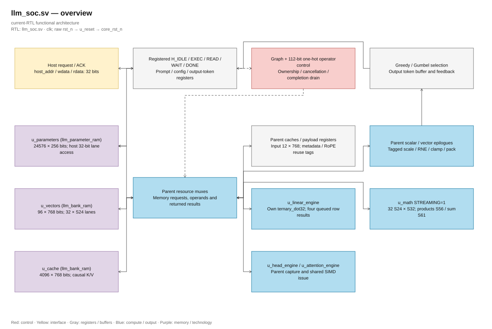
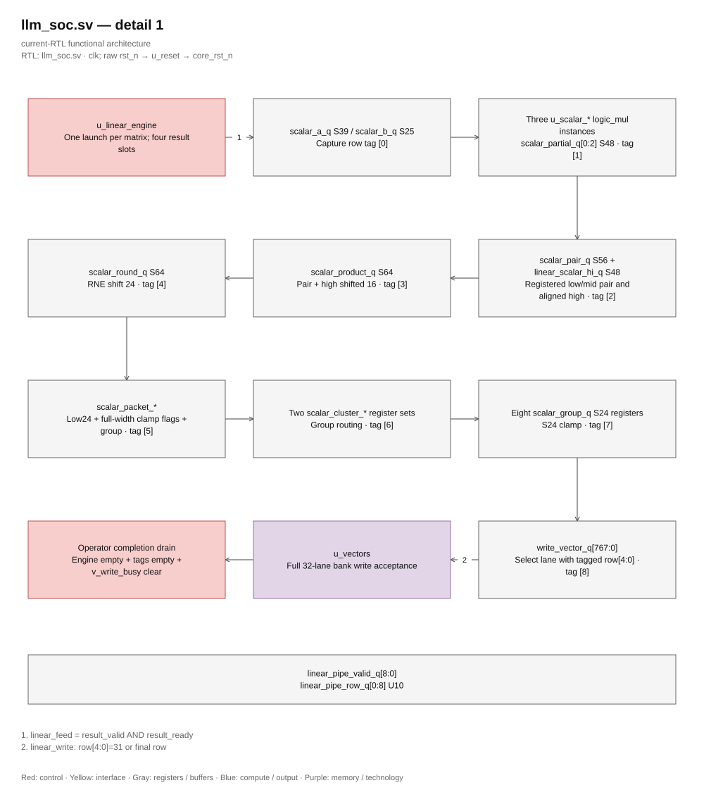
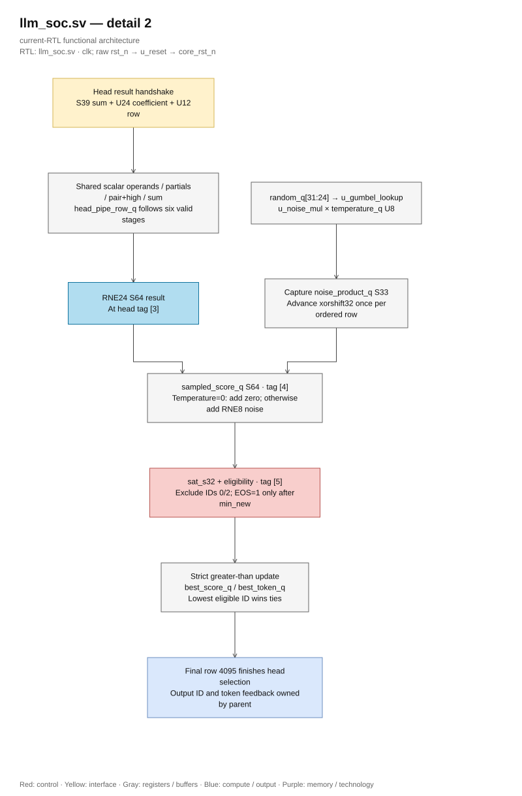

# llm_soc

> **Role:** Own autonomous fixed-point inference and route shared resources.
> **Scope:** CURRENT. **Category:** GUIDE.
> **Source:** [llm_soc.sv](<../../../Verilog Source code/llm_soc.sv>).

Mặc định `USE_QUARTUS_MEMORY=0`: test Xcelium và synthesis Genus dùng RAM portable.
Backend Quartus chỉ còn phục vụ snapshot FPGA cũ khi chọn tham số 1 rõ ràng.
Xem [flow server](../../../tools/server/README.md); evidence FPGA cũ không xác minh cấu hình mới.

## At a glance

| Item | Description |
|---|---|
| Responsibility | Host transactions, prefill/decode sequencing and ordered operator completion |
| Inputs | Clock/reset; host enable/write/address/data |
| Outputs | Host data/acknowledgement; running/ready/error/overflow; debug signals |
| Owns | Graph/operator/host FSMs, metadata, operand/cache tags, scaling, vector writes, softmax/value passes and token selection |
| Delegates | Linear/head/QK/normalization engines, structural arithmetic and parameter/vector/KV memory adapters |

## Architecture

[Editable draw.io — llm_soc.sv — overview](../../diagrams/architecture.drawio) · Page `31_llm_soc.sv_1`.

[Editable draw.io — llm_soc.sv — detail 1](../../diagrams/architecture.drawio) · Page `32_llm_soc.sv_2`.

[Editable draw.io — llm_soc.sv — detail 2](../../diagrams/architecture.drawio) · Page `33_llm_soc.sv_3`.

## Main flow

1. Accept host parameters, prompt IDs and configuration; validate START.
2. Select each graph phase and route its memory/arithmetic requests.
3. Consume valid engine responses; finish rounding, saturation and ordered vector writes.
4. Select a token, append its ID and either feed it back or complete generation.

## Important state / datapath groups

| Group | Purpose |
|---|---|
| `graph`, `op` | Phase selection and explicit operator states |
| `layer_q`, `position_q`, `generated_q` | Layer, context position and output progress |
| Input/scale/RoPE tags | Reuse only operands compatible with the next phase |
| `linear_active_q`, `linear_row_issue_q`, `linear_pipe_valid_q/linear_pipe_row_q` | One matrix stream; ordered engine results feed the existing scalar registers with stage validity and aligned row tags |
| `head_result_ready`, `head_pipe_valid_q/head_pipe_row_q` | One vocabulary stream; six tagged scalar stages carry multiply partials, pair/high alignment, product, RNE/noise, sampled score and ordered selection |
| `temperature_q`, `random_q`, selection score | Greedy or sampled selection; stable ID ordering |

## Important contracts

Linear execution launches once in `L_ROW_START` and remains in `L_ROW_WAIT` while the engine issues consecutive rows. Its bounded result FIFO feeds coefficient multiplication, RNE, saturation and lane packing through the existing registers. The final lane is captured before the tagged bank write is accepted; a write may overlap packing the next bank. Fault consumption waits for older scalar packets to finish, then drains accepted memory/dot work. Completion waits for empty row results, scalar validity and bank write queues. Memory acceptance and write commitment are different events; host acknowledgement follows commitment. Shared-resource muxes are owned here, rather than direct engine-to-engine wiring.

The diagrams above reflect continuous row streaming and the tagged scalar epilogue, including the registered upper multiply partial.

Head execution launches once in `H_SCALE` after four hidden-vector cache reads, then stays in `H_STREAM_WAIT`. The engine owns weight and packed-scale reads; each accepted S39 sum/U24 coefficient enters the shared scalar registers. The upper multiply partial travels with its pair stage. Tags preserve row-scale association through exact RNE and sampled-score saturation. PRNG advances once per ordered row at the RNE/noise stage, including greedy and excluded rows. Selection uses strict greater-than and ascending IDs, preserving the eligible fallback and stable ties. Completion follows selection of row 4,095 and empty head validity/engine ownership. Reset/cancellation clears pipeline validity and prevents PRNG/selection updates; cancellation drains accepted engine responses before completion.

## Easy to misunderstand

- SIMD lanes form one reduction, not independent completed outputs.
- Zero temperature adds zero noise in the head pipeline but still advances PRNG once per row, including excluded IDs.
- Host supplies prompt/configuration, not hidden activations or continuation IDs.
- Result slots include queued sums and rows already issued into the dot pipeline. Backpressure retains the oldest sum/fault pair and bounds further row issue.

## Related docs

[Architecture/numeric contracts](../../design/full_rtl_language.md) · [Host interface](../../design/host_interface.md) · [Cache contracts](../../design/exact_throughput_optimization.md) · [Full graph module map](../full_graph.md) · [Implementation rationale](../../../review/architecture_optimization_20261007.md)
