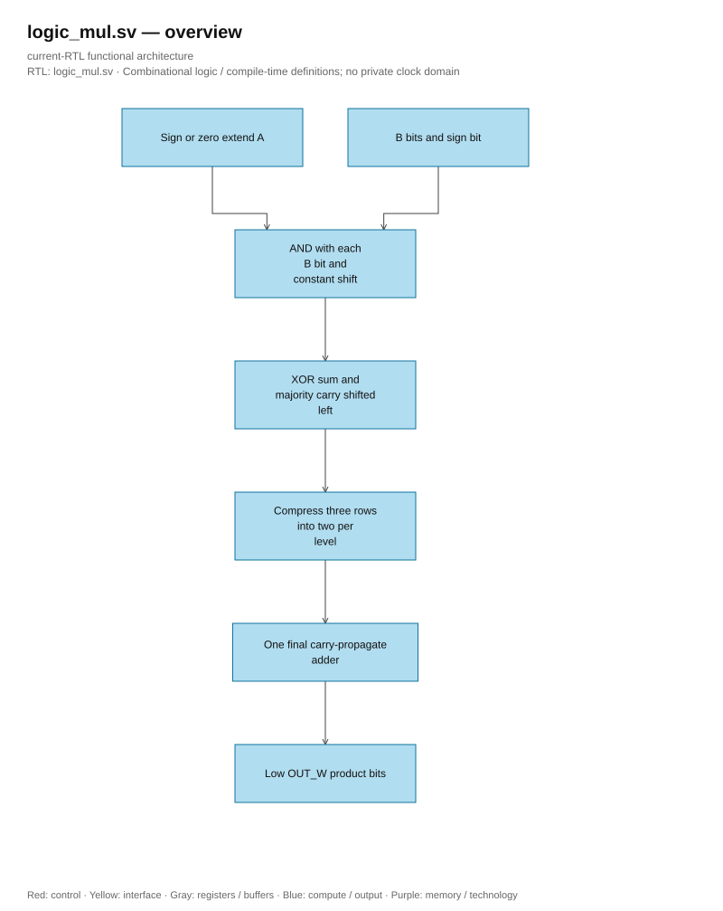

# logic_mul.sv — Portable bit-product compressor tree

<!-- reading-navigation:start -->
[Documentation](../../README.md) → [02 · Architecture](../../02-architecture/README.md) → [Module catalog](README.md)

| Reading guide | Document |
|---|---|
| Read first | [Full RTL graph](../full_graph.md) |
| Related implementation | [llm_math.sv](llm_math.sv.md) |
<!-- reading-navigation:end -->

**Structural generation.** Named SystemVerilog generate constructs are retained without the optional `generate`/`endgenerate` regions, following lowRISC. Loop bounds, conditional branches, instance names and lane ownership are unchanged.

> **Category: GUIDE. Scope: CURRENT (may also have legacy callers).** RTL is authoritative; diagrams use the [shared visual style](../../diagrams/diagram_style.md).

**Source:** [logic_mul.sv](<../../../Verilog%20Source%20code/logic_mul.sv>).

## At a glance

| Item | Description |
|---|---|
| Responsibility | Multiplier of AND/XOR/OR/NOT combinations, shift constants, and a final adder. Do not use multiply/divide operators or vendor arithmetic IP. A/B have independent signedness; OUT_W takes modulo 2^OUT_W according to RTL width trimming. Callers preserve register, valid, reset, and latency. The sign bit of B has a negative weight using complemented row plus one correction; A is sign/zero extended before shifting. |

## Architecture diagram

[Editable draw.io — logic_mul.sv — overview](../../diagrams/architecture.drawio) · Page `34_logic_mul.sv_1`.

## Important state / datapath groups

### [Lines 1–16: Contract and independent signedness](<../../../Verilog%20Source%20code/logic_mul.sv#L1>)

Combinational payload, no separate reset/handshake. ASIC maps the module into standard cells; no technology branch needed.

### [Lines 17–35: Elaboration geometry](<../../../Verilog%20Source%20code/logic_mul.sv#L17>)

Count rows using constant loops, no runtime divider or counter created. genvars create fixed hierarchy.

### [Lines 36–72: Partial products and carry-save compression](<../../../Verilog%20Source%20code/logic_mul.sv#L36>)

Unsigned bits contribute A shifted left; signed top bit contributes -A shifted left. Correction compensates with plus one; compressor keeps modulo sum and has no horizontal carry chain at each level.

### [Lines 73–74: Final sum](<../../../Verilog%20Source%20code/logic_mul.sv#L73>)

The remaining two rows are added using a regular adder; OUT_W must be positive. Higher bits are intentionally truncated, the caller is responsible for saturation/RNE after the product.
