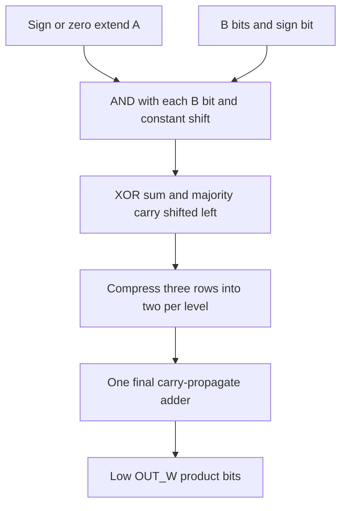

# logic_mul.sv — Portable bit-product compressor tree

[Tài liệu](../../README.md) → [Source guide](../README.md) → [Mục lục](README.md)

**Source:** [logic_mul.sv](<../../../Verilog%20Source%20code/logic_mul.sv>). **Số dòng:** 76. **SHA-256:** `b54ffa7814b0d19816f3137d123ea022cba56b31089aa2a52fdbbfca1a2a7137`.

## Khối này làm gì?

Multiplier tổ hợp từ AND/XOR/OR/NOT, dịch hằng và một bộ cộng cuối. Không dùng toán tử nhân/chia hoặc vendor arithmetic IP. A/B có signedness độc lập; OUT_W lấy modulo 2^OUT_W đúng với cắt độ rộng RTL. Callers giữ nguyên register, valid, reset và latency. Bit dấu B mang trọng số âm bằng complemented row cộng correction một; A được sign/zero extend trước khi dịch.

## Sơ đồ kiến trúc



## Cách hoạt động chi tiết

Multiplier tổ hợp từ AND/XOR/OR/NOT, dịch hằng và một bộ cộng cuối. Không dùng toán tử nhân/chia hoặc vendor arithmetic IP. A/B có signedness độc lập; OUT_W lấy modulo 2^OUT_W đúng với cắt độ rộng RTL. Callers giữ nguyên register, valid, reset và latency. Bit dấu B mang trọng số âm bằng complemented row cộng correction một; A được sign/zero extend trước khi dịch.

## Các nhóm logic trong source

### [Dòng 1–15: Contract and independent signedness](<../../../Verilog%20Source%20code/logic_mul.sv#L1>)

<!-- source-range:1:15 -->
```systemverilog
// Portable bit-product compressor tree. No arithmetic multiply operator or IP.
// Combinational: callers own operand/product registers, validity and reset.
// Result is the low OUT_W bits of the exact signed/unsigned product.
module logic_mul #(
    parameter int A_W = 24,
    parameter int B_W = 8,
    parameter int OUT_W = A_W + B_W,
    parameter bit SIGNED_A = 1,
    parameter bit SIGNED_B = 0
) (
    input logic [A_W - 1:0] a,
    input logic [B_W - 1:0] b,
    output wire [OUT_W - 1:0] product
);
    localparam int ROWS = B_W + (SIGNED_B ? 1 : 0);
```

Payload combinational, không reset/handshake riêng. ASIC map cùng module vào standard cells; không cần technology branch.

### [Dòng 16–37: Elaboration geometry](<../../../Verilog%20Source%20code/logic_mul.sv#L16>)

<!-- source-range:16:37 -->
```systemverilog
    function automatic integer rows_at(input integer level);
        integer count, groups;
        begin
            count = ROWS;
            for (integer step = 0; step < level; step = step + 1) begin
                // Constant elaboration division by three, using subtraction.
                groups = 0;
                for (integer remaining = count; remaining >= 3; remaining = remaining - 3)
                    groups = groups + 1;
                count = count - groups;
            end
            rows_at = count;
        end
    endfunction
    function automatic integer tree_depth();
        integer depth;
        begin
            depth = 0;
            while (rows_at(depth) > 2) depth = depth + 1;
            tree_depth = depth;
        end
    endfunction
```

Đếm rows bằng loop hằng, không tạo divider hay counter runtime. Các genvar tạo hierarchy cố định.

### [Dòng 38–74: Partial products and carry-save compression](<../../../Verilog%20Source%20code/logic_mul.sv#L38>)

<!-- source-range:38:74 -->
```systemverilog
    localparam int LEVELS = tree_depth();
    wire [OUT_W - 1:0] extended_a;
    genvar level, bit_id, group_id, tail;
    generate
    if (SIGNED_A) assign extended_a = OUT_W'($signed(a));
    else assign extended_a = OUT_W'(a);
    for (level = 0; level <= LEVELS; level = level + 1) begin : g_level
        localparam int COUNT = rows_at(level);
        wire [OUT_W - 1:0] row [0:COUNT - 1];
        if (level == 0) begin : g_bits
            for (bit_id = 0; bit_id < B_W; bit_id = bit_id + 1) begin : g_bit
                if (SIGNED_B && bit_id == B_W - 1)
                    assign row[bit_id] = b[bit_id] ? ~(extended_a << bit_id) : '0;
                else assign row[bit_id] = (extended_a << bit_id) & {OUT_W{b[bit_id]}};
            end
            // Negative sign-bit weight: complemented shifted row plus one.
            if (SIGNED_B) assign row[B_W] = OUT_W'(b[B_W - 1]);
        end else begin : g_compress
            localparam int PREVIOUS = rows_at(level - 1);
            localparam int GROUPS = PREVIOUS - COUNT;
            for (group_id = 0; group_id < GROUPS; group_id = group_id + 1) begin : g_group
                localparam int BASE = group_id + (group_id << 1);
                wire [OUT_W - 1:0] x, y, z;
                assign x = g_level[level - 1].row[BASE];
                assign y = g_level[level - 1].row[BASE + 1];
                assign z = g_level[level - 1].row[BASE + 2];
                assign row[group_id << 1] = x ^ y ^ z;
                assign row[(group_id << 1) + 1] = ((x & y) | (x & z) | (y & z)) << 1;
            end
            for (tail = 0; tail < PREVIOUS - GROUPS - (GROUPS << 1); tail = tail + 1) begin : g_tail
                assign row[(GROUPS << 1) + tail] =
                    g_level[level - 1].row[GROUPS + (GROUPS << 1) + tail];
            end
        end
    end
    if (rows_at(LEVELS) == 1) assign product = g_level[LEVELS].row[0];
    else assign product = g_level[LEVELS].row[0] + g_level[LEVELS].row[1];
```

Unsigned bits góp A dịch trái; signed top bit góp -A dịch trái. Correction bù cộng một; compressor giữ tổng modulo và không có carry chain ngang mỗi level.

### [Dòng 75–76: Final sum](<../../../Verilog%20Source%20code/logic_mul.sv#L75>)

<!-- source-range:75:76 -->
```systemverilog
    endgenerate
endmodule
```

Hai rows còn lại cộng bằng adder thông thường; OUT_W phải dương. Cắt bit cao có chủ ý, caller chịu trách nhiệm saturation/RNE sau product.
