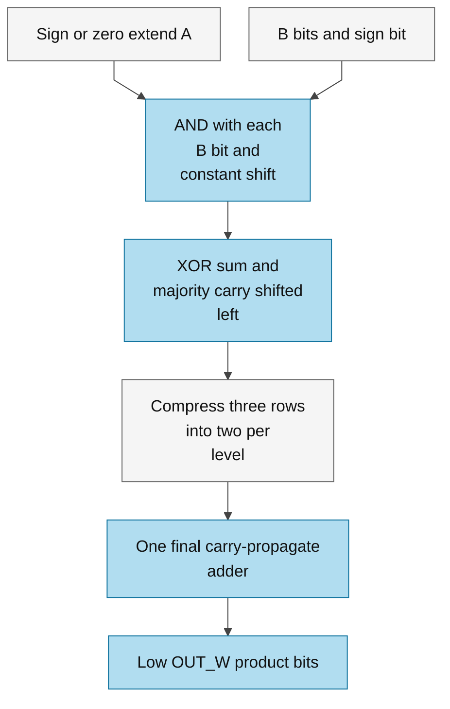

# logic_mul.sv — Portable bit-product compressor tree

> **Category: GUIDE. Scope: CURRENT (may also have legacy callers).** RTL is authoritative; diagrams use the [shared visual style](../../diagrams/diagram_style.md).
[Tài liệu](../../README.md) → [Source guide](../README.md) → [Mục lục](README.md)

**Source:** [logic_mul.sv](<../../../Verilog%20Source%20code/logic_mul.sv>).

## At a glance

| Item | Description |
|---|---|
| Responsibility | Multiplier tổ hợp từ AND/XOR/OR/NOT, dịch hằng và một bộ cộng cuối. Không dùng toán tử nhân/chia hoặc vendor arithmetic IP. A/B có signedness độc lập; OUT_W lấy modulo 2^OUT_W đúng với cắt độ rộng RTL. Callers giữ nguyên register, valid, reset và latency. Bit dấu B mang trọng số âm bằng complemented row cộng correction một; A được sign/zero extend trước khi dịch. |

## Sơ đồ kiến trúc

## Important state / datapath groups

### [Dòng 1–16: Contract and independent signedness](<../../../Verilog%20Source%20code/logic_mul.sv#L1>)

Payload combinational, không reset/handshake riêng. ASIC map cùng module vào standard cells; không cần technology branch.

### [Dòng 17–35: Elaboration geometry](<../../../Verilog%20Source%20code/logic_mul.sv#L17>)

Đếm rows bằng loop hằng, không tạo divider hay counter runtime. Các genvar tạo hierarchy cố định.

### [Dòng 36–72: Partial products and carry-save compression](<../../../Verilog%20Source%20code/logic_mul.sv#L36>)

Unsigned bits góp A dịch trái; signed top bit góp -A dịch trái. Correction bù cộng một; compressor giữ tổng modulo và không có carry chain ngang mỗi level.

### [Dòng 73–74: Final sum](<../../../Verilog%20Source%20code/logic_mul.sv#L73>)

Hai rows còn lại cộng bằng adder thông thường; OUT_W phải dương. Cắt bit cao có chủ ý, caller chịu trách nhiệm saturation/RNE sau product.
