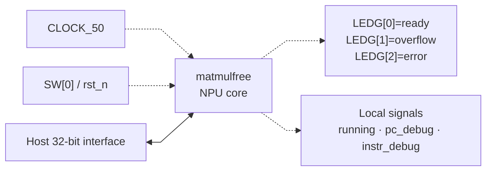

# matmul_wrap.sv — Wrapper clock/reset/LED

[Tài liệu](../../README.md) → [Hierarchy RTL](../README.md) → [Mục lục từng file](README.md)

**Trạng thái:** Đang dùng nếu chọn board top.

**Source:** [matmul_wrap.sv](<../../../Verilog%20Source%20code/matmul_wrap.sv>). **Số dòng:** 29. **SHA-256:** `989501df6c30b7b8ac91d1ffde814b7b62b149a01c69c2a5f723c419d48a7e16`.

## Khối này làm gì?

Wrapper đưa CLOCK_50 vào clk và SW[0] vào rst_n của core. LEDG[0]=ready, [1]=overflow, [2]=error. Tín hiệu running/PC/instruction được giữ nội bộ, không đưa ra LED.

## Sơ đồ kiến trúc tổng quan



MUX dùng hình thang rộng ở phía nhiều ngõ vào và thu hẹp về ngõ ra; decoder/demux dùng hình thang ngược lại, mở rộng về phía nhiều ngõ ra. Hình chữ nhật có các vạch ngang biểu diễn bộ nhớ hoặc bank descriptor. Các hình chữ nhật thường là datapath, thanh ghi đơn hoặc giao diện. Nét liền là đường dữ liệu, nét đứt là điều khiển/cấu hình. Mũi tên hồi tiếp biểu diễn kết nối phần cứng. Sơ đồ không biểu diễn thứ tự chu kỳ, trạng thái FSM hoặc các tầng pipeline CPU.

## Cách hoạt động chi tiết

Không có datapath hay chương trình riêng trong wrapper. Host bên ngoài vẫn phải nạp đầy đủ memory/descriptor/program. SW[0]=0 giữ reset; đưa lên 1 mới thoát reset. Khi đóng gói ASIC sẽ cần thay giao diện board phù hợp.

1. Wrapper chỉ nối pin board với core, không thêm datapath hay instruction.
2. CLOCK_50 cấp trực tiếp cho core; SW[0] là reset active-low.
3. Host bus đi thẳng vào matmulfree nên giữ nguyên memory map và quy tắc chỉ ghi khi idle.
4. LED báo ready, overflow và error; running/PC/instruction debug chỉ tồn tại nội bộ.

## Các nhóm logic trong source

Source được chia theo chức năng. Mỗi nhóm giữ nguyên phạm vi dòng để đối chiếu, nhưng phần giải thích tập trung vào quan hệ giữa các câu lệnh thay vì lặp lại từng dấu ngoặc, khai báo hoặc phép gán.


### [Dòng 1–14: Port và debug nội bộ](<../../../Verilog%20Source%20code/matmul_wrap.sv#L1>)

<!-- source-range:1:14 -->
```systemverilog
// Board wrapper: LED0=ready, LED1=saturation/overflow, LED2=error.
// The host must load SRAM, descriptors and a HALT-terminated program before start.
module matmul_wrap (
    input logic CLOCK_50,
    input logic [0:0] SW,
    output logic [2:0] LEDG,
    input logic host_en, host_we,
    input logic [31:0] host_addr, host_wdata,
    output logic [31:0] host_rdata,
    output logic host_ready
);
    logic running;
    logic [8:0] pc_debug;
    logic [12:0] instr_debug;
```

**Mục đích.** Tên clock theo board không phải tần số timing signoff.

**Cách phần code hoạt động.** Nhóm này định nghĩa giao diện, độ rộng, kiểu hoặc tín hiệu trung gian. Nó tạo cấu trúc để các nhóm xử lý sau sử dụng, chưa tự biểu diễn một bước runtime riêng.

**Tín hiệu và dữ liệu chính.** `CLOCK_50`: clock từ board wrapper; `SW`: switch0 dùng làm rst_n; `LEDG`: ba LED chỉ ready/overflow/error; `host_en`: host đang yêu cầu truy cập; `host_we`: host chọn ghi thay vì đọc; `host_addr`: địa chỉ phía host; và 6 tín hiệu phụ khác trong đoạn code.


### [Dòng 15–29: Instance core](<../../../Verilog%20Source%20code/matmul_wrap.sv#L15>)

<!-- source-range:15:29 -->
```systemverilog
    matmulfree u_npu(.clk(CLOCK_50),
        .rst_n(SW[0]),
        .host_en(host_en),
        .host_we(host_we),
        .host_addr(host_addr),
        .host_wdata(host_wdata),
        .host_rdata(host_rdata),
        .host_ready(host_ready),
        .running(running),
        .ready(LEDG[0]),
        .overflow_out(LEDG[1]),
        .error(LEDG[2]),
        .pc_debug(pc_debug),
        .instr_debug(instr_debug));
endmodule
```

**Mục đích.** Named ports đưa host thẳng vào matmulfree và status đến LED.

**Cách phần code hoạt động.** Có instance module con; named-port ở nhóm này xác định chính xác đường control/data giữa hai cấp hierarchy.

**Tín hiệu và dữ liệu chính.** `CLOCK_50`: clock từ board wrapper; `SW`: switch0 dùng làm rst_n; `host_en`: host đang yêu cầu truy cập; `host_we`: host chọn ghi thay vì đọc; `host_addr`: địa chỉ phía host; `host_wdata`: data 32 host muốn ghi; và 9 tín hiệu phụ khác trong đoạn code.
