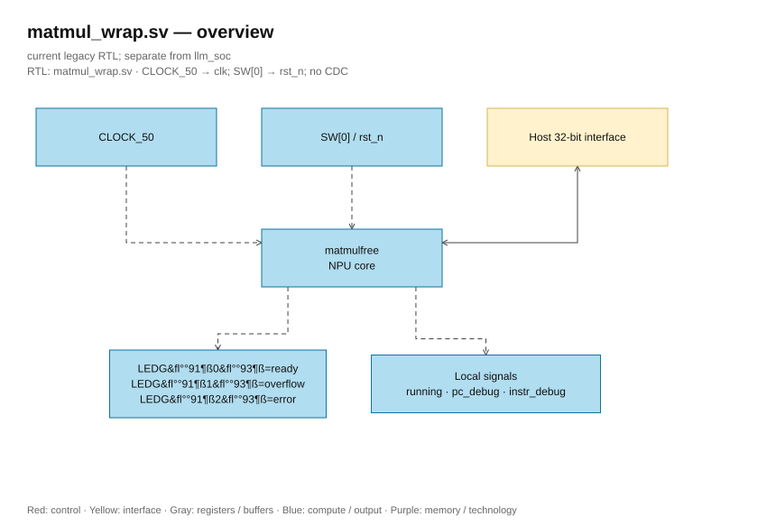

# matmul_wrap.sv — Wrapper clock/reset/LED

<!-- reading-navigation:start -->
[Documentation](../../README.md) → [Archive · Legacy](../../archive/README.md) → [Module catalog](README.md)

| Reading guide | Document |
|---|---|
| New to the subject | [NPU and RTL fundamentals](../../00-start-here/fundamentals.md) · [Glossary](../../00-start-here/glossary.md) |
| Learn the RTL syntax | [How to read the SystemVerilog](../../00-start-here/reading-systemverilog.md) |
| Read first | [Legacy architecture](../../design/legacy/architecture.md) |
| Related implementation | [matmulfree.sv](matmulfree.sv.md) |
<!-- reading-navigation:end -->

> **Category: GUIDE. Scope: LEGACY.** RTL is authoritative; diagrams use the [shared visual style](../../diagrams/diagram_style.md).

**Status:** Used when selecting the top board.

**Source:** [matmul_wrap.sv](<../../../Verilog%20Source%20code/matmul_wrap.sv>).

## At a glance

| Item | Description |
|---|---|
| Responsibility | Wrapper brings CLOCK_50 into clk and SW[0] into core's rst_n. LEDG[0]=ready, [1]=overflow, [2]=error. The running/PC/instruction signals are kept internal, not output to LEDs. |

## Overall architecture diagram

[Editable draw.io — matmul_wrap.sv — overview](../../diagrams/architecture.drawio) · Page `35_matmul_wrap.sv_1`.

## Main flow

There is no datapath or individual program in the wrapper. The external host still needs to fully load memory/descriptor/program. SW[0]=0 holds reset; setting it to 1 releases reset. When packaging into ASIC, the board interface will need to be adapted accordingly.

1. The wrapper only connects the board pins to the core, without adding a datapath or instructions.
2. CLOCK_50 is supplied directly to the core; SW[0] is an active-low reset.
3. The host bus goes directly into matmulfree, so it keeps the original memory map and the rule to write only when idle.
4. LEDs indicate ready, overflow, and error; running/PC/instruction debug exist only internally.

## Important state / datapath groups

### [Lines 1–14: Ports and internal debug](<../../../Verilog%20Source%20code/matmul_wrap.sv#L1>)

**Purpose.** The clock name according to the board is not the timing signoff frequency.

**How the code works.** This group defines the interface, width, type, or intermediate signals. It creates structure for subsequent processing groups to use and does not itself represent a separate runtime step.

**Main signals and data.** `CLOCK_50`: clock from the wrapper board; `SW`: switch0 used as rst_n; `LEDG`: three LEDs indicating ready/overflow/error; `host_en`: host is requesting access; `host_we`: host chooses write instead of read; `host_addr`: host-side address; and 6 other auxiliary signals in the code snippet.

### [Lines 15–29: Core instance](<../../../Verilog%20Source%20code/matmul_wrap.sv#L15>)

**Purpose.** Named ports bring the host directly into matmulfree and status to the LED.

**How the code works.** There is a child module instance; named ports in this group precisely define the control/data path between the two hierarchy levels.

**Main signals and data.** `CLOCK_50`: clock from the board wrapper; `SW`: switch0 used as rst_n; `host_en`: host is requesting access; `host_we`: host chooses to write instead of read; `host_addr`: host-side address; `host_wdata`: 32-bit data the host wants to write; and 9 other auxiliary signals in the code segment.
