# matmul_wrap.sv — Wrapper clock/reset/LED

> **Category: GUIDE. Scope: LEGACY.** RTL is authoritative; diagrams use the [shared visual style](../../diagrams/diagram_style.md).
[Tài liệu](../../README.md) → [Hierarchy RTL](<../legacy/README.md>) → [Mục lục từng file](README.md)

**Trạng thái:** Đang dùng nếu chọn board top.

**Source:** [matmul_wrap.sv](<../../../Verilog%20Source%20code/matmul_wrap.sv>).

## At a glance

| Item | Description |
|---|---|
| Responsibility | Wrapper đưa CLOCK_50 vào clk và SW[0] vào rst_n của core. LEDG[0]=ready, [1]=overflow, [2]=error. Tín hiệu running/PC/instruction được giữ nội bộ, không đưa ra LED. |

## Sơ đồ kiến trúc tổng quan

```mermaid
%%{init: {
  "theme": "base",
  "themeVariables": {
    "background": "#ffffff",
    "primaryTextColor": "#111111",
    "secondaryTextColor": "#111111",
    "tertiaryTextColor": "#111111",
    "lineColor": "#444444",
    "clusterBkg": "#ffffff",
    "clusterBorder": "#aaaaaa",
    "edgeLabelBackground": "#ffffff",
    "fontSize": "17px"
  },
  "flowchart": {
    "curve": "linear",
    "nodeSpacing": 30,
    "rankSpacing": 40,
    "htmlLabels": true,
    "useMaxWidth": true
  }
}}%%
flowchart LR
CLK["CLOCK_50"] -.-> CORE["matmulfree<br/>NPU core"]
    SW["SW&#91;0&#93; / rst_n"] -.-> CORE
    HOST["Host 32-bit interface"] <--> CORE
    CORE -.-> LED["LEDG&#91;0&#93;=ready<br/>LEDG&#91;1&#93;=overflow<br/>LEDG&#91;2&#93;=error"]
    CORE -.-> DBG["Local signals<br/>running · pc_debug · instr_debug"]
classDef control fill:#f8cecc,stroke:#b85450,color:#111111;
classDef interface fill:#fff2cc,stroke:#d6b656,color:#111111;
classDef buffer fill:#f5f5f5,stroke:#666666,color:#111111;
classDef compute fill:#b1ddf0,stroke:#10739e,color:#111111;
classDef output fill:#dae8fc,stroke:#6c8ebf,color:#111111;
classDef platform fill:#e1d5e7,stroke:#9673a6,color:#111111;
class HOST interface;
class CLK,SW,LED,DBG buffer;
class CORE compute;
```

## Main flow

Không có datapath hay chương trình riêng trong wrapper. Host bên ngoài vẫn phải nạp đầy đủ memory/descriptor/program. SW[0]=0 giữ reset; đưa lên 1 mới thoát reset. Khi đóng gói ASIC sẽ cần thay giao diện board phù hợp.

1. Wrapper chỉ nối pin board với core, không thêm datapath hay instruction.
2. CLOCK_50 cấp trực tiếp cho core; SW[0] là reset active-low.
3. Host bus đi thẳng vào matmulfree nên giữ nguyên memory map và quy tắc chỉ ghi khi idle.
4. LED báo ready, overflow và error; running/PC/instruction debug chỉ tồn tại nội bộ.

## Important state / datapath groups

### [Dòng 1–14: Port và debug nội bộ](<../../../Verilog%20Source%20code/matmul_wrap.sv#L1>)

**Mục đích.** Tên clock theo board không phải tần số timing signoff.

**Cách phần code hoạt động.** Nhóm này định nghĩa giao diện, độ rộng, kiểu hoặc tín hiệu trung gian. Nó tạo cấu trúc để các nhóm xử lý sau sử dụng, chưa tự biểu diễn một bước runtime riêng.

**Tín hiệu và dữ liệu chính.** `CLOCK_50`: clock từ board wrapper; `SW`: switch0 dùng làm rst_n; `LEDG`: ba LED chỉ ready/overflow/error; `host_en`: host đang yêu cầu truy cập; `host_we`: host chọn ghi thay vì đọc; `host_addr`: địa chỉ phía host; và 6 tín hiệu phụ khác trong đoạn code.

### [Dòng 15–29: Instance core](<../../../Verilog%20Source%20code/matmul_wrap.sv#L15>)

**Mục đích.** Named ports đưa host thẳng vào matmulfree và status đến LED.

**Cách phần code hoạt động.** Có instance module con; named-port ở nhóm này xác định chính xác đường control/data giữa hai cấp hierarchy.

**Tín hiệu và dữ liệu chính.** `CLOCK_50`: clock từ board wrapper; `SW`: switch0 dùng làm rst_n; `host_en`: host đang yêu cầu truy cập; `host_we`: host chọn ghi thay vì đọc; `host_addr`: địa chỉ phía host; `host_wdata`: data 32 host muốn ghi; và 9 tín hiệu phụ khác trong đoạn code.
