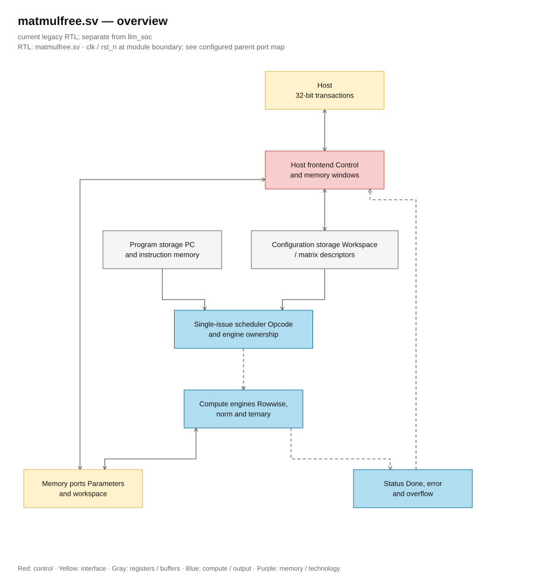
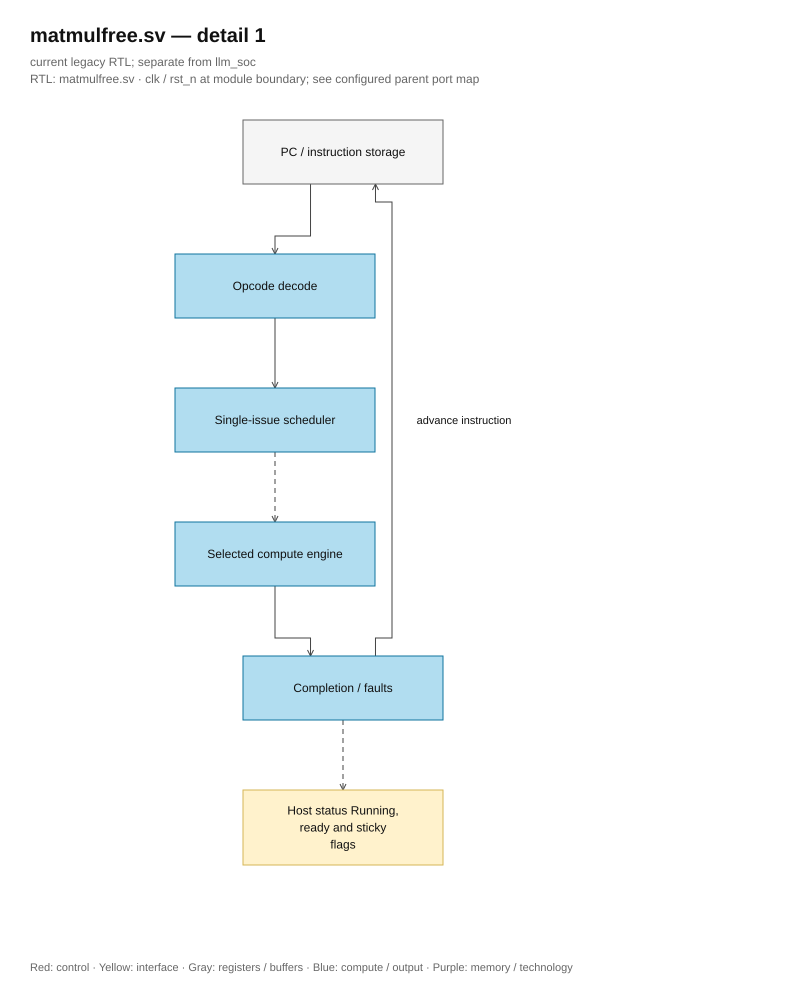
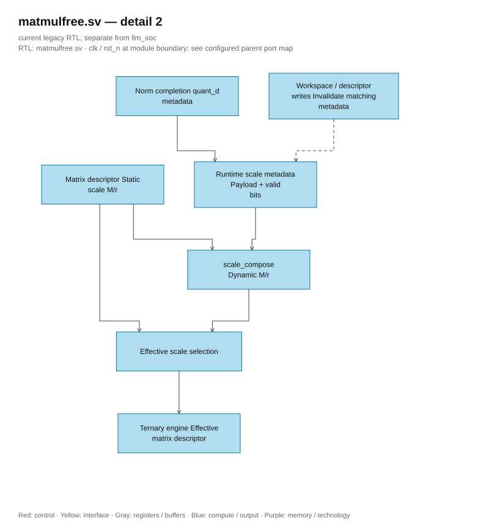

# matmulfree.sv — Top-level: coordination of the entire NPU

<!-- reading-navigation:start -->
[Documentation](../../README.md) → [Archive · Legacy](../../archive/README.md) → [Module catalog](README.md)

| Reading guide | Document |
|---|---|
| Read first | [Legacy architecture](../../design/legacy/architecture.md) |
| Related implementation | [descriptor_file.sv](descriptor_file.sv.md) |
<!-- reading-navigation:end -->

> **Category: GUIDE. Scope: LEGACY.** RTL is authoritative; diagrams use the [shared visual style](../../diagrams/diagram_style.md).

**Status:** In use — main core.

**Source:** [matmulfree.sv](<../../../Verilog%20Source%20code/matmulfree.sv>).

## At a glance

| Item | Description |
|---|---|
| Responsibility | This is where the host, instruction memory, descriptor, SRAM, and three execution units are connected. The core does not push many instructions into the pipeline. A FSM selects a unit, waits for the result, and only then increments the PC. Therefore, when reading this file, it is necessary to simultaneously follow `sched` (control steps) and `active_unit` (unit connected to the workspace). |

The host port is a simple 32-bit bus, not AXI/APB. Host addresses are in bytes; compute SRAM is in 256-bit words. Host write operations are only allowed when the core is not running.

## General architecture diagram

[Editable draw.io — matmulfree.sv — overview](../../diagrams/architecture.drawio) · Page `36_matmulfree.sv_1`.

## Main flow

`start → S_FETCH → S_START → S_WAIT → S_ADVANCE`. TMATMUL uses a dynamic scale to go through `S_COMPOSE_START/WAIT` before `S_TM_START`. HALT or errors lead to `S_HALT`, setting ready to 1. Overflow is retained until the next start; error and overflow are two different states.

Cache q holds D, base, and length to ensure the scale is attached to the correct tensor. Any overwrite of the q region invalidates the old metadata. Static TM checks for overlap with all valid q entries, so descriptor alias cannot ignore dynamic scale. Dynamic TM requires the correct ID and exact base/length.

1. When idle, the host loads parameters, workspace, descriptor, and instructions. `host_ready` only verifies that allowed addresses are accepted; it does not check the model content.
2. Start by setting the PC to 0, clear the flag from the previous run, and switch the scheduler to FETCH. The scheduler holds the fetch request and waits for `instr_fetch_valid`; the instruction is locked into `instr_q`, so the opcode and descriptor IDs remain stable throughout the multi-cycle instruction.
3. S_START selects the execution unit. NORM and rowwise go straight to WAIT. TMATMUL may need to run `scale_compose` first if q carries a dynamic scale from NORM.
4. `active_unit` controls the workspace mux. Only rowwise, norm, or ternary is connected to SRAM at one time.
5. When the unit signals done, the top collects overflow/error. Valid instructions increment the PC; errors or HALT bring the core back to ready.
6. Cache `q_d/q_base/q_length/q_valid` forces D to go along with the correct tensor. Overriding q or modifying the descriptor makes the cache invalid. Only `q_valid` has reset; the 336-bit tuple is fully written when NORM successfully completes through eight generate processes with a constant index and is read after the valid guard.

**RTL conventions.** Host reads request/address/region and then latches response/data/tag: control/descriptor require two rising edges, SRAM/imem require four rising edges from the first sample. Data is only valid when ready on the correct address. Held request keeps a snapshot of the initial response; a new poll at the same address requires idle through one rising edge. Address change/drop enable/write cancels the old read. Write is direct and memory access is blocked when running; control/status read is allowed. Payload request/response do not reset, reset valid mask output to zero. Backend adapter still reads valid on two rising edges.

## Important state / datapath groups

### [Lines 1–25: Interface and opcode](<../../../Verilog%20Source%20code/matmulfree.sv#L1>)

**Purpose.** Declare host port, execution status, and instruction code. The names DIV/EXP/LDV/STV have no meaning; the scheduler supports them.

**How this part of the code works.** This group defines interfaces, width, type, or intermediate signals. It creates a structure for subsequent processing groups to use, but does not represent a separate runtime step itself.

**Main signals and data.** `host_en`: host is requesting access; `host_we`: host chooses to write instead of read; `host_addr`: host-side address; `host_wdata`: 32-bit data host wants to write; `host_rdata`: 32-bit data returned to host; `host_ready`: host transaction is accepted; and 6 other auxiliary signals in the code segment.

### [Line 26–103: Decode and frontend read host](<../../../Verilog%20Source%20code/matmulfree.sv#L26>)

**Purpose.** Decode region/alignment, latch read request and response with tag to break down host address → data combinational path. Control reads when running; other regions only when idle.

**How the code works.** Valid request writes address and one-hot region at the first edge. Backend uses latched address; control/descriptor ready for response at the second edge, SRAM/imem read via adapter then latch response at the fourth edge. Valid regions are mutually exclusive. Current read address must match response tag to be ready. First response is held until idle/write/address change; do not continuously sample status when enable is held. Write acknowledge and commit are still direct. Reset only clears pending/region/valid/control, while 96-bit address/data payload does not async reset and is masked by valid.

**Main signals and data.** `host_read_address_q`: address locked; `host_read_region_q`: select one of five regions; `host_response_address_q`: returned tag; `host_response_data_q`: returned data; `host_response_valid_q`: payload has been written; `host_read_matches`: current request still matches tag.

#### Hardware block diagram of the group

[Editable draw.io — matmulfree.sv — detail 1](../../diagrams/architecture.drawio) · Page `37_matmulfree.sv_2`.

Control/descriptor needs two rising edges; SRAM/imem needs four rising edges from the first sample. Data mux uses the fixed region, output data goes from the response register. Comparator address/tag keeps ready attached to the correct transaction; host must take data with ready.

### [Lines 104–126: Program counter and instruction memory](<../../../Verilog%20Source%20code/matmulfree.sv#L104>)

**Purpose.** 9-bit PC selects one of 512 instructions; host only writes the lower 13 bits of the word into the program.

**How the code works.** There is a submodule instance; named-port in this group precisely determines the control/data paths between the two hierarchy levels.

**Main signals and data.** `pc`: current instruction address; `pc_clear`: reset PC to 0; `pc_advance`: increment PC by 1; `instr_fetch`: instruction read at PC; `instr_q`: 13-bit instruction currently executing; `clear`: reset PC to 0; and 11 other auxiliary signals in the code segment.

### [Lines 127–156: Descriptor](<../../../Verilog%20Source%20code/matmulfree.sv#L127>)

**Purpose.** Three IDs in the instruction select source0, source1, and destination. TMATMUL uses the source1 field to select the matrix descriptor.

**How the code works.** There is a continuous assignment: the expression always drives the destination signal, no start or clock edge needed. There is a sub-module instance; named-port in this group precisely determines the control/data paths between two hierarchy levels.

**Main signals and data.** `d_src0`: descriptor source0 is being selected by the instruction; `d_src1`: descriptor source1 is being selected by the instruction; `d_dst`: descriptor destination is selected; `d_mat`: original matrix descriptor; `effective_mat`: matrix descriptor with effective postscale factor; `desc_host_matrix`: host is selecting matrix descriptor; and 20 other auxiliary signals in the code segment.

### [Lines 157–203: Two SRAMs](<../../../Verilog%20Source%20code/matmulfree.sv#L157>)

**Purpose.** Workspace read/written by the active unit. Parameter SRAM is read-only on the compute side; host loads weight and bias.

**Main signals and data.** `ws_rd_en`: request to read workspace; `ws_wr_en`: allow writing to workspace; `ws_rd_valid`: workspace returns valid data; `ws_rd_addr`: workspace read address; `ws_wr_addr`: workspace write address; `ws_rd_data`: word 256 returned from workspace; and 16 other auxiliary signals in the code segment.

### [Lines 204–230: Rowwise unit](<../../../Verilog%20Source%20code/matmulfree.sv#L204>)

**Purpose.** Provide descriptor and opcode to the dispatcher; shared workspace data is received through valid.

**Main signals and data.** `start`: request to start transaction; `op`: operand or opcode, according to module interface; `instr_q`: 13-bit instruction currently executing; `a_desc`: source A metadata; `d_src0`: source0 descriptor selected by the instruction; `b_desc`: source B metadata; and 14 other auxiliary signals in the code snippet.

### [Lines 231–266: NORM + QUANT](<../../../Verilog%20Source%20code/matmulfree.sv#L231>)

**Purpose.** Connect scratch, epsilon, delta, and D metadata. Output M/r can be read through the control window for debugging.

**Main signals and data.** `quant_d`: D=max(absmax,delta); `norm_m`: multiplier U24 of RMSNorm; `quant_m`: multiplier U24 of QUANT; `norm_r`: shift of RMSNorm; `quant_r`: shift of QUANT; `start`: request to start transaction; and 18 other auxiliary signals in the code segment.

### [Lines 267–300: Ternary unit](<../../../Verilog%20Source%20code/matmulfree.sv#L267>)

**Purpose.** Insert the descriptor with scale into TMATMUL. The parameter read port is connected separately.

**Main signals and data.** `start`: request to start transaction; `q_desc`: activation S8 source metadata; `d_src0`: source0 descriptor currently selected by instruction; `out_desc`: TMATMUL output metadata; `d_dst`: destination descriptor currently selected; `mat_desc`: matrix and postscale metadata; and 16 other auxiliary signals in the code segment.

### [Lines 301–343: Dynamic Scale](<../../../Verilog%20Source%20code/matmulfree.sv#L301>)

**Purpose.** Each workspace descriptor has D/base/length cache. `selected_quant_d` is 0 when the entry is not valid; `input_has_runtime_scale` scans input overlap with all valid q extents to block static TM via descriptor alias. scale_compose receives the weight/output factors and valid D of the q source.

**Signals and main data.** `q_d`: D associated with each descriptor q; `q_base`: base SRAM that cache q describes; `q_length`: length that cache q describes; `q_valid`: scale q valid bitmask; `composed_m`: effective M from scale_compose; `composed_r`: effective r from scale_compose; and 15 other auxiliary signals in the code segment.

### [Lines 344–379: Metadata validity](<../../../Verilog%20Source%20code/matmulfree.sv#L344>)

**Purpose.** Writing tensor invalidates the old scale. Only `q_valid` uses reset; 336-bit D/base/length payload uses eight clock-only generate processes with constant index, writing full tuples when NORM completes successfully along with the valid edge. Extent comparisons only run when q_valid=1, so uninitialized payload does not affect control.

**How the code section works.** There is sequential logic: registers/FSM only update on the clock edge; nonblocking assignments read the old value on the right-hand side and then latch simultaneously.

**Main signals and data.** `q_valid`: effective bitmask for scale q; `q_d`: D attached to each descriptor q; `q_base`: base SRAM that cache q describes; `q_length`: length that cache q describes; `ws_wr_en`: workspace write enable; `ws_wr_addr`: workspace write address; and 12 other auxiliary signals in the code section.

### [Lines 380–397: Start signal and PC control](<../../../Verilog%20Source%20code/matmulfree.sv#L380>)

**Purpose.** The unit start is a pulse according to the state. The PC only advances after the previous instruction has completed.

**How the code section works.** There is combinational logic: output/intermediate values are calculated from the current input; default values at the beginning of the block help avoid inferring latches.

**Main signals and data.** `pc_clear`: reset PC to 0; `running`: core is executing the program; `pc_advance`: increment PC by 1; `sched`: scheduler state; `instr_q`: currently executing 13-bit instruction; `pc`: current instruction address.

### [Lines 398–430: Mux workspace](<../../../Verilog%20Source%20code/matmulfree.sv#L398>)

**Purpose.** Only the unit selected by active_unit has the right to issue address, data, and enable signals to the workspace.

**Main signals and data.** `ws_rd_en`: request to read workspace; `ws_rd_addr`: workspace read address; `ws_wr_en`: allow workspace write; `ws_wr_addr`: workspace write address; `ws_wr_data`: 256-word workspace write; `active_unit`: unit granted workspace port.

### [Lines 431–542: Scheduler](<../../../Verilog%20Source%20code/matmulfree.sv#L431>)

**Purpose.** Start a run, latch instructions, check q scale, wait for done, collect errors, and stop at HALT. Dynamic TM needs to be valid before reading a tuple to match ID/base/length; static TM is rejected when any input overlaps a valid q extent. Both guards are before S_TM_START, so do not write output when rejected. Assignments within one clock use the old value on the right-hand side.

**Main signals and data.** `sched`: scheduler status; `instr_q`: currently executing 13-bit instruction; `active_unit`: unit allocated workspace port; `running`: core executing program; `ready`: core stopped, ready for host; `error`: run error flag; and 16 other auxiliary signals in the code segment.

#### Hardware block diagram of the group

[Editable draw.io — matmulfree.sv — detail 2](../../diagrams/architecture.drawio) · Page `38_matmulfree.sv_3`.

### [Lines 543–568: Mux response and status](<../../../Verilog%20Source%20code/matmulfree.sv#L543>)

**Purpose.** Generate control data according to the finalized read address and parallel mux five responses using one-hot region. This combinational data only goes into the response register, does not drive host_rdata directly.

**How the code section works.** There is combinational logic: output/intermediate is calculated from the current input; default values at the start of the block help avoid inferring latches. There is continuous assignment: the expression always drives the target signal, no start or clock edge needed.

**Key signals and data.** `host_read_address_q`: address selecting control word; `host_control_data`: status/config combinational; `host_read_region_q`: finalized one-hot region; `host_response_data`: data to latch the response; `pc_debug/instr_debug`: debug scheduler.

### [Lines 569–572: Host writes configuration](<../../../Verilog%20Source%20code/matmulfree.sv#L569>)

**Purpose.** Control register holds base scratch, 64-bit epsilon, and delta. Only updates when not running.

**How the code works.** There is sequential logic: register/FSM only updates on the clock edge; nonblocking assignment reads the old value on the right-hand side then latches simultaneously. There is continuous assignment: the expression continuously drives the destination signal, no start or clock edge needed.

**Main signals and data.** `host_ctrl`: host address belongs to control window; `host_we`: host selects write instead of read; `host_addr`: host-side address; `host_wdata`: 32-bit data the host wants to write; `scratch_z_base`: first word of scratch z; `epsilon_raw32`: epsilon in raw-square units with 32 fractional bits; and 2 other auxiliary signals in the code segment.
