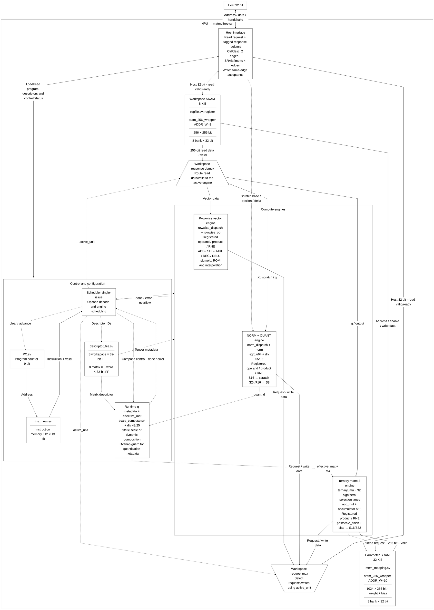
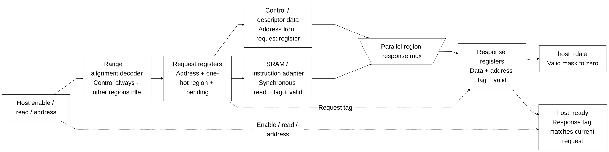
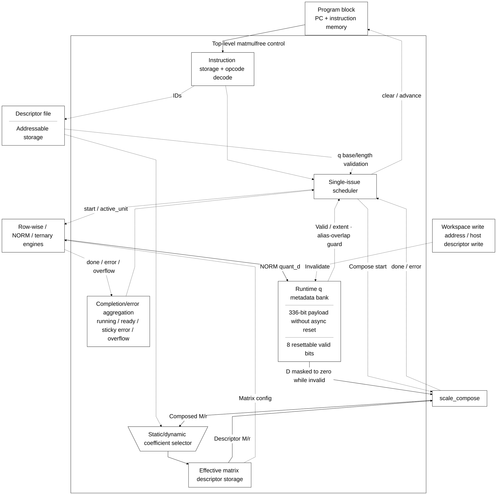

# matmulfree.sv — Top-level: điều phối toàn NPU

> **Category: GUIDE. Scope: LEGACY.** RTL is authoritative; diagrams are preserved from the existing guide.
[Tài liệu](../../README.md) → [Hierarchy RTL](<../legacy/README.md>) → [Mục lục từng file](README.md)

**Trạng thái:** Đang dùng — core chính.

**Source:** [matmulfree.sv](<../../../Verilog%20Source%20code/matmulfree.sv>).

## At a glance

| Item | Description |
|---|---|
| Responsibility | Đây là nơi nối host, instruction memory, descriptor, SRAM và ba execution unit. Core không đưa nhiều instruction vào pipeline. Một FSM chọn unit, đợi kết quả rồi mới tăng PC. Vì vậy khi đọc file này, cần theo dõi đồng thời `sched` (bước điều khiển) và `active_unit` (unit được nối với workspace). |

Port host là bus đơn giản 32 bit, không phải AXI/APB. Địa chỉ host tính theo byte; SRAM compute tính theo word 256 bit. Host write dữ liệu chỉ được cho phép khi core không chạy.

## Sơ đồ kiến trúc tổng quan

## Main flow

`start → S_FETCH → S_START → S_WAIT → S_ADVANCE`. TMATMUL dùng scale động đi qua `S_COMPOSE_START/WAIT` trước `S_TM_START`. HALT hoặc lỗi dẫn đến `S_HALT`, đưa ready lên 1. Overflow được giữ đến lần start kế tiếp; error và overflow là hai trạng thái khác nhau.

Cache q giữ D, base và length để scale gắn đúng tensor. Bất kỳ ghi đè vùng q nào cũng làm metadata cũ mất hiệu lực. Static TM kiểm tra overlap với mọi entry q hợp lệ, nên descriptor alias không thể bỏ qua scale động. Dynamic TM yêu cầu đúng ID và exact base/length.

1. Khi idle, host nạp parameter, workspace, descriptor và instruction. `host_ready` chỉ xác nhận địa chỉ hợp lệ được chấp nhận; nó không kiểm tra nội dung model.
2. Start đưa PC về 0, xóa cờ của lần chạy trước và chuyển scheduler sang FETCH. Scheduler giữ fetch request và chờ `instr_fetch_valid`; instruction được chốt vào `instr_q`, nên opcode và các descriptor ID ổn định suốt lệnh nhiều chu kỳ.
3. S_START chọn execution unit. NORM và rowwise đi thẳng tới WAIT. TMATMUL có thể phải chạy `scale_compose` trước nếu q mang scale động từ NORM.
4. `active_unit` điều khiển mux workspace. Chỉ rowwise, norm hoặc ternary được nối với SRAM ở một thời điểm.
5. Khi unit báo done, top gom overflow/error. Lệnh hợp lệ làm PC tăng; lỗi hoặc HALT đưa core về ready.
6. Cache `q_d/q_base/q_length/q_valid` buộc D đi cùng đúng tensor. Ghi đè q hoặc sửa descriptor làm cache mất hiệu lực. Chỉ `q_valid` có reset; 336 bit tuple được ghi trọn khi NORM hoàn thành thành công qua tám process generate với index hằng và được đọc sau valid guard.

**Quy ước RTL.** Host read chốt request/address/region rồi chốt response/data/tag: control/descriptor cần hai cạnh lên, SRAM/imem cần bốn cạnh lên từ lần sample đầu. Data chỉ hợp lệ khi ready đúng address. Held request giữ snapshot response đầu; poll mới cùng địa chỉ cần idle qua một cạnh lên. Address change/drop enable/write hủy read cũ. Write trực tiếp và memory access bị chặn khi running; control/status read được phép. Payload request/response không reset, reset valid mask output về zero. Backend adapter vẫn read-valid hai cạnh lên.

## Important state / datapath groups

### [Dòng 1–25: Giao diện và opcode](<../../../Verilog%20Source%20code/matmulfree.sv#L1>)

**Mục đích.** Khai báo host port, trạng thái thực thi và mã instruction. Các tên DIV/EXP/LDV/STV không có nghĩa scheduler hỗ trợ chúng.

**Cách phần code hoạt động.** Nhóm này định nghĩa giao diện, độ rộng, kiểu hoặc tín hiệu trung gian. Nó tạo cấu trúc để các nhóm xử lý sau sử dụng, chưa tự biểu diễn một bước runtime riêng.

**Tín hiệu và dữ liệu chính.** `host_en`: host đang yêu cầu truy cập; `host_we`: host chọn ghi thay vì đọc; `host_addr`: địa chỉ phía host; `host_wdata`: data 32 host muốn ghi; `host_rdata`: data 32 trả về host; `host_ready`: giao dịch host được chấp nhận; và 6 tín hiệu phụ khác trong đoạn code.

### [Dòng 26–103: Giải mã và frontend đọc host](<../../../Verilog%20Source%20code/matmulfree.sv#L26>)

**Mục đích.** Giải mã vùng/alignment, chốt read request và response có tag để ngắt đường tổ hợp host address → data. Control đọc khi running; các vùng khác chỉ khi idle.

**Cách phần code hoạt động.** Request hợp lệ ghi address và one-hot region tại cạnh đầu. Backend dùng address đã chốt; control/descriptor sẵn cho response ở cạnh thứ hai, SRAM/imem qua adapter đọc rồi chốt response ở cạnh thứ tư. Region hợp lệ loại trừ nhau. Read address hiện tại phải khớp response tag mới có ready. Response đầu được giữ đến idle/write/address change; không liên tục sample lại status khi enable giữ nguyên. Write acknowledge và commit vẫn trực tiếp. Reset chỉ xóa pending/region/valid/control, còn 96 bit address/data payload không async reset và bị valid mask.

**Tín hiệu và dữ liệu chính.** `host_read_address_q`: address đã chốt; `host_read_region_q`: chọn một trong năm vùng; `host_response_address_q`: tag trả về; `host_response_data_q`: data trả về; `host_response_valid_q`: payload đã được ghi; `host_read_matches`: request hiện tại còn khớp tag.

#### Sơ đồ khối phần cứng của nhóm

Control/descriptor cần hai cạnh lên; SRAM/imem cần bốn cạnh lên từ sample đầu. Mux data dùng region đã chốt, output data đi từ register response. Comparator address/tag giữ ready gắn đúng giao dịch; host phải lấy data cùng ready.

### [Dòng 104–126: Program counter và instruction memory](<../../../Verilog%20Source%20code/matmulfree.sv#L104>)

**Mục đích.** PC 9 bit chọn một trong 512 instruction; host chỉ ghi 13 bit thấp của word vào program.

**Cách phần code hoạt động.** Có instance module con; named-port ở nhóm này xác định chính xác đường control/data giữa hai cấp hierarchy.

**Tín hiệu và dữ liệu chính.** `pc`: địa chỉ instruction hiện tại; `pc_clear`: đưa PC về 0; `pc_advance`: cho PC tiến1; `instr_fetch`: instruction đọc tại PC; `instr_q`: instruction13 bit đang thực thi; `clear`: đưa PC về 0; và 11 tín hiệu phụ khác trong đoạn code.

### [Dòng 127–156: Descriptor](<../../../Verilog%20Source%20code/matmulfree.sv#L127>)

**Mục đích.** Ba ID trong instruction chọn source0, source1 và destination. TMATMUL dùng trường source1 để chọn matrix descriptor.

**Cách phần code hoạt động.** Có continuous assignment: biểu thức luôn lái tín hiệu đích, không cần start hoặc cạnh clock. Có instance module con; named-port ở nhóm này xác định chính xác đường control/data giữa hai cấp hierarchy.

**Tín hiệu và dữ liệu chính.** `d_src0`: descriptor source0 đang được instruction chọn; `d_src1`: descriptor source1 đang được instruction chọn; `d_dst`: descriptor destination đang được chọn; `d_mat`: matrix descriptor gốc; `effective_mat`: matrix descriptor với hệ số postscale hiệu dụng; `desc_host_matrix`: host đang chọn matrix descriptor; và 20 tín hiệu phụ khác trong đoạn code.

### [Dòng 157–203: Hai SRAM](<../../../Verilog%20Source%20code/matmulfree.sv#L157>)

**Mục đích.** Workspace đọc/ghi bởi unit đang hoạt động. Parameter SRAM chỉ đọc ở phía compute; host nạp weight và bias.

**Tín hiệu và dữ liệu chính.** `ws_rd_en`: request đọc workspace; `ws_wr_en`: cho phép ghi workspace; `ws_rd_valid`: workspace trả dữ liệu hợp lệ; `ws_rd_addr`: địa chỉ đọc workspace; `ws_wr_addr`: địa chỉ ghi workspace; `ws_rd_data`: word 256 trả từ workspace; và 16 tín hiệu phụ khác trong đoạn code.

### [Dòng 204–230: Rowwise unit](<../../../Verilog%20Source%20code/matmulfree.sv#L204>)

**Mục đích.** Đưa descriptor và opcode vào dispatcher; dữ liệu workspace dùng chung được nhận qua valid.

**Tín hiệu và dữ liệu chính.** `start`: yêu cầu bắt đầu giao dịch; `op`: operand hoặc opcode, theo giao diện module; `instr_q`: instruction13 bit đang thực thi; `a_desc`: metadata nguồn A; `d_src0`: descriptor source0 đang được instruction chọn; `b_desc`: metadata nguồn B; và 14 tín hiệu phụ khác trong đoạn code.

### [Dòng 231–266: NORM + QUANT](<../../../Verilog%20Source%20code/matmulfree.sv#L231>)

**Mục đích.** Nối scratch, epsilon, delta và metadata D. M/r đầu ra có thể đọc qua control window để debug.

**Tín hiệu và dữ liệu chính.** `quant_d`: D=max(absmax,delta); `norm_m`: multiplier U24 của RMSNorm; `quant_m`: multiplier U24 của QUANT; `norm_r`: shift của RMSNorm; `quant_r`: shift của QUANT; `start`: yêu cầu bắt đầu giao dịch; và 18 tín hiệu phụ khác trong đoạn code.

### [Dòng 267–300: Ternary unit](<../../../Verilog%20Source%20code/matmulfree.sv#L267>)

**Mục đích.** Đưa descriptor đã ghép scale vào TMATMUL. Cổng đọc parameter được nối riêng.

**Tín hiệu và dữ liệu chính.** `start`: yêu cầu bắt đầu giao dịch; `q_desc`: metadata nguồn activation S8; `d_src0`: descriptor source0 đang được instruction chọn; `out_desc`: metadata output TMATMUL; `d_dst`: descriptor destination đang được chọn; `mat_desc`: metadata ma trận và postscale; và 16 tín hiệu phụ khác trong đoạn code.

### [Dòng 301–343: Scale động](<../../../Verilog%20Source%20code/matmulfree.sv#L301>)

**Mục đích.** Mỗi workspace descriptor có cache D/base/length. `selected_quant_d` bằng 0 khi entry chưa valid; `input_has_runtime_scale` quét overlap input với mọi extent q valid để chặn static TM qua descriptor alias. scale_compose nhận hệ số weight/output và D hợp lệ của nguồn q.

**Tín hiệu và dữ liệu chính.** `q_d`: D gắn với từng descriptor q; `q_base`: base SRAM mà cache q mô tả; `q_length`: length mà cache q mô tả; `q_valid`: bitmask hiệu lực scale q; `composed_m`: M hiệu dụng từ scale_compose; `composed_r`: r hiệu dụng từ scale_compose; và 15 tín hiệu phụ khác trong đoạn code.

### [Dòng 344–379: Hiệu lực metadata](<../../../Verilog%20Source%20code/matmulfree.sv#L344>)

**Mục đích.** Ghi tensor làm vô hiệu scale cũ. Chỉ `q_valid` dùng reset; 336 bit D/base/length payload dùng tám clock-only process generate với index hằng, ghi đủ tuple khi NORM hoàn thành thành công cùng cạnh đặt valid. Các phép so sánh extent chỉ chạy khi q_valid=1, nên payload chưa khởi tạo không ảnh hưởng control.

**Cách phần code hoạt động.** Có logic tuần tự: register/FSM chỉ cập nhật tại cạnh clock; nonblocking assignment đọc giá trị cũ ở vế phải rồi chốt đồng thời.

**Tín hiệu và dữ liệu chính.** `q_valid`: bitmask hiệu lực scale q; `q_d`: D gắn với từng descriptor q; `q_base`: base SRAM mà cache q mô tả; `q_length`: length mà cache q mô tả; `ws_wr_en`: cho phép ghi workspace; `ws_wr_addr`: địa chỉ ghi workspace; và 12 tín hiệu phụ khác trong đoạn code.

### [Dòng 380–397: Phát start và điều khiển PC](<../../../Verilog%20Source%20code/matmulfree.sv#L380>)

**Mục đích.** Start của unit là xung theo state. PC chỉ advance sau khi instruction trước đã kết thúc.

**Cách phần code hoạt động.** Có logic tổ hợp: output/intermediate được tính từ input hiện tại; các giá trị mặc định đầu khối giúp tránh suy ra latch.

**Tín hiệu và dữ liệu chính.** `pc_clear`: đưa PC về 0; `running`: core đang thực thi chương trình; `pc_advance`: cho PC tiến1; `sched`: trạng thái scheduler; `instr_q`: instruction13 bit đang thực thi; `pc`: địa chỉ instruction hiện tại.

### [Dòng 398–430: Mux workspace](<../../../Verilog%20Source%20code/matmulfree.sv#L398>)

**Mục đích.** Chỉ unit được active_unit chọn có quyền phát địa chỉ, data và enable ra workspace.

**Tín hiệu và dữ liệu chính.** `ws_rd_en`: request đọc workspace; `ws_rd_addr`: địa chỉ đọc workspace; `ws_wr_en`: cho phép ghi workspace; `ws_wr_addr`: địa chỉ ghi workspace; `ws_wr_data`: word 256 ghi workspace; `active_unit`: unit được cấp cổng workspace.

### [Dòng 431–542: Scheduler](<../../../Verilog%20Source%20code/matmulfree.sv#L431>)

**Mục đích.** Bắt đầu lượt chạy, chốt instruction, kiểm tra scale q, đợi done, gom lỗi và dừng ở HALT. Dynamic TM cần valid rồi mới đọc tuple để so khớp ID/base/length; static TM bị reject khi input overlap bất kỳ q extent valid. Cả hai guard đều trước S_TM_START, nên không ghi output khi reject. Các phép gán trong một clock dùng giá trị cũ ở vế phải.

**Tín hiệu và dữ liệu chính.** `sched`: trạng thái scheduler; `instr_q`: instruction13 bit đang thực thi; `active_unit`: unit được cấp cổng workspace; `running`: core đang thực thi chương trình; `ready`: core đã dừng, sẵn sàng cho host; `error`: cờ lỗi của lượt chạy; và 16 tín hiệu phụ khác trong đoạn code.

#### Sơ đồ khối phần cứng của nhóm

### [Dòng 543–568: Mux response và status](<../../../Verilog%20Source%20code/matmulfree.sv#L543>)

**Mục đích.** Tạo control data theo read address đã chốt và mux song song năm response bằng one-hot region. Data tổ hợp này chỉ đi vào response register, không lái trực tiếp host_rdata.

**Cách phần code hoạt động.** Có logic tổ hợp: output/intermediate được tính từ input hiện tại; các giá trị mặc định đầu khối giúp tránh suy ra latch. Có continuous assignment: biểu thức luôn lái tín hiệu đích, không cần start hoặc cạnh clock.

**Tín hiệu và dữ liệu chính.** `host_read_address_q`: address chọn control word; `host_control_data`: status/config tổ hợp; `host_read_region_q`: region one-hot đã chốt; `host_response_data`: data để chốt response; `pc_debug/instr_debug`: debug scheduler.

### [Dòng 569–572: Host ghi cấu hình](<../../../Verilog%20Source%20code/matmulfree.sv#L569>)

**Mục đích.** Control register giữ base scratch, epsilon 64 bit và delta. Chỉ cập nhật khi không running.

**Cách phần code hoạt động.** Có logic tuần tự: register/FSM chỉ cập nhật tại cạnh clock; nonblocking assignment đọc giá trị cũ ở vế phải rồi chốt đồng thời. Có continuous assignment: biểu thức luôn lái tín hiệu đích, không cần start hoặc cạnh clock.

**Tín hiệu và dữ liệu chính.** `host_ctrl`: địa chỉ host thuộc control window; `host_we`: host chọn ghi thay vì đọc; `host_addr`: địa chỉ phía host; `host_wdata`: data 32 host muốn ghi; `scratch_z_base`: word đầu scratch z; `epsilon_raw32`: epsilon theo đơn vị raw-square có 32 fractional bit; và 2 tín hiệu phụ khác trong đoạn code.
