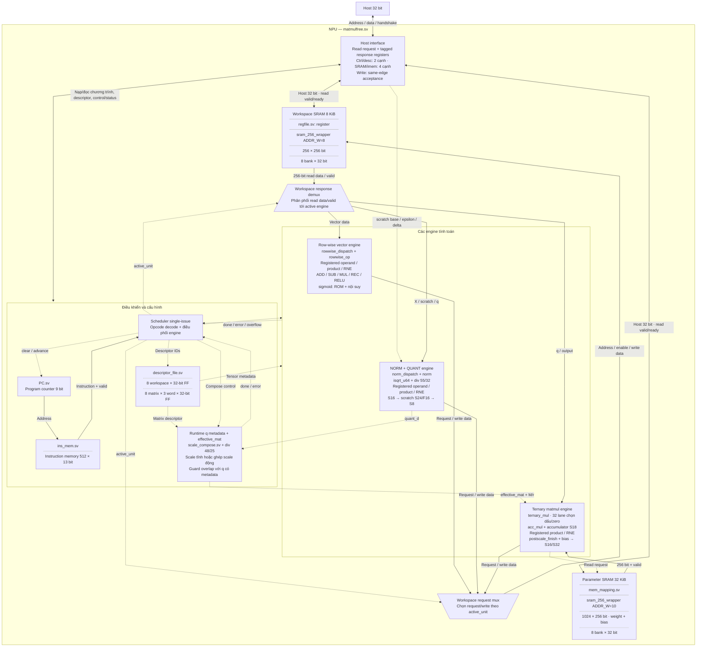
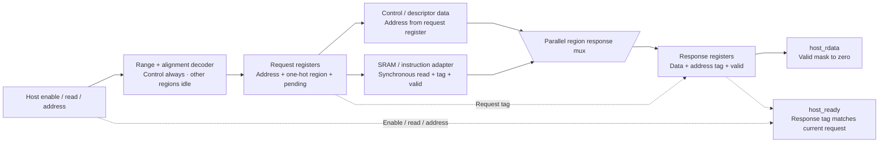
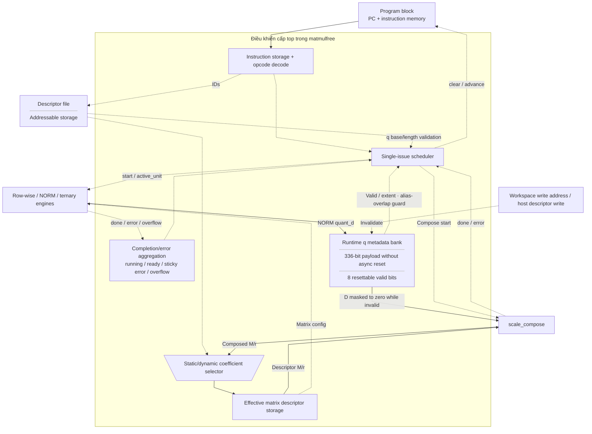

# matmulfree.sv — Top-level: điều phối toàn NPU

[Tài liệu](../../README.md) → [Hierarchy RTL](../README.md) → [Mục lục từng file](README.md)

**Trạng thái:** Đang dùng — core chính.

**Source:** [matmulfree.sv](<../../../Verilog%20Source%20code/matmulfree.sv>). **Số dòng:** 572. **SHA-256:** `0f761bc1d91809443a1f5af7eb08b572b58cd81da052a5c28a4a0b4db212f475`.

## Khối này làm gì?

Đây là nơi nối host, instruction memory, descriptor, SRAM và ba execution unit. Core không đưa nhiều instruction vào pipeline. Một FSM chọn unit, đợi kết quả rồi mới tăng PC. Vì vậy khi đọc file này, cần theo dõi đồng thời `sched` (bước điều khiển) và `active_unit` (unit được nối với workspace).

Port host là bus đơn giản 32 bit, không phải AXI/APB. Địa chỉ host tính theo byte; SRAM compute tính theo word 256 bit. Host write dữ liệu chỉ được cho phép khi core không chạy.

## Sơ đồ kiến trúc tổng quan



MUX dùng hình thang rộng ở phía nhiều ngõ vào và thu hẹp về ngõ ra; decoder/demux dùng hình thang ngược lại, mở rộng về phía nhiều ngõ ra. Hình chữ nhật có các vạch ngang biểu diễn bộ nhớ hoặc bank descriptor. Các hình chữ nhật thường là datapath, thanh ghi đơn hoặc giao diện. Nét liền là đường dữ liệu, nét đứt là điều khiển/cấu hình. Mũi tên hồi tiếp biểu diễn kết nối phần cứng. Sơ đồ không biểu diễn thứ tự chu kỳ, trạng thái FSM hoặc các tầng pipeline CPU.

## Cách hoạt động chi tiết

`start → S_FETCH → S_START → S_WAIT → S_ADVANCE`. TMATMUL dùng scale động đi qua `S_COMPOSE_START/WAIT` trước `S_TM_START`. HALT hoặc lỗi dẫn đến `S_HALT`, đưa ready lên 1. Overflow được giữ đến lần start kế tiếp; error và overflow là hai trạng thái khác nhau.

Cache q giữ D, base và length để scale gắn đúng tensor. Bất kỳ ghi đè vùng q nào cũng làm metadata cũ mất hiệu lực. Static TM kiểm tra overlap với mọi entry q hợp lệ, nên descriptor alias không thể bỏ qua scale động. Dynamic TM yêu cầu đúng ID và exact base/length.

1. Khi idle, host nạp parameter, workspace, descriptor và instruction. `host_ready` chỉ xác nhận địa chỉ hợp lệ được chấp nhận; nó không kiểm tra nội dung model.
2. Start đưa PC về 0, xóa cờ của lần chạy trước và chuyển scheduler sang FETCH. Scheduler giữ fetch request và chờ `instr_fetch_valid`; instruction được chốt vào `instr_q`, nên opcode và các descriptor ID ổn định suốt lệnh nhiều chu kỳ.
3. S_START chọn execution unit. NORM và rowwise đi thẳng tới WAIT. TMATMUL có thể phải chạy `scale_compose` trước nếu q mang scale động từ NORM.
4. `active_unit` điều khiển mux workspace. Chỉ rowwise, norm hoặc ternary được nối với SRAM ở một thời điểm.
5. Khi unit báo done, top gom overflow/error. Lệnh hợp lệ làm PC tăng; lỗi hoặc HALT đưa core về ready.
6. Cache `q_d/q_base/q_length/q_valid` buộc D đi cùng đúng tensor. Ghi đè q hoặc sửa descriptor làm cache mất hiệu lực. Chỉ `q_valid` có reset; 336 bit tuple được ghi trọn khi NORM hoàn thành thành công qua tám process generate với index hằng và được đọc sau valid guard.

**Quy ước RTL.** Host read chốt request/address/region rồi chốt response/data/tag: control/descriptor cần hai cạnh lên, SRAM/imem cần bốn cạnh lên từ lần sample đầu. Data chỉ hợp lệ khi ready đúng address. Held request giữ snapshot response đầu; poll mới cùng địa chỉ cần idle qua một cạnh lên. Address change/drop enable/write hủy read cũ. Write trực tiếp và memory access bị chặn khi running; control/status read được phép. Payload request/response không reset, reset valid mask output về zero. Backend adapter vẫn read-valid hai cạnh lên.

## Các nhóm logic trong source

Source được chia theo chức năng. Mỗi nhóm giữ nguyên phạm vi dòng để đối chiếu, nhưng phần giải thích tập trung vào quan hệ giữa các câu lệnh thay vì lặp lại từng dấu ngoặc, khai báo hoặc phép gán.


### [Dòng 1–25: Giao diện và opcode](<../../../Verilog%20Source%20code/matmulfree.sv#L1>)

<!-- source-range:1:25 -->
```systemverilog
module matmulfree (
    input logic clk,
    input logic rst_n,

    // Simple 32-bit host window.
    input logic host_en,
    input logic host_we,
    input logic [31:0] host_addr,
    input logic [31:0] host_wdata,
    output logic [31:0] host_rdata,
    output logic host_ready,

    output logic running,
    output logic ready,
    output logic error,
    output logic overflow_out,
    output logic [8:0] pc_debug,
    output logic [12:0] instr_debug
);
    import npu_pkg::*;

    localparam logic [3:0] ADD = 4'h1, SUB = 4'h2, MUL = 4'h3, DIV_OP = 4'h4, EXP_OP = 4'h5,
    SIG = 4'h6, NORM_OP = 4'h7, TMATMUL = 4'h8, LDV = 4'h9, STV = 4'ha, REC = 4'hb, RELU = 4'hc, HALT = 4'hf;

    // ---------------- Host decode ----------------
```

**Mục đích.** Khai báo host port, trạng thái thực thi và mã instruction. Các tên DIV/EXP/LDV/STV không có nghĩa scheduler hỗ trợ chúng.

**Cách phần code hoạt động.** Nhóm này định nghĩa giao diện, độ rộng, kiểu hoặc tín hiệu trung gian. Nó tạo cấu trúc để các nhóm xử lý sau sử dụng, chưa tự biểu diễn một bước runtime riêng.

**Tín hiệu và dữ liệu chính.** `host_en`: host đang yêu cầu truy cập; `host_we`: host chọn ghi thay vì đọc; `host_addr`: địa chỉ phía host; `host_wdata`: data 32 host muốn ghi; `host_rdata`: data 32 trả về host; `host_ready`: giao dịch host được chấp nhận; và 6 tín hiệu phụ khác trong đoạn code.


### [Dòng 26–103: Giải mã và frontend đọc host](<../../../Verilog%20Source%20code/matmulfree.sv#L26>)

<!-- source-range:26:103 -->
```systemverilog
    logic host_param, host_ws, host_desc, host_imem, host_ctrl;
    assign host_param = host_en && host_addr[31:15] == 17'h0 && host_addr[1:0] == 2'b00;
    assign host_ws = host_en && host_addr[31:13] == 19'h8 && host_addr[1:0] == 0;
    assign host_desc = host_en && host_addr[31:9] == 23'h100 && host_addr[7] == 0 && host_addr[1:0] == 0 &&
    (host_addr[8] ? host_addr[3:2] < 3 : host_addr[3:2] == 0);
    assign host_imem = host_en && host_addr[31:11] == 21'h60 && host_addr[1:0] == 0;
    assign host_ctrl = host_en && host_addr[31:8] == 24'h000400 && host_addr[1:0] == 0 &&
    (host_addr[7:2] == 0 || host_addr[7:2] == 1 ||
        (host_addr[7:2] >= 4 && host_addr[7:2] <= 10));
    logic ws_host_rvalid, p_host_rvalid;
    logic instr_fetch_en, instr_fetch_valid, instr_host_valid;
    // Reads have a registered request and a tagged registered response. The
    // host holds its request until ready; changing address, dropping enable or
    // issuing a write cancels the old read. Writes retain same-edge acceptance.
    logic host_read_allowed, host_read_request, host_read_pending_q, host_read_matches;
    logic [4:0] host_read_region_q;
    logic [31:0] host_read_address_q, host_response_address_q;
    logic host_read_param, host_read_ws, host_read_desc, host_read_imem, host_read_ctrl;
    logic host_response_fire, host_response_valid_q, host_response_ctrl_q;
    logic [31:0] host_response_data, host_response_data_q, host_control_data;
    assign host_read_allowed = !host_we && (host_ctrl ||
        (!running && (host_param || host_ws || host_desc || host_imem)));
    assign host_read_request = host_read_allowed &&
        (!host_read_pending_q || host_read_address_q != host_addr);
    assign host_read_matches = host_read_pending_q && host_en && !host_we &&
        host_read_address_q == host_addr;
    assign host_read_param = host_read_matches && !host_response_valid_q && !running && host_read_region_q[0];
    assign host_read_ws = host_read_matches && !host_response_valid_q && !running && host_read_region_q[1];
    assign host_read_desc = host_read_matches && !host_response_valid_q && !running && host_read_region_q[2];
    assign host_read_imem = host_read_matches && !host_response_valid_q && !running && host_read_region_q[3];
    assign host_read_ctrl = host_read_matches && !host_response_valid_q && host_read_region_q[4];
    assign host_response_fire = host_read_ctrl || host_read_desc ||
        (host_read_param && p_host_rvalid) || (host_read_ws && ws_host_rvalid) ||
        (host_read_imem && instr_host_valid);
    assign host_ready = host_we ? (!running &&
        (host_ctrl || host_desc || host_imem || host_param || host_ws)) :
        (host_en && host_response_valid_q && host_response_address_q == host_addr &&
        (!running || host_response_ctrl_q));
    // Data is meaningful only with ready. A resettable response-valid bit
    // masks the unreset payload and keeps the reset output deterministic.
    assign host_rdata = host_response_valid_q ? host_response_data_q : 32'h0;

    always_ff @(posedge clk or negedge rst_n) begin
        if (!rst_n) begin
            host_read_pending_q <= 1'b0;
            host_read_region_q <= '0;
            host_response_valid_q <= 1'b0;
            host_response_ctrl_q <= 1'b0;
        end else begin
            if (!host_read_allowed) begin
                host_read_pending_q <= 1'b0;
                host_read_region_q <= '0;
                host_response_valid_q <= 1'b0;
            end else if (host_read_request) begin
                host_read_pending_q <= 1'b1;
                host_read_region_q <= {host_ctrl, host_imem, host_desc, host_ws, host_param};
                host_response_valid_q <= 1'b0;
            end else if (host_response_fire) begin
                host_response_valid_q <= 1'b1;
                host_response_ctrl_q <= host_read_region_q[4];
            end
        end
    end
    always_ff @(posedge clk) begin
        if (rst_n && host_read_request) host_read_address_q <= host_addr;
        if (rst_n && host_response_fire) begin
            host_response_address_q <= host_read_address_q;
            host_response_data_q <= host_response_data;
        end
    end

    logic start_pulse;
    logic [7:0] scratch_z_base;
    logic [63:0] epsilon_raw32;
    logic [23:0] delta_raw;

    // ---------------- Program ----------------
    logic [8:0] pc;
```

**Mục đích.** Giải mã vùng/alignment, chốt read request và response có tag để ngắt đường tổ hợp host address → data. Control đọc khi running; các vùng khác chỉ khi idle.

**Cách phần code hoạt động.** Request hợp lệ ghi address và one-hot region tại cạnh đầu. Backend dùng address đã chốt; control/descriptor sẵn cho response ở cạnh thứ hai, SRAM/imem qua adapter đọc rồi chốt response ở cạnh thứ tư. Region hợp lệ loại trừ nhau. Read address hiện tại phải khớp response tag mới có ready. Response đầu được giữ đến idle/write/address change; không liên tục sample lại status khi enable giữ nguyên. Write acknowledge và commit vẫn trực tiếp. Reset chỉ xóa pending/region/valid/control, còn 96 bit address/data payload không async reset và bị valid mask.

**Tín hiệu và dữ liệu chính.** `host_read_address_q`: address đã chốt; `host_read_region_q`: chọn một trong năm vùng; `host_response_address_q`: tag trả về; `host_response_data_q`: data trả về; `host_response_valid_q`: payload đã được ghi; `host_read_matches`: request hiện tại còn khớp tag.


#### Sơ đồ khối phần cứng của nhóm



Control/descriptor cần hai cạnh lên; SRAM/imem cần bốn cạnh lên từ sample đầu. Mux data dùng region đã chốt, output data đi từ register response. Comparator address/tag giữ ready gắn đúng giao dịch; host phải lấy data cùng ready.

### [Dòng 104–126: Program counter và instruction memory](<../../../Verilog%20Source%20code/matmulfree.sv#L104>)

<!-- source-range:104:126 -->
```systemverilog
    logic pc_clear, pc_advance;
    logic [12:0] instr_fetch, instr_q, instr_host;
    PC u_pc(.clk(clk),
        .rst_n(rst_n),
        .clear(pc_clear),
        .advance(pc_advance),
        .pc_out(pc));
    ins_mem u_imem(.clk(clk),
        .rst_n(rst_n),
        .fetch_en(instr_fetch_en),
        .addr(pc),
        .instr(instr_fetch),
        .instr_valid(instr_fetch_valid),
        .host_en((host_imem && host_we && !running) || host_read_imem),
        .host_we(host_imem && host_we && !running),
        .host_addr(host_we ? host_addr[10:2] : host_read_address_q[10:2]),
        .host_instr(host_wdata[12:0]),
        .host_rinstr(instr_host),
        .host_rvalid(instr_host_valid));

    // ---------------- Descriptors ----------------
    ws_desc_t d_src0, d_src1, d_dst;
    mat_desc_t d_mat, effective_mat;
```

**Mục đích.** PC 9 bit chọn một trong 512 instruction; host chỉ ghi 13 bit thấp của word vào program.

**Cách phần code hoạt động.** Có instance module con; named-port ở nhóm này xác định chính xác đường control/data giữa hai cấp hierarchy.

**Tín hiệu và dữ liệu chính.** `pc`: địa chỉ instruction hiện tại; `pc_clear`: đưa PC về 0; `pc_advance`: cho PC tiến1; `instr_fetch`: instruction đọc tại PC; `instr_q`: instruction13 bit đang thực thi; `clear`: đưa PC về 0; và 11 tín hiệu phụ khác trong đoạn code.


### [Dòng 127–156: Descriptor](<../../../Verilog%20Source%20code/matmulfree.sv#L127>)

<!-- source-range:127:156 -->
```systemverilog
    logic desc_host_matrix;
    logic [2:0] desc_host_id;
    logic [1:0] desc_host_word;
    logic [31:0] desc_host_rdata;
    assign desc_host_matrix = host_we ? host_addr[8] : host_read_address_q[8];
    assign desc_host_id = host_we ? host_addr[6:4] : host_read_address_q[6:4];
    assign desc_host_word = host_we ? host_addr[3:2] : host_read_address_q[3:2];
    descriptor_file u_desc(
        .clk(clk),
        .rst_n(rst_n),
        .host_we(host_desc && host_we && !running),
        .host_id(desc_host_id),
        .host_is_matrix(desc_host_matrix),
        .host_word_sel(desc_host_word),
        .host_wdata(host_wdata),
        .host_rdata(desc_host_rdata),
        .ws_id0(instr_q[2:0]),
        .ws_id1(instr_q[5:3]),
        .ws_id2(instr_q[8:6]),
        .ws_desc0(d_src0),
        .ws_desc1(d_src1),
        .ws_desc2(d_dst),
        .mat_id(instr_q[5:3]),
        .mat_desc(d_mat)
    );

    // ---------------- Workspace SRAM + arbitration ----------------
    logic ws_rd_en, ws_wr_en, ws_rd_valid;
    logic [7:0] ws_rd_addr, ws_wr_addr;
    logic [255:0] ws_rd_data, ws_wr_data;
```

**Mục đích.** Ba ID trong instruction chọn source0, source1 và destination. TMATMUL dùng trường source1 để chọn matrix descriptor.

**Cách phần code hoạt động.** Có continuous assignment: biểu thức luôn lái tín hiệu đích, không cần start hoặc cạnh clock. Có instance module con; named-port ở nhóm này xác định chính xác đường control/data giữa hai cấp hierarchy.

**Tín hiệu và dữ liệu chính.** `d_src0`: descriptor source0 đang được instruction chọn; `d_src1`: descriptor source1 đang được instruction chọn; `d_dst`: descriptor destination đang được chọn; `d_mat`: matrix descriptor gốc; `effective_mat`: matrix descriptor với hệ số postscale hiệu dụng; `desc_host_matrix`: host đang chọn matrix descriptor; và 20 tín hiệu phụ khác trong đoạn code.


### [Dòng 157–203: Hai SRAM](<../../../Verilog%20Source%20code/matmulfree.sv#L157>)

<!-- source-range:157:203 -->
```systemverilog
    logic [31:0] ws_host_rdata;
    register u_ws(
        .clk(clk),
        .rst_n(rst_n),
        .rd_en(ws_rd_en),
        .rd_addr(ws_rd_addr),
        .rd_data(ws_rd_data),
        .rd_valid(ws_rd_valid),
        .wr_en(ws_wr_en),
        .wr_addr(ws_wr_addr),
        .wr_data(ws_wr_data),
        .host_en((host_ws && host_we && !running) || host_read_ws),
        .host_we(host_we),
        .host_addr(host_we ? host_addr[12:2] : host_read_address_q[12:2]),
        .host_wdata(host_wdata),
        .host_rdata(ws_host_rdata),
        .host_rvalid(ws_host_rvalid)
    );

    // ---------------- Parameter SRAM ----------------
    logic p_rd_en, p_rd_valid;
    logic [9:0] p_rd_addr;
    logic [255:0] p_rd_data;
    logic [31:0] p_host_rdata;
    mem_mapping u_param(
        .clk(clk),
        .rst_n(rst_n),
        .rd_en(p_rd_en),
        .rd_addr(p_rd_addr),
        .rd_data(p_rd_data),
        .rd_valid(p_rd_valid),
        .wr_en(1'b0),
        .wr_addr('0),
        .wr_data('0),
        .host_en((host_param && host_we && !running) || host_read_param),
        .host_we(host_we),
        .host_addr(host_we ? host_addr[14:2] : host_read_address_q[14:2]),
        .host_wdata(host_wdata),
        .host_rdata(p_host_rdata),
        .host_rvalid(p_host_rvalid)
    );

    // ---------------- Row-wise vector unit ----------------
    logic row_start, row_busy, row_done, row_ov, row_fmt_err;
    logic row_rd_en, row_wr_en;
    logic [7:0] row_rd_addr, row_wr_addr;
    logic [255:0] row_wr_data;
```

**Mục đích.** Workspace đọc/ghi bởi unit đang hoạt động. Parameter SRAM chỉ đọc ở phía compute; host nạp weight và bias.

**Cách phần code hoạt động.** Có instance module con; named-port ở nhóm này xác định chính xác đường control/data giữa hai cấp hierarchy.

**Tín hiệu và dữ liệu chính.** `ws_rd_en`: request đọc workspace; `ws_wr_en`: cho phép ghi workspace; `ws_rd_valid`: workspace trả dữ liệu hợp lệ; `ws_rd_addr`: địa chỉ đọc workspace; `ws_wr_addr`: địa chỉ ghi workspace; `ws_rd_data`: word 256 trả từ workspace; và 16 tín hiệu phụ khác trong đoạn code.


### [Dòng 204–230: Rowwise unit](<../../../Verilog%20Source%20code/matmulfree.sv#L204>)

<!-- source-range:204:230 -->
```systemverilog
    rowwise_dispatch u_row(
        .clk(clk),
        .rst_n(rst_n),
        .start(row_start),
        .op(instr_q[12:9]),
        .a_desc(d_src0),
        .b_desc(d_src1),
        .dst_desc(d_dst),
        .ws_rd_en(row_rd_en),
        .ws_rd_addr(row_rd_addr),
        .ws_rd_data(ws_rd_data),
        .ws_rd_valid(ws_rd_valid),
        .ws_wr_en(row_wr_en),
        .ws_wr_addr(row_wr_addr),
        .ws_wr_data(row_wr_data),
        .busy(row_busy),
        .done(row_done),
        .overflow(row_ov),
        .format_error(row_fmt_err)
    );

    // ---------------- NORM + QUANT ----------------
    logic norm_start, norm_busy, norm_done, norm_ov, norm_error;
    logic [23:0] quant_d;
    logic norm_rd_en, norm_wr_en;
    logic [7:0] norm_rd_addr, norm_wr_addr;
    logic [255:0] norm_wr_data;
```

**Mục đích.** Đưa descriptor và opcode vào dispatcher; dữ liệu workspace dùng chung được nhận qua valid.

**Cách phần code hoạt động.** Có instance module con; named-port ở nhóm này xác định chính xác đường control/data giữa hai cấp hierarchy.

**Tín hiệu và dữ liệu chính.** `start`: yêu cầu bắt đầu giao dịch; `op`: operand hoặc opcode, theo giao diện module; `instr_q`: instruction13 bit đang thực thi; `a_desc`: metadata nguồn A; `d_src0`: descriptor source0 đang được instruction chọn; `b_desc`: metadata nguồn B; và 14 tín hiệu phụ khác trong đoạn code.


### [Dòng 231–266: NORM + QUANT](<../../../Verilog%20Source%20code/matmulfree.sv#L231>)

<!-- source-range:231:266 -->
```systemverilog
    logic [23:0] norm_m, quant_m;
    logic [5:0] norm_r, quant_r;
    norm_dispatch u_norm(
        .clk(clk),
        .rst_n(rst_n),
        .start(norm_start),
        .src_desc(d_src0),
        .dst_desc(d_dst),
        .scratch_z_base(scratch_z_base),
        .epsilon_raw32(epsilon_raw32),
        .delta_raw(delta_raw),
        .ws_rd_en(norm_rd_en),
        .ws_rd_addr(norm_rd_addr),
        .ws_rd_data(ws_rd_data),
        .ws_rd_valid(ws_rd_valid),
        .ws_wr_en(norm_wr_en),
        .ws_wr_addr(norm_wr_addr),
        .ws_wr_data(norm_wr_data),
        .busy(norm_busy),
        .done(norm_done),
        .overflow(norm_ov),
        .format_error(norm_error),
        .quant_d(quant_d),
        .norm_m(norm_m),
        .norm_r(norm_r),
        .quant_m(quant_m),
        .quant_r(quant_r)
    );

    // ---------------- Ternary core ----------------
    logic tm_start, tm_busy, tm_done, tm_ov, tm_error;
    logic tm_rd_en, tm_wr_en;
    logic [7:0] tm_rd_addr, tm_wr_addr;
    logic [255:0] tm_wr_data;
    logic tm_p_rd_en;
    logic [9:0] tm_p_rd_addr;
```

**Mục đích.** Nối scratch, epsilon, delta và metadata D. M/r đầu ra có thể đọc qua control window để debug.

**Cách phần code hoạt động.** Có instance module con; named-port ở nhóm này xác định chính xác đường control/data giữa hai cấp hierarchy.

**Tín hiệu và dữ liệu chính.** `quant_d`: D=max(absmax,delta); `norm_m`: multiplier U24 của RMSNorm; `quant_m`: multiplier U24 của QUANT; `norm_r`: shift của RMSNorm; `quant_r`: shift của QUANT; `start`: yêu cầu bắt đầu giao dịch; và 18 tín hiệu phụ khác trong đoạn code.


### [Dòng 267–300: Ternary unit](<../../../Verilog%20Source%20code/matmulfree.sv#L267>)

<!-- source-range:267:300 -->
```systemverilog
    ternary_mul u_tm(
        .clk(clk),
        .rst_n(rst_n),
        .start(tm_start),
        .q_desc(d_src0),
        .out_desc(d_dst),
        .mat_desc(effective_mat),
        .ws_rd_en(tm_rd_en),
        .ws_rd_addr(tm_rd_addr),
        .ws_rd_data(ws_rd_data),
        .ws_rd_valid(ws_rd_valid),
        .ws_wr_en(tm_wr_en),
        .ws_wr_addr(tm_wr_addr),
        .ws_wr_data(tm_wr_data),
        .param_rd_en(tm_p_rd_en),
        .param_rd_addr(tm_p_rd_addr),
        .param_rd_data(p_rd_data),
        .param_rd_valid(p_rd_valid),
        .busy(tm_busy),
        .done(tm_done),
        .overflow(tm_ov),
        .format_error(tm_error)
    );
    assign p_rd_en = tm_p_rd_en;
    assign p_rd_addr = tm_p_rd_addr;

    // Runtime q scales are attached to the descriptor and exact memory extent.
    logic [23:0] q_d[0:7];
    logic [7:0] q_base[0:7];
    logic [9:0] q_length[0:7];
    logic [7:0] q_valid;
    logic input_has_runtime_scale;
    logic [23:0] selected_quant_d;
    logic compose_busy, compose_done, compose_error;
```

**Mục đích.** Đưa descriptor đã ghép scale vào TMATMUL. Cổng đọc parameter được nối riêng.

**Cách phần code hoạt động.** Có continuous assignment: biểu thức luôn lái tín hiệu đích, không cần start hoặc cạnh clock. Có instance module con; named-port ở nhóm này xác định chính xác đường control/data giữa hai cấp hierarchy.

**Tín hiệu và dữ liệu chính.** `start`: yêu cầu bắt đầu giao dịch; `q_desc`: metadata nguồn activation S8; `d_src0`: descriptor source0 đang được instruction chọn; `out_desc`: metadata output TMATMUL; `d_dst`: descriptor destination đang được chọn; `mat_desc`: metadata ma trận và postscale; và 16 tín hiệu phụ khác trong đoạn code.


### [Dòng 301–343: Scale động](<../../../Verilog%20Source%20code/matmulfree.sv#L301>)

<!-- source-range:301:343 -->
```systemverilog
    logic [23:0] composed_m;
    logic [5:0] composed_r;
    typedef enum logic [3:0] {S_IDLE, S_FETCH, S_START, S_WAIT, S_ADVANCE, S_HALT,
    S_COMPOSE_START, S_COMPOSE_WAIT, S_TM_START} sched_t;
    sched_t sched;
    assign instr_fetch_en = running && sched == S_FETCH;
    logic [1:0] active_unit; // 1=row, 2=norm, 3=tm
    assign selected_quant_d = q_valid[instr_q[2:0]] ? q_d[instr_q[2:0]] : 24'h0;

    // Scale provenance belongs to the generated q memory extent. A descriptor
    // alias must not bypass the requirement to compose its runtime scale.
    always_comb begin
        input_has_runtime_scale = 1'b0;
        for (integer i = 0; i < 8; i = i + 1) begin
            if (q_valid[i]) begin
                if (ranges_overlap(int'(d_src0.base_word), ws_words(d_src0),
                    int'(q_base[i]), ((int'(q_length[i]) + 31) >> 5)))
                    input_has_runtime_scale = 1'b1;
            end
        end
    end

    scale_compose u_compose(.clk(clk),
        .rst_n(rst_n),
        .start(sched == S_COMPOSE_START),
        .factor_m(effective_mat.scale_m),
        .factor_r(effective_mat.scale_r),
        .quant_d(selected_quant_d),
        .busy(compose_busy),
        .done(compose_done),
        .format_error(compose_error),
        .result_m(composed_m),
        .result_r(composed_r));

    always_ff @(posedge clk or negedge rst_n) begin
        if (!rst_n) begin
            q_valid <= 0;
        end else begin
            for (integer i = 0;i < 8;i = i + 1) begin
                if (q_valid[i]) begin
                    if (ws_wr_en && int'(ws_wr_addr) >= int'(q_base[i]) &&
                        int'(ws_wr_addr) < int'(q_base[i]) + ((int'(q_length[i]) + 31) >> 5)) q_valid[i] <= 0;
                    if (host_ws && host_we && !running && int'(host_addr[12:5]) >= int'(q_base[i]) &&
```

**Mục đích.** Mỗi workspace descriptor có cache D/base/length. `selected_quant_d` bằng 0 khi entry chưa valid; `input_has_runtime_scale` quét overlap input với mọi extent q valid để chặn static TM qua descriptor alias. scale_compose nhận hệ số weight/output và D hợp lệ của nguồn q.

**Cách phần code hoạt động.** Có instance module con; named-port ở nhóm này xác định chính xác đường control/data giữa hai cấp hierarchy.

**Tín hiệu và dữ liệu chính.** `q_d`: D gắn với từng descriptor q; `q_base`: base SRAM mà cache q mô tả; `q_length`: length mà cache q mô tả; `q_valid`: bitmask hiệu lực scale q; `composed_m`: M hiệu dụng từ scale_compose; `composed_r`: r hiệu dụng từ scale_compose; và 15 tín hiệu phụ khác trong đoạn code.


### [Dòng 344–379: Hiệu lực metadata](<../../../Verilog%20Source%20code/matmulfree.sv#L344>)

<!-- source-range:344:379 -->
```systemverilog
                        int'(host_addr[12:5]) < int'(q_base[i]) + ((int'(q_length[i]) + 31) >> 5)) q_valid[i] <= 0;
                end
            end
            if (host_desc && host_we && !running) q_valid <= 0;
            if (sched == S_WAIT && active_unit == 2 && norm_done && !norm_error && !norm_ov)
                q_valid[instr_q[8:6]] <= 1;
        end
    end

    // Payload tuples are consumed only while their resettable valid bit is set.
    // Successful NORM completion writes the full tuple before making it valid.
    // Constant slot indices describe independent registers with parallel reads.
    genvar slot;
    generate
    for (slot = 0; slot < 8; slot = slot + 1) begin : g_quant_metadata
        always_ff @(posedge clk) begin
            if (rst_n && sched == S_WAIT && active_unit == 2 && norm_done &&
                !norm_error && !norm_ov && instr_q[8:6] == 3'(slot)) begin
                q_d[slot] <= quant_d;
                q_base[slot] <= d_dst.base_word;
                q_length[slot] <= d_dst.length;
            end
        end
    end
    endgenerate

    always_comb begin
        row_start = 0;
        norm_start = 0;
        tm_start = 0;
        pc_clear = (start_pulse && !running);
        pc_advance = 0;
        if (sched == S_START) begin
            case (instr_q[12:9])
                ADD, SUB, MUL, SIG, REC, RELU : row_start = 1;
                NORM_OP : norm_start = 1;
```

**Mục đích.** Ghi tensor làm vô hiệu scale cũ. Chỉ `q_valid` dùng reset; 336 bit D/base/length payload dùng tám clock-only process generate với index hằng, ghi đủ tuple khi NORM hoàn thành thành công cùng cạnh đặt valid. Các phép so sánh extent chỉ chạy khi q_valid=1, nên payload chưa khởi tạo không ảnh hưởng control.

**Cách phần code hoạt động.** Có logic tuần tự: register/FSM chỉ cập nhật tại cạnh clock; nonblocking assignment đọc giá trị cũ ở vế phải rồi chốt đồng thời.

**Tín hiệu và dữ liệu chính.** `q_valid`: bitmask hiệu lực scale q; `q_d`: D gắn với từng descriptor q; `q_base`: base SRAM mà cache q mô tả; `q_length`: length mà cache q mô tả; `ws_wr_en`: cho phép ghi workspace; `ws_wr_addr`: địa chỉ ghi workspace; và 12 tín hiệu phụ khác trong đoạn code.


### [Dòng 380–397: Phát start và điều khiển PC](<../../../Verilog%20Source%20code/matmulfree.sv#L380>)

<!-- source-range:380:397 -->
```systemverilog
                default : ;
            endcase
        end
        if (sched == S_TM_START) tm_start = 1;
        if (sched == S_ADVANCE && pc != 9'h1ff) pc_advance = 1;
    end

    always_comb begin
        ws_rd_en = 0;
        ws_rd_addr = 0;
        ws_wr_en = 0;
        ws_wr_addr = 0;
        ws_wr_data = 0;
        case (active_unit)
            2'h1 : begin
                ws_rd_en = row_rd_en;
                ws_rd_addr = row_rd_addr;
                ws_wr_en = row_wr_en;
```

**Mục đích.** Start của unit là xung theo state. PC chỉ advance sau khi instruction trước đã kết thúc.

**Cách phần code hoạt động.** Có logic tổ hợp: output/intermediate được tính từ input hiện tại; các giá trị mặc định đầu khối giúp tránh suy ra latch.

**Tín hiệu và dữ liệu chính.** `pc_clear`: đưa PC về 0; `running`: core đang thực thi chương trình; `pc_advance`: cho PC tiến1; `sched`: trạng thái scheduler; `instr_q`: instruction13 bit đang thực thi; `pc`: địa chỉ instruction hiện tại.


### [Dòng 398–430: Mux workspace](<../../../Verilog%20Source%20code/matmulfree.sv#L398>)

<!-- source-range:398:430 -->
```systemverilog
                ws_wr_addr = row_wr_addr;
                ws_wr_data = row_wr_data;
            end
            2'h2 : begin
                ws_rd_en = norm_rd_en;
                ws_rd_addr = norm_rd_addr;
                ws_wr_en = norm_wr_en;
                ws_wr_addr = norm_wr_addr;
                ws_wr_data = norm_wr_data;
            end
            2'h3 : begin
                ws_rd_en = tm_rd_en;
                ws_rd_addr = tm_rd_addr;
                ws_wr_en = tm_wr_en;
                ws_wr_addr = tm_wr_addr;
                ws_wr_data = tm_wr_data;
            end
            default : ;
        endcase
    end

    always_ff @(posedge clk or negedge rst_n) begin
        if (!rst_n) begin
            sched <= S_IDLE;
            instr_q <= 0;
            active_unit <= 0;
            running <= 0;
            ready <= 1;
            error <= 0;
            overflow_out <= 0;
            effective_mat <= '0;
        end else begin
            if (start_pulse && !running) begin
```

**Mục đích.** Chỉ unit được active_unit chọn có quyền phát địa chỉ, data và enable ra workspace.

**Cách phần code hoạt động.** Có logic tổ hợp: output/intermediate được tính từ input hiện tại; các giá trị mặc định đầu khối giúp tránh suy ra latch.

**Tín hiệu và dữ liệu chính.** `ws_rd_en`: request đọc workspace; `ws_rd_addr`: địa chỉ đọc workspace; `ws_wr_en`: cho phép ghi workspace; `ws_wr_addr`: địa chỉ ghi workspace; `ws_wr_data`: word 256 ghi workspace; `active_unit`: unit được cấp cổng workspace.


### [Dòng 431–542: Scheduler](<../../../Verilog%20Source%20code/matmulfree.sv#L431>)

<!-- source-range:431:542 -->
```systemverilog
                running <= 1;
                ready <= 0;
                error <= 0;
                overflow_out <= 0;
                sched <= S_FETCH;
                active_unit <= 0;
            end
            case (sched)
                S_IDLE : ;
                S_FETCH : if (instr_fetch_valid) begin
                    instr_q <= instr_fetch;
                    sched <= S_START;
                end
                S_START : begin
                    case (instr_q[12:9])
                        ADD, SUB, MUL, SIG, REC, RELU : begin
                            active_unit <= 1;
                            sched <= S_WAIT;
                        end
                        NORM_OP : begin
                            active_unit <= 2;
                            sched <= S_WAIT;
                        end
                        TMATMUL : begin
                            effective_mat <= d_mat;
                            if (d_mat.reserved[0]) begin
                                if (!q_valid[instr_q[2:0]]) begin
                                    error <= 1;
                                    sched <= S_HALT;
                                end else if (q_base[instr_q[2:0]] != d_src0.base_word ||
                                             q_length[instr_q[2:0]] != d_src0.length) begin
                                    error <= 1;
                                    sched <= S_HALT;
                                end
                                else sched <= S_COMPOSE_START;
                            end else if (input_has_runtime_scale) begin
                                // NORM-generated q must consume its runtime scale.
                                error <= 1;
                                sched <= S_HALT;
                            end else sched <= S_TM_START;
                        end
                        HALT : sched <= S_HALT;
                        4'h0 : sched <= S_ADVANCE;
                        default : begin
                            error <= 1;
                            sched <= S_HALT;
                        end
                    endcase
                end
                S_WAIT : begin
                    if ((active_unit == 1 && row_done) || (active_unit == 2 && norm_done) || (active_unit == 3 && tm_done)) begin
                        if (active_unit == 1) begin
                            overflow_out <= overflow_out | row_ov;
                            error <= error | row_fmt_err;
                        end
                        if (active_unit == 2) begin
                            overflow_out <= overflow_out | norm_ov;
                            error <= error | norm_error;
                        end
                        if (active_unit == 3) begin
                            overflow_out <= overflow_out | tm_ov;
                            error <= error | tm_error;
                        end
                        active_unit <= 0;
                        sched <= S_ADVANCE;
                        if ((active_unit == 1 && row_fmt_err) || (active_unit == 2 && (norm_error || norm_ov)) ||
                            (active_unit == 3 && tm_error)) sched <= S_HALT;
                    end
                end
                S_COMPOSE_START : sched <= S_COMPOSE_WAIT;
                S_COMPOSE_WAIT : if (compose_done) begin
                    if (compose_error) begin
                        error <= 1;
                        sched <= S_HALT;
                    end
                    else begin
                        effective_mat.scale_m <= composed_m;
                        effective_mat.scale_r <= composed_r;
                        sched <= S_TM_START;
                    end
                end
                S_TM_START : begin
                    active_unit <= 3;
                    sched <= S_WAIT;
                end
                S_ADVANCE : if (pc == 9'h1ff) begin
                    error <= 1;
                    sched <= S_HALT;
                end else sched <= S_FETCH;
                S_HALT : begin
                    running <= 0;
                    ready <= 1;
                    sched <= S_IDLE;
                end
                default : sched <= S_IDLE;
            endcase
        end
    end

    assign pc_debug = pc;
    assign instr_debug = instr_q;

    always_comb begin
        case (host_read_address_q[7:2])
            6'h00 : host_control_data = {28'h0, error, overflow_out, ready, running};
            6'h01 : host_control_data = {23'h0, pc};
            6'h04 : host_control_data = {24'h00_0000, scratch_z_base};
            6'h05 : host_control_data = epsilon_raw32[31:0];
            6'h06 : host_control_data = epsilon_raw32[63:32];
            6'h07 : host_control_data = {8'h00, delta_raw};
            6'h08 : host_control_data = {2'h0, quant_r, quant_m};
            6'h09 : host_control_data = {2'h0, norm_r, norm_m};
```

**Mục đích.** Bắt đầu lượt chạy, chốt instruction, kiểm tra scale q, đợi done, gom lỗi và dừng ở HALT. Dynamic TM cần valid rồi mới đọc tuple để so khớp ID/base/length; static TM bị reject khi input overlap bất kỳ q extent valid. Cả hai guard đều trước S_TM_START, nên không ghi output khi reject. Các phép gán trong một clock dùng giá trị cũ ở vế phải.

**Cách phần code hoạt động.** Có logic tuần tự: register/FSM chỉ cập nhật tại cạnh clock; nonblocking assignment đọc giá trị cũ ở vế phải rồi chốt đồng thời.

**Tín hiệu và dữ liệu chính.** `sched`: trạng thái scheduler; `instr_q`: instruction13 bit đang thực thi; `active_unit`: unit được cấp cổng workspace; `running`: core đang thực thi chương trình; `ready`: core đã dừng, sẵn sàng cho host; `error`: cờ lỗi của lượt chạy; và 16 tín hiệu phụ khác trong đoạn code.

#### Sơ đồ khối phần cứng của nhóm




### [Dòng 543–568: Mux response và status](<../../../Verilog%20Source%20code/matmulfree.sv#L543>)

<!-- source-range:543:568 -->
```systemverilog
            6'h0a : host_control_data = {8'h00, quant_d};
            default : host_control_data = 0;
        endcase
        // Legal regions are mutually exclusive. A parallel one-hot mux avoids
        // a priority chain between unrelated host windows.
        host_response_data = ({32{host_read_region_q[0]}} & p_host_rdata) |
            ({32{host_read_region_q[1]}} & ws_host_rdata) |
            ({32{host_read_region_q[2]}} & desc_host_rdata) |
            ({32{host_read_region_q[3]}} & {19'h0, instr_host}) |
            ({32{host_read_region_q[4]}} & host_control_data);
    end

    assign start_pulse = host_ctrl && host_we && (host_addr[7:2] == 0) && host_wdata[0];

    always_ff @(posedge clk or negedge rst_n) begin
        if (!rst_n) begin
            scratch_z_base <= 8'h80;
            epsilon_raw32 <= 0;
            delta_raw <= 24'h00_0001;
        end else if (host_ctrl && host_we && !running) begin
            case (host_addr[7:2])
                6'h04 : scratch_z_base <= host_wdata[7:0];
                6'h05 : epsilon_raw32[31:0] <= host_wdata;
                6'h06 : epsilon_raw32[63:32] <= host_wdata;
                6'h07 : delta_raw <= host_wdata[23:0];
                default : ;
```

**Mục đích.** Tạo control data theo read address đã chốt và mux song song năm response bằng one-hot region. Data tổ hợp này chỉ đi vào response register, không lái trực tiếp host_rdata.

**Cách phần code hoạt động.** Có logic tổ hợp: output/intermediate được tính từ input hiện tại; các giá trị mặc định đầu khối giúp tránh suy ra latch. Có continuous assignment: biểu thức luôn lái tín hiệu đích, không cần start hoặc cạnh clock.

**Tín hiệu và dữ liệu chính.** `host_read_address_q`: address chọn control word; `host_control_data`: status/config tổ hợp; `host_read_region_q`: region one-hot đã chốt; `host_response_data`: data để chốt response; `pc_debug/instr_debug`: debug scheduler.


### [Dòng 569–572: Host ghi cấu hình](<../../../Verilog%20Source%20code/matmulfree.sv#L569>)

<!-- source-range:569:572 -->
```systemverilog
            endcase
        end
    end
endmodule
```

**Mục đích.** Control register giữ base scratch, epsilon 64 bit và delta. Chỉ cập nhật khi không running.

**Cách phần code hoạt động.** Có logic tuần tự: register/FSM chỉ cập nhật tại cạnh clock; nonblocking assignment đọc giá trị cũ ở vế phải rồi chốt đồng thời. Có continuous assignment: biểu thức luôn lái tín hiệu đích, không cần start hoặc cạnh clock.

**Tín hiệu và dữ liệu chính.** `host_ctrl`: địa chỉ host thuộc control window; `host_we`: host chọn ghi thay vì đọc; `host_addr`: địa chỉ phía host; `host_wdata`: data 32 host muốn ghi; `scratch_z_base`: word đầu scratch z; `epsilon_raw32`: epsilon theo đơn vị raw-square có 32 fractional bit; và 2 tín hiệu phụ khác trong đoạn code.
