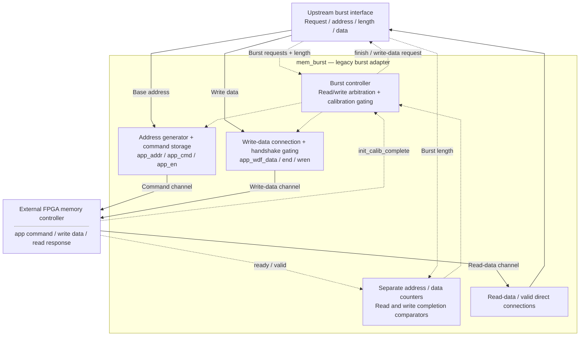
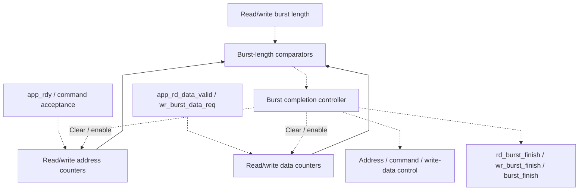

# mem_burst.v — Adapter burst cho memory ngoài kiểu FPGA

[Tài liệu](../../README.md) → [Hierarchy RTL](../README.md) → [Mục lục từng file](README.md)

**Trạng thái:** Legacy — không instantiate trong ASIC core hiện tại.

**Source:** [mem_burst.v](<../../../Verilog%20Source%20code/mem_burst.v>). **Số dòng:** 247. **SHA-256:** `bd2467f0fe9ed199d522a674f89c72dadcbc2f19752fbc0bdb35397135cc9f2f`.

## Khối này làm gì?

Module chuyển burst request sang các tín hiệu app_* của memory controller. Nó không phải DDR PHY/controller hoàn chỉnh. Core hiện tại dùng SRAM/host, nên không có DDR streaming chỉ vì file này vẫn còn trong folder.

Một số comment gốc có encoding khó đọc; chú giải tập trung vào tín hiệu và FSM. Các đoạn code bị comment không hoạt động.

## Sơ đồ kiến trúc tổng quan



MUX dùng hình thang rộng ở phía nhiều ngõ vào và thu hẹp về ngõ ra; decoder/demux dùng hình thang ngược lại, mở rộng về phía nhiều ngõ ra. Hình chữ nhật có các vạch ngang biểu diễn bộ nhớ hoặc bank descriptor. Các hình chữ nhật thường là datapath, thanh ghi đơn hoặc giao diện. Nét liền là đường dữ liệu, nét đứt là điều khiển/cấu hình. Mũi tên hồi tiếp biểu diễn kết nối phần cứng. Sơ đồ không biểu diễn thứ tự chu kỳ, trạng thái FSM hoặc các tầng pipeline CPU. Sơ đồ riêng của module legacy/helper; module này không được instantiate trong hierarchy matmulfree hiện tại.

## Cách hoạt động chi tiết

Chờ init_calib_complete, chọn read hoặc write từ IDLE (read ưu tiên). Các bộ đếm tách số address đã gửi và số data đã nhận/cấp. app_rdy nhận command; app_wdf_rdy nhận write data. Hoàn tất phát READ_END/WRITE_END rồi về IDLE. Offset địa chỉ tăng8 theo convention controller cũ; không diễn giải nó thành 8 byte cho mọi interface.

Đây là giải thích code giữ lại, không phải chứng nhận adapter đã sẵn sàng dùng với mọi IP. Concatenation địa chỉ thêm3 bit có thể bị cắt theo ADDR_BITS của đích; tích hợp thực tế phải xác nhận đơn vị địa chỉ và handshake của controller.

1. Sau reset, FSM chỉ chạy khi controller báo calibration xong. IDLE ưu tiên read request trước write request.
2. Read có counter address và data riêng vì command/data response không nhất thiết cùng nhịp.
3. Write tách `app_rdy` cho command và `app_wdf_rdy` cho data; upstream nhận `wr_burst_data_req`.
4. State WAIT giữ giao dịch đến khi đủ beat, sau đó phát finish và về IDLE.
5. Đây là adapter FPGA cũ, không phải DDR PHY/controller và không nối vào core hiện tại; address/handshake phải xác nhận lại nếu tái sử dụng.

**Quy ước RTL.** State constants dùng `localparam` để cố định mã FSM, không phải cấu hình caller được phép override. Module này vẫn là legacy độc lập, không nằm trong hierarchy NPU hiện tại.

## Các nhóm logic trong source

Source được chia theo chức năng. Mỗi nhóm giữ nguyên phạm vi dòng để đối chiếu, nhưng phần giải thích tập trung vào quan hệ giữa các câu lệnh thay vì lặp lại từng dấu ngoặc, khai báo hoặc phép gán.


### [Dòng 1–39: Giao diện burst và app](<../../../Verilog%20Source%20code/mem_burst.v#L1>)

<!-- source-range:1:39 -->
```systemverilog
/*��ģ����ɶ�ddr2 IP�İ�װ���������ģ��ʹ�ã�Ҳ����������ֲ���������ƽ̨����������ļ�����
*/
module mem_burst
#(
	parameter MEM_DATA_BITS = 256,
	parameter ADDR_BITS = 28
)
(
	input rst,                                   /*��λ*/
	input mem_clk,                               /*�ӿ�ʱ��*/
	input rd_burst_req,                          /*������*/
	input wr_burst_req,                          /*���*/
	input[9:0] rd_burst_len,                     /*�����ݳ���*/
	input[9:0] wr_burst_len,                     /*д���ݳ���*/
	input[ADDR_BITS - 1:0] rd_burst_addr,        /*���׵�ַ*/
	input[ADDR_BITS - 1:0] wr_burst_addr,        /*д�׵�ַ*/
	output rd_burst_data_valid,                  /*����������Ч*/
	output wr_burst_data_req,                    /*д�����ź�*/
	output[MEM_DATA_BITS - 1:0] rd_burst_data,   /*����������*/
	input[MEM_DATA_BITS - 1:0] wr_burst_data,    /*������*/
	output rd_burst_finish,                      /*�����*/
	output wr_burst_finish,                      /*��*/
	output burst_finish,                         /*������*/
	
	///////////////////
   output[ADDR_BITS-1:0]                       app_addr,
   output[2:0]                                 app_cmd,
   output                                      app_en,
   output [MEM_DATA_BITS-1:0]                  app_wdf_data,
   output                                      app_wdf_end,
   output                                      app_wdf_wren,
   input [MEM_DATA_BITS-1:0]                   app_rd_data,
   input                                       app_rd_data_end,
   input                                       app_rd_data_valid,
   input                                       app_rdy,
   input                                       app_wdf_rdy,
   input                                       ui_clk_sync_rst,  
   input                                       init_calib_complete
);
```

**Mục đích.** MEM_DATA_BITS mặc định256, ADDR_BITS28. Hai bus address/data thuộc interface controller cũ.

**Cách phần code hoạt động.** Nhóm này định nghĩa giao diện, độ rộng, kiểu hoặc tín hiệu trung gian. Nó tạo cấu trúc để các nhóm xử lý sau sử dụng, chưa tự biểu diễn một bước runtime riêng.

**Tín hiệu và dữ liệu chính.** `rst`: reset active-high của adapter cũ.


### [Dòng 40–83: State, counter và wiring](<../../../Verilog%20Source%20code/mem_burst.v#L40>)

<!-- source-range:40:83 -->
```systemverilog

	localparam IDLE = 3'h0;
	localparam MEM_READ = 3'h1;
	localparam MEM_READ_WAIT = 3'h2;
	localparam MEM_WRITE  = 3'h3;
	localparam MEM_WRITE_WAIT = 3'h4;
	localparam READ_END = 3'h5;
	localparam WRITE_END = 3'h6;
	localparam MEM_WRITE_FIRST_READ = 3'h7;
	reg[2:0] state;	
	reg[9:0] rd_addr_cnt;
	reg[9:0] rd_data_cnt;
	reg[9:0] wr_addr_cnt;
	reg[9:0] wr_data_cnt;

	reg[2:0] app_cmd_r;
	reg[ADDR_BITS-1:0] app_addr_r;
	reg app_en_r;
	reg app_wdf_end_r;
	reg app_wdf_wren_r;
	assign app_cmd = app_cmd_r;
	assign app_addr = app_addr_r;
	assign app_en = app_en_r;
	assign app_wdf_end = app_wdf_end_r;
	//assign wr_burst_data_req = wr_burst_data_req_r;
	assign app_wdf_data = wr_burst_data;
	assign app_wdf_wren = app_wdf_wren_r & app_wdf_rdy;
	assign rd_burst_finish = (state == READ_END);
	assign wr_burst_finish = (state == WRITE_END);
	assign burst_finish = rd_burst_finish | wr_burst_finish;

	assign rd_burst_data = app_rd_data;
	assign rd_burst_data_valid = app_rd_data_valid;
	/* always@(posedge mem_clk or posedge rst)
	begin
		if(rst)
		begin
			app_wdf_wren_r <= 1'b0;
		end
		else
			app_wdf_wren_r <= wr_burst_data_req_r;	``
	end */

	assign wr_burst_data_req = (state == MEM_WRITE) & app_wdf_rdy ;
```

**Mục đích.** Các assign nối command, data và cờ finish; khối comment nhiều dòng không thực thi.

**Cách phần code hoạt động.** Có logic tuần tự: register/FSM chỉ cập nhật tại cạnh clock; nonblocking assignment đọc giá trị cũ ở vế phải rồi chốt đồng thời. Có continuous assignment: biểu thức luôn lái tín hiệu đích, không cần start hoặc cạnh clock.

**Tín hiệu và dữ liệu chính.** `state`: trạng thái FSM của khối; `rd_addr_cnt`: số địa chỉ burst read đã phát; `rd_data_cnt`: số data burst read đã nhận; `wr_addr_cnt`: số địa chỉ burst write đã phát; `wr_data_cnt`: số data burst write đã cấp; `app_cmd_r`: command gửi memory controller; và 4 tín hiệu phụ khác trong đoạn code.


### [Dòng 84–96: Yêu cầu write data](<../../../Verilog%20Source%20code/mem_burst.v#L84>)

<!-- source-range:84:96 -->
```systemverilog

	always@(posedge mem_clk or posedge rst)
	begin
		if(rst)
		begin
			app_wdf_wren_r <= 1'b0;
		end
		else if(app_wdf_rdy)
			app_wdf_wren_r <= wr_burst_data_req;
	end

	always@(posedge mem_clk or posedge rst)
	begin
```

**Mục đích.** wr_burst_data_req phụ thuộc state WRITE và readiness; app_wdf_wren có register và gate ready.

**Cách phần code hoạt động.** Có logic tuần tự: register/FSM chỉ cập nhật tại cạnh clock; nonblocking assignment đọc giá trị cũ ở vế phải rồi chốt đồng thời. Có continuous assignment: biểu thức luôn lái tín hiệu đích, không cần start hoặc cạnh clock.

**Tín hiệu và dữ liệu chính.** `state`: trạng thái FSM của khối; `rst`: reset active-high của adapter cũ; `app_wdf_wren_r`: write data enable đã chốt.


### [Dòng 97–134: Reset/IDLE](<../../../Verilog%20Source%20code/mem_burst.v#L97>)

<!-- source-range:97:134 -->
```systemverilog
		if(rst)
		begin
			state <= IDLE;
			app_cmd_r <= 3'b000;
			app_addr_r <= 0;
			app_en_r <= 1'b0;
			//wr_burst_data_req_r <= 1'b0;
			rd_addr_cnt <= 0;
			rd_data_cnt <= 0;
			wr_addr_cnt <= 0;
			wr_data_cnt <= 0;
			app_wdf_end_r <= 1'b0;
			//app_wdf_wren_r <= 1'b0;
		end
		else if(init_calib_complete ==  1'b1)
		begin
			case(state)
				IDLE:
				begin
					if(rd_burst_req)
					begin
						state <= MEM_READ;
						app_cmd_r <= 3'b001;
						app_addr_r <= {rd_burst_addr,3'b000};
						app_en_r <= 1'b1;
					end
					else if(wr_burst_req)
					begin
						state <= MEM_WRITE;
						app_cmd_r <= 3'b000;
						app_addr_r <= {wr_burst_addr,3'b000};
						app_en_r <= 1'b1;
						wr_addr_cnt <= 0;
						app_wdf_end_r <= 1'b1;
						wr_data_cnt <= 0;
					end
				end
				MEM_READ:
```

**Mục đích.** Reset active-high. Sau calibration, read có ưu tiên nếu cả hai request cùng lên.

**Cách phần code hoạt động.** Có logic tuần tự: register/FSM chỉ cập nhật tại cạnh clock; nonblocking assignment đọc giá trị cũ ở vế phải rồi chốt đồng thời.

**Tín hiệu và dữ liệu chính.** `rst`: reset active-high của adapter cũ; `state`: trạng thái FSM của khối; `app_cmd_r`: command gửi memory controller; `app_addr_r`: địa chỉ gửi memory controller; `app_en_r`: command valid gửi controller; `rd_addr_cnt`: số địa chỉ burst read đã phát; và 4 tín hiệu phụ khác trong đoạn code.


### [Dòng 135–186: Read và chờ data](<../../../Verilog%20Source%20code/mem_burst.v#L135>)

<!-- source-range:135:186 -->
```systemverilog
				begin
					if(app_rdy)
					begin
						app_addr_r <= app_addr_r + 8;
						if(rd_addr_cnt == rd_burst_len - 1)
						begin
							state <= MEM_READ_WAIT;
							rd_addr_cnt <= 0;
							app_en_r <= 1'b0;
						end
						else
							rd_addr_cnt <= rd_addr_cnt + 1;
					end
					
					if(app_rd_data_valid)
					begin
						if(rd_data_cnt == rd_burst_len - 1)
						begin
							rd_data_cnt <= 0;
							state <= READ_END;
						end
						else
						begin
							rd_data_cnt <= rd_data_cnt + 1;
						end
					end
				end
				MEM_READ_WAIT:
				begin
					if(app_rd_data_valid)
					begin
						if(rd_data_cnt == rd_burst_len - 1)
						begin
							rd_data_cnt <= 0;
							state <= READ_END;
						end
						else
						begin
							rd_data_cnt <= rd_data_cnt + 1;
						end
					end
				end
				MEM_WRITE_FIRST_READ:
				begin
					app_en_r <= 1'b1;
					state <= MEM_WRITE;
					wr_addr_cnt <= 0;
					//app_wdf_wren_r <= 1'b1;	
				end
				MEM_WRITE:
				begin
					if(app_rdy)
```

**Mục đích.** Theo dõi address chấp nhận và data valid bằng hai counter riêng.

**Cách phần code hoạt động.** Các câu lệnh thuộc cùng một nhánh/pha xử lý và phải được đọc liền nhau; tách riêng từng dòng sẽ làm mất quan hệ điều kiện và dữ liệu.

**Tín hiệu và dữ liệu chính.** `app_addr_r`: địa chỉ gửi memory controller; `rd_addr_cnt`: số địa chỉ burst read đã phát; `state`: trạng thái FSM của khối; `app_en_r`: command valid gửi controller; `rd_data_cnt`: số data burst read đã nhận; `wr_addr_cnt`: số địa chỉ burst write đã phát.

#### Sơ đồ khối phần cứng của nhóm




### [Dòng 187–218: Write](<../../../Verilog%20Source%20code/mem_burst.v#L187>)

<!-- source-range:187:218 -->
```systemverilog
					begin
						app_addr_r <= app_addr_r + 'b1000;
						if(wr_addr_cnt == wr_burst_len - 1)
						begin
							app_wdf_end_r <= 1'b0;
							app_en_r <= 1'b0;
						end
						else
						begin
							wr_addr_cnt <= wr_addr_cnt + 1;
						end
					end
						
					if(wr_burst_data_req)
					begin
						
						if(wr_data_cnt == wr_burst_len - 1)
						begin
							//app_wdf_wren_r <= 1'b0;	
							state <= MEM_WRITE_WAIT;
							//wr_burst_data_req_r <= 1'b0;
						end
						else
						begin
							//wr_burst_data_req_r <= 1'b1;
							wr_data_cnt <= wr_data_cnt + 1;
						end
					end
					
				end
				READ_END:
					state <= IDLE;
```

**Mục đích.** Cấp data và địa chỉ theo các readiness riêng; giữ đủ transaction trước wait/end.

**Cách phần code hoạt động.** Các câu lệnh thuộc cùng một nhánh/pha xử lý và phải được đọc liền nhau; tách riêng từng dòng sẽ làm mất quan hệ điều kiện và dữ liệu.

**Tín hiệu và dữ liệu chính.** `app_addr_r`: địa chỉ gửi memory controller; `wr_addr_cnt`: số địa chỉ burst write đã phát; `app_wdf_end_r`: cờ cuối write data beat theo interface cũ; `app_en_r`: command valid gửi controller; `wr_data_cnt`: số data burst write đã cấp; `state`: trạng thái FSM của khối.


### [Dòng 219–247: Kết thúc write](<../../../Verilog%20Source%20code/mem_burst.v#L219>)

<!-- source-range:219:247 -->
```systemverilog
				MEM_WRITE_WAIT:
				begin
					if(app_rdy)
					begin
						app_addr_r <= app_addr_r + 'b1000;
						if(wr_addr_cnt == wr_burst_len - 1)
						begin
							app_wdf_end_r <= 1'b0;
							app_en_r <= 1'b0;
							if(app_wdf_rdy) 
								state <= WRITE_END;
						end
						else
						begin
							wr_addr_cnt <= wr_addr_cnt + 1;
						end
					end
					else if(~app_en_r & app_wdf_rdy)
						state <= WRITE_END;
					
				end
				WRITE_END:
					state <= IDLE;
				default:
					state <= IDLE;
			endcase
		end
	end
endmodule
```

**Mục đích.** Chờ command/data drain rồi phát WRITE_END; default state quay IDLE.

**Cách phần code hoạt động.** Các câu lệnh thuộc cùng một nhánh/pha xử lý và phải được đọc liền nhau; tách riêng từng dòng sẽ làm mất quan hệ điều kiện và dữ liệu.

**Tín hiệu và dữ liệu chính.** `state`: trạng thái FSM của khối; `app_addr_r`: địa chỉ gửi memory controller; `wr_addr_cnt`: số địa chỉ burst write đã phát; `app_wdf_end_r`: cờ cuối write data beat theo interface cũ; `app_en_r`: command valid gửi controller.
