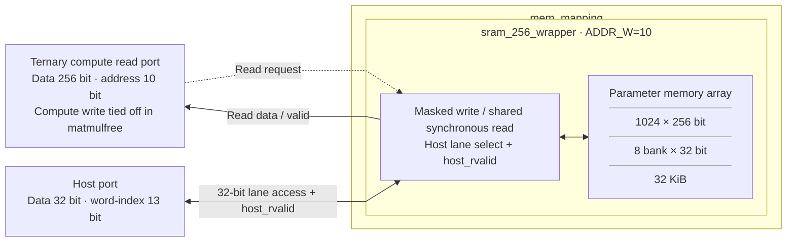

# mem_mapping.sv — Wrapper SRAM 32 KiB

[Tài liệu](../../README.md) → [Hierarchy RTL](../README.md) → [Mục lục từng file](README.md)

**Trạng thái:** Đang dùng.

**Source:** [mem_mapping.sv](<../../../Verilog%20Source%20code/mem_mapping.sv>). **Số dòng:** 40. **SHA-256:** `d9f275ec9c51f32d23b1e4c9312285b2282586308d17a7b5a4a7493300be1492`.

## Khối này làm gì?

File này giữ interface riêng cho parameter memory nhưng dùng chung `sram_256_wrapper` với ADDR_W=10. Module có tên `mem_mapping`; đường compute của instance trong top chỉ đọc; host nạp weight/bias qua cổng32 bit.

## Sơ đồ kiến trúc tổng quan



MUX dùng hình thang rộng ở phía nhiều ngõ vào và thu hẹp về ngõ ra; decoder/demux dùng hình thang ngược lại, mở rộng về phía nhiều ngõ ra. Hình chữ nhật có các vạch ngang biểu diễn bộ nhớ hoặc bank descriptor. Các hình chữ nhật thường là datapath, thanh ghi đơn hoặc giao diện. Nét liền là đường dữ liệu, nét đứt là điều khiển/cấu hình. Mũi tên hồi tiếp biểu diễn kết nối phần cứng. Sơ đồ không biểu diễn thứ tự chu kỳ, trạng thái FSM hoặc các tầng pipeline CPU. Sơ đồ đặt wrapper trong kết nối hiện tại của matmulfree: compute chỉ đọc. Cổng ghi compute vẫn có trong module nhưng bị nối hằng 0 tại top.

## Cách hoạt động chi tiết

Compute đọc/ghi word 256; host chọn một slice32. Wrapper không thêm FSM hay đổi latency. Mỗi port được nối một-một vào implementation chung; xem sram_256_wrapper để hiểu timing và write mask.

1. Đây là wrapper parameter SRAM 32 KiB: compute address 10 bit chọn 1024 word, host thêm ba bit lane.
2. Trong top, compute write bị buộc zero nên ternary core chỉ đọc; host nạp weight/bias khi idle.
3. Tín hiệu nối trực tiếp vào wrapper chung; module không còn mapping FIFO/vector kiểu thesis.
4. Adapter SRAM macro phải giữ read-valid contract mà ternary core đang chờ.

**Quy ước RTL.** Wrapper nối `host_rvalid` từ SRAM lên top. Backend nhận read/address từ frontend và trả host_rvalid sau hai cạnh lên. Frontend top chốt request/response, nên host ngoài giữ read/address bốn cạnh lên đến host_ready. Memory có tám bank 32 bit, write-enable riêng từng lane. Wrapper chỉ nối cổng, không thêm register hoặc đổi latency. Simulation và synthesis dùng cùng hợp đồng memory. Xem [implementation và sơ đồ SRAM](sram_256_wrapper.sv.md).

## Các nhóm logic trong source

Source được chia theo chức năng. Mỗi nhóm giữ nguyên phạm vi dòng để đối chiếu, nhưng phần giải thích tập trung vào quan hệ giữa các câu lệnh thay vì lặp lại từng dấu ngoặc, khai báo hoặc phép gán.


### [Dòng 1–21: Hai giao diện](<../../../Verilog%20Source%20code/mem_mapping.sv#L1>)

<!-- source-range:1:21 -->
```systemverilog
module mem_mapping (
    input logic clk,
    input logic rst_n,

    // Compute-side parameter SRAM port: 1024 x 256 = 32 KiB.
    input logic rd_en,
    input logic [9:0] rd_addr,
    output logic [255:0] rd_data,
    output logic rd_valid,
    input logic wr_en,
    input logic [9:0] wr_addr,
    input logic [255:0] wr_data,

    // 32-bit host port. host_addr is a 32-bit-word index (0..8191).
    input logic host_en,
    input logic host_we,
    input logic [12:0] host_addr,
    input logic [31:0] host_wdata,
    output logic [31:0] host_rdata,
    output logic host_rvalid
);
```

**Mục đích.** Địa chỉ compute đếm word 256, host đếm word 32. Host address byte đã được top bỏ hai bit alignment.

**Cách phần code hoạt động.** Nhóm này định nghĩa giao diện, độ rộng, kiểu hoặc tín hiệu trung gian. Nó tạo cấu trúc để các nhóm xử lý sau sử dụng, chưa tự biểu diễn một bước runtime riêng.

**Tín hiệu và dữ liệu chính.** `rd_en`: request đọc của compute; `rd_addr`: địa chỉ word cần đọc; `rd_data`: word dữ liệu đọc ra; `rd_valid`: response đọc hợp lệ; `wr_en`: cho phép ghi compute; `wr_addr`: địa chỉ word cần ghi; và 6 tín hiệu phụ khác trong đoạn code.


### [Dòng 22–40: Instance SRAM](<../../../Verilog%20Source%20code/mem_mapping.sv#L22>)

<!-- source-range:22:40 -->
```systemverilog
    // Shared implementation keeps host packing and read latency consistent.
    sram_256_wrapper #(.ADDR_W(10)) u_sram (
        .clk(clk),
        .rst_n(rst_n),
        .rd_en(rd_en),
        .rd_addr(rd_addr),
        .rd_data(rd_data),
        .rd_valid(rd_valid),
        .wr_en(wr_en),
        .wr_addr(wr_addr),
        .wr_data(wr_data),
        .host_en(host_en),
        .host_we(host_we),
        .host_addr(host_addr),
        .host_wdata(host_wdata),
        .host_rdata(host_rdata),
        .host_rvalid(host_rvalid)
    );
endmodule
```

**Mục đích.** Parameter ADDR_W quyết định depth; các named port nối trực tiếp cùng chức năng.

**Cách phần code hoạt động.** Có instance module con; named-port ở nhóm này xác định chính xác đường control/data giữa hai cấp hierarchy.

**Tín hiệu và dữ liệu chính.** `rd_en`: request đọc của compute; `rd_addr`: địa chỉ word cần đọc; `rd_data`: word dữ liệu đọc ra; `rd_valid`: response đọc hợp lệ; `wr_en`: cho phép ghi compute; `wr_addr`: địa chỉ word cần ghi; và 6 tín hiệu phụ khác trong đoạn code.

