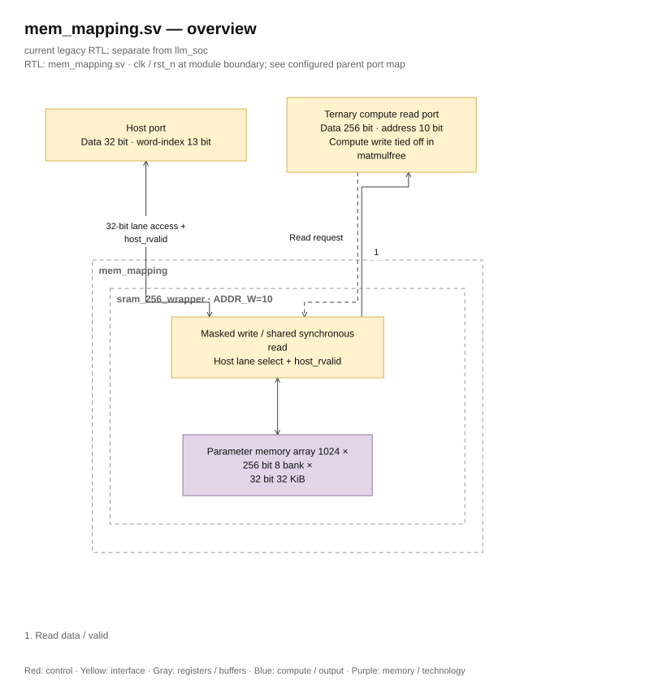

# mem_mapping.sv — Wrapper SRAM 32 KiB

<!-- reading-navigation:start -->
[Documentation](../../README.md) → [Archive · Legacy](../../archive/README.md) → [Module catalog](README.md)

| Reading guide | Document |
|---|---|
| New to the subject | [NPU and RTL fundamentals](../../00-start-here/fundamentals.md) · [Glossary](../../00-start-here/glossary.md) |
| Learn the RTL syntax | [How to read the SystemVerilog](../../00-start-here/reading-systemverilog.md) |
| Read first | [Legacy architecture](../../design/legacy/architecture.md) |
| Related implementation | [sram_256_wrapper.sv](sram_256_wrapper.sv.md) |
<!-- reading-navigation:end -->

> **Category: GUIDE. Scope: LEGACY.** RTL is authoritative; diagrams use the [shared visual style](../../diagrams/diagram_style.md).

**Status:** In use.

**Source:** [mem_mapping.sv](<../../../Verilog%20Source%20code/mem_mapping.sv>).

## At a glance

| Item | Description |
|---|---|
| Responsibility | This file maintains a separate interface for memory parameters but shares `sram_256_wrapper` with ADDR_W=10. The module is named `mem_mapping`; the compute path of the instance in the top only reads; host loads weight/bias via 32-bit port. |

## Reading the `u_sram` instance

`sram_256_wrapper #(.ADDR_W(10)) u_sram (` creates one permanent 1024-row child
instance: `2^10` rows × 256 bits (32 bytes) = 32 KiB. The left name in every
`.port(signal)` pair is a child port; the right name is the parent signal. This
wrapper adds no FSM, register, mux, or latency of its own.

The host sees the same storage as 8192 consecutive 32-bit words. For
`host_addr`, bits `[12:3]` choose one of 1024 rows and bits `[2:0]` choose one of
eight 32-bit lanes. Compute reads a complete 256-bit row using `rd_en/rd_addr`
and waits for `rd_valid`; in the current legacy top its compute write inputs are
tied off, so parameters are loaded through the host while idle.

This RAM stores packed model parameters. Depending on the program/layout, those
bits can represent ternary weights, S32 biases, embeddings, or scale/metadata
words. The SRAM does not recognize a tensor type: its address and the consuming
operator assign meaning. See [How to read the SystemVerilog](../../00-start-here/reading-systemverilog.md)
for parameter overrides and named ports.

## Overview Architecture Diagram

[Editable draw.io — mem_mapping.sv — overview](../../diagrams/architecture.drawio) · Page `39_mem_mapping.sv_1`.

## Main flow

Compute accesses a 1024-row, 256-bit-wide parameter memory; host selects one
32-bit lane. The wrapper does not add an FSM or change latency. Each port is
connected one-to-one to the common implementation; see `sram_256_wrapper` to
understand timing and the write mask.

1. This is a wrapper parameter for 32 KiB SRAM: compute 10-bit address selects 1024 words, host adds three lane bits.
2. In top, compute write is forced zero so ternary core only reads; host loads weight/bias when idle.
3. The signal is connected directly to the common wrapper; the module no longer maps FIFO/vector in the thesis style.
4. The SRAM macro adapter must maintain the read-valid contract that the ternary core is waiting for.

**RTL convention.** The wrapper connects `host_rvalid` from SRAM to the top. The backend receives read/address from the frontend and returns host_rvalid after two rising edges. The frontend top latches request/response, so the external host holds read/address for four rising edges until host_ready. The memory has eight 32-bit banks, with write-enable for each lane separately. The wrapper only connects ports, without adding registers or changing latency. Simulation and synthesis use the same memory contract. See [implementation and SRAM diagram](sram_256_wrapper.sv.md).

## Important state / datapath groups

### [Lines 1–21: Two interfaces](<../../../Verilog%20Source%20code/mem_mapping.sv#L1>)

**Purpose.** Compute address counts 256 words, host counts 32 words. Host byte address has had two alignment bits removed by top.

**How the code works.** This group defines interfaces, width, type, or intermediate signals. It creates a structure for subsequent processing groups to use, and does not itself represent a separate runtime step.

**Main signals and data.** `rd_en`: compute read request; `rd_addr`: word address to read; `rd_data`: word data read out; `rd_valid`: valid read response; `wr_en`: compute write enable; `wr_addr`: word address to write; and 6 other auxiliary signals in the code segment.

### [Lines 22–45: SRAM instance and transparent port wiring](<../../../Verilog%20Source%20code/mem_mapping.sv#L22>)

**Purpose.** The parameter ADDR_W determines the depth; the named ports are connected directly with the same function.

**How the code works.** Elaboration creates one child hardware block; it is not a
runtime function call. Named ports precisely define the paths between parent and
child.

**Main signals and data.** `rd_en`: compute read request; `rd_addr`: word address to read; `rd_data`: word data read out; `rd_valid`: valid read response; `wr_en`: compute write enable; `wr_addr`: word address to write; and 6 other auxiliary signals in the code segment.
