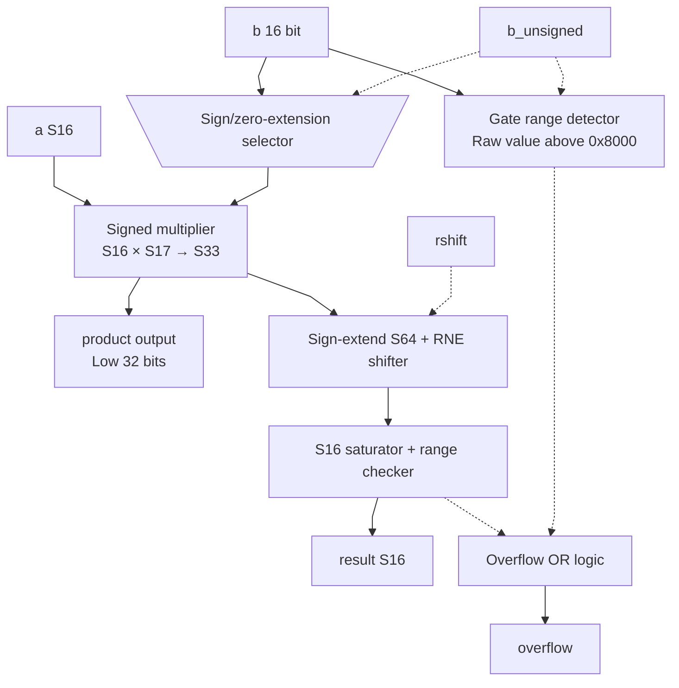

# mul.sv — Helper nhân S16 và gate

[Tài liệu](../../README.md) → [Hierarchy RTL](../README.md) → [Mục lục từng file](README.md)

**Trạng thái:** Helper — không instantiate trong top hiện tại.

**Source:** [mul.sv](<../../../Verilog%20Source%20code/mul.sv>). **Số dòng:** 43. **SHA-256:** `fdca97fe654f877cd33e7eb934d3869a6e754bd9a4d9d128f228d9c17add646e`.

## Khối này làm gì?

Helper nhân a signed 16 với b signed 16 hoặc unsigned gate. Rowwise_op đã có đường nhân chia sẻ MUL/REC riêng; không cộng helper này vào số multiplier của top.

## Sơ đồ kiến trúc tổng quan



MUX dùng hình thang rộng ở phía nhiều ngõ vào và thu hẹp về ngõ ra; decoder/demux dùng hình thang ngược lại, mở rộng về phía nhiều ngõ ra. Hình chữ nhật có các vạch ngang biểu diễn bộ nhớ hoặc bank descriptor. Các hình chữ nhật thường là datapath, thanh ghi đơn hoặc giao diện. Nét liền là đường dữ liệu, nét đứt là điều khiển/cấu hình. Mũi tên hồi tiếp biểu diễn kết nối phần cứng. Sơ đồ không biểu diễn thứ tự chu kỳ, trạng thái FSM hoặc các tầng pipeline CPU. Sơ đồ riêng của module legacy/helper; module này không được instantiate trong hierarchy matmulfree hiện tại.

## Cách hoạt động chi tiết

b_s17 giữ đúng sign hoặc zero-extend gate. Tích p33 được RNE theo rshift rồi clamp S16. product chỉ xuất32 bit thấp của p33. Gate unsigned vượt raw `0x8000` bị báo overflow; không nên dùng helper như multiplier U16 tổng quát không giới hạn.

1. A luôn là S16. B được sign-extend nếu signed hoặc zero-extend nếu là gate U16.
2. Tích S33 giữ trường hợp S16×0x8000; `product` chỉ xuất 32 bit thấp vì interface helper cũ.
3. Đường result mở rộng lên S64, RNE theo rshift rồi clamp S16.
4. Gate trên raw 0x8000 bị báo overflow vì ngoài miền 0…1 của U16/F15.
5. Helper không được top instantiate; rowwise_op có đường multiplier/scale hoàn chỉnh hơn.

## Các nhóm logic trong source

Source được chia theo chức năng. Mỗi nhóm giữ nguyên phạm vi dòng để đối chiếu, nhưng phần giải thích tập trung vào quan hệ giữa các câu lệnh thay vì lặp lại từng dấu ngoặc, khai báo hoặc phép gán.


### [Dòng 1–15: Giao diện và intermediate](<../../../Verilog%20Source%20code/mul.sv#L1>)

<!-- source-range:1:15 -->
```systemverilog
module mul (
    input logic signed [15:0] a,
    input logic [15:0] b,
    input logic b_unsigned,
    input logic [5:0] rshift,
    output logic signed [31:0] product,
    output logic signed [15:0] result,
    output logic overflow
);
    import npu_pkg::*;
    logic signed [16:0] b_s17;
    logic signed [32:0] p33;
    logic signed [63:0] rounded;
    logic_mul #(.A_W(16), .B_W(17), .OUT_W(33), .SIGNED_A(1), .SIGNED_B(1)) u_bit_mul
        (.a(a), .b(b_s17), .product(p33));
```

**Mục đích.** b_unsigned quyết định cách diễn giải cùng16 bit của b.

**Cách phần code hoạt động.** Nhóm này định nghĩa giao diện, độ rộng, kiểu hoặc tín hiệu trung gian. Nó tạo cấu trúc để các nhóm xử lý sau sử dụng, chưa tự biểu diễn một bước runtime riêng.

**Tín hiệu và dữ liệu chính.** `a`: operand A; `b`: operand B; `b_unsigned`: B là gate unsigned; `rshift`: số bit chia lũy thừa 2 trước saturation; `product`: tích trung gian trước rescale; `result`: kết quả đã saturation; và 4 tín hiệu phụ khác trong đoạn code.


### [Dòng 16–43: Multiply/round/clamp](<../../../Verilog%20Source%20code/mul.sv#L16>)

<!-- source-range:16:43 -->
```systemverilog
    always_comb begin
        b_s17 = b_unsigned ? $signed({1'b0, b}) : $signed({b[15], b});

        product = p33[31:0];
        rounded = rne_shift64({{31{p33[32]}}, p33}, rshift);
        overflow = (rounded > 64'sh0000_0000_0000_7fff) || (rounded < - 64'sh0000_0000_0000_8000) || (b_unsigned && b > 16'h8000);
        result = sat_s16(rounded);
    end
endmodule

// Small arithmetic cell retained here after consolidating legacy helper files.
// Used by the arithmetic regression; no technology binding is required.
module addsub (
    input logic signed [15:0] a, b,
    input logic sub,
    output logic signed [16:0] wide,
    output logic signed [15:0] result,
    output logic overflow
);
    import npu_pkg::*;
    logic signed [16:0] b_ext;
    always_comb begin
        b_ext = {b[15], b};
        wide = {a[15], a} + (sub ? -b_ext : b_ext);
        overflow = wide[16] ^ wide[15];
        result = sat_s16({{47{wide[16]}}, wide});
    end
endmodule
```

**Mục đích.** Output result được làm tròn; output product không phải result đã đổi scale.

**Cách phần code hoạt động.** Có logic tổ hợp: output/intermediate được tính từ input hiện tại; các giá trị mặc định đầu khối giúp tránh suy ra latch.

**Tín hiệu và dữ liệu chính.** `b_s17`: B S17 sau chọn signed/gate; `b_unsigned`: B là gate unsigned; `b`: operand B; `p33`: tích đầy đủ S33 của helper mul; `a`: operand A; `product`: tích trung gian trước rescale; và 4 tín hiệu phụ khác trong đoạn code.
