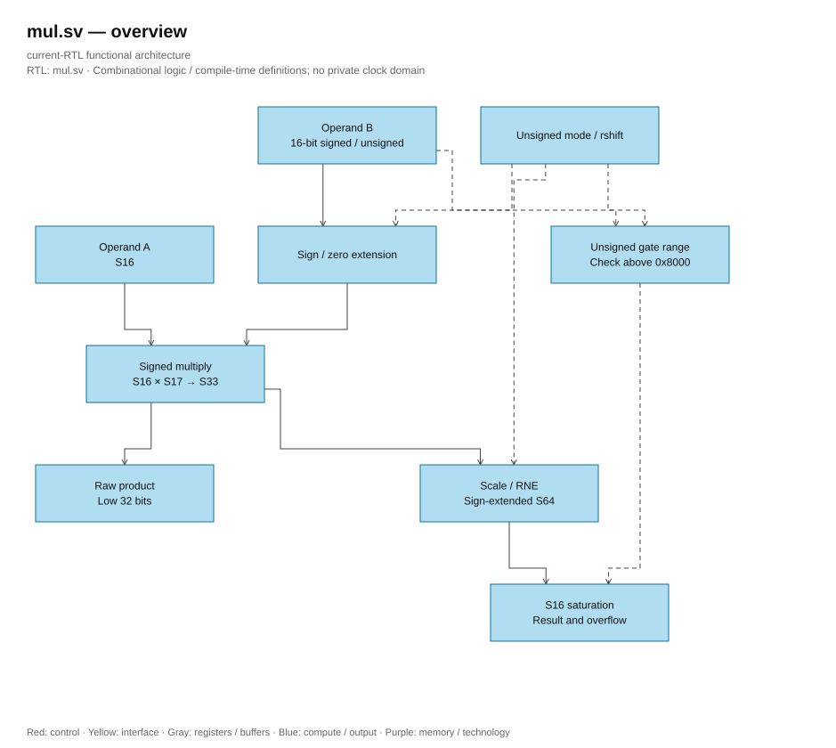

# mul.sv — Helper multiplying S16 and gate

<!-- reading-navigation:start -->
[Documentation](../../README.md) → [02 · Architecture](../../02-architecture/README.md) → [Module catalog](README.md)

| Reading guide | Document |
|---|---|
| New to the subject | [NPU and RTL fundamentals](../../00-start-here/fundamentals.md) · [Glossary](../../00-start-here/glossary.md) |
| Learn the RTL syntax | [How to read the SystemVerilog](../../00-start-here/reading-systemverilog.md) |
| Read first | [Full RTL graph](../full_graph.md) |
| Related implementation | [logic_mul.sv](logic_mul.sv.md) |
<!-- reading-navigation:end -->

> **Category: GUIDE. Scope: LEGACY.** RTL is authoritative; diagrams use the [shared visual style](../../diagrams/diagram_style.md).

**Status:** Helper — not instantiated in the current top.

**Source:** [mul.sv](<../../../Verilog%20Source%20code/mul.sv>).

## At a glance

| Item | Description |
|---|---|
| Responsibility | Helper multiplies a signed 16 with b signed 16 or unsigned gate. Rowwise_op already has its own dedicated MUL/REC path; do not add this helper to the top's multiplier count. |

## Overview of architecture diagram

[Editable draw.io — mul.sv — overview](../../diagrams/architecture.drawio) · Page `40_mul.sv_1`.

## Main flow

b_s17 keeps the correct sign or zero-extend gate. The p33 product is rounded to nearest even (RNE) according to rshift then clamped to S16. The product only outputs the lower 32 bits of p33. Unsigned gates exceeding raw `0x8000` trigger overflow; general U16 multipliers without limits should not be used as helpers.

1. A is always S16. B is sign-extended if signed or zero-extended if it is a U16 gate.
2. The S33 product keeps the S16×0x8000 case; `product` only outputs the lower 32 bits because of the old helper interface.
3. The result path extends to S64, RNE according to rshift then clamps to S16.
4. The gate on raw 0x8000 reports overflow because it is outside the 0…1 range of U16/F15.
5. Helper should not be top-level instantiated; rowwise_op has a more complete multiplier/scale path.

## Important state / datapath groups

### [Lines 1–15: Interface and intermediate](<../../../Verilog%20Source%20code/mul.sv#L1>)

**Purpose.** b_unsigned determines how to interpret the 16 bits of b.

**How the code works.** This group defines interface, width, type, or intermediate signals. It creates a structure for subsequent processing groups to use, not yet representing a separate runtime step itself.

**Main signals and data.** `a`: operand A; `b`: operand B; `b_unsigned`: B is an unsigned gate; `rshift`: number of bits to divide by power of 2 before saturation; `product`: intermediate product before rescale; `result`: result after saturation; and 4 other auxiliary signals in the code segment.

### [Lines 16–43: Multiply/round/clamp](<../../../Verilog%20Source%20code/mul.sv#L16>)

**Purpose.** Output result is rounded; output product is not the scaled result.

**How the code works.** There is combinational logic: output/intermediate is calculated from the current input; default block values help avoid inferring latches.

**Main signals and data.** `b_s17`: B S17 after selecting signed/gate; `b_unsigned`: B is unsigned gate; `b`: operand B; `p33`: full S33 product of helper mul; `a`: operand A; `product`: intermediate product before rescale; and 4 other auxiliary signals in the code segment.
