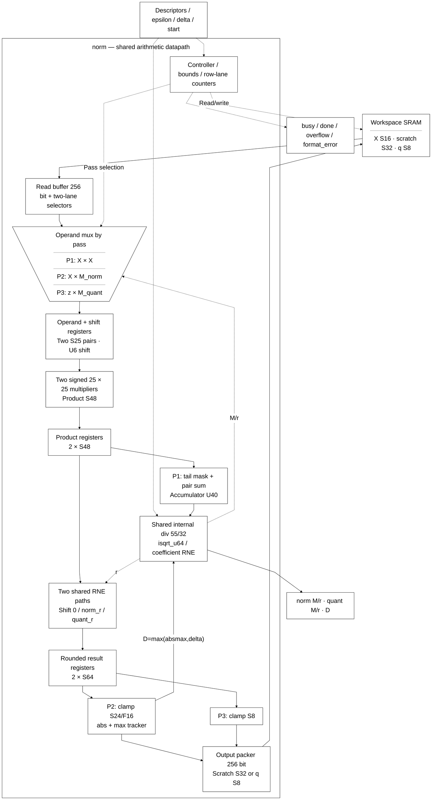
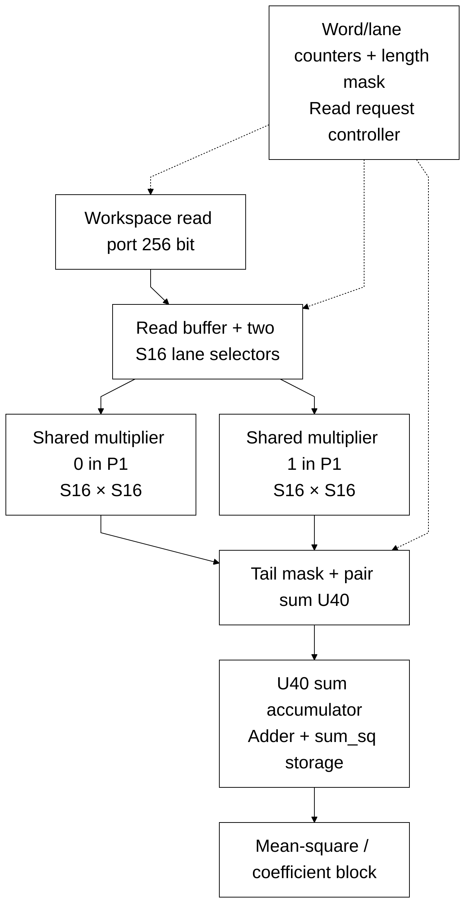
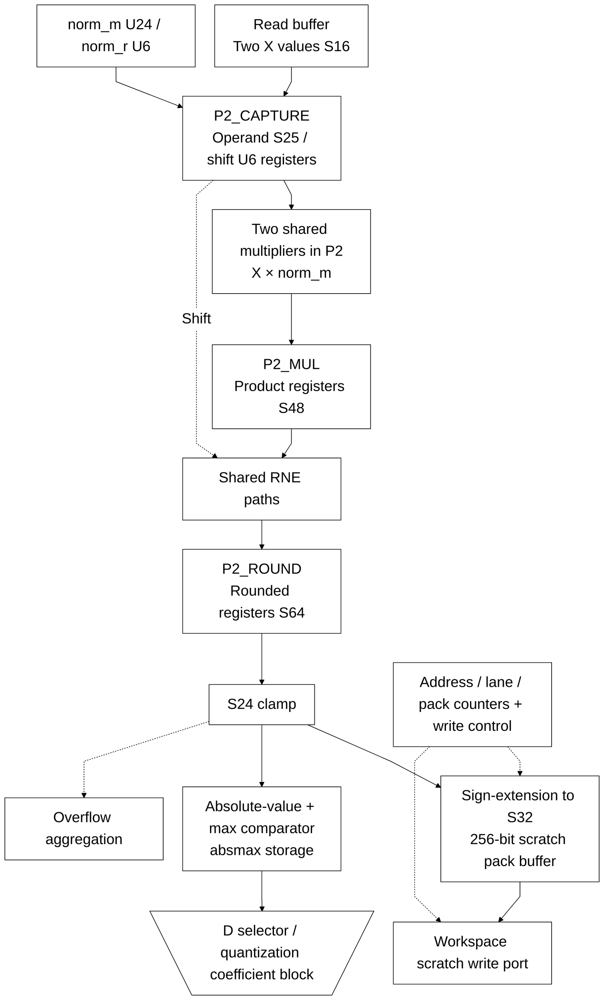
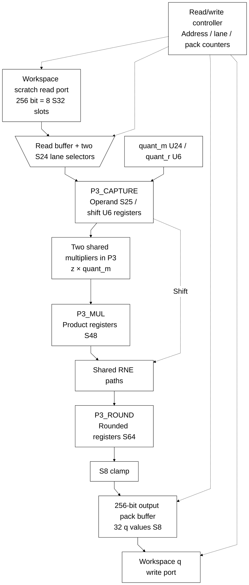

# norm.sv

[Documentation](../../README.md) → [Source guide](../full_graph.md) → [RTL index](README.md)

**Source:** [norm.sv](<../../../Verilog%20Source%20code/norm.sv>). **Số dòng:** 556. **SHA-256:** `83047edfb7ac751c38c19b15e8eed6f725b8e6f40fe63b6bdf3475cde42be8c4`.

## Khối này làm gì?

Legacy three-pass RMS normalization and quantization. Two shared structural multipliers, one divider and the separately defined isqrt_u64 serve the explicit pass controller. Workspace scratch and final quantized values are packed in 256-bit words.

## Sơ đồ kiến trúc



## Cách hoạt động chi tiết

Legacy three-pass RMS normalization and quantization. Two shared structural multipliers, one divider and the separately defined isqrt_u64 serve the explicit pass controller. Workspace scratch and final quantized values are packed in 256-bit words.

### Datapath detail 1



### Datapath detail 2



### Datapath detail 3



## Các nhóm logic trong source

### [Dòng 1–99: Legacy normalization interface and controller](<../../../Verilog%20Source%20code/norm.sv#L1>)

<!-- source-range:1:99 -->
```systemverilog
// Full-vector integer RMSNorm + activation quantization.
// X: S16 with per-tensor scale. z scratch: S24/F16 stored sign-extended in S32 slots.
// q: S8, RNE and clamp [-128,127]. K is 1..512.
module norm (
    input logic clk,
    input logic rst_n,
    input logic start,
    input logic [7:0] x_base,
    input logic [7:0] z_base,
    input logic [7:0] q_base,
    input logic [9:0] k_len,
    input logic [63:0] epsilon_raw32,
    input logic [23:0] delta_raw,

    output logic ws_rd_en,
    output logic [7:0] ws_rd_addr,
    input logic [255:0] ws_rd_data,
    input logic ws_rd_valid,
    output logic ws_wr_en,
    output logic [7:0] ws_wr_addr,
    output logic [255:0] ws_wr_data,

    output logic busy,
    output logic done,
    output logic overflow,
    output logic format_error,
    output logic [23:0] quant_d,
    output logic [23:0] norm_m,
    output logic [5:0] norm_r,
    output logic [23:0] quant_m,
    output logic [5:0] quant_r
);
    import npu_pkg::*;

    typedef enum logic [5:0] {
    IDLE,
    P1_REQ, P1_WAIT, P1_CAPTURE, P1_MUL, P1_PROC,
    DIV_MEAN_START, DIV_MEAN_WAIT,
    DIV_FRAC_START, DIV_FRAC_WAIT,
    SQRT_START, SQRT_WAIT,
    CNORM_PREP, CNORM_DIV_START, CNORM_DIV_WAIT,
    P2_REQ, P2_WAIT, P2_CAPTURE, P2_MUL, P2_ROUND, P2_PROC, P2_WRITE,
    CQUANT_PREP, CQUANT_DIV_START, CQUANT_DIV_WAIT,
    P3_REQ, P3_WAIT, P3_CAPTURE, P3_MUL, P3_ROUND, P3_PROC, P3_WRITE,
    FINISH
    } state_t;
    state_t state;

    logic [7:0] input_base_q, scratch_base_q, output_base_q;
    logic [9:0] vector_length_q;
    logic [63:0] epsilon_q;
    logic [23:0] delta_q;
    logic [7:0] word_index;
    logic [3:0] lane;
    logic [255:0] read_buf;
    logic [39:0] sum_sq;
    logic [63:0] mean_q, mean_rem;
    logic [63:0] v_raw;
    logic [64:0] mean_with_epsilon;
    logic [31:0] rms_r;
    logic [23:0] absmax;
    logic [255:0] pack_buf;
    logic [5:0] pack_count;
    logic [7:0] write_word;

    // Shared numerator width: sum_sq uses 40 bits; mean remainder shifted
    // by 32 uses at most 41; quant numerator uses at most 48; norm numerator
    // is 2^(32+r), with r <= 22 for a U32 RMS, so bit 54 is the maximum.
    localparam int DIV_NUM_W = 55;
    logic div_start, div_busy, div_done, div_zero;
    logic [DIV_NUM_W - 1:0] div_num, div_q;
    logic [31:0] div_den, div_rem;
    div #(.NUM_W(DIV_NUM_W),
        .DEN_W(32)) u_div(
        .clk(clk),
        .rst_n(rst_n),
        .start(div_start),
        .numerator(div_num),
        .denominator(div_den),
        .busy(div_busy),
        .done(div_done),
        .div_zero(div_zero),
        .quotient(div_q),
        .remainder(div_rem)
    );

    logic sqrt_start, sqrt_busy, sqrt_done;
    logic [31:0] sqrt_root;
    isqrt_u64 u_sqrt(.clk(clk),
        .rst_n(rst_n),
        .start(sqrt_start),
        .radicand(v_raw),
        .busy(sqrt_busy),
        .done(sqrt_done),
        .root(sqrt_root));

    logic signed [15:0] x0, x1;
    logic signed [31:0] x0_sq, x1_sq;
    logic [39:0] pair_sq;
```

### [Dòng 100–219: Coefficient, multiplier and numeric datapaths](<../../../Verilog%20Source%20code/norm.sv#L100>)

<!-- source-range:100:219 -->
```systemverilog
    logic [10:0] idx0, idx1;
    logic signed [23:0] zr0, zr1;
    logic signed [24:0] multiply_a [0:1], multiply_b [0:1];
    logic signed [24:0] multiply_a_q [0:1], multiply_b_q [0:1];
    wire signed [47:0] arithmetic_product [0:1];
    genvar arithmetic_lane;
    generate
    for (arithmetic_lane = 0; arithmetic_lane < 2; arithmetic_lane = arithmetic_lane + 1) begin : g_bit_mul
        logic_mul #(.A_W(25), .B_W(25), .OUT_W(48), .SIGNED_A(1), .SIGNED_B(1)) u_mul
            (.a(multiply_a_q[arithmetic_lane]), .b(multiply_b_q[arithmetic_lane]), .product(arithmetic_product[arithmetic_lane]));
    end
    endgenerate
    logic signed [47:0] arithmetic_product_q [0:1];
    logic signed [63:0] arithmetic_rounded [0:1];
    logic signed [63:0] arithmetic_rounded_q [0:1];
    logic [5:0] arithmetic_shift, arithmetic_shift_q;
    always_comb begin
        x0 = read_buf[(int'(lane) << 4) +: 16];
        x1 = read_buf[((int'(lane) + 1) << 4) +: 16];
        zr0 = read_buf[(int'(lane) << 5) +: 24];
        zr1 = read_buf[((int'(lane) + 1) << 5) +: 24];
        // The three passes share two multipliers and two RNE paths. Register
        // the read mux outputs, products and rounded values separately so a
        // lane selection cannot feed multiply, RNE and absmax in one cycle.
        multiply_a[0] = '0;
        multiply_a[1] = '0;
        multiply_b[0] = '0;
        multiply_b[1] = '0;
        arithmetic_shift = '0;
        case (state)
            P1_CAPTURE : begin
                multiply_a[0] = {{9{x0[15]}}, x0};
                multiply_a[1] = {{9{x1[15]}}, x1};
                multiply_b[0] = multiply_a[0];
                multiply_b[1] = multiply_a[1];
            end
            P2_CAPTURE : begin
                multiply_a[0] = {{9{x0[15]}}, x0};
                multiply_a[1] = {{9{x1[15]}}, x1};
                multiply_b[0] = $signed({1'b0, norm_m});
                multiply_b[1] = $signed({1'b0, norm_m});
                arithmetic_shift = norm_r;
            end
            P3_CAPTURE : begin
                multiply_a[0] = {zr0[23], zr0};
                multiply_a[1] = {zr1[23], zr1};
                multiply_b[0] = $signed({1'b0, quant_m});
                multiply_b[1] = $signed({1'b0, quant_m});
                arithmetic_shift = quant_r;
            end
            default : ;
        endcase
        for (integer j = 0; j < 2; j = j + 1) begin
            // S24 * U24 fits S48; the extra operand bit preserves U24's sign.

            arithmetic_rounded[j] = rne_shift64(
                {{16{arithmetic_product_q[j][47]}}, arithmetic_product_q[j]}, arithmetic_shift_q);
        end
        x0_sq = arithmetic_product_q[0][31:0];
        x1_sq = arithmetic_product_q[1][31:0];
        idx0 = 11'({word_index, 4'b0} + lane);
        idx1 = idx0 + 1'b1;
        pair_sq = 0;
        if (idx0 < vector_length_q) pair_sq = pair_sq + $unsigned(x0_sq);
        if (idx1 < vector_length_q) pair_sq = pair_sq + $unsigned(x1_sq);
    end

    // Payload registers need no reset: the reset state cannot consume them,
    // and every pass captures fresh operands before multiplying/rounding.
    // Keeping the payload on plain clocked flops permits ordinary multiplier
    // register packing in synthesis without any vendor-specific attributes.
    always_ff @(posedge clk) begin
        if (rst_n && (state == P1_CAPTURE || state == P2_CAPTURE || state == P3_CAPTURE)) begin
            for (integer j = 0; j < 2; j = j + 1) begin
                multiply_a_q[j] <= multiply_a[j];
                multiply_b_q[j] <= multiply_b[j];
            end
            arithmetic_shift_q <= arithmetic_shift;
        end
        if (rst_n && (state == P1_MUL || state == P2_MUL || state == P3_MUL)) begin
            for (integer j = 0; j < 2; j = j + 1)
                arithmetic_product_q[j] <= arithmetic_product[j];
        end
        if (rst_n && (state == P2_ROUND || state == P3_ROUND)) begin
            for (integer j = 0; j < 2; j = j + 1)
                arithmetic_rounded_q[j] <= arithmetic_rounded[j];
        end
    end

    // Parallel leading-bit masks and constant comparisons expose shift selection.
    wire [23:0] quant_den = (absmax > delta_q) ? absmax : delta_q;
    wire [5:0] norm_encode [0:32], quant_encode [0:24];
    wire [5:0] norm_r_sel = norm_encode[32];
    wire [5:0] quant_r_sel = quant_encode[24];
    genvar norm_bit, quant_bit;
    generate
    for (norm_bit = 0; norm_bit < 32; norm_bit = norm_bit + 1) begin : g_norm_shift
        wire leading = rms_r[norm_bit] && ((rms_r >> (norm_bit + 1)) == 0);
        assign norm_encode[norm_bit + 1] = norm_encode[norm_bit] |
            (6'(norm_bit > 9 ? norm_bit - 9 : 0) & {6{leading}});
    end
    for (quant_bit = 0; quant_bit < 24; quant_bit = quant_bit + 1) begin : g_quant_shift
        wire leading = quant_den[quant_bit] && ((quant_den >> (quant_bit + 1)) == 0);
        wire boost;
        if (quant_bit >= 7) assign boost = quant_den > (24'd127 << (quant_bit - 6));
        else assign boost = 0;
        assign quant_encode[quant_bit + 1] = quant_encode[quant_bit] |
            ((6'(quant_bit + 17) + {5'h0, boost}) & {6{leading}});
    end
    endgenerate
    assign norm_encode[0] = 0;
    assign quant_encode[0] = 0;
    logic [DIV_NUM_W - 1:0] norm_num, quant_num;
    always_comb begin
        mean_with_epsilon = ({1'b0, mean_q} << 32) + {10'h000, div_q} + {1'b0, epsilon_q};
        // PREP registers the chosen shift before DIV_START consumes it.
        // Reuse that value so coefficient selection is not on divider inputs.
        norm_num = 55'h1 << (32 + norm_r);
        quant_num = 55'h7f << quant_r;
    end
```

### [Dòng 220–556: Workspace requests and pass sequencing](<../../../Verilog%20Source%20code/norm.sv#L220>)

<!-- source-range:220:556 -->
```systemverilog

    logic signed [63:0] z_round0, z_round1;
    logic signed [23:0] z0, z1;
    logic [23:0] absz0, absz1;
    always_comb begin
        z_round0 = arithmetic_rounded_q[0];
        z_round1 = arithmetic_rounded_q[1];
        if (z_round0 > 64'sh0000_0000_007f_ffff) z0 = 24'sh7f_ffff;
        else if (z_round0 < - 64'sh0000_0000_0080_0000) z0 = 24'sh80_0000;
        else z0 = z_round0[23:0];
        if (z_round1 > 64'sh0000_0000_007f_ffff) z1 = 24'sh7f_ffff;
        else if (z_round1 < - 64'sh0000_0000_0080_0000) z1 = 24'sh80_0000;
        else z1 = z_round1[23:0];
        absz0 = z0[23] ? $unsigned( - $signed(z0)) : z0;
        absz1 = z1[23] ? $unsigned( - $signed(z1)) : z1;
    end

    logic signed [63:0] qround0, qround1;
    logic signed [7:0] q0, q1;
    always_comb begin
        qround0 = arithmetic_rounded_q[0];
        qround1 = arithmetic_rounded_q[1];
        if (qround0 > 64'sh0000_0000_0000_007f) q0 = 8'sh7f;
        else if (qround0 < - 64'sh0000_0000_0000_0080) q0 = 8'sh80;
        else q0 = qround0[7:0];
        if (qround1 > 64'sh0000_0000_0000_007f) q1 = 8'sh7f;
        else if (qround1 < - 64'sh0000_0000_0000_0080) q1 = 8'sh80;
        else q1 = qround1[7:0];
    end

    always_comb begin
        ws_rd_en = 1'b0;
        ws_rd_addr = '0;
        ws_wr_en = 1'b0;
        ws_wr_addr = '0;
        ws_wr_data = pack_buf;
        div_start = 1'b0;
        div_num = '0;
        div_den = '0;
        sqrt_start = 1'b0;
        case (state)
            P1_REQ : begin
                ws_rd_en = 1'b1;
                ws_rd_addr = input_base_q + word_index;
            end
            DIV_MEAN_START : begin
                div_start = 1'b1;
                div_num = {{15{1'b0}}, sum_sq};
                div_den = {22'h0, vector_length_q};
            end
            DIV_FRAC_START : begin
                div_start = 1'b1;
                div_num = DIV_NUM_W'(mean_rem) << 32;
                div_den = {22'h0, vector_length_q};
            end
            SQRT_START : sqrt_start = 1'b1;
            CNORM_DIV_START : begin
                div_start = 1'b1;
                div_num = norm_num;
                div_den = rms_r;
            end
            P2_REQ : begin
                ws_rd_en = 1'b1;
                ws_rd_addr = input_base_q + word_index;
            end
            P2_WRITE : begin
                ws_wr_en = 1'b1;
                ws_wr_addr = scratch_base_q + write_word;
                ws_wr_data = pack_buf;
            end
            CQUANT_DIV_START : begin
                div_start = 1'b1;
                div_num = quant_num;
                div_den = {8'h00, quant_d};
            end
            P3_REQ : begin
                ws_rd_en = 1'b1;
                ws_rd_addr = scratch_base_q + word_index;
            end
            P3_WRITE : begin
                ws_wr_en = 1'b1;
                ws_wr_addr = output_base_q + write_word;
                ws_wr_data = pack_buf;
            end
            default : ;
        endcase
    end

    always_ff @(posedge clk or negedge rst_n) begin
        if (!rst_n) begin
            state <= IDLE;
            busy <= 0;
            done <= 0;
            overflow <= 0;
            format_error <= 0;
            quant_d <= 0;
            input_base_q <= 0;
            scratch_base_q <= 0;
            output_base_q <= 0;
            vector_length_q <= 0;
            epsilon_q <= 0;
            delta_q <= 1;
            word_index <= 0;
            lane <= 0;
            read_buf <= 0;
            sum_sq <= 0;
            mean_q <= 0;
            mean_rem <= 0;
            v_raw <= 0;
            rms_r <= 0;
            absmax <= 0;
            pack_buf <= 0;
            pack_count <= 0;
            write_word <= 0;
            norm_m <= 0;
            norm_r <= 0;
            quant_m <= 0;
            quant_r <= 0;
        end else begin
            done <= 1'b0;
            case (state)
                IDLE : if (start) begin
                    busy <= 1;
                    overflow <= 0;
                    format_error <= 0;
                    quant_d <= 0;
                    norm_m <= 0;
                    norm_r <= 0;
                    quant_m <= 0;
                    quant_r <= 0;
                    input_base_q <= x_base;
                    scratch_base_q <= z_base;
                    output_base_q <= q_base;
                    vector_length_q <= k_len;
                    epsilon_q <= epsilon_raw32;
                    delta_q <= delta_raw;
                    word_index <= 0;
                    lane <= 0;
                    sum_sq <= 0;
                    state <= P1_REQ;
                    if (k_len == 0 || k_len > K_MAX || delta_raw == 0 ||
                        int'(x_base) + ((int'(k_len) + 15) >> 4) > 256 ||
                        int'(z_base) + ((int'(k_len) + 7) >> 3) > 256 ||
                        int'(q_base) + ((int'(k_len) + 31) >> 5) > 256 ||
                        ranges_overlap(int'(x_base), ((int'(k_len) + 15) >> 4), int'(z_base), ((int'(k_len) + 7) >> 3)) ||
                        ranges_overlap(int'(q_base), ((int'(k_len) + 31) >> 5), int'(z_base), ((int'(k_len) + 7) >> 3))) begin
                        format_error <= 1;
                        state <= FINISH;
                    end
                end
                P1_REQ : state <= P1_WAIT;
                P1_WAIT : if (ws_rd_valid) begin
                    read_buf <= ws_rd_data;
                    lane <= 0;
                    state <= P1_CAPTURE;
                end
                P1_CAPTURE : state <= P1_MUL;
                P1_MUL : state <= P1_PROC;
                P1_PROC : begin
                    sum_sq <= sum_sq + pair_sq;
                    if (lane == 14 || idx1 >= vector_length_q - 1) begin
                        if (({word_index, 4'b0} + 16) >= vector_length_q) state <= DIV_MEAN_START;
                        else begin
                            word_index <= word_index + 1'b1;
                            state <= P1_REQ;
                        end
                    end else begin
                        lane <= lane + 4'd2;
                        state <= P1_CAPTURE;
                    end
                end
                DIV_MEAN_START : state <= DIV_MEAN_WAIT;
                DIV_MEAN_WAIT : if (div_done) begin
                    mean_q <= {{9{1'b0}}, div_q};
                    mean_rem <= div_rem;
                    state <= DIV_FRAC_START;
                end
                DIV_FRAC_START : state <= DIV_FRAC_WAIT;
                DIV_FRAC_WAIT : if (div_done) begin
                    v_raw <= mean_with_epsilon[63:0];
                    state <= SQRT_START;
                    if (mean_with_epsilon[64]) begin
                        overflow <= 1;
                        format_error <= 1;
                        state <= FINISH;
                    end
                end
                SQRT_START : state <= SQRT_WAIT;
                SQRT_WAIT : if (sqrt_done) begin
                    rms_r <= sqrt_root;
                    state <= CNORM_PREP;
                end
                CNORM_PREP : begin
                    if (sum_sq == 0) begin
                        norm_m <= 0;
                        norm_r <= 0;
                        absmax <= 0;
                        word_index <= 0;
                        lane <= 0;
                        pack_buf <= 0;
                        pack_count <= 0;
                        write_word <= 0;
                        state <= P2_REQ;
                    end
                    else begin
                        norm_r <= norm_r_sel;
                        state <= CNORM_DIV_START;
                    end
                end
                CNORM_DIV_START : state <= CNORM_DIV_WAIT;
                CNORM_DIV_WAIT : if (div_done) begin
                    norm_m <= div_q[23:0] + ((({1'b0, div_rem} << 1) > rms_r) || ((({1'b0, div_rem} << 1) == rms_r) && div_q[0]));
                    word_index <= 0;
                    lane <= 0;
                    pack_buf <= 0;
                    pack_count <= 0;
                    write_word <= 0;
                    absmax <= 0;
                    state <= P2_REQ;
                end
                P2_REQ : state <= P2_WAIT;
                P2_WAIT : if (ws_rd_valid) begin
                    read_buf <= ws_rd_data;
                    lane <= 0;
                    state <= P2_CAPTURE;
                end
                P2_CAPTURE : state <= P2_MUL;
                P2_MUL : state <= P2_ROUND;
                P2_ROUND : state <= P2_PROC;
                P2_PROC : begin
                    if ((idx0 < vector_length_q && (z_round0 > 64'sh0000_0000_007f_ffff || z_round0 < - 64'sh0000_0000_0080_0000)) ||
                        (idx1 < vector_length_q && (z_round1 > 64'sh0000_0000_007f_ffff || z_round1 < - 64'sh0000_0000_0080_0000))) overflow <= 1;
                    if (idx0 < vector_length_q) begin
                        pack_buf[(int'(pack_count) << 5) +: 32] <= {{8{z0[23]}}, z0};
                        if (absz0 > absmax) absmax <= absz0;
                    end
                    if (idx1 < vector_length_q) begin
                        pack_buf[((int'(pack_count) + 1) << 5) +: 32] <= {{8{z1[23]}}, z1};
                        if (absz1 > absmax && absz1 > absz0) absmax <= absz1;
                    end
                    if (pack_count >= 6 || idx1 >= vector_length_q - 1) begin
                        state <= P2_WRITE;
                    end else begin
                        pack_count <= pack_count + 6'd2;
                        lane <= lane + 4'd2;
                        state <= P2_CAPTURE;
                    end
                end
                P2_WRITE : begin
                    write_word <= write_word + 1'b1;
                    pack_buf <= 0;
                    pack_count <= 0;
                    if (idx1 >= vector_length_q - 1) state <= CQUANT_PREP;
                    else if (lane == 14) begin
                        word_index <= word_index + 1'b1;
                        lane <= 0;
                        state <= P2_REQ;
                    end
                    else begin
                        lane <= lane + 4'd2;
                        state <= P2_CAPTURE;
                    end
                end
                CQUANT_PREP : begin
                    quant_d <= (absmax > delta_q) ? absmax : delta_q;
                    quant_r <= quant_r_sel;
                    if ((absmax == 0) && (delta_q == 0)) begin
                        quant_m <= 0;
                        word_index <= 0;
                        lane <= 0;
                        pack_buf <= 0;
                        pack_count <= 0;
                        write_word <= 0;
                        state <= P3_REQ;
                    end
                    else state <= CQUANT_DIV_START;
                end
                CQUANT_DIV_START : state <= CQUANT_DIV_WAIT;
                CQUANT_DIV_WAIT : if (div_done) begin
                    quant_m <= div_q[23:0] + ((({1'b0, div_rem} << 1) > quant_d) || ((({1'b0, div_rem} << 1) == quant_d) && div_q[0]));
                    word_index <= 0;
                    lane <= 0;
                    pack_buf <= 0;
                    pack_count <= 0;
                    write_word <= 0;
                    state <= P3_REQ;
                end
                P3_REQ : state <= P3_WAIT;
                P3_WAIT : if (ws_rd_valid) begin
                    read_buf <= ws_rd_data;
                    lane <= 0;
                    state <= P3_CAPTURE;
                end
                P3_CAPTURE : state <= P3_MUL;
                P3_MUL : state <= P3_ROUND;
                P3_ROUND : state <= P3_PROC;
                P3_PROC : begin
                    if (({word_index, 3'b0} + lane) < vector_length_q) pack_buf[(int'(pack_count) << 3) +: 8] <= q0;
                    if (({word_index, 3'b0} + lane + 1) < vector_length_q) pack_buf[((int'(pack_count) + 1) << 3) +: 8] <= q1;
                    if (pack_count >= 30 || ({word_index, 3'b0} + lane + 1) >= vector_length_q - 1) state <= P3_WRITE;
                    else if (lane == 6) begin
                        word_index <= word_index + 1'b1;
                        lane <= 0;
                        pack_count <= pack_count + 6'd2;
                        state <= P3_REQ;
                    end
                    else begin
                        lane <= lane + 4'd2;
                        pack_count <= pack_count + 6'd2;
                        state <= P3_CAPTURE;
                    end
                end
                P3_WRITE : begin
                    write_word <= write_word + 1'b1;
                    pack_buf <= 0;
                    pack_count <= 0;
                    if (({word_index, 3'b0} + lane + 1) >= vector_length_q - 1) state <= FINISH;
                    else if (lane == 6) begin
                        word_index <= word_index + 1'b1;
                        lane <= 0;
                        state <= P3_REQ;
                    end
                    else begin
                        lane <= lane + 4'd2;
                        state <= P3_CAPTURE;
                    end
                end
                FINISH : begin
                    busy <= 0;
                    done <= 1;
                    state <= IDLE;
                end
                default : state <= IDLE;
            endcase
        end
    end
endmodule
```
