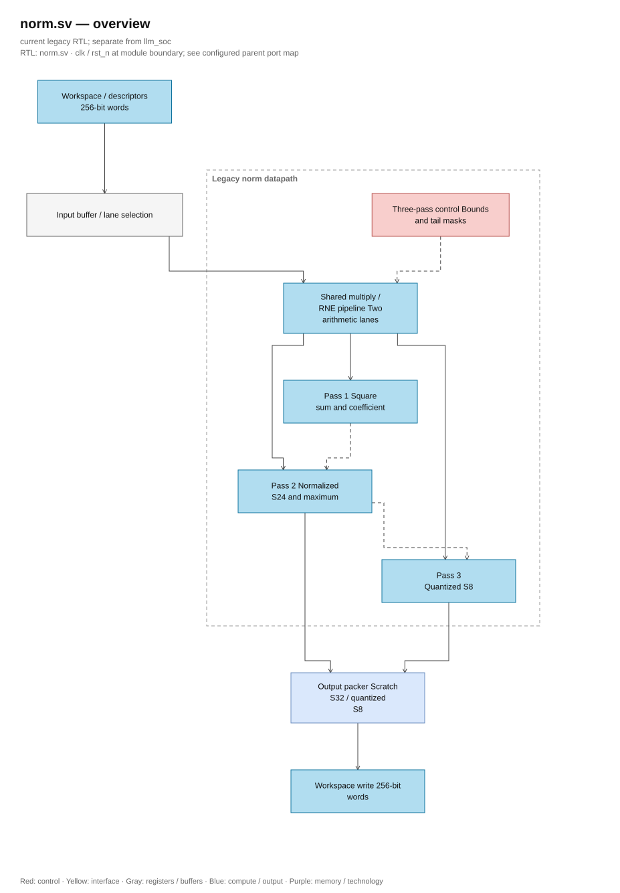
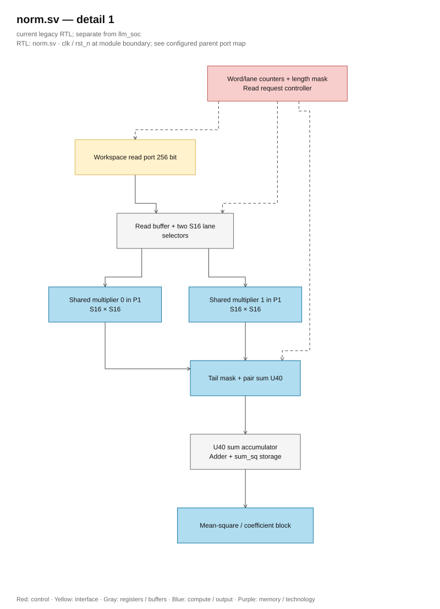
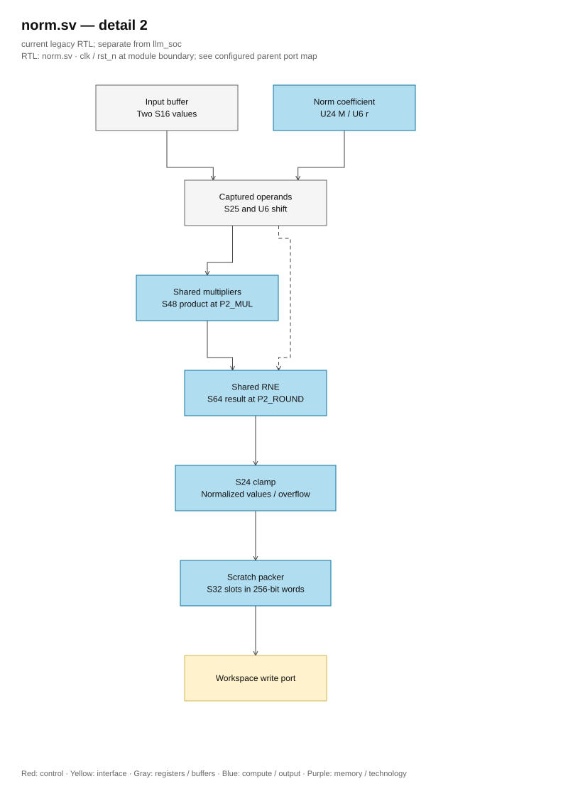
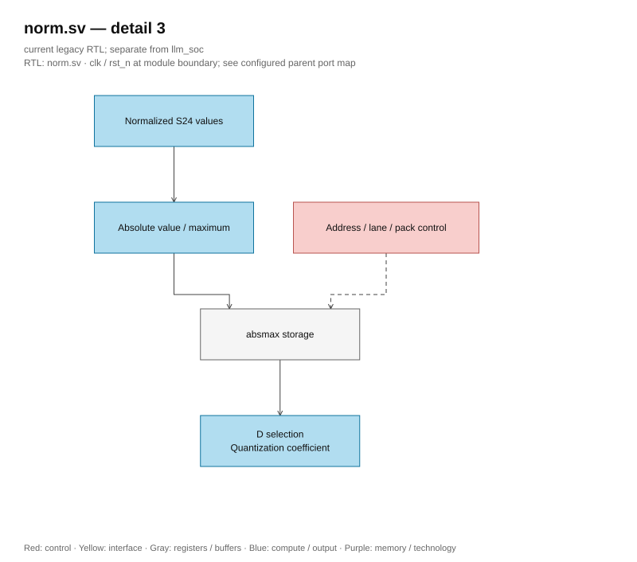
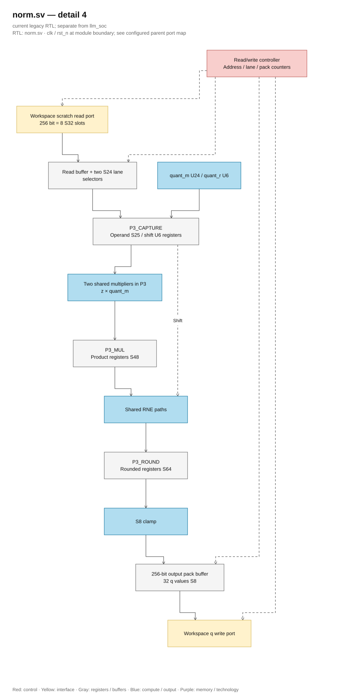

# norm.sv

<!-- reading-navigation:start -->
[Documentation](../../README.md) → [Archive · Legacy](../../archive/README.md) → [Module catalog](README.md)

| Reading guide | Document |
|---|---|
| New to the subject | [NPU and RTL fundamentals](../../00-start-here/fundamentals.md) · [Glossary](../../00-start-here/glossary.md) |
| Read first | [Legacy architecture](../../design/legacy/architecture.md) |
| Related implementation | [isqrt_u64.sv](isqrt_u64.sv.md) |
<!-- reading-navigation:end -->

> **Category: GUIDE. Scope: LEGACY.** RTL is authoritative; diagrams use the [shared visual style](../../diagrams/diagram_style.md).

**Source:** [norm.sv](<../../../Verilog%20Source%20code/norm.sv>).

## At a glance

| Item | Description |
|---|---|
| Responsibility | Legacy three-pass RMS normalization and quantization. Two shared structural multipliers, one divider and the separately defined isqrt_u64 serve the explicit pass controller. Workspace scratch and final quantized values are packed in 256-bit words. |

## Architecture diagram

[Editable draw.io — norm.sv — overview](../../diagrams/architecture.drawio) · Page `41_norm.sv_1`.

## Main flow

### Datapath detail 1

[Editable draw.io — norm.sv — detail 1](../../diagrams/architecture.drawio) · Page `42_norm.sv_2`.

### Datapath detail 2

[Editable draw.io — norm.sv — detail 2](../../diagrams/architecture.drawio) · Page `43_norm.sv_3`.

[Editable draw.io — norm.sv — detail 3](../../diagrams/architecture.drawio) · Page `44_norm.sv_4`.

### Datapath detail 3

[Editable draw.io — norm.sv — detail 4](../../diagrams/architecture.drawio) · Page `45_norm.sv_5`.
