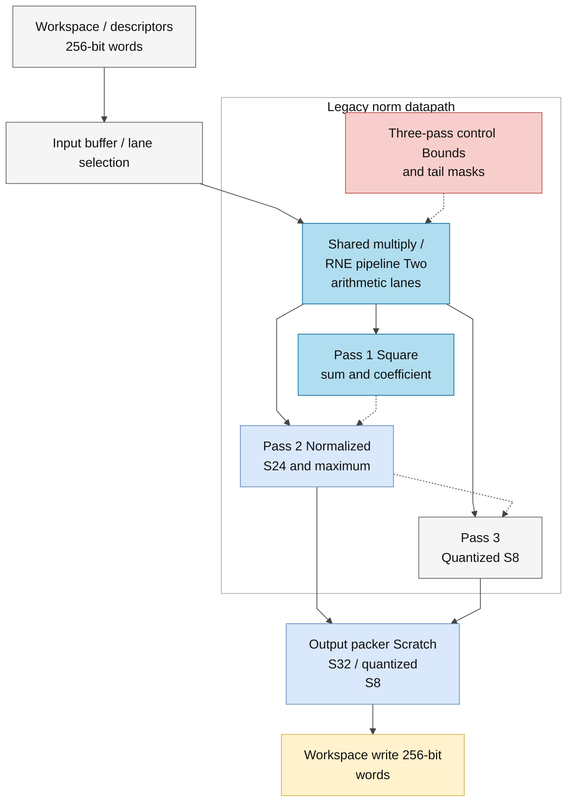
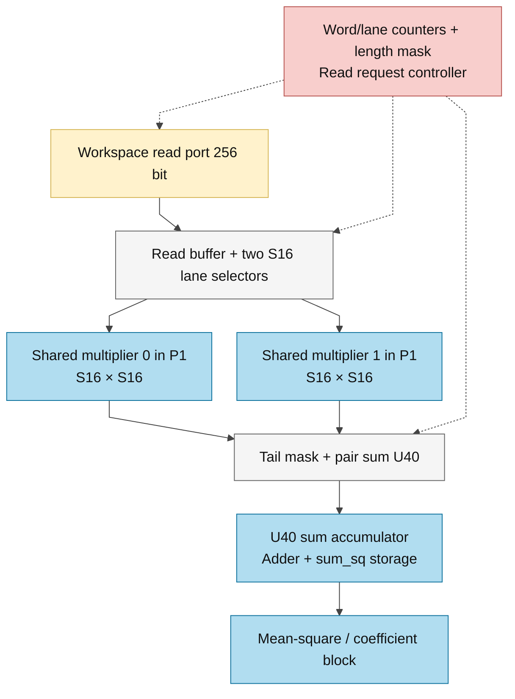
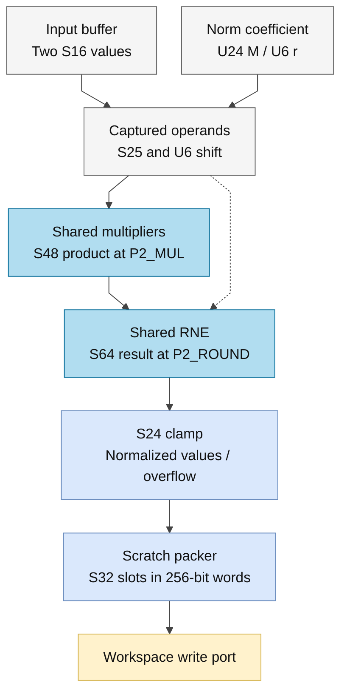
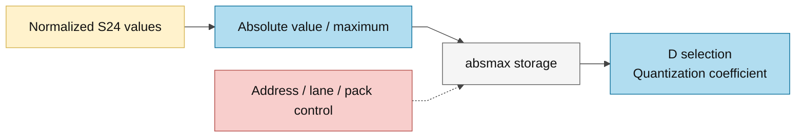
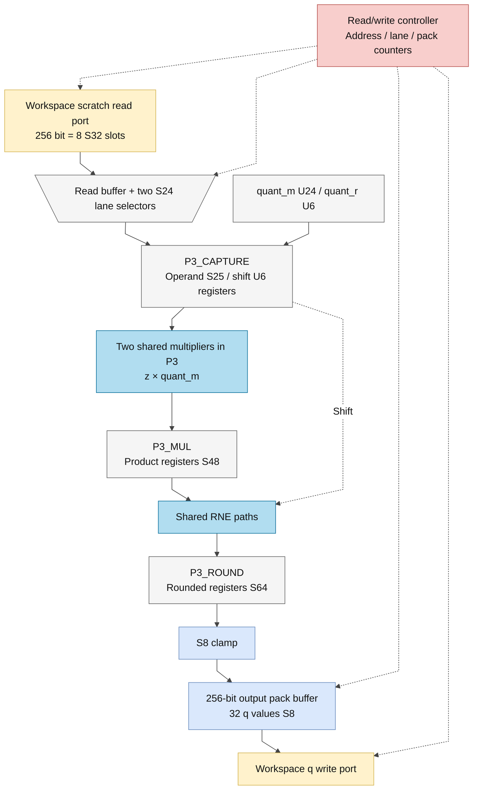

# norm.sv

> **Category: GUIDE. Scope: LEGACY.** RTL is authoritative; diagrams use the [shared visual style](../../diagrams/diagram_style.md).
[Documentation](../../README.md) → [Source guide](../full_graph.md) → [RTL index](README.md)

**Source:** [norm.sv](<../../../Verilog%20Source%20code/norm.sv>).

## At a glance

| Item | Description |
|---|---|
| Responsibility | Legacy three-pass RMS normalization and quantization. Two shared structural multipliers, one divider and the separately defined isqrt_u64 serve the explicit pass controller. Workspace scratch and final quantized values are packed in 256-bit words. |

## Sơ đồ kiến trúc

## Main flow

### Datapath detail 1

### Datapath detail 2

### Datapath detail 3

