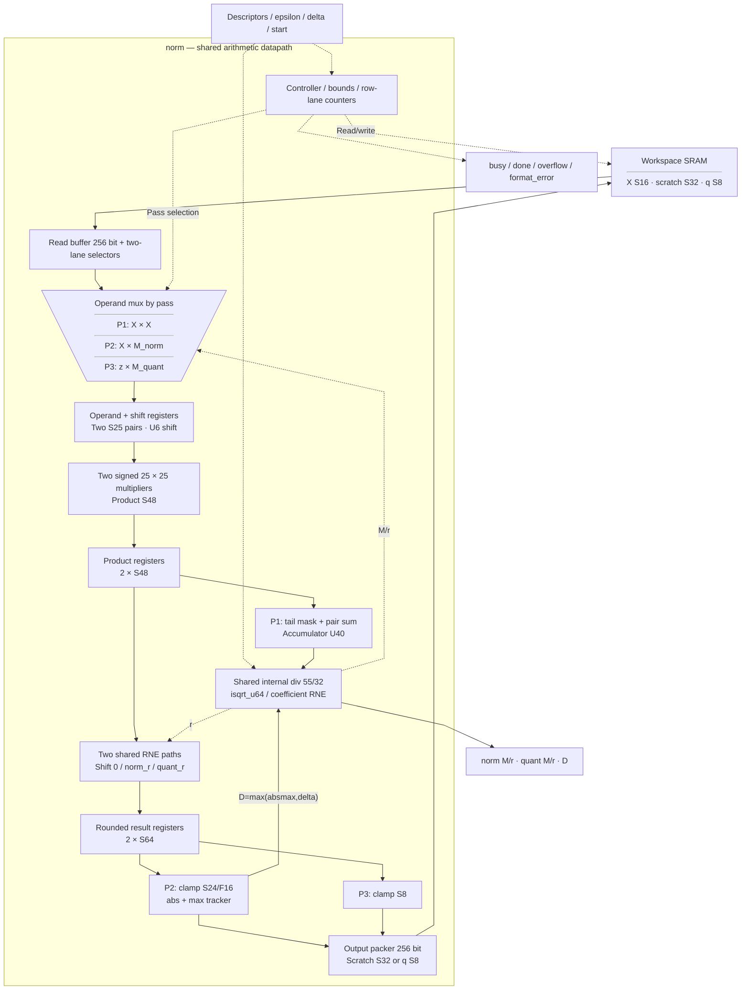
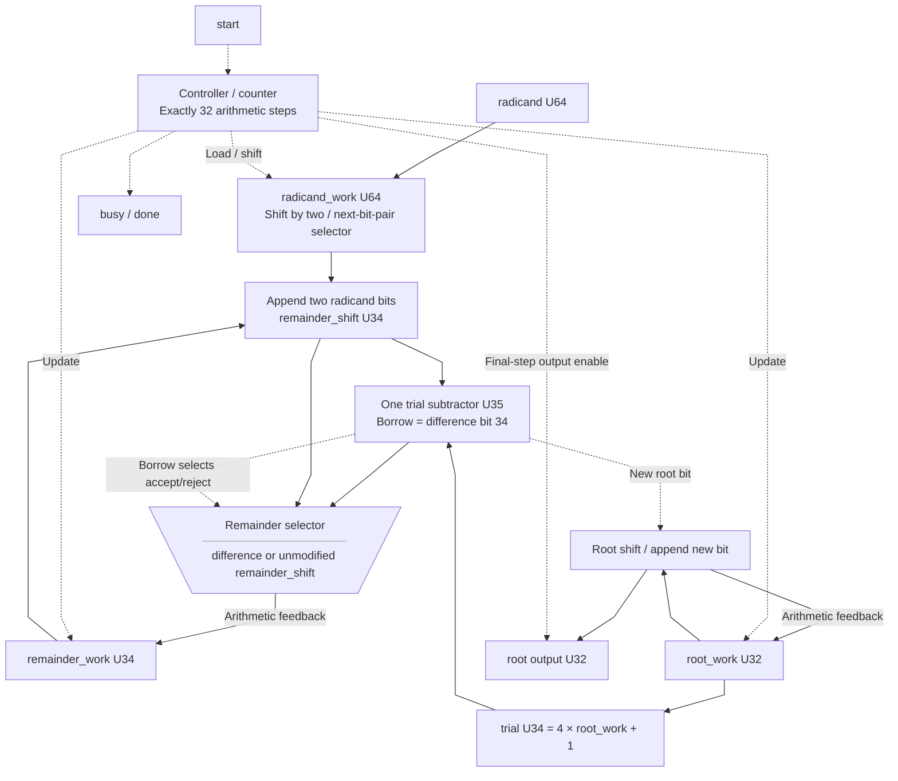
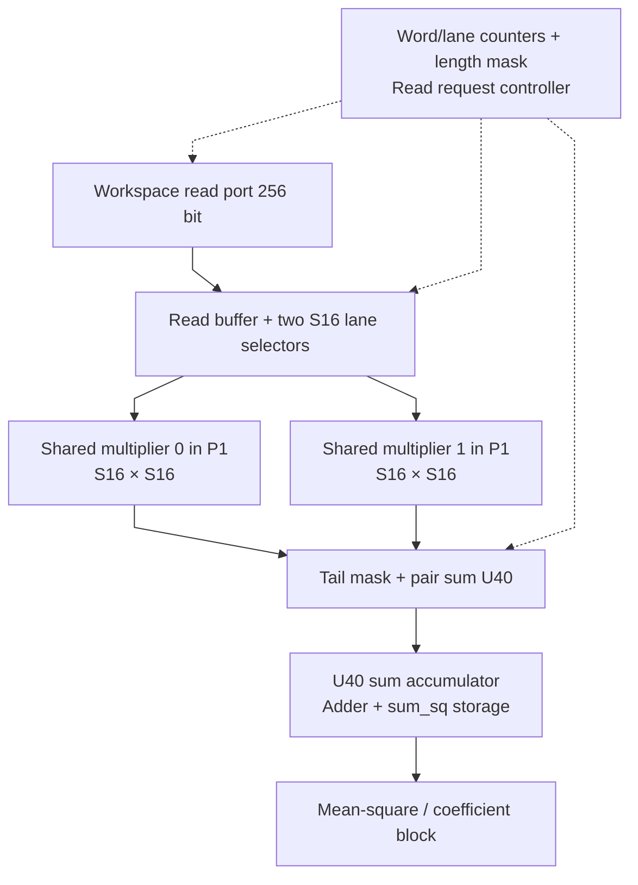
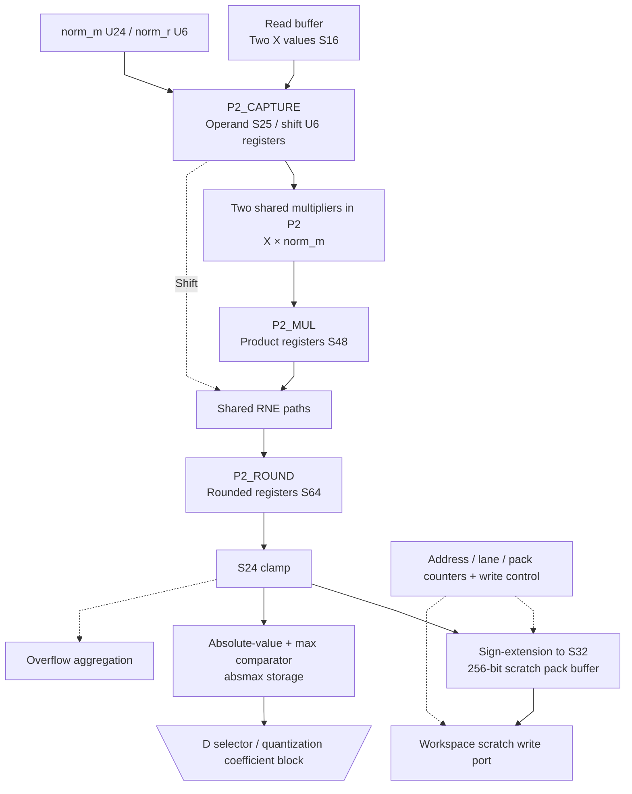
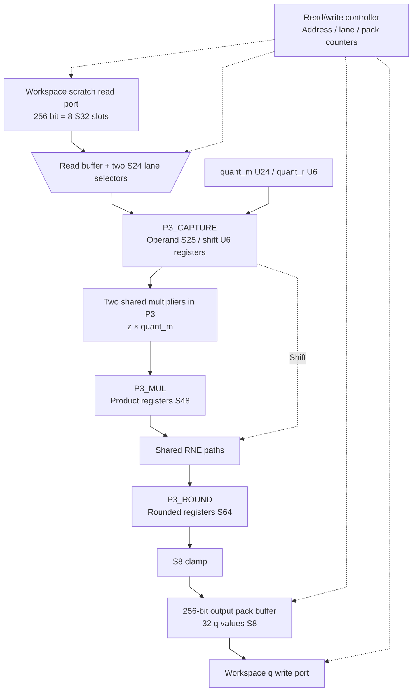

# norm.sv — RMSNorm toàn vector và QUANT

[Tài liệu](../../README.md) → [Hierarchy RTL](../README.md) → [Mục lục từng file](README.md)

**Trạng thái:** Đang dùng — chứa norm và isqrt_u64.

**Source:** [norm.sv](<../../../Verilog%20Source%20code/norm.sv>). **Số dòng:** 617. **SHA-256:** `045a18b3d7152a114705cf85f87396eb1d080193dbb867b6791f37e278f17f36`.

## Khối này làm gì?

File có hai module. `isqrt_u64` tính căn nguyên của một số U64. `norm` sử dụng căn này, một divider tuần tự và ba lượt đọc/tính để biến vector S16 thành q S8. Các hệ số M/r là số nguyên mô tả scale; không có floating-point.

RMSNorm trong module legacy `norm` không có affine gamma/beta; affine RMSNorm của graph mới được điều phối bởi [llm_soc](llm_soc.sv.md), dùng chung `isqrt_u64` từ file này. Epsilon legacy đã được host quy đổi sang raw mean-square với 32 fractional bit. Scratch z là S24/F16, đặt trong ô S32; output q dùng scale D/(0x7F×0x1_0000).

Source hiện tại chốt các bước operand, multiply và RNE; chọn quant shift theo threshold chính xác, giữ nguyên rounding/saturation và kiểm tra metadata. Regression `All` sau SRAM tiling PASS, gồm 4301 sqrt cases, 37189 scalar RNE checks và 900 coefficient cases. Đây là bằng chứng chức năng; timing của top đầy đủ được đánh giá riêng.

## Sơ đồ kiến trúc tổng quan



MUX dùng hình thang rộng ở phía nhiều ngõ vào và thu hẹp về ngõ ra; decoder/demux dùng hình thang ngược lại, mở rộng về phía nhiều ngõ ra. Hình chữ nhật có các vạch ngang biểu diễn bộ nhớ hoặc bank descriptor. Các hình chữ nhật thường là datapath, thanh ghi đơn hoặc giao diện. Nét liền là đường dữ liệu, nét đứt là điều khiển/cấu hình. Mũi tên hồi tiếp biểu diễn kết nối phần cứng. Sơ đồ không biểu diễn thứ tự chu kỳ, trạng thái FSM hoặc các tầng pipeline CPU.

## Cách hoạt động chi tiết

Lượt 1: tính S=Σx², chia cho K với phần lẻ 32 bit, cộng epsilon rồi lấy căn R. Tính M_norm/r_norm xấp xỉ 2^32/R. Lượt 2: đọc X lần nữa, tạo z và maxabs. Tính D=max(maxabs,delta), M_quant/r_quant xấp xỉ 127/D. Lượt 3: đọc scratch z, quantize, pack q và ghi workspace.

Scratch không được overlap X hoặc q. q có thể dùng lại vùng X vì lúc ghi q, X đã được tiêu thụ hết. Tail ngoài K không tham gia phép tính. Nếu z vượt S24 thì overflow được báo; top dừng chuỗi sau NORM đó.

1. P1 đọc từng word S16 và xử lý hai phần tử mỗi bước. Hai bình phương S32 được cộng vào `sum_sq` U40; lane padding ngoài K bị bỏ qua.
2. Hai phép chia tạo mean-square có 32 bit phần lẻ. Sau khi cộng epsilon đã quy đổi, `isqrt_u64` tạo RMS raw nhân 2^16.
3. Hệ số norm M/r xấp xỉ `2^32/R`. Input toàn zero dùng M bằng 0 để tránh chia zero.
4. P2 đọc X lần hai, tạo z S24/F16, ghi scratch S32 và tìm `absmax` của toàn vector.
5. D bằng max(absmax, delta). Divider tạo hệ số QUANT xấp xỉ 0x7F/D; D trở thành metadata scale của q.
6. P3 đọc scratch, lượng tử hóa z về S8 và pack 32 phần tử/word. Scratch không được overlap X hay q; q được phép trùng X vì X đã đọc xong.

**Tối ưu timing 01/10.** Ba lượt P1/P2/P3 tiếp tục dùng chung hai multiplier với operand S25 và hai đường RNE. S16/S24 được sign-extend; M U24 thêm bit zero trước cast signed. S24×U24 vừa S48, P1 chỉ lấy 32 bit bình phương. Chốt operand, product và rounded result để tách mux đọc khỏi multiply/RNE/absmax. P1 dùng CAPTURE → MUL → PROC; P2/P3 dùng CAPTURE → MUL → ROUND → PROC. Tổng overhead so với bản trước là **8 × ceil(K/2) clock/NORM**; clamp, scratch packing và tail giữ nguyên.

CNORM_PREP/CQUANT_PREP chốt `norm_r`, `quant_r` và `quant_d`; DIV_START và RNE hệ số QUANT dùng lại các register này thay vì tính lại chooser/max ở input divider. Không thêm state hoặc chu kỳ và không thay công thức hệ số.

Payload mới gồm 330 bit operand/product/rounded/shift không async reset. FSM và rst_n gate mỗi enable; reset không thể consume payload chưa ghi, start mới đi qua capture trước khi dùng. [Timing report](../../verification/timing/README.md) và [model demo](../../demos/README.md) ghi số liệu của snapshot được kiểm tra.

**Quy ước RTL.** `isqrt_u64` dùng radicand U64, root U32, remainder/trial U34 và phép trừ U35 có borrow, xử lý hai bit radicand mỗi bước trong 32 bước. Divider NORM dùng tử U55/mẫu U32 trong 55 bước; giới hạn r_norm≤22 làm tử norm cao nhất ở bit 54, các tử mean-square/phần lẻ/QUANT cũng vừa U55. Index 11 bit, shift hệ số 6 bit, lane 4 bit và pack count 6 bit giữ độ rộng rõ ràng. Ba lượt NORM, RNE và scale output không đổi.

## Các nhóm logic trong source

Source được chia theo chức năng. Mỗi nhóm giữ nguyên phạm vi dòng để đối chiếu, nhưng phần giải thích tập trung vào quan hệ giữa các câu lệnh thay vì lặp lại từng dấu ngoặc, khai báo hoặc phép gán.


### [Dòng 1–60: Căn nguyên tuần tự](<../../../Verilog%20Source%20code/norm.sv#L1>)

<!-- source-range:1:60 -->
```systemverilog
module isqrt_u64 (
    input logic clk,
    input logic rst_n,
    input logic start,
    input logic [63:0] radicand,
    output logic busy,
    output logic done,
    output logic [31:0] root
);
    logic [63:0] radicand_work;
    logic [31:0] root_work, root_next;
    logic [33:0] remainder_work, remainder_next, remainder_shift, trial;
    logic [34:0] difference;
    logic [5:0] count;
    always_comb begin
        // Before iteration 32, root_work < 2^31 and remainder_work <=
        // 2*root_work. Two new radicand bits therefore fit in U34.
        remainder_shift = {remainder_work[31:0], radicand_work[63:62]};
        trial = {root_work, 2'b01}; // 4*root_work + 1
        difference = {1'b0, remainder_shift} - {1'b0, trial};
        // The extra subtraction bit is the borrow flag; share one subtractor
        // for the trial comparison and accepted remainder update.
        root_next = {root_work[30:0], 1'b0};
        remainder_next = remainder_shift;
        if (!difference[34]) begin
            root_next[0] = 1'b1;
            remainder_next = difference[33:0];
        end
    end
    always_ff @(posedge clk or negedge rst_n) begin
        if (!rst_n) begin
            busy <= 0;
            done <= 0;
            root <= '0;
            radicand_work <= '0;
            root_work <= '0;
            remainder_work <= '0;
            count <= '0;
        end else begin
            done <= 1'b0;
            if (start && !busy) begin
                radicand_work <= radicand;
                root_work <= '0;
                remainder_work <= '0;
                count <= 6'd32;
                busy <= 1'b1;
            end else if (busy) begin
                radicand_work <= radicand_work << 2;
                root_work <= root_next;
                remainder_work <= remainder_next;
                count <= count - 1'b1;
                if (count == 1) begin
                    busy <= 1'b0;
                    done <= 1'b1;
                    root <= root_next;
                end
            end
        end
    end
endmodule
```

**Mục đích.** Thuật toán digit-by-digit nhận hai bit radicand mỗi bước. Dịch remainder và tạo trial=4×root_work+1; một phép trừ U35 vừa cho borrow để quyết định bit root mới vừa cho remainder khi trial được nhận. Sau 32 bước trả floor(sqrt(radicand)).

**Cách phần code hoạt động.** Có logic tuần tự: register/FSM chỉ cập nhật tại cạnh clock; nonblocking assignment đọc giá trị cũ ở vế phải rồi chốt đồng thời.

**Tín hiệu và dữ liệu chính.** `radicand_work`: U64 lưu các cặp bit còn lại; `root_work/root_next`: U32 xây căn nguyên; `remainder_work/remainder_shift/trial`: U34; `difference`: U35 có borrow ở bit 34; `count`: U6 đếm 32 bước; `root`: kết quả U32 chỉ có hiệu lực khi done.

**Điểm cần đọc kỹ.** Trước bước cuối, root_work<2^31 và remainder_work≤2×root_work nên 32 bit thấp của remainder cùng hai bit radicand mới vừa U34. trial là U34; difference thêm một bit để phát hiện borrow, tránh tạo comparator rộng riêng. Root được chốt từ root_next của bước cuối, không lấy giá trị register cũ.

#### Sơ đồ khối phần cứng của nhóm




### [Dòng 61–110: Giao diện và state NORM](<../../../Verilog%20Source%20code/norm.sv#L61>)

<!-- source-range:61:110 -->
```systemverilog

// Full-vector integer RMSNorm + activation quantization.
// X: S16 with per-tensor scale. z scratch: S24/F16 stored sign-extended in S32 slots.
// q: S8, RNE and clamp [-128,127]. K is 1..512.
module norm (
    input logic clk,
    input logic rst_n,
    input logic start,
    input logic [7:0] x_base,
    input logic [7:0] z_base,
    input logic [7:0] q_base,
    input logic [9:0] k_len,
    input logic [63:0] epsilon_raw32,
    input logic [23:0] delta_raw,

    output logic ws_rd_en,
    output logic [7:0] ws_rd_addr,
    input logic [255:0] ws_rd_data,
    input logic ws_rd_valid,
    output logic ws_wr_en,
    output logic [7:0] ws_wr_addr,
    output logic [255:0] ws_wr_data,

    output logic busy,
    output logic done,
    output logic overflow,
    output logic format_error,
    output logic [23:0] quant_d,
    output logic [23:0] norm_m,
    output logic [5:0] norm_r,
    output logic [23:0] quant_m,
    output logic [5:0] quant_r
);
    import npu_pkg::*;

    typedef enum logic [5:0] {
    IDLE,
    P1_REQ, P1_WAIT, P1_CAPTURE, P1_MUL, P1_PROC,
    DIV_MEAN_START, DIV_MEAN_WAIT,
    DIV_FRAC_START, DIV_FRAC_WAIT,
    SQRT_START, SQRT_WAIT,
    CNORM_PREP, CNORM_DIV_START, CNORM_DIV_WAIT,
    P2_REQ, P2_WAIT, P2_CAPTURE, P2_MUL, P2_ROUND, P2_PROC, P2_WRITE,
    CQUANT_PREP, CQUANT_DIV_START, CQUANT_DIV_WAIT,
    P3_REQ, P3_WAIT, P3_CAPTURE, P3_MUL, P3_ROUND, P3_PROC, P3_WRITE,
    FINISH
    } state_t;
    state_t state;

    logic [7:0] input_base_q, scratch_base_q, output_base_q;
```

**Mục đích.** Tách state request/wait/process/write để không dùng dữ liệu SRAM trước valid.

**Cách phần code hoạt động.** Nhóm này định nghĩa giao diện, độ rộng, kiểu hoặc tín hiệu trung gian. Nó tạo cấu trúc để các nhóm xử lý sau sử dụng, chưa tự biểu diễn một bước runtime riêng.

**Tín hiệu và dữ liệu chính.** `start`: yêu cầu bắt đầu giao dịch; `x_base`: base input S16; `z_base`: base scratch z; `q_base`: base SRAM mà cache q mô tả; `k_len`: độ dài dot product; `epsilon_raw32`: epsilon theo đơn vị raw-square có 32 fractional bit; và 18 tín hiệu phụ khác trong đoạn code.


### [Dòng 111–159: Thanh ghi và scalar unit](<../../../Verilog%20Source%20code/norm.sv#L111>)

<!-- source-range:111:159 -->
```systemverilog
    logic [9:0] vector_length_q;
    logic [63:0] epsilon_q;
    logic [23:0] delta_q;
    logic [7:0] word_index;
    logic [3:0] lane;
    logic [255:0] read_buf;
    logic [39:0] sum_sq;
    logic [63:0] mean_q, mean_rem;
    logic [63:0] v_raw;
    logic [64:0] mean_with_epsilon;
    logic [31:0] rms_r;
    logic [23:0] absmax;
    logic [255:0] pack_buf;
    logic [5:0] pack_count;
    logic [7:0] write_word;

    // Shared numerator width: sum_sq uses 40 bits; mean remainder shifted
    // by 32 uses at most 41; quant numerator uses at most 48; norm numerator
    // is 2^(32+r), with r <= 22 for a U32 RMS, so bit 54 is the maximum.
    localparam int DIV_NUM_W = 55;
    logic div_start, div_busy, div_done, div_zero;
    logic [DIV_NUM_W - 1:0] div_num, div_q;
    logic [31:0] div_den, div_rem;
    div #(.NUM_W(DIV_NUM_W),
        .DEN_W(32)) u_div(
        .clk(clk),
        .rst_n(rst_n),
        .start(div_start),
        .numerator(div_num),
        .denominator(div_den),
        .busy(div_busy),
        .done(div_done),
        .div_zero(div_zero),
        .quotient(div_q),
        .remainder(div_rem)
    );

    logic sqrt_start, sqrt_busy, sqrt_done;
    logic [31:0] sqrt_root;
    isqrt_u64 u_sqrt(.clk(clk),
        .rst_n(rst_n),
        .start(sqrt_start),
        .radicand(v_raw),
        .busy(sqrt_busy),
        .done(sqrt_done),
        .root(sqrt_root));

    logic signed [15:0] x0, x1;
    logic signed [31:0] x0_sq, x1_sq;
```

**Mục đích.** sum_sq U40; v_raw U64; hệ số U24/U6; pack buffer 256 bit. Divider 55/32 và square-root U64→U32 là hai instance nội bộ. Tử norm tối đa 2^54, mean remainder<<32 tối đa 41 bit, tử QUANT tối đa 48 bit nên U55 đủ cho cả bốn loại phép chia.

**Cách phần code hoạt động.** Có instance module con; named-port ở nhóm này xác định chính xác đường control/data giữa hai cấp hierarchy.

**Tín hiệu và dữ liệu chính.** `input_base_q`: base input X đã chốt; `scratch_base_q`: base scratch z đã chốt; `output_base_q`: base q đã chốt; `vector_length_q`: K đã chốt; `epsilon_q`: epsilon đã chốt; `delta_q`: delta đã chốt; và 32 tín hiệu phụ khác trong đoạn code.


### [Dòng 160–250: Datapath nhân/RNE dùng chung](<../../../Verilog%20Source%20code/norm.sv#L160>)

<!-- source-range:160:250 -->
```systemverilog
    logic [39:0] pair_sq;
    logic [10:0] idx0, idx1;
    logic signed [23:0] zr0, zr1;
    logic signed [24:0] multiply_a [0:1], multiply_b [0:1];
    logic signed [24:0] multiply_a_q [0:1], multiply_b_q [0:1];
    wire signed [47:0] arithmetic_product [0:1];
    genvar arithmetic_lane;
    generate
    for (arithmetic_lane = 0; arithmetic_lane < 2; arithmetic_lane = arithmetic_lane + 1) begin : g_bit_mul
        logic_mul #(.A_W(25), .B_W(25), .OUT_W(48), .SIGNED_A(1), .SIGNED_B(1)) u_mul
            (.a(multiply_a_q[arithmetic_lane]), .b(multiply_b_q[arithmetic_lane]), .product(arithmetic_product[arithmetic_lane]));
    end
    endgenerate
    logic signed [47:0] arithmetic_product_q [0:1];
    logic signed [63:0] arithmetic_rounded [0:1];
    logic signed [63:0] arithmetic_rounded_q [0:1];
    logic [5:0] arithmetic_shift, arithmetic_shift_q;
    always_comb begin
        x0 = read_buf[(int'(lane) << 4) +: 16];
        x1 = read_buf[((int'(lane) + 1) << 4) +: 16];
        zr0 = read_buf[(int'(lane) << 5) +: 24];
        zr1 = read_buf[((int'(lane) + 1) << 5) +: 24];
        // The three passes share two multipliers and two RNE paths. Register
        // the read mux outputs, products and rounded values separately so a
        // lane selection cannot feed multiply, RNE and absmax in one cycle.
        multiply_a[0] = '0;
        multiply_a[1] = '0;
        multiply_b[0] = '0;
        multiply_b[1] = '0;
        arithmetic_shift = '0;
        case (state)
            P1_CAPTURE : begin
                multiply_a[0] = {{9{x0[15]}}, x0};
                multiply_a[1] = {{9{x1[15]}}, x1};
                multiply_b[0] = multiply_a[0];
                multiply_b[1] = multiply_a[1];
            end
            P2_CAPTURE : begin
                multiply_a[0] = {{9{x0[15]}}, x0};
                multiply_a[1] = {{9{x1[15]}}, x1};
                multiply_b[0] = $signed({1'b0, norm_m});
                multiply_b[1] = $signed({1'b0, norm_m});
                arithmetic_shift = norm_r;
            end
            P3_CAPTURE : begin
                multiply_a[0] = {zr0[23], zr0};
                multiply_a[1] = {zr1[23], zr1};
                multiply_b[0] = $signed({1'b0, quant_m});
                multiply_b[1] = $signed({1'b0, quant_m});
                arithmetic_shift = quant_r;
            end
            default : ;
        endcase
        for (integer j = 0; j < 2; j = j + 1) begin
            // S24 * U24 fits S48; the extra operand bit preserves U24's sign.

            arithmetic_rounded[j] = rne_shift64(
                {{16{arithmetic_product_q[j][47]}}, arithmetic_product_q[j]}, arithmetic_shift_q);
        end
        x0_sq = arithmetic_product_q[0][31:0];
        x1_sq = arithmetic_product_q[1][31:0];
        idx0 = 11'({word_index, 4'b0} + lane);
        idx1 = idx0 + 1'b1;
        pair_sq = 0;
        if (idx0 < vector_length_q) pair_sq = pair_sq + $unsigned(x0_sq);
        if (idx1 < vector_length_q) pair_sq = pair_sq + $unsigned(x1_sq);
    end

    // Payload registers need no reset: the reset state cannot consume them,
    // and every pass captures fresh operands before multiplying/rounding.
    // Keeping the payload on plain clocked flops permits ordinary multiplier
    // register packing in synthesis without any vendor-specific attributes.
    always_ff @(posedge clk) begin
        if (rst_n && (state == P1_CAPTURE || state == P2_CAPTURE || state == P3_CAPTURE)) begin
            for (integer j = 0; j < 2; j = j + 1) begin
                multiply_a_q[j] <= multiply_a[j];
                multiply_b_q[j] <= multiply_b[j];
            end
            arithmetic_shift_q <= arithmetic_shift;
        end
        if (rst_n && (state == P1_MUL || state == P2_MUL || state == P3_MUL)) begin
            for (integer j = 0; j < 2; j = j + 1)
                arithmetic_product_q[j] <= arithmetic_product[j];
        end
        if (rst_n && (state == P2_ROUND || state == P3_ROUND)) begin
            for (integer j = 0; j < 2; j = j + 1)
                arithmetic_rounded_q[j] <= arithmetic_rounded[j];
        end
    end

    // Parallel leading-bit masks and constant comparisons expose shift selection.
```

**Mục đích.** Chọn hai cặp operand tại CAPTURE, chốt operand S25/shift U6, tích S48 tại MUL và kết quả S64 tại ROUND. P1 consume tích đã chốt; P2/P3 consume rounded result đã chốt. Hai multiplier/RNE dùng chung giữa các pass.

**Cách phần code hoạt động.** Phần tổ hợp chọn operand theo pass và tính từ register của pha trước; block clocked có enable theo CAPTURE/MUL/ROUND để chốt payload. Tail ngoài K bị loại khỏi pair_sq. Không reset payload; reset state không có đường consume dữ liệu cũ.

**Tín hiệu và dữ liệu chính.** `multiply_a_q/multiply_b_q`: operand đã chốt; `arithmetic_product_q`: hai tích S48; `arithmetic_rounded_q`: hai giá trị RNE S64; `arithmetic_shift_q`: shift của batch; `pair_sq`: tổng hai bình phương hữu ích.


### [Dòng 251–275: Chọn shift hệ số](<../../../Verilog%20Source%20code/norm.sv#L251>)

<!-- source-range:251:275 -->
```systemverilog
    wire [23:0] quant_den = (absmax > delta_q) ? absmax : delta_q;
    wire [5:0] norm_encode [0:32], quant_encode [0:24];
    wire [5:0] norm_r_sel = norm_encode[32];
    wire [5:0] quant_r_sel = quant_encode[24];
    genvar norm_bit, quant_bit;
    generate
    for (norm_bit = 0; norm_bit < 32; norm_bit = norm_bit + 1) begin : g_norm_shift
        wire leading = rms_r[norm_bit] && ((rms_r >> (norm_bit + 1)) == 0);
        assign norm_encode[norm_bit + 1] = norm_encode[norm_bit] |
            (6'(norm_bit > 9 ? norm_bit - 9 : 0) & {6{leading}});
    end
    for (quant_bit = 0; quant_bit < 24; quant_bit = quant_bit + 1) begin : g_quant_shift
        wire leading = quant_den[quant_bit] && ((quant_den >> (quant_bit + 1)) == 0);
        wire boost;
        if (quant_bit >= 7) assign boost = quant_den > (24'd127 << (quant_bit - 6));
        else assign boost = 0;
        assign quant_encode[quant_bit + 1] = quant_encode[quant_bit] |
            ((6'(quant_bit + 17) + {5'h0, boost}) & {6{leading}});
    end
    endgenerate
    assign norm_encode[0] = 0;
    assign quant_encode[0] = 0;
    logic [DIV_NUM_W - 1:0] norm_num, quant_num;
    always_comb begin
        mean_with_epsilon = ({1'b0, mean_q} << 32) + {10'h000, div_q} + {1'b0, epsilon_q};
```

**Mục đích.** Ưu tiên r lớn để giữ precision trong U24. Root U32 làm norm_r≤22 và norm_num≤2^54; lựa chọn QUANT giữ tử 0x7F<<r trong tối đa 48 bit. Hai miền này vừa divider chung U55.

**Cách phần code hoạt động.** Có function tổ hợp dùng lại tại nơi gọi; function không giữ trạng thái qua các chu kỳ.

**Tín hiệu và dữ liệu chính.** `den`: denominator của hàm chọn shift; `msb`: vị trí bit 1 cao nhất của denominator; `limit`: giới hạn den×M_max; `num`: tử số 127<<r đang thử; `found`: đã tìm shift hợp lệ đầu tiên khi quét từ lớn xuống.


### [Dòng 276–286: Chuẩn bị tử số và epsilon](<../../../Verilog%20Source%20code/norm.sv#L276>)

<!-- source-range:276:286 -->
```systemverilog
        // PREP registers the chosen shift before DIV_START consumes it.
        // Reuse that value so coefficient selection is not on divider inputs.
        norm_num = 55'h1 << (32 + norm_r);
        quant_num = 55'h7f << quant_r;
    end

    logic signed [63:0] z_round0, z_round1;
    logic signed [23:0] z0, z1;
    logic [23:0] absz0, absz1;
    always_comb begin
        z_round0 = arithmetic_rounded_q[0];
```

**Mục đích.** Ghép mean-square/epsilon bằng U65; tạo tử số từ norm_r/quant_r đã chốt ở PREP. Chooser chỉ tạo giá trị mới cho PREP, không nối tiếp vào input divider ở DIV_START.

**Cách phần code hoạt động.** Có logic tổ hợp: output/intermediate được tính từ input hiện tại; các giá trị mặc định đầu khối giúp tránh suy ra latch.

**Tín hiệu và dữ liệu chính.** `norm_r_sel`: shift norm được logic lựa chọn; `quant_r_sel`: shift QUANT được logic lựa chọn; `norm_num`: tử số từ norm_r đã chốt; `quant_num`: tử số từ quant_r đã chốt; `mean_with_epsilon`: tổng U65 để kiểm tra overflow mean-square + epsilon; `mean_q`: phần nguyên của S/K; và 5 tín hiệu phụ khác trong đoạn code.


### [Dòng 287–303: Đường tạo z](<../../../Verilog%20Source%20code/norm.sv#L287>)

<!-- source-range:287:303 -->
```systemverilog
        z_round1 = arithmetic_rounded_q[1];
        if (z_round0 > 64'sh0000_0000_007f_ffff) z0 = 24'sh7f_ffff;
        else if (z_round0 < - 64'sh0000_0000_0080_0000) z0 = 24'sh80_0000;
        else z0 = z_round0[23:0];
        if (z_round1 > 64'sh0000_0000_007f_ffff) z1 = 24'sh7f_ffff;
        else if (z_round1 < - 64'sh0000_0000_0080_0000) z1 = 24'sh80_0000;
        else z1 = z_round1[23:0];
        absz0 = z0[23] ? $unsigned( - $signed(z0)) : z0;
        absz1 = z1[23] ? $unsigned( - $signed(z1)) : z1;
    end

    logic signed [63:0] qround0, qround1;
    logic signed [7:0] q0, q1;
    always_comb begin
        qround0 = arithmetic_rounded_q[0];
        qround1 = arithmetic_rounded_q[1];
        if (qround0 > 64'sh0000_0000_0000_007f) q0 = 8'sh7f;
```

**Mục đích.** Lấy kết quả RNE từ datapath chung trong P2, clamp S24 và tính trị tuyệt đối để tìm maxabs.

**Cách phần code hoạt động.** Có logic tổ hợp: output/intermediate được tính từ input hiện tại; các giá trị mặc định đầu khối giúp tránh suy ra latch.

**Tín hiệu và dữ liệu chính.** `arithmetic_rounded_q[0:1]`: kết quả RNE hai lane đã chốt; `z_round0/z_round1`: input clamp; `z0/z1`: S24 sau clamp; `absz0/absz1`: trị tuyệt đối dùng cập nhật absmax.


### [Dòng 304–317: Đường tạo q](<../../../Verilog%20Source%20code/norm.sv#L304>)

<!-- source-range:304:317 -->
```systemverilog
        else if (qround0 < - 64'sh0000_0000_0000_0080) q0 = 8'sh80;
        else q0 = qround0[7:0];
        if (qround1 > 64'sh0000_0000_0000_007f) q1 = 8'sh7f;
        else if (qround1 < - 64'sh0000_0000_0000_0080) q1 = 8'sh80;
        else q1 = qround1[7:0];
    end

    always_comb begin
        ws_rd_en = 1'b0;
        ws_rd_addr = '0;
        ws_wr_en = 1'b0;
        ws_wr_addr = '0;
        ws_wr_data = pack_buf;
        div_start = 1'b0;
```

**Mục đích.** Lấy kết quả RNE từ datapath chung trong P3 rồi clamp vào S8. Operand z lấy 24 bit thấp của mỗi ô scratch S32.

**Cách phần code hoạt động.** Có logic tổ hợp: output/intermediate được tính từ input hiện tại; các giá trị mặc định đầu khối giúp tránh suy ra latch.

**Tín hiệu và dữ liệu chính.** `zr0/zr1`: z lấy từ ô scratch S32 ở CAPTURE; `arithmetic_rounded_q[0:1]`: kết quả RNE đã chốt; `qround0/qround1`: input clamp; `q0/q1`: hai mã S8 ghi ở P3_PROC.


### [Dòng 318–376: Phát request](<../../../Verilog%20Source%20code/norm.sv#L318>)

<!-- source-range:318:376 -->
```systemverilog
        div_num = '0;
        div_den = '0;
        sqrt_start = 1'b0;
        case (state)
            P1_REQ : begin
                ws_rd_en = 1'b1;
                ws_rd_addr = input_base_q + word_index;
            end
            DIV_MEAN_START : begin
                div_start = 1'b1;
                div_num = {{15{1'b0}}, sum_sq};
                div_den = {22'h0, vector_length_q};
            end
            DIV_FRAC_START : begin
                div_start = 1'b1;
                div_num = DIV_NUM_W'(mean_rem) << 32;
                div_den = {22'h0, vector_length_q};
            end
            SQRT_START : sqrt_start = 1'b1;
            CNORM_DIV_START : begin
                div_start = 1'b1;
                div_num = norm_num;
                div_den = rms_r;
            end
            P2_REQ : begin
                ws_rd_en = 1'b1;
                ws_rd_addr = input_base_q + word_index;
            end
            P2_WRITE : begin
                ws_wr_en = 1'b1;
                ws_wr_addr = scratch_base_q + write_word;
                ws_wr_data = pack_buf;
            end
            CQUANT_DIV_START : begin
                div_start = 1'b1;
                div_num = quant_num;
                div_den = {8'h00, quant_d};
            end
            P3_REQ : begin
                ws_rd_en = 1'b1;
                ws_rd_addr = scratch_base_q + word_index;
            end
            P3_WRITE : begin
                ws_wr_en = 1'b1;
                ws_wr_addr = output_base_q + write_word;
                ws_wr_data = pack_buf;
            end
            default : ;
        endcase
    end

    always_ff @(posedge clk or negedge rst_n) begin
        if (!rst_n) begin
            state <= IDLE;
            busy <= 0;
            done <= 0;
            overflow <= 0;
            format_error <= 0;
            quant_d <= 0;
```

**Mục đích.** Control tổ hợp theo FSM: chọn vùng input/scratch/output, phát divider start hoặc sqrt start.

**Cách phần code hoạt động.** Có logic tổ hợp: output/intermediate được tính từ input hiện tại; các giá trị mặc định đầu khối giúp tránh suy ra latch.

**Tín hiệu và dữ liệu chính.** `ws_rd_en`: request đọc workspace; `ws_rd_addr`: địa chỉ đọc workspace; `ws_wr_en`: cho phép ghi workspace; `ws_wr_addr`: địa chỉ ghi workspace; `ws_wr_data`: word 256 ghi workspace; `pack_buf`: buffer pack output trước khi ghi SRAM; và 17 tín hiệu phụ khác trong đoạn code.


### [Dòng 377–409: Reset thanh ghi](<../../../Verilog%20Source%20code/norm.sv#L377>)

<!-- source-range:377:409 -->
```systemverilog
            input_base_q <= 0;
            scratch_base_q <= 0;
            output_base_q <= 0;
            vector_length_q <= 0;
            epsilon_q <= 0;
            delta_q <= 1;
            word_index <= 0;
            lane <= 0;
            read_buf <= 0;
            sum_sq <= 0;
            mean_q <= 0;
            mean_rem <= 0;
            v_raw <= 0;
            rms_r <= 0;
            absmax <= 0;
            pack_buf <= 0;
            pack_count <= 0;
            write_word <= 0;
            norm_m <= 0;
            norm_r <= 0;
            quant_m <= 0;
            quant_r <= 0;
        end else begin
            done <= 1'b0;
            case (state)
                IDLE : if (start) begin
                    busy <= 1;
                    overflow <= 0;
                    format_error <= 0;
                    quant_d <= 0;
                    norm_m <= 0;
                    norm_r <= 0;
                    quant_m <= 0;
```

**Mục đích.** Chỉ reset trạng thái và buffer trong khối. Nội dung workspace không được reset ở đây.

**Cách phần code hoạt động.** Có logic tuần tự: register/FSM chỉ cập nhật tại cạnh clock; nonblocking assignment đọc giá trị cũ ở vế phải rồi chốt đồng thời.

**Tín hiệu và dữ liệu chính.** `state`: trạng thái FSM của khối; `busy`: khối đang xử lý; `done`: xung báo hoàn tất; `overflow`: cờ kết quả vượt miền số; `format_error`: cờ format/metadata không hợp lệ; `quant_d`: D=max(absmax,delta); và 24 tín hiệu phụ khác trong đoạn code.


### [Dòng 410–438: Nhận lệnh và kiểm tra vùng](<../../../Verilog%20Source%20code/norm.sv#L410>)

<!-- source-range:410:438 -->
```systemverilog
                    quant_r <= 0;
                    input_base_q <= x_base;
                    scratch_base_q <= z_base;
                    output_base_q <= q_base;
                    vector_length_q <= k_len;
                    epsilon_q <= epsilon_raw32;
                    delta_q <= delta_raw;
                    word_index <= 0;
                    lane <= 0;
                    sum_sq <= 0;
                    state <= P1_REQ;
                    if (k_len == 0 || k_len > K_MAX || delta_raw == 0 ||
                        int'(x_base) + ((int'(k_len) + 15) >> 4) > 256 ||
                        int'(z_base) + ((int'(k_len) + 7) >> 3) > 256 ||
                        int'(q_base) + ((int'(k_len) + 31) >> 5) > 256 ||
                        ranges_overlap(int'(x_base), ((int'(k_len) + 15) >> 4), int'(z_base), ((int'(k_len) + 7) >> 3)) ||
                        ranges_overlap(int'(q_base), ((int'(k_len) + 31) >> 5), int'(z_base), ((int'(k_len) + 7) >> 3))) begin
                        format_error <= 1;
                        state <= FINISH;
                    end
                end
                P1_REQ : state <= P1_WAIT;
                P1_WAIT : if (ws_rd_valid) begin
                    read_buf <= ws_rd_data;
                    lane <= 0;
                    state <= P1_CAPTURE;
                end
                P1_CAPTURE : state <= P1_MUL;
                P1_MUL : state <= P1_PROC;
```

**Mục đích.** Chốt bases, K, epsilon, delta. Reject K sai, delta=0, vượt SRAM hoặc scratch overlap.

**Cách phần code hoạt động.** Các câu lệnh thuộc cùng một nhánh/pha xử lý và phải được đọc liền nhau; tách riêng từng dòng sẽ làm mất quan hệ điều kiện và dữ liệu.

**Tín hiệu và dữ liệu chính.** `start`: yêu cầu bắt đầu giao dịch; `busy`: khối đang xử lý; `overflow`: cờ kết quả vượt miền số; `format_error`: cờ format/metadata không hợp lệ; `quant_d`: D=max(absmax,delta); `norm_m`: multiplier U24 của RMSNorm; và 19 tín hiệu phụ khác trong đoạn code.


### [Dòng 439–459: Lượt 1](<../../../Verilog%20Source%20code/norm.sv#L439>)

<!-- source-range:439:459 -->
```systemverilog
                P1_PROC : begin
                    sum_sq <= sum_sq + pair_sq;
                    if (lane == 14 || idx1 >= vector_length_q - 1) begin
                        if (({word_index, 4'b0} + 16) >= vector_length_q) state <= DIV_MEAN_START;
                        else begin
                            word_index <= word_index + 1'b1;
                            state <= P1_REQ;
                        end
                    end else begin
                        lane <= lane + 4'd2;
                        state <= P1_CAPTURE;
                    end
                end
                DIV_MEAN_START : state <= DIV_MEAN_WAIT;
                DIV_MEAN_WAIT : if (div_done) begin
                    mean_q <= {{9{1'b0}}, div_q};
                    mean_rem <= div_rem;
                    state <= DIV_FRAC_START;
                end
                DIV_FRAC_START : state <= DIV_FRAC_WAIT;
                DIV_FRAC_WAIT : if (div_done) begin
```

**Mục đích.** Đọc input theo word, đi hai lane mỗi bước và cộng pair_sq cho đến hết K.

**Cách phần code hoạt động.** Các câu lệnh thuộc cùng một nhánh/pha xử lý và phải được đọc liền nhau; tách riêng từng dòng sẽ làm mất quan hệ điều kiện và dữ liệu.

**Tín hiệu và dữ liệu chính.** `state`: trạng thái FSM của khối; `ws_rd_valid`: workspace trả dữ liệu hợp lệ; `read_buf`: word SRAM đã nhận; `ws_rd_data`: word 256 trả từ workspace; `lane`: vị trí phần tử trong word; `sum_sq`: tổng bình phương U40; và 4 tín hiệu phụ khác trong đoạn code.

**Điểm cần đọc kỹ.** REQ và WAIT tách riêng để phù hợp read-valid của SRAM. P1_CAPTURE đọc read_buf đã chốt, P1_MUL ghi product register, P1_PROC chỉ consume product đã ghi; không dùng bus SRAM đang thay đổi.

#### Sơ đồ khối phần cứng của nhóm




### [Dòng 460–480: Mean-square và căn](<../../../Verilog%20Source%20code/norm.sv#L460>)

<!-- source-range:460:480 -->
```systemverilog
                    v_raw <= mean_with_epsilon[63:0];
                    state <= SQRT_START;
                    if (mean_with_epsilon[64]) begin
                        overflow <= 1;
                        format_error <= 1;
                        state <= FINISH;
                    end
                end
                SQRT_START : state <= SQRT_WAIT;
                SQRT_WAIT : if (sqrt_done) begin
                    rms_r <= sqrt_root;
                    state <= CNORM_PREP;
                end
                CNORM_PREP : begin
                    if (sum_sq == 0) begin
                        norm_m <= 0;
                        norm_r <= 0;
                        absmax <= 0;
                        word_index <= 0;
                        lane <= 0;
                        pack_buf <= 0;
```

**Mục đích.** Lần chia thứ nhất lấy thương/phần dư; lần thứ hai lấy phần lẻ Q32. Kiểm tra tổng epsilon trước khi sqrt.

**Cách phần code hoạt động.** Các câu lệnh thuộc cùng một nhánh/pha xử lý và phải được đọc liền nhau; tách riêng từng dòng sẽ làm mất quan hệ điều kiện và dữ liệu.

**Tín hiệu và dữ liệu chính.** `state`: trạng thái FSM của khối; `div_done`: divider đã xong; `mean_q`: phần nguyên của S/K; `div_q`: thương divider; `mean_rem`: phần dư của S/K; `div_rem`: phần dư divider; và 6 tín hiệu phụ khác trong đoạn code.


### [Dòng 481–508: Hệ số norm](<../../../Verilog%20Source%20code/norm.sv#L481>)

<!-- source-range:481:508 -->
```systemverilog
                        pack_count <= 0;
                        write_word <= 0;
                        state <= P2_REQ;
                    end
                    else begin
                        norm_r <= norm_r_sel;
                        state <= CNORM_DIV_START;
                    end
                end
                CNORM_DIV_START : state <= CNORM_DIV_WAIT;
                CNORM_DIV_WAIT : if (div_done) begin
                    norm_m <= div_q[23:0] + ((({1'b0, div_rem} << 1) > rms_r) || ((({1'b0, div_rem} << 1) == rms_r) && div_q[0]));
                    word_index <= 0;
                    lane <= 0;
                    pack_buf <= 0;
                    pack_count <= 0;
                    write_word <= 0;
                    absmax <= 0;
                    state <= P2_REQ;
                end
                P2_REQ : state <= P2_WAIT;
                P2_WAIT : if (ws_rd_valid) begin
                    read_buf <= ws_rd_data;
                    lane <= 0;
                    state <= P2_CAPTURE;
                end
                P2_CAPTURE : state <= P2_MUL;
                P2_MUL : state <= P2_ROUND;
```

**Mục đích.** Input toàn zero dùng M=0. Trường hợp thường chia tử số cho R rồi RNE thương bằng cách so sánh hai lần remainder với denominator.

**Cách phần code hoạt động.** Các câu lệnh thuộc cùng một nhánh/pha xử lý và phải được đọc liền nhau; tách riêng từng dòng sẽ làm mất quan hệ điều kiện và dữ liệu.

**Tín hiệu và dữ liệu chính.** `sum_sq`: tổng bình phương U40; `norm_m`: multiplier U24 của RMSNorm; `norm_r`: shift của RMSNorm; `absmax`: trị tuyệt đối z lớn nhất đã thấy; `word_index`: chỉ số word đang đọc; `lane`: vị trí phần tử trong word; và 9 tín hiệu phụ khác trong đoạn code.


### [Dòng 509–551: Lượt 2 và ghi scratch](<../../../Verilog%20Source%20code/norm.sv#L509>)

<!-- source-range:509:551 -->
```systemverilog
                P2_ROUND : state <= P2_PROC;
                P2_PROC : begin
                    if ((idx0 < vector_length_q && (z_round0 > 64'sh0000_0000_007f_ffff || z_round0 < - 64'sh0000_0000_0080_0000)) ||
                        (idx1 < vector_length_q && (z_round1 > 64'sh0000_0000_007f_ffff || z_round1 < - 64'sh0000_0000_0080_0000))) overflow <= 1;
                    if (idx0 < vector_length_q) begin
                        pack_buf[(int'(pack_count) << 5) +: 32] <= {{8{z0[23]}}, z0};
                        if (absz0 > absmax) absmax <= absz0;
                    end
                    if (idx1 < vector_length_q) begin
                        pack_buf[((int'(pack_count) + 1) << 5) +: 32] <= {{8{z1[23]}}, z1};
                        if (absz1 > absmax && absz1 > absz0) absmax <= absz1;
                    end
                    if (pack_count >= 6 || idx1 >= vector_length_q - 1) begin
                        state <= P2_WRITE;
                    end else begin
                        pack_count <= pack_count + 6'd2;
                        lane <= lane + 4'd2;
                        state <= P2_CAPTURE;
                    end
                end
                P2_WRITE : begin
                    write_word <= write_word + 1'b1;
                    pack_buf <= 0;
                    pack_count <= 0;
                    if (idx1 >= vector_length_q - 1) state <= CQUANT_PREP;
                    else if (lane == 14) begin
                        word_index <= word_index + 1'b1;
                        lane <= 0;
                        state <= P2_REQ;
                    end
                    else begin
                        lane <= lane + 4'd2;
                        state <= P2_CAPTURE;
                    end
                end
                CQUANT_PREP : begin
                    quant_d <= (absmax > delta_q) ? absmax : delta_q;
                    quant_r <= quant_r_sel;
                    if ((absmax == 0) && (delta_q == 0)) begin
                        quant_m <= 0;
                        word_index <= 0;
                        lane <= 0;
                        pack_buf <= 0;
```

**Mục đích.** Tạo hai z mỗi bước, sign-extend lên S32 và cập nhật maxabs. Cứ 8 z hoặc hết K thì ghi một word.

**Cách phần code hoạt động.** Các câu lệnh thuộc cùng một nhánh/pha xử lý và phải được đọc liền nhau; tách riêng từng dòng sẽ làm mất quan hệ điều kiện và dữ liệu.

**Tín hiệu và dữ liệu chính.** `state`: trạng thái FSM của khối; `ws_rd_valid`: workspace trả dữ liệu hợp lệ; `read_buf`: word SRAM đã nhận; `ws_rd_data`: word 256 trả từ workspace; `lane`: vị trí phần tử trong word; `idx0`: chỉ số phần tử toàn vector của lane 0; và 14 tín hiệu phụ khác trong đoạn code.

**Điểm cần đọc kỹ.** Lượt này vừa sinh scratch vừa đo biên độ. Nếu chỉ ghi z mà không tìm `absmax`, phần cứng sẽ phải đọc scratch thêm một lượt nữa chỉ để chọn scale QUANT.

#### Sơ đồ khối phần cứng của nhóm




### [Dòng 552–575: Hệ số quantization](<../../../Verilog%20Source%20code/norm.sv#L552>)

<!-- source-range:552:575 -->
```systemverilog
                        pack_count <= 0;
                        write_word <= 0;
                        state <= P3_REQ;
                    end
                    else state <= CQUANT_DIV_START;
                end
                CQUANT_DIV_START : state <= CQUANT_DIV_WAIT;
                CQUANT_DIV_WAIT : if (div_done) begin
                    quant_m <= div_q[23:0] + ((({1'b0, div_rem} << 1) > quant_d) || ((({1'b0, div_rem} << 1) == quant_d) && div_q[0]));
                    word_index <= 0;
                    lane <= 0;
                    pack_buf <= 0;
                    pack_count <= 0;
                    write_word <= 0;
                    state <= P3_REQ;
                end
                P3_REQ : state <= P3_WAIT;
                P3_WAIT : if (ws_rd_valid) begin
                    read_buf <= ws_rd_data;
                    lane <= 0;
                    state <= P3_CAPTURE;
                end
                P3_CAPTURE : state <= P3_MUL;
                P3_MUL : state <= P3_ROUND;
```

**Mục đích.** Giữ D=max(absmax,delta). Nhánh cả hai bằng 0 là nhánh phòng vệ không đạt được với delta đã kiểm tra hợp lệ.

**Cách phần code hoạt động.** Các câu lệnh thuộc cùng một nhánh/pha xử lý và phải được đọc liền nhau; tách riêng từng dòng sẽ làm mất quan hệ điều kiện và dữ liệu.

**Tín hiệu và dữ liệu chính.** `quant_d`: D=max(absmax,delta); `absmax`: trị tuyệt đối z lớn nhất đã thấy; `delta_q`: delta đã chốt; `quant_r`: shift của QUANT; `quant_r_sel`: shift QUANT được logic lựa chọn; `quant_m`: multiplier U24 của QUANT; và 9 tín hiệu phụ khác trong đoạn code.


### [Dòng 576–617: Lượt 3 và hoàn tất](<../../../Verilog%20Source%20code/norm.sv#L576>)

<!-- source-range:576:617 -->
```systemverilog
                P3_ROUND : state <= P3_PROC;
                P3_PROC : begin
                    if (({word_index, 3'b0} + lane) < vector_length_q) pack_buf[(int'(pack_count) << 3) +: 8] <= q0;
                    if (({word_index, 3'b0} + lane + 1) < vector_length_q) pack_buf[((int'(pack_count) + 1) << 3) +: 8] <= q1;
                    if (pack_count >= 30 || ({word_index, 3'b0} + lane + 1) >= vector_length_q - 1) state <= P3_WRITE;
                    else if (lane == 6) begin
                        word_index <= word_index + 1'b1;
                        lane <= 0;
                        pack_count <= pack_count + 6'd2;
                        state <= P3_REQ;
                    end
                    else begin
                        lane <= lane + 4'd2;
                        pack_count <= pack_count + 6'd2;
                        state <= P3_CAPTURE;
                    end
                end
                P3_WRITE : begin
                    write_word <= write_word + 1'b1;
                    pack_buf <= 0;
                    pack_count <= 0;
                    if (({word_index, 3'b0} + lane + 1) >= vector_length_q - 1) state <= FINISH;
                    else if (lane == 6) begin
                        word_index <= word_index + 1'b1;
                        lane <= 0;
                        state <= P3_REQ;
                    end
                    else begin
                        lane <= lane + 4'd2;
                        state <= P3_CAPTURE;
                    end
                end
                FINISH : begin
                    busy <= 0;
                    done <= 1;
                    state <= IDLE;
                end
                default : state <= IDLE;
            endcase
        end
    end
endmodule
```

**Mục đích.** Đọc từng word gồm 8 z; pack dần 32 q vào output word. FINISH hạ busy, phát done rồi về IDLE.

**Cách phần code hoạt động.** Các câu lệnh thuộc cùng một nhánh/pha xử lý và phải được đọc liền nhau; tách riêng từng dòng sẽ làm mất quan hệ điều kiện và dữ liệu.

**Tín hiệu và dữ liệu chính.** `state`: trạng thái FSM của khối; `ws_rd_valid`: workspace trả dữ liệu hợp lệ; `read_buf`: word SRAM đã nhận; `ws_rd_data`: word 256 trả từ workspace; `lane`: vị trí phần tử trong word; `word_index`: chỉ số word đang đọc; và 8 tín hiệu phụ khác trong đoạn code.

**Điểm cần đọc kỹ.** Một word scratch chứa 8 z S32, còn một word q chứa 32 phần tử S8. Vì vậy P3 tích lũy kết quả qua nhiều word scratch trước khi ghi đủ một word output.

#### Sơ đồ khối phần cứng của nhóm


