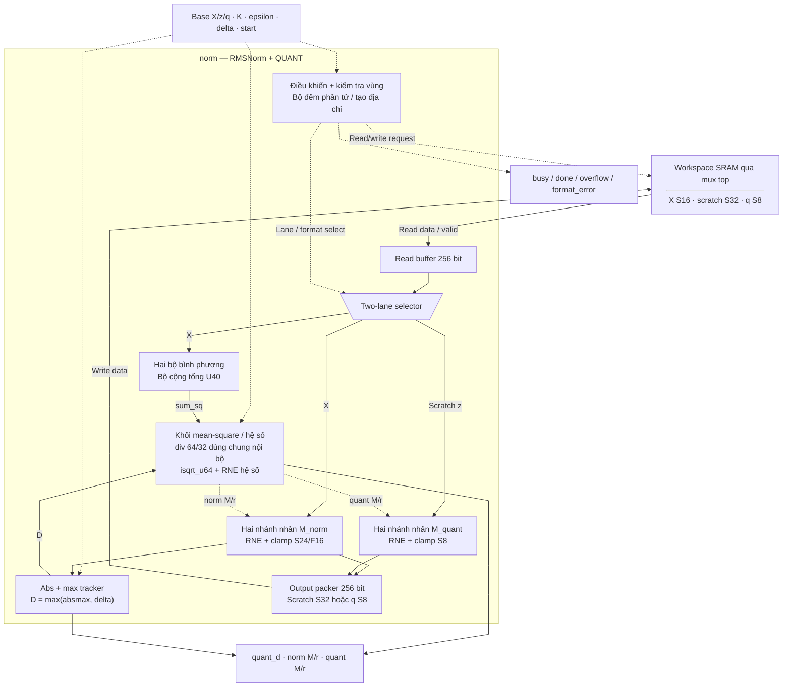
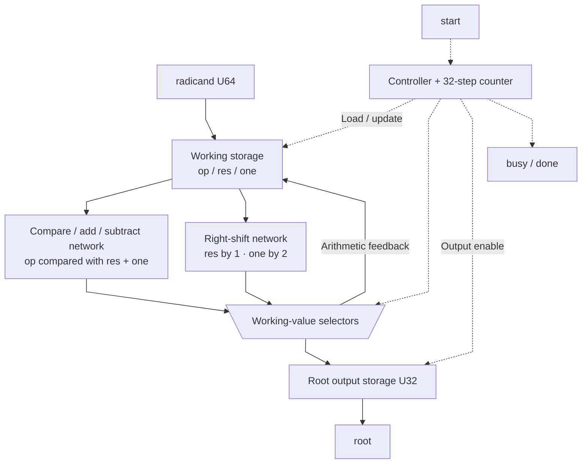
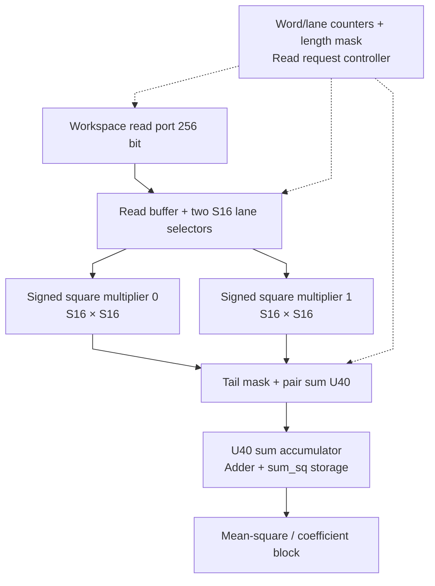
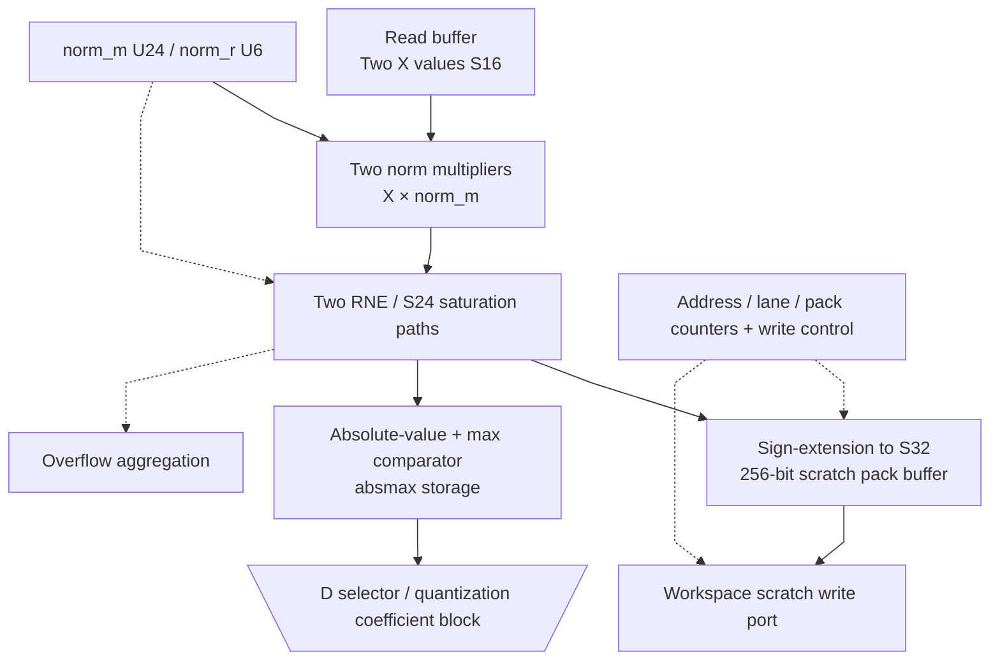
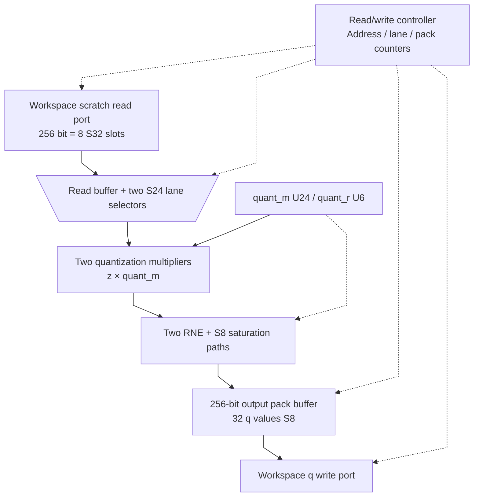

# norm.sv — RMSNorm toàn vector và QUANT

[Về mục lục](README.md) · [Về tổng quan](../README.md)

**Trạng thái:** Đang dùng — chứa norm và isqrt_u64.

**Source:** [norm.sv](<../../../Verilog%20Source%20code/norm.sv>). **Số dòng:** 536. **SHA-256:** `bc22ac01770f53ed3994bf1232864ce2aff1a0b963665f0f3c1346b66d46b06a`.

## Khối này làm gì?

File có hai module. `isqrt_u64` tính căn nguyên của một số U64. `norm` sử dụng căn này, một divider tuần tự và ba lượt đọc/tính để biến vector S16 thành q S8. Các hệ số M/r là số nguyên mô tả scale; không có floating-point.

RMSNorm ở đây không có affine gamma/beta. Epsilon đã được host quy đổi sang raw mean-square với 32 fractional bit. Scratch z là S24/F16, đặt trong ô S32; output q dùng scale D/(0x7F×0x1_0000).

## Sơ đồ kiến trúc tổng quan



MUX dùng hình thang rộng ở phía nhiều ngõ vào và thu hẹp về ngõ ra; decoder/demux dùng hình thang ngược lại, mở rộng về phía nhiều ngõ ra. Hình chữ nhật có các vạch ngang biểu diễn bộ nhớ hoặc bank descriptor. Các hình chữ nhật thường là datapath, thanh ghi đơn hoặc giao diện. Nét liền là đường dữ liệu, nét đứt là điều khiển/cấu hình. Mũi tên hồi tiếp biểu diễn kết nối phần cứng. Sơ đồ không biểu diễn thứ tự chu kỳ, trạng thái FSM hoặc các tầng pipeline CPU.

## Cách hoạt động chi tiết

Lượt 1: tính S=Σx², chia cho K với phần lẻ 32 bit, cộng epsilon rồi lấy căn R. Tính M_norm/r_norm xấp xỉ 2^32/R. Lượt 2: đọc X lần nữa, tạo z và maxabs. Tính D=max(maxabs,delta), M_quant/r_quant xấp xỉ 127/D. Lượt 3: đọc scratch z, quantize, pack q và ghi workspace.

Scratch không được overlap X hoặc q. q có thể dùng lại vùng X vì lúc ghi q, X đã được tiêu thụ hết. Tail ngoài K không tham gia phép tính. Nếu z vượt S24 thì overflow được báo; top dừng chuỗi sau NORM đó.

1. P1 đọc từng word S16 và xử lý hai phần tử mỗi bước. Hai bình phương S32 được cộng vào `sum_sq` U40; lane padding ngoài K bị bỏ qua.
2. Hai phép chia tạo mean-square có 32 bit phần lẻ. Sau khi cộng epsilon đã quy đổi, `isqrt_u64` tạo RMS raw nhân 2^16.
3. Hệ số norm M/r xấp xỉ `2^32/R`. Input toàn zero dùng M bằng 0 để tránh chia zero.
4. P2 đọc X lần hai, tạo z S24/F16, ghi scratch S32 và tìm `absmax` của toàn vector.
5. D bằng max(absmax, delta). Divider tạo hệ số QUANT xấp xỉ 0x7F/D; D trở thành metadata scale của q.
6. P3 đọc scratch, lượng tử hóa z về S8 và pack 32 phần tử/word. Scratch không được overlap X hay q; q được phép trùng X vì X đã đọc xong.

## Các nhóm logic trong source

Source được chia theo chức năng. Mỗi nhóm giữ nguyên phạm vi dòng để đối chiếu, nhưng phần giải thích tập trung vào quan hệ giữa các câu lệnh thay vì lặp lại từng dấu ngoặc, khai báo hoặc phép gán.


### [Dòng 1–49: Căn nguyên tuần tự](<../../../Verilog%20Source%20code/norm.sv#L1>)

<!-- source-range:1:49 -->
```systemverilog
module isqrt_u64 (
    input logic clk,
    input logic rst_n,
    input logic start,
    input logic [63:0] radicand,
    output logic busy,
    output logic done,
    output logic [31:0] root
);
    logic [63:0] op, res, one;
    logic [5:0] count;
    always_ff @(posedge clk or negedge rst_n) begin
        if (!rst_n) begin
            busy <= 0;
            done <= 0;
            root <= '0;
            op <= '0;
            res <= '0;
            one <= '0;
            count <= '0;
        end else begin
            done <= 1'b0;
            if (start && !busy) begin
                op <= radicand;
                res <= 0;
                one <= 64'h4000_0000_0000_0000; // 2^62, highest power of 4 in U64
                count <= 6'd32;
                busy <= 1'b1;
            end else if (busy) begin
                if (op >= res + one) begin
                    op <= op - (res + one);
                    res <= (res >> 1) + one;
                end else begin
                    res <= res >> 1;
                end
                one <= one >> 2;
                count <= count - 1'b1;
                if (count == 1) begin
                    busy <= 1'b0;
                    done <= 1'b1;
                    if (op >= res + one)
                        root <= (res >> 1) + one;
                    else
                    root <= res >> 1;
                end
            end
        end
    end
endmodule
```

**Mục đích.** Thuật toán thử các lũy thừa của 4 từ 2^62 trở xuống. Mỗi bước quyết định một phần kết quả; sau 32 bước trả floor(sqrt(radicand)).

**Cách phần code hoạt động.** Có logic tuần tự: register/FSM chỉ cập nhật tại cạnh clock; nonblocking assignment đọc giá trị cũ ở vế phải rồi chốt đồng thời.

**Tín hiệu và dữ liệu chính.** `start`: yêu cầu bắt đầu giao dịch; `radicand`: số U64 cần lấy căn; `busy`: khối đang xử lý; `done`: xung báo hoàn tất; `root`: kết quả floor(sqrt); `op`: operand hoặc opcode, theo giao diện module; và 3 tín hiệu phụ khác trong đoạn code.

**Điểm cần đọc kỹ.** Mỗi vòng quyết định một bit của căn thông qua biến `one`, nhưng thuật toán biểu diễn bit thử dưới dạng lũy thừa của 4. Vì vậy `one` dịch hai bit mỗi vòng và cần đúng 32 vòng cho radicand U64.

#### Sơ đồ khối phần cứng của nhóm




### [Dòng 50–98: Giao diện và state NORM](<../../../Verilog%20Source%20code/norm.sv#L50>)

<!-- source-range:50:98 -->
```systemverilog

// Full-vector integer RMSNorm + activation quantization.
// X: S16 with per-tensor scale. z scratch: S24/F16 stored sign-extended in S32 slots.
// q: S8, RNE and clamp [-128,127]. K is 1..512.
module norm (
    input logic clk,
    input logic rst_n,
    input logic start,
    input logic [7:0] x_base,
    input logic [7:0] z_base,
    input logic [7:0] q_base,
    input logic [9:0] k_len,
    input logic [63:0] epsilon_raw32,
    input logic [23:0] delta_raw,

    output logic ws_rd_en,
    output logic [7:0] ws_rd_addr,
    input logic [255:0] ws_rd_data,
    input logic ws_rd_valid,
    output logic ws_wr_en,
    output logic [7:0] ws_wr_addr,
    output logic [255:0] ws_wr_data,

    output logic busy,
    output logic done,
    output logic overflow,
    output logic format_error,
    output logic [23:0] quant_d,
    output logic [23:0] norm_m,
    output logic [5:0] norm_r,
    output logic [23:0] quant_m,
    output logic [5:0] quant_r
);
    import npu_pkg::*;

    typedef enum logic [5:0] {
    IDLE,
    P1_REQ, P1_WAIT, P1_PROC,
    DIV_MEAN_START, DIV_MEAN_WAIT,
    DIV_FRAC_START, DIV_FRAC_WAIT,
    SQRT_START, SQRT_WAIT,
    CNORM_PREP, CNORM_DIV_START, CNORM_DIV_WAIT,
    P2_REQ, P2_WAIT, P2_PROC, P2_WRITE,
    CQUANT_PREP, CQUANT_DIV_START, CQUANT_DIV_WAIT,
    P3_REQ, P3_WAIT, P3_PROC, P3_WRITE,
    FINISH
    } state_t;
    state_t state;

```

**Mục đích.** Tách state request/wait/process/write để không dùng dữ liệu SRAM trước valid.

**Cách phần code hoạt động.** Nhóm này định nghĩa giao diện, độ rộng, kiểu hoặc tín hiệu trung gian. Nó tạo cấu trúc để các nhóm xử lý sau sử dụng, chưa tự biểu diễn một bước runtime riêng.

**Tín hiệu và dữ liệu chính.** `start`: yêu cầu bắt đầu giao dịch; `x_base`: base input S16; `z_base`: base scratch z; `q_base`: base SRAM mà cache q mô tả; `k_len`: độ dài dot product; `epsilon_raw32`: epsilon theo đơn vị raw-square có 32 fractional bit; và 18 tín hiệu phụ khác trong đoạn code.


### [Dòng 99–144: Thanh ghi và scalar unit](<../../../Verilog%20Source%20code/norm.sv#L99>)

<!-- source-range:99:144 -->
```systemverilog
    logic [7:0] input_base_q, scratch_base_q, output_base_q;
    logic [9:0] vector_length_q;
    logic [63:0] epsilon_q;
    logic [23:0] delta_q;
    logic [9:0] elem_index;
    logic [7:0] word_index;
    logic [3:0] lane;
    logic [255:0] read_buf;
    logic [39:0] sum_sq;
    logic [63:0] mean_q, frac_q, mean_rem;
    logic [63:0] v_raw;
    logic [64:0] mean_with_epsilon;
    logic [31:0] rms_r;
    logic [23:0] absmax;
    logic [255:0] pack_buf;
    logic [5:0] pack_count;
    logic [7:0] write_word;

    // scalar divider shared by normalization coefficient generation
    logic div_start, div_busy, div_done, div_zero;
    logic [63:0] div_num, div_q;
    logic [31:0] div_den, div_rem;
    div #(.NUM_W(64),
        .DEN_W(32)) u_div(
        .clk(clk),
        .rst_n(rst_n),
        .start(div_start),
        .numerator(div_num),
        .denominator(div_den),
        .busy(div_busy),
        .done(div_done),
        .div_zero(div_zero),
        .quotient(div_q),
        .remainder(div_rem)
    );

    logic sqrt_start, sqrt_busy, sqrt_done;
    logic [31:0] sqrt_root;
    isqrt_u64 u_sqrt(.clk(clk),
        .rst_n(rst_n),
        .start(sqrt_start),
        .radicand(v_raw),
        .busy(sqrt_busy),
        .done(sqrt_done),
        .root(sqrt_root));

```

**Mục đích.** sum_sq U40; v_raw U64; hệ số U24/U6; pack buffer 256 bit. Divider 64/32 và square-root là hai instance nội bộ.

**Cách phần code hoạt động.** Có instance module con; named-port ở nhóm này xác định chính xác đường control/data giữa hai cấp hierarchy.

**Tín hiệu và dữ liệu chính.** `input_base_q`: base input X đã chốt; `scratch_base_q`: base scratch z đã chốt; `output_base_q`: base q đã chốt; `vector_length_q`: K đã chốt; `epsilon_q`: epsilon đã chốt; `delta_q`: delta đã chốt; và 32 tín hiệu phụ khác trong đoạn code.


### [Dòng 145–159: Bình phương hai phần tử](<../../../Verilog%20Source%20code/norm.sv#L145>)

<!-- source-range:145:159 -->
```systemverilog
    logic signed [15:0] x0, x1;
    logic signed [31:0] x0_sq, x1_sq;
    logic [39:0] pair_sq;
    logic [10:0] idx0, idx1;
    always_comb begin
        x0 = read_buf[lane * 16 +: 16];
        x1 = read_buf[(lane + 1) * 16 +: 16];
        x0_sq = $signed(x0) * $signed(x0);
        x1_sq = $signed(x1) * $signed(x1);
        idx0 = {word_index, 4'b0} + lane;
        idx1 = idx0 + 1'b1;
        pair_sq = 0;
        if (idx0 < vector_length_q) pair_sq = pair_sq + $unsigned(x0_sq);
        if (idx1 < vector_length_q) pair_sq = pair_sq + $unsigned(x1_sq);
    end
```

**Mục đích.** Lấy hai S16 từ read_buf. Chỉ cộng bình phương nếu chỉ số nằm trong K, kể cả word cuối chưa đủ phần tử.

**Cách phần code hoạt động.** Có logic tổ hợp: output/intermediate được tính từ input hiện tại; các giá trị mặc định đầu khối giúp tránh suy ra latch.

**Tín hiệu và dữ liệu chính.** `x0`: input S16 lane thứ nhất; `x1`: input S16 lane thứ hai; `x0_sq`: bình phương lane 0; `x1_sq`: bình phương lane 1; `pair_sq`: tổng bình phương của hai lane hữu ích; `idx0`: chỉ số phần tử toàn vector của lane 0; và 5 tín hiệu phụ khác trong đoạn code.


### [Dòng 160–191: Chọn shift hệ số](<../../../Verilog%20Source%20code/norm.sv#L160>)

<!-- source-range:160:191 -->
```systemverilog

    // Dynamic coefficient shift choices. Larger r improves precision while M remains U24.
    function automatic [5:0] choose_norm_r(input logic [31:0] den);
        integer msb;
        begin
            msb = 0;
            for (integer i = 31;i >= 0;i = i - 1)
                if (den[i] && msb == 0) msb = i;
            if (msb <= 9) choose_norm_r = 0;
            else if (msb - 9 > 31) choose_norm_r = 31;
            else choose_norm_r = msb - 9;
        end
    endfunction

    function automatic [5:0] choose_quant_r(input logic [23:0] den);
        logic [63:0] limit;
        logic [63:0] num;
        logic found;
        begin
            limit = den * 24'hff_ffff;
            choose_quant_r = 0;
            found = 1'b0;
            for (integer r = 47;r >= 0;r = r - 1) begin
                num = 64'h0000_0000_0000_007f << r;
                if (!found && num <= limit) begin
                    choose_quant_r = r[5:0];
                    found = 1'b1;
                end
            end
        end
    endfunction

```

**Mục đích.** Ưu tiên r lớn để giữ precision trong U24; lựa chọn phải đồng thời giữ tử số trong U64.

**Cách phần code hoạt động.** Có function tổ hợp dùng lại tại nơi gọi; function không giữ trạng thái qua các chu kỳ.

**Tín hiệu và dữ liệu chính.** `den`: denominator của hàm chọn shift; `msb`: vị trí bit 1 cao nhất của denominator; `limit`: giới hạn den×M_max; `num`: tử số 127<<r đang thử; `found`: đã tìm shift hợp lệ đầu tiên khi quét từ lớn xuống.


### [Dòng 192–201: Chuẩn bị tử số và epsilon](<../../../Verilog%20Source%20code/norm.sv#L192>)

<!-- source-range:192:201 -->
```systemverilog
    logic [5:0] norm_r_sel, quant_r_sel;
    logic [63:0] norm_num, quant_num;
    always_comb begin
        mean_with_epsilon = ({1'b0, mean_q} << 32) + {1'b0, div_q} + {1'b0, epsilon_q};
        norm_r_sel = choose_norm_r(rms_r);
        norm_num = 64'h1 << (32 + norm_r_sel);
        quant_r_sel = choose_quant_r((absmax > delta_q) ? absmax : delta_q);
        quant_num = 64'h0000_0000_0000_007f << quant_r_sel;
    end

```

**Mục đích.** Ghép phần nguyên và phần lẻ của mean-square. Bit 64 của tổng giúp phát hiện tràn U64.

**Cách phần code hoạt động.** Có logic tổ hợp: output/intermediate được tính từ input hiện tại; các giá trị mặc định đầu khối giúp tránh suy ra latch.

**Tín hiệu và dữ liệu chính.** `norm_r_sel`: shift norm được logic lựa chọn; `quant_r_sel`: shift QUANT được logic lựa chọn; `norm_num`: tử số tính hệ số norm; `quant_num`: tử số tính hệ số QUANT; `mean_with_epsilon`: tổng U65 để kiểm tra overflow mean-square + epsilon; `mean_q`: phần nguyên của S/K; và 5 tín hiệu phụ khác trong đoạn code.


### [Dòng 202–220: Đường tạo z](<../../../Verilog%20Source%20code/norm.sv#L202>)

<!-- source-range:202:220 -->
```systemverilog
    logic signed [39:0] z_prod0, z_prod1;
    logic signed [63:0] z_round0, z_round1;
    logic signed [23:0] z0, z1;
    logic [23:0] absz0, absz1;
    always_comb begin
        z_prod0 = $signed(x0) * $signed({1'b0, norm_m});
        z_prod1 = $signed(x1) * $signed({1'b0, norm_m});
        z_round0 = rne_shift64({{24{z_prod0[39]}}, z_prod0}, norm_r);
        z_round1 = rne_shift64({{24{z_prod1[39]}}, z_prod1}, norm_r);
        if (z_round0 > 64'sh0000_0000_007f_ffff) z0 = 24'sh7f_ffff;
        else if (z_round0 < - 64'sh0000_0000_0080_0000) z0 = 24'sh80_0000;
        else z0 = z_round0[23:0];
        if (z_round1 > 64'sh0000_0000_007f_ffff) z1 = 24'sh7f_ffff;
        else if (z_round1 < - 64'sh0000_0000_0080_0000) z1 = 24'sh80_0000;
        else z1 = z_round1[23:0];
        absz0 = z0[23] ? $unsigned( - $signed(z0)) : z0;
        absz1 = z1[23] ? $unsigned( - $signed(z1)) : z1;
    end

```

**Mục đích.** Nhân S16 với hệ số norm, RNE, clamp S24 và tính trị tuyệt đối để tìm maxabs.

**Cách phần code hoạt động.** Có logic tổ hợp: output/intermediate được tính từ input hiện tại; các giá trị mặc định đầu khối giúp tránh suy ra latch.

**Tín hiệu và dữ liệu chính.** `z_prod0`: tích x0×M_norm S40; `z_prod1`: tích x1×M_norm S40; `z_round0`: z lane 0 sau RNE; `z_round1`: z lane 1 sau RNE; `z0`: z lane 0 đã clamp S24; `z1`: z lane 1 đã clamp S24; và 6 tín hiệu phụ khác trong đoạn code.


### [Dòng 221–239: Đường tạo q](<../../../Verilog%20Source%20code/norm.sv#L221>)

<!-- source-range:221:239 -->
```systemverilog
    logic signed [23:0] zr0, zr1;
    logic signed [47:0] qprod0, qprod1;
    logic signed [63:0] qround0, qround1;
    logic signed [7:0] q0, q1;
    always_comb begin
        zr0 = read_buf[lane * 32 +: 24];
        zr1 = read_buf[(lane + 1) * 32 +: 24];
        qprod0 = $signed(zr0) * $signed({1'b0, quant_m});
        qprod1 = $signed(zr1) * $signed({1'b0, quant_m});
        qround0 = rne_shift64({{16{qprod0[47]}}, qprod0}, quant_r);
        qround1 = rne_shift64({{16{qprod1[47]}}, qprod1}, quant_r);
        if (qround0 > 64'sh0000_0000_0000_007f) q0 = 8'sh7f;
        else if (qround0 < - 64'sh0000_0000_0000_0080) q0 = 8'sh80;
        else q0 = qround0[7:0];
        if (qround1 > 64'sh0000_0000_0000_007f) q1 = 8'sh7f;
        else if (qround1 < - 64'sh0000_0000_0000_0080) q1 = 8'sh80;
        else q1 = qround1[7:0];
    end

```

**Mục đích.** Đọc 24 bit thấp của mỗi ô S32, nhân hệ số QUANT và RNE, rồi clamp vào S8.

**Cách phần code hoạt động.** Có logic tổ hợp: output/intermediate được tính từ input hiện tại; các giá trị mặc định đầu khối giúp tránh suy ra latch.

**Tín hiệu và dữ liệu chính.** `zr0`: z lane 0 lấy từ ô scratch S32; `zr1`: z lane 1 lấy từ ô scratch S32; `qprod0`: tích z0×M_quant S48; `qprod1`: tích z1×M_quant S48; `qround0`: q lane 0 sau RNE; `qround1`: q lane 1 sau RNE; và 6 tín hiệu phụ khác trong đoạn code.


### [Dòng 240–297: Phát request](<../../../Verilog%20Source%20code/norm.sv#L240>)

<!-- source-range:240:297 -->
```systemverilog
    always_comb begin
        ws_rd_en = 1'b0;
        ws_rd_addr = '0;
        ws_wr_en = 1'b0;
        ws_wr_addr = '0;
        ws_wr_data = pack_buf;
        div_start = 1'b0;
        div_num = '0;
        div_den = '0;
        sqrt_start = 1'b0;
        case (state)
            P1_REQ : begin
                ws_rd_en = 1'b1;
                ws_rd_addr = input_base_q + word_index;
            end
            DIV_MEAN_START : begin
                div_start = 1'b1;
                div_num = {{24{1'b0}}, sum_sq};
                div_den = {22'h0, vector_length_q};
            end
            DIV_FRAC_START : begin
                div_start = 1'b1;
                div_num = mean_rem << 32;
                div_den = {22'h0, vector_length_q};
            end
            SQRT_START : sqrt_start = 1'b1;
            CNORM_DIV_START : begin
                div_start = 1'b1;
                div_num = norm_num;
                div_den = rms_r;
            end
            P2_REQ : begin
                ws_rd_en = 1'b1;
                ws_rd_addr = input_base_q + word_index;
            end
            P2_WRITE : begin
                ws_wr_en = 1'b1;
                ws_wr_addr = scratch_base_q + write_word;
                ws_wr_data = pack_buf;
            end
            CQUANT_DIV_START : begin
                div_start = 1'b1;
                div_num = quant_num;
                div_den = {8'h00, ((absmax > delta_q) ? absmax : delta_q)};
            end
            P3_REQ : begin
                ws_rd_en = 1'b1;
                ws_rd_addr = scratch_base_q + word_index;
            end
            P3_WRITE : begin
                ws_wr_en = 1'b1;
                ws_wr_addr = output_base_q + write_word;
                ws_wr_data = pack_buf;
            end
            default : ;
        endcase
    end

```

**Mục đích.** Control tổ hợp theo FSM: chọn vùng input/scratch/output, phát divider start hoặc sqrt start.

**Cách phần code hoạt động.** Có logic tổ hợp: output/intermediate được tính từ input hiện tại; các giá trị mặc định đầu khối giúp tránh suy ra latch.

**Tín hiệu và dữ liệu chính.** `ws_rd_en`: request đọc workspace; `ws_rd_addr`: địa chỉ đọc workspace; `ws_wr_en`: cho phép ghi workspace; `ws_wr_addr`: địa chỉ ghi workspace; `ws_wr_data`: word 256 ghi workspace; `pack_buf`: buffer pack output trước khi ghi SRAM; và 17 tín hiệu phụ khác trong đoạn code.


### [Dòng 298–332: Reset thanh ghi](<../../../Verilog%20Source%20code/norm.sv#L298>)

<!-- source-range:298:332 -->
```systemverilog
    always_ff @(posedge clk or negedge rst_n) begin
        if (!rst_n) begin
            state <= IDLE;
            busy <= 0;
            done <= 0;
            overflow <= 0;
            format_error <= 0;
            quant_d <= 0;
            input_base_q <= 0;
            scratch_base_q <= 0;
            output_base_q <= 0;
            vector_length_q <= 0;
            epsilon_q <= 0;
            delta_q <= 1;
            elem_index <= 0;
            word_index <= 0;
            lane <= 0;
            read_buf <= 0;
            sum_sq <= 0;
            mean_q <= 0;
            frac_q <= 0;
            mean_rem <= 0;
            v_raw <= 0;
            rms_r <= 0;
            absmax <= 0;
            pack_buf <= 0;
            pack_count <= 0;
            write_word <= 0;
            norm_m <= 0;
            norm_r <= 0;
            quant_m <= 0;
            quant_r <= 0;
        end else begin
            done <= 1'b0;
            case (state)
```

**Mục đích.** Chỉ reset trạng thái và buffer trong khối. Nội dung workspace không được reset ở đây.

**Cách phần code hoạt động.** Có logic tuần tự: register/FSM chỉ cập nhật tại cạnh clock; nonblocking assignment đọc giá trị cũ ở vế phải rồi chốt đồng thời.

**Tín hiệu và dữ liệu chính.** `state`: trạng thái FSM của khối; `busy`: khối đang xử lý; `done`: xung báo hoàn tất; `overflow`: cờ kết quả vượt miền số; `format_error`: cờ format/metadata không hợp lệ; `quant_d`: D=max(absmax,delta); và 24 tín hiệu phụ khác trong đoạn code.


### [Dòng 333–361: Nhận lệnh và kiểm tra vùng](<../../../Verilog%20Source%20code/norm.sv#L333>)

<!-- source-range:333:361 -->
```systemverilog
                IDLE : if (start) begin
                    busy <= 1;
                    overflow <= 0;
                    format_error <= 0;
                    quant_d <= 0;
                    norm_m <= 0;
                    norm_r <= 0;
                    quant_m <= 0;
                    quant_r <= 0;
                    input_base_q <= x_base;
                    scratch_base_q <= z_base;
                    output_base_q <= q_base;
                    vector_length_q <= k_len;
                    epsilon_q <= epsilon_raw32;
                    delta_q <= delta_raw;
                    word_index <= 0;
                    lane <= 0;
                    sum_sq <= 0;
                    state <= P1_REQ;
                    if (k_len == 0 || k_len > K_MAX || delta_raw == 0 ||
                        int'(x_base) + (int'(k_len) + 15) / 16 > 256 ||
                        int'(z_base) + (int'(k_len) + 7) / 8 > 256 ||
                        int'(q_base) + (int'(k_len) + 31) / 32 > 256 ||
                        ranges_overlap(int'(x_base), (int'(k_len) + 15) / 16, int'(z_base), (int'(k_len) + 7) / 8) ||
                        ranges_overlap(int'(q_base), (int'(k_len) + 31) / 32, int'(z_base), (int'(k_len) + 7) / 8)) begin
                        format_error <= 1;
                        state <= FINISH;
                    end
                end
```

**Mục đích.** Chốt bases, K, epsilon, delta. Reject K sai, delta=0, vượt SRAM hoặc scratch overlap.

**Cách phần code hoạt động.** Các câu lệnh thuộc cùng một nhánh/pha xử lý và phải được đọc liền nhau; tách riêng từng dòng sẽ làm mất quan hệ điều kiện và dữ liệu.

**Tín hiệu và dữ liệu chính.** `start`: yêu cầu bắt đầu giao dịch; `busy`: khối đang xử lý; `overflow`: cờ kết quả vượt miền số; `format_error`: cờ format/metadata không hợp lệ; `quant_d`: D=max(absmax,delta); `norm_m`: multiplier U24 của RMSNorm; và 19 tín hiệu phụ khác trong đoạn code.


### [Dòng 362–377: Lượt 1](<../../../Verilog%20Source%20code/norm.sv#L362>)

<!-- source-range:362:377 -->
```systemverilog
                P1_REQ : state <= P1_WAIT;
                P1_WAIT : if (ws_rd_valid) begin
                    read_buf <= ws_rd_data;
                    lane <= 0;
                    state <= P1_PROC;
                end
                P1_PROC : begin
                    sum_sq <= sum_sq + pair_sq;
                    if (lane == 14 || idx1 >= vector_length_q - 1) begin
                        if (({word_index, 4'b0} + 16) >= vector_length_q) state <= DIV_MEAN_START;
                        else begin
                            word_index <= word_index + 1'b1;
                            state <= P1_REQ;
                        end
                    end else lane <= lane + 2;
                end
```

**Mục đích.** Đọc input theo word, đi hai lane mỗi bước và cộng pair_sq cho đến hết K.

**Cách phần code hoạt động.** Các câu lệnh thuộc cùng một nhánh/pha xử lý và phải được đọc liền nhau; tách riêng từng dòng sẽ làm mất quan hệ điều kiện và dữ liệu.

**Tín hiệu và dữ liệu chính.** `state`: trạng thái FSM của khối; `ws_rd_valid`: workspace trả dữ liệu hợp lệ; `read_buf`: word SRAM đã nhận; `ws_rd_data`: word 256 trả từ workspace; `lane`: vị trí phần tử trong word; `sum_sq`: tổng bình phương U40; và 4 tín hiệu phụ khác trong đoạn code.

**Điểm cần đọc kỹ.** REQ và WAIT tách riêng để phù hợp read-valid của SRAM. P1_PROC chỉ sử dụng `read_buf` đã chốt; không đọc trực tiếp bus SRAM đang thay đổi.

#### Sơ đồ khối phần cứng của nhóm




### [Dòng 378–399: Mean-square và căn](<../../../Verilog%20Source%20code/norm.sv#L378>)

<!-- source-range:378:399 -->
```systemverilog
                DIV_MEAN_START : state <= DIV_MEAN_WAIT;
                DIV_MEAN_WAIT : if (div_done) begin
                    mean_q <= div_q;
                    mean_rem <= div_rem;
                    state <= DIV_FRAC_START;
                end
                DIV_FRAC_START : state <= DIV_FRAC_WAIT;
                DIV_FRAC_WAIT : if (div_done) begin
                    frac_q <= div_q;
                    v_raw <= mean_with_epsilon[63:0];
                    state <= SQRT_START;
                    if (mean_with_epsilon[64]) begin
                        overflow <= 1;
                        format_error <= 1;
                        state <= FINISH;
                    end
                end
                SQRT_START : state <= SQRT_WAIT;
                SQRT_WAIT : if (sqrt_done) begin
                    rms_r <= sqrt_root;
                    state <= CNORM_PREP;
                end
```

**Mục đích.** Lần chia thứ nhất lấy thương/phần dư; lần thứ hai lấy phần lẻ Q32. Kiểm tra tổng epsilon trước khi sqrt.

**Cách phần code hoạt động.** Các câu lệnh thuộc cùng một nhánh/pha xử lý và phải được đọc liền nhau; tách riêng từng dòng sẽ làm mất quan hệ điều kiện và dữ liệu.

**Tín hiệu và dữ liệu chính.** `state`: trạng thái FSM của khối; `div_done`: divider đã xong; `mean_q`: phần nguyên của S/K; `div_q`: thương divider; `mean_rem`: phần dư của S/K; `div_rem`: phần dư divider; và 6 tín hiệu phụ khác trong đoạn code.


### [Dòng 400–427: Hệ số norm](<../../../Verilog%20Source%20code/norm.sv#L400>)

<!-- source-range:400:427 -->
```systemverilog
                CNORM_PREP : begin
                    if (sum_sq == 0) begin
                        norm_m <= 0;
                        norm_r <= 0;
                        absmax <= 0;
                        word_index <= 0;
                        lane <= 0;
                        pack_buf <= 0;
                        pack_count <= 0;
                        write_word <= 0;
                        state <= P2_REQ;
                    end
                    else begin
                        norm_r <= norm_r_sel;
                        state <= CNORM_DIV_START;
                    end
                end
                CNORM_DIV_START : state <= CNORM_DIV_WAIT;
                CNORM_DIV_WAIT : if (div_done) begin
                    norm_m <= div_q[23:0] + (({1'b0, div_rem} * 2 > rms_r) || (({1'b0, div_rem} * 2 == rms_r) && div_q[0]));
                    word_index <= 0;
                    lane <= 0;
                    pack_buf <= 0;
                    pack_count <= 0;
                    write_word <= 0;
                    absmax <= 0;
                    state <= P2_REQ;
                end
```

**Mục đích.** Input toàn zero dùng M=0. Trường hợp thường chia tử số cho R rồi RNE thương bằng cách so sánh hai lần remainder với denominator.

**Cách phần code hoạt động.** Các câu lệnh thuộc cùng một nhánh/pha xử lý và phải được đọc liền nhau; tách riêng từng dòng sẽ làm mất quan hệ điều kiện và dữ liệu.

**Tín hiệu và dữ liệu chính.** `sum_sq`: tổng bình phương U40; `norm_m`: multiplier U24 của RMSNorm; `norm_r`: shift của RMSNorm; `absmax`: trị tuyệt đối z lớn nhất đã thấy; `word_index`: chỉ số word đang đọc; `lane`: vị trí phần tử trong word; và 9 tín hiệu phụ khác trong đoạn code.


### [Dòng 428–466: Lượt 2 và ghi scratch](<../../../Verilog%20Source%20code/norm.sv#L428>)

<!-- source-range:428:466 -->
```systemverilog
                P2_REQ : state <= P2_WAIT;
                P2_WAIT : if (ws_rd_valid) begin
                    read_buf <= ws_rd_data;
                    lane <= 0;
                    state <= P2_PROC;
                end
                P2_PROC : begin
                    if ((idx0 < vector_length_q && (z_round0 > 64'sh0000_0000_007f_ffff || z_round0 < - 64'sh0000_0000_0080_0000)) ||
                        (idx1 < vector_length_q && (z_round1 > 64'sh0000_0000_007f_ffff || z_round1 < - 64'sh0000_0000_0080_0000))) overflow <= 1;
                    if (idx0 < vector_length_q) begin
                        pack_buf[pack_count * 32 +: 32] <= {{8{z0[23]}}, z0};
                        if (absz0 > absmax) absmax <= absz0;
                    end
                    if (idx1 < vector_length_q) begin
                        pack_buf[(pack_count + 1) * 32 +: 32] <= {{8{z1[23]}}, z1};
                        if (absz1 > absmax && absz1 > absz0) absmax <= absz1;
                    end
                    if (pack_count >= 6 || idx1 >= vector_length_q - 1) begin
                        state <= P2_WRITE;
                    end else begin
                        pack_count <= pack_count + 2;
                        lane <= lane + 2;
                    end
                end
                P2_WRITE : begin
                    write_word <= write_word + 1'b1;
                    pack_buf <= 0;
                    pack_count <= 0;
                    if (idx1 >= vector_length_q - 1) state <= CQUANT_PREP;
                    else if (lane == 14) begin
                        word_index <= word_index + 1'b1;
                        lane <= 0;
                        state <= P2_REQ;
                    end
                    else begin
                        lane <= lane + 2;
                        state <= P2_PROC;
                    end
                end
```

**Mục đích.** Tạo hai z mỗi bước, sign-extend lên S32 và cập nhật maxabs. Cứ 8 z hoặc hết K thì ghi một word.

**Cách phần code hoạt động.** Các câu lệnh thuộc cùng một nhánh/pha xử lý và phải được đọc liền nhau; tách riêng từng dòng sẽ làm mất quan hệ điều kiện và dữ liệu.

**Tín hiệu và dữ liệu chính.** `state`: trạng thái FSM của khối; `ws_rd_valid`: workspace trả dữ liệu hợp lệ; `read_buf`: word SRAM đã nhận; `ws_rd_data`: word 256 trả từ workspace; `lane`: vị trí phần tử trong word; `idx0`: chỉ số phần tử toàn vector của lane 0; và 14 tín hiệu phụ khác trong đoạn code.

**Điểm cần đọc kỹ.** Lượt này vừa sinh scratch vừa đo biên độ. Nếu chỉ ghi z mà không tìm `absmax`, phần cứng sẽ phải đọc scratch thêm một lượt nữa chỉ để chọn scale QUANT.

#### Sơ đồ khối phần cứng của nhóm




### [Dòng 467–490: Hệ số quantization](<../../../Verilog%20Source%20code/norm.sv#L467>)

<!-- source-range:467:490 -->
```systemverilog
                CQUANT_PREP : begin
                    quant_d <= (absmax > delta_q) ? absmax : delta_q;
                    quant_r <= quant_r_sel;
                    if ((absmax == 0) && (delta_q == 0)) begin
                        quant_m <= 0;
                        word_index <= 0;
                        lane <= 0;
                        pack_buf <= 0;
                        pack_count <= 0;
                        write_word <= 0;
                        state <= P3_REQ;
                    end
                    else state <= CQUANT_DIV_START;
                end
                CQUANT_DIV_START : state <= CQUANT_DIV_WAIT;
                CQUANT_DIV_WAIT : if (div_done) begin
                    quant_m <= div_q[23:0] + (({1'b0, div_rem} * 2 > ((absmax > delta_q) ? absmax : delta_q)) || (({1'b0, div_rem} * 2 == ((absmax > delta_q) ? absmax : delta_q)) && div_q[0]));
                    word_index <= 0;
                    lane <= 0;
                    pack_buf <= 0;
                    pack_count <= 0;
                    write_word <= 0;
                    state <= P3_REQ;
                end
```

**Mục đích.** Giữ D=max(absmax,delta). Nhánh cả hai bằng 0 là nhánh phòng vệ không đạt được với delta đã kiểm tra hợp lệ.

**Cách phần code hoạt động.** Các câu lệnh thuộc cùng một nhánh/pha xử lý và phải được đọc liền nhau; tách riêng từng dòng sẽ làm mất quan hệ điều kiện và dữ liệu.

**Tín hiệu và dữ liệu chính.** `quant_d`: D=max(absmax,delta); `absmax`: trị tuyệt đối z lớn nhất đã thấy; `delta_q`: delta đã chốt; `quant_r`: shift của QUANT; `quant_r_sel`: shift QUANT được logic lựa chọn; `quant_m`: multiplier U24 của QUANT; và 9 tín hiệu phụ khác trong đoạn code.


### [Dòng 491–536: Lượt 3 và hoàn tất](<../../../Verilog%20Source%20code/norm.sv#L491>)

<!-- source-range:491:536 -->
```systemverilog
                P3_REQ : state <= P3_WAIT;
                P3_WAIT : if (ws_rd_valid) begin
                    read_buf <= ws_rd_data;
                    lane <= 0;
                    state <= P3_PROC;
                end
                P3_PROC : begin
                    if (({word_index, 3'b0} + lane) < vector_length_q) pack_buf[pack_count * 8 +: 8] <= q0;
                    if (({word_index, 3'b0} + lane + 1) < vector_length_q) pack_buf[(pack_count + 1) * 8 +: 8] <= q1;
                    if (pack_count >= 30 || ({word_index, 3'b0} + lane + 1) >= vector_length_q - 1) state <= P3_WRITE;
                    else if (lane == 6) begin
                        word_index <= word_index + 1'b1;
                        lane <= 0;
                        pack_count <= pack_count + 2;
                        state <= P3_REQ;
                    end
                    else begin
                        lane <= lane + 2;
                        pack_count <= pack_count + 2;
                    end
                end
                P3_WRITE : begin
                    write_word <= write_word + 1'b1;
                    pack_buf <= 0;
                    pack_count <= 0;
                    if (({word_index, 3'b0} + lane + 1) >= vector_length_q - 1) state <= FINISH;
                    else if (lane == 6) begin
                        word_index <= word_index + 1'b1;
                        lane <= 0;
                        state <= P3_REQ;
                    end
                    else begin
                        lane <= lane + 2;
                        state <= P3_PROC;
                    end
                end
                FINISH : begin
                    busy <= 0;
                    done <= 1;
                    state <= IDLE;
                end
                default : state <= IDLE;
            endcase
        end
    end
endmodule
```

**Mục đích.** Đọc từng word gồm 8 z; pack dần 32 q vào output word. FINISH hạ busy, phát done rồi về IDLE.

**Cách phần code hoạt động.** Các câu lệnh thuộc cùng một nhánh/pha xử lý và phải được đọc liền nhau; tách riêng từng dòng sẽ làm mất quan hệ điều kiện và dữ liệu.

**Tín hiệu và dữ liệu chính.** `state`: trạng thái FSM của khối; `ws_rd_valid`: workspace trả dữ liệu hợp lệ; `read_buf`: word SRAM đã nhận; `ws_rd_data`: word 256 trả từ workspace; `lane`: vị trí phần tử trong word; `word_index`: chỉ số word đang đọc; và 8 tín hiệu phụ khác trong đoạn code.

**Điểm cần đọc kỹ.** Một word scratch chứa 8 z S32, còn một word q chứa 32 phần tử S8. Vì vậy P3 tích lũy kết quả qua nhiều word scratch trước khi ghi đủ một word output.

#### Sơ đồ khối phần cứng của nhóm



