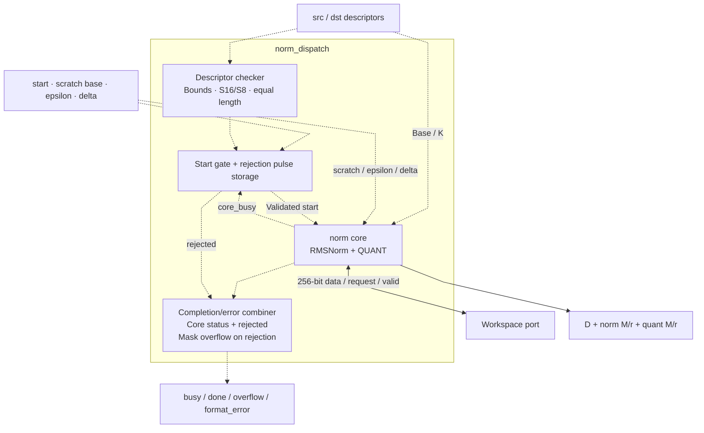

# norm_dispatch.sv — Kiểm tra descriptor trước NORM

[Tài liệu](../../README.md) → [Hierarchy RTL](../README.md) → [Mục lục từng file](README.md)

**Trạng thái:** Đang dùng.

**Source:** [norm_dispatch.sv](<../../../Verilog%20Source%20code/norm_dispatch.sv>). **Số dòng:** 72. **SHA-256:** `22f4016cfeedad90c67e0538b6708fb5206fa5ce8e1372a6ad1afd998f7bc8a8`.

## Khối này làm gì?

Wrapper này kiểm tra nguồn S16, đích S8, length bằng nhau và descriptor nằm trong workspace. Core norm bên trong tiếp tục kiểm tra scratch, overlap và tham số thuật toán. frac_bits không được chuyển trực tiếp vào core norm; epsilon phải đã được host quy đổi.

## Sơ đồ kiến trúc tổng quan



MUX dùng hình thang rộng ở phía nhiều ngõ vào và thu hẹp về ngõ ra; decoder/demux dùng hình thang ngược lại, mở rộng về phía nhiều ngõ ra. Hình chữ nhật có các vạch ngang biểu diễn bộ nhớ hoặc bank descriptor. Các hình chữ nhật thường là datapath, thanh ghi đơn hoặc giao diện. Nét liền là đường dữ liệu, nét đứt là điều khiển/cấu hình. Mũi tên hồi tiếp biểu diễn kết nối phần cứng. Sơ đồ không biểu diễn thứ tự chu kỳ, trạng thái FSM hoặc các tầng pipeline CPU.

## Cách hoạt động chi tiết

Nếu descriptor hợp lệ, chuyển start đến norm. Nếu không, rejected phát một pulse để done và format_error cùng lên, tránh scheduler chờ vô hạn một core chưa được start. Khi rejected=1, wrapper mask `core_overflow` về 0 vì giao dịch bị từ chối không thực hiện số học; cờ còn giữ từ lần core chạy trước không được gán cho lệnh mới.

1. Wrapper kiểm tra source/destination nằm trong workspace, source S16, destination S8 và length bằng nhau.
2. Descriptor sai không được start norm. `rejected` tạo pulse done/error và overflow=0 để scheduler không chờ vô hạn hoặc lấy nhầm overflow của lần chạy trước.
3. Descriptor hợp lệ được đổi thành base/K; scratch, epsilon và delta đến từ control register top.
4. Norm core kiểm tra overlap chi tiết rồi trả output, D và hai cặp M/r.

## Các nhóm logic trong source

Source được chia theo chức năng. Mỗi nhóm giữ nguyên phạm vi dòng để đối chiếu, nhưng phần giải thích tập trung vào quan hệ giữa các câu lệnh thay vì lặp lại từng dấu ngoặc, khai báo hoặc phép gán.


### [Dòng 1–30: Giao diện](<../../../Verilog%20Source%20code/norm_dispatch.sv#L1>)

<!-- source-range:1:30 -->
```systemverilog
module norm_dispatch (
    input logic clk,
    input logic rst_n,
    input logic start,
    input npu_pkg::ws_desc_t src_desc,
    input npu_pkg::ws_desc_t dst_desc,
    input logic [7:0] scratch_z_base,
    input logic [63:0] epsilon_raw32,
    input logic [23:0] delta_raw,

    output logic ws_rd_en,
    output logic [7:0] ws_rd_addr,
    input logic [255:0] ws_rd_data,
    input logic ws_rd_valid,
    output logic ws_wr_en,
    output logic [7:0] ws_wr_addr,
    output logic [255:0] ws_wr_data,

    output logic busy,
    output logic done,
    output logic overflow,
    output logic format_error,
    output logic [23:0] quant_d,
    output logic [23:0] norm_m,
    output logic [5:0] norm_r,
    output logic [23:0] quant_m,
    output logic [5:0] quant_r
);
    import npu_pkg::*;
    logic invalid, rejected, core_busy, core_done, core_error, core_overflow;
```

**Mục đích.** Base scratch và các control scalar đi kèm địa chỉ tensor.

**Cách phần code hoạt động.** Nhóm này định nghĩa giao diện, độ rộng, kiểu hoặc tín hiệu trung gian. Nó tạo cấu trúc để các nhóm xử lý sau sử dụng, chưa tự biểu diễn một bước runtime riêng.

**Tín hiệu và dữ liệu chính.** `start`: yêu cầu bắt đầu giao dịch; `src_desc`: metadata tensor nguồn; `dst_desc`: metadata tensor đích; `scratch_z_base`: word đầu scratch z; `epsilon_raw32`: epsilon theo đơn vị raw-square có 32 fractional bit; `delta_raw`: cận dưới khác 0 cho D; và 18 tín hiệu phụ khác trong đoạn code.


### [Dòng 31–44: Reject handshake](<../../../Verilog%20Source%20code/norm_dispatch.sv#L31>)

<!-- source-range:31:44 -->
```systemverilog
    always_comb begin
        invalid = !ws_valid(src_desc) || !ws_valid(dst_desc) ||
        src_desc.fmt != FMT_S16 || dst_desc.fmt != FMT_S8 ||
        src_desc.length != dst_desc.length;
    end
    always_ff @(posedge clk or negedge rst_n) begin
        if (!rst_n) rejected <= 0;
        else rejected <= start && !core_busy && invalid;
    end
    assign busy = core_busy;
    assign done = core_done || rejected;
    assign format_error = core_error || rejected;
    // A rejected invocation never starts the core and has no arithmetic overflow.
    assign overflow = core_overflow && !rejected;
```

**Mục đích.** invalid là tổ hợp; rejected được chốt một cycle để báo lệnh bị từ chối. `overflow=core_overflow && !rejected` ngăn overflow cũ đi kèm completion của descriptor bị reject.

**Cách phần code hoạt động.** Có logic tuần tự: register/FSM chỉ cập nhật tại cạnh clock; nonblocking assignment đọc giá trị cũ ở vế phải rồi chốt đồng thời. Có logic tổ hợp: output/intermediate được tính từ input hiện tại; các giá trị mặc định đầu khối giúp tránh suy ra latch. Có continuous assignment: biểu thức luôn lái tín hiệu đích, không cần start hoặc cạnh clock.

**Tín hiệu và dữ liệu chính.** `invalid`: descriptor/operation bị từ chối; `src_desc`: metadata tensor nguồn; `dst_desc`: metadata tensor đích; `length`: số phần tử tensor; `rejected`: xung báo lệnh NORM bị reject; `start`: yêu cầu bắt đầu giao dịch; và 3 tín hiệu phụ khác trong đoạn code.


### [Dòng 45–72: Nối core](<../../../Verilog%20Source%20code/norm_dispatch.sv#L45>)

<!-- source-range:45:72 -->
```systemverilog
    norm u_norm(
        .clk(clk),
        .rst_n(rst_n),
        .start(start && !invalid),
        .x_base(src_desc.base_word),
        .z_base(scratch_z_base),
        .q_base(dst_desc.base_word),
        .k_len(src_desc.length),
        .epsilon_raw32(epsilon_raw32),
        .delta_raw(delta_raw),
        .ws_rd_en(ws_rd_en),
        .ws_rd_addr(ws_rd_addr),
        .ws_rd_data(ws_rd_data),
        .ws_rd_valid(ws_rd_valid),
        .ws_wr_en(ws_wr_en),
        .ws_wr_addr(ws_wr_addr),
        .ws_wr_data(ws_wr_data),
        .busy(core_busy),
        .done(core_done),
        .overflow(core_overflow),
        .format_error(core_error),
        .quant_d(quant_d),
        .norm_m(norm_m),
        .norm_r(norm_r),
        .quant_m(quant_m),
        .quant_r(quant_r)
    );
endmodule
```

**Mục đích.** Chuyển descriptor thành base/K và đưa data/status giữa norm và top. Overflow từ core đi vào `core_overflow`, rồi qua mask rejection trước khi trả wrapper output.

**Cách phần code hoạt động.** Có instance module con; named-port ở nhóm này xác định chính xác đường control/data giữa hai cấp hierarchy.

**Tín hiệu và dữ liệu chính.** `start`: yêu cầu bắt đầu giao dịch; `invalid`: descriptor/operation bị từ chối; `x_base`: base input S16; `src_desc`: metadata tensor nguồn; `base_word`: địa chỉ word 256 đầu tensor; `z_base`: base scratch z; và 23 tín hiệu phụ khác trong đoạn code.
