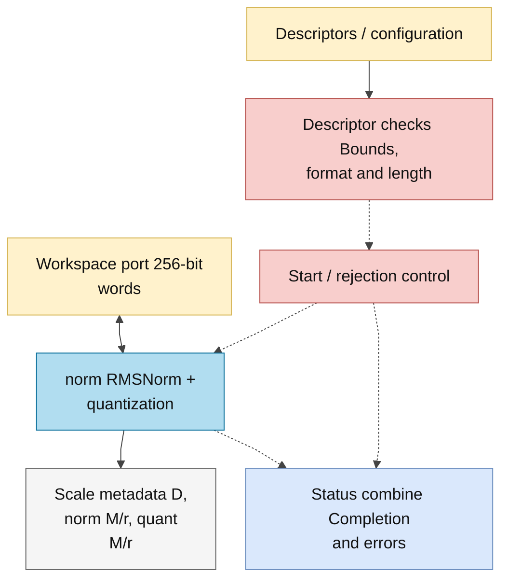

# norm_dispatch.sv — Kiểm tra descriptor trước NORM

> **Category: GUIDE. Scope: LEGACY.** RTL is authoritative; diagrams use the [shared visual style](../../diagrams/diagram_style.md).
[Tài liệu](../../README.md) → [Hierarchy RTL](<../legacy/README.md>) → [Mục lục từng file](README.md)

**Trạng thái:** Đang dùng.

**Source:** [norm_dispatch.sv](<../../../Verilog%20Source%20code/norm_dispatch.sv>).

## At a glance

| Item | Description |
|---|---|
| Responsibility | Wrapper này kiểm tra nguồn S16, đích S8, length bằng nhau và descriptor nằm trong workspace. Core norm bên trong tiếp tục kiểm tra scratch, overlap và tham số thuật toán. frac_bits không được chuyển trực tiếp vào core norm; epsilon phải đã được host quy đổi. |

## Sơ đồ kiến trúc tổng quan

## Main flow

Nếu descriptor hợp lệ, chuyển start đến norm. Nếu không, rejected phát một pulse để done và format_error cùng lên, tránh scheduler chờ vô hạn một core chưa được start. Khi rejected=1, wrapper mask `core_overflow` về 0 vì giao dịch bị từ chối không thực hiện số học; cờ còn giữ từ lần core chạy trước không được gán cho lệnh mới.

1. Wrapper kiểm tra source/destination nằm trong workspace, source S16, destination S8 và length bằng nhau.
2. Descriptor sai không được start norm. `rejected` tạo pulse done/error và overflow=0 để scheduler không chờ vô hạn hoặc lấy nhầm overflow của lần chạy trước.
3. Descriptor hợp lệ được đổi thành base/K; scratch, epsilon và delta đến từ control register top.
4. Norm core kiểm tra overlap chi tiết rồi trả output, D và hai cặp M/r.

## Important state / datapath groups

### [Dòng 1–30: Giao diện](<../../../Verilog%20Source%20code/norm_dispatch.sv#L1>)

**Mục đích.** Base scratch và các control scalar đi kèm địa chỉ tensor.

**Cách phần code hoạt động.** Nhóm này định nghĩa giao diện, độ rộng, kiểu hoặc tín hiệu trung gian. Nó tạo cấu trúc để các nhóm xử lý sau sử dụng, chưa tự biểu diễn một bước runtime riêng.

**Tín hiệu và dữ liệu chính.** `start`: yêu cầu bắt đầu giao dịch; `src_desc`: metadata tensor nguồn; `dst_desc`: metadata tensor đích; `scratch_z_base`: word đầu scratch z; `epsilon_raw32`: epsilon theo đơn vị raw-square có 32 fractional bit; `delta_raw`: cận dưới khác 0 cho D; và 18 tín hiệu phụ khác trong đoạn code.

### [Dòng 31–44: Reject handshake](<../../../Verilog%20Source%20code/norm_dispatch.sv#L31>)

**Mục đích.** invalid là tổ hợp; rejected được chốt một cycle để báo lệnh bị từ chối. `overflow=core_overflow && !rejected` ngăn overflow cũ đi kèm completion của descriptor bị reject.

**Cách phần code hoạt động.** Có logic tuần tự: register/FSM chỉ cập nhật tại cạnh clock; nonblocking assignment đọc giá trị cũ ở vế phải rồi chốt đồng thời. Có logic tổ hợp: output/intermediate được tính từ input hiện tại; các giá trị mặc định đầu khối giúp tránh suy ra latch. Có continuous assignment: biểu thức luôn lái tín hiệu đích, không cần start hoặc cạnh clock.

**Tín hiệu và dữ liệu chính.** `invalid`: descriptor/operation bị từ chối; `src_desc`: metadata tensor nguồn; `dst_desc`: metadata tensor đích; `length`: số phần tử tensor; `rejected`: xung báo lệnh NORM bị reject; `start`: yêu cầu bắt đầu giao dịch; và 3 tín hiệu phụ khác trong đoạn code.

### [Dòng 45–72: Nối core](<../../../Verilog%20Source%20code/norm_dispatch.sv#L45>)

**Mục đích.** Chuyển descriptor thành base/K và đưa data/status giữa norm và top. Overflow từ core đi vào `core_overflow`, rồi qua mask rejection trước khi trả wrapper output.

**Cách phần code hoạt động.** Có instance module con; named-port ở nhóm này xác định chính xác đường control/data giữa hai cấp hierarchy.

**Tín hiệu và dữ liệu chính.** `start`: yêu cầu bắt đầu giao dịch; `invalid`: descriptor/operation bị từ chối; `x_base`: base input S16; `src_desc`: metadata tensor nguồn; `base_word`: địa chỉ word 256 đầu tensor; `z_base`: base scratch z; và 23 tín hiệu phụ khác trong đoạn code.
