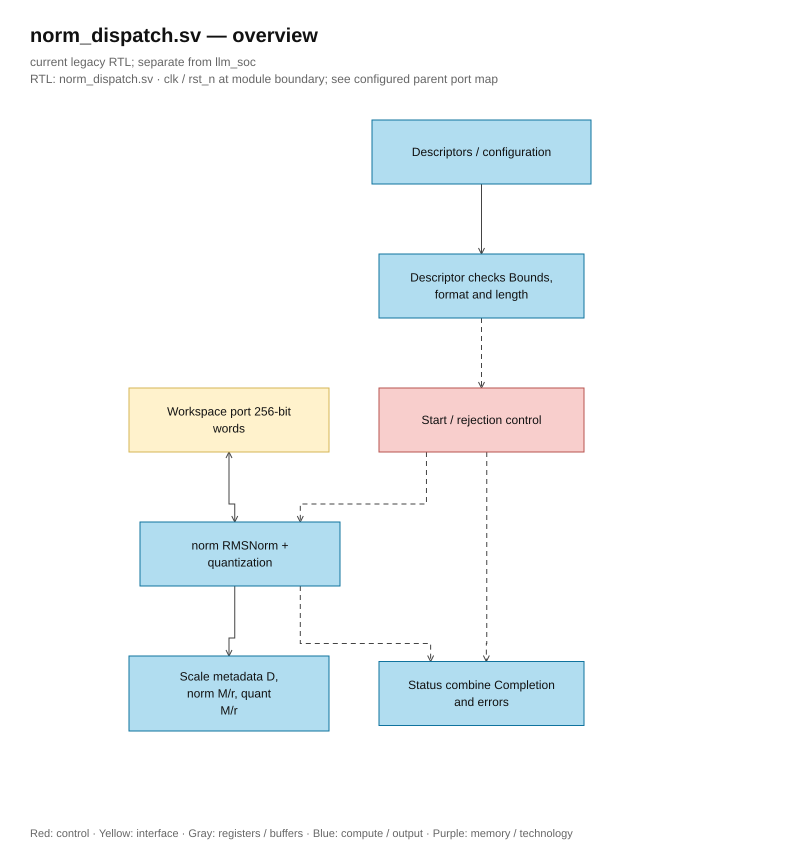

# norm_dispatch.sv — Check descriptor before NORM

<!-- reading-navigation:start -->
[Documentation](../../README.md) → [Archive · Legacy](../../archive/README.md) → [Module catalog](README.md)

| Reading guide | Document |
|---|---|
| New to the subject | [NPU and RTL fundamentals](../../00-start-here/fundamentals.md) · [Glossary](../../00-start-here/glossary.md) |
| Read first | [Legacy architecture](../../design/legacy/architecture.md) |
| Related implementation | [norm.sv](norm.sv.md) |
<!-- reading-navigation:end -->

> **Category: GUIDE. Scope: LEGACY.** RTL is authoritative; diagrams use the [shared visual style](../../diagrams/diagram_style.md).

**Status:** In use.

**Source:** [norm_dispatch.sv](<../../../Verilog%20Source%20code/norm_dispatch.sv>).

## At a glance

| Item | Description |
|---|---|
| Responsibility | This wrapper checks that the source is S16, the destination is S8, the lengths are equal, and the descriptor is within the workspace. The internal core norm continues to check the scratch, overlap, and algorithm parameters. frac_bits should not be passed directly into the core norm; epsilon must be converted by the host. |

## Overall architecture diagram

[Editable draw.io — norm_dispatch.sv — overview](../../diagrams/architecture.drawio) · Page `46_norm_dispatch.sv_1`.

## Main flow

If the descriptor is valid, transfer start to norm. If not, rejected issues a pulse so that done and format_error both go high, preventing the scheduler from waiting indefinitely for a core that hasn't been started. When rejected=1, the wrapper masks `core_overflow` to 0 because the rejected transaction does not perform arithmetic; the flag retained from the previous core run is not assigned to the new instruction.

1. The wrapper checks whether the source/destination is within the workspace, source is S16, destination is S8, and the lengths are equal.
2. An incorrect descriptor is not allowed to start norm. `rejected` generates a done/error pulse and overflow=0 so that the scheduler does not wait indefinitely or take the overflow from the previous run by mistake.
3. A valid descriptor is converted to base/K; scratch, epsilon, and delta come from the top control register.
4. The norm core checks detail overlap and then returns output, D, and two M/r pairs.

## Important state / datapath groups

### [Lines 1–30: Interface](<../../../Verilog%20Source%20code/norm_dispatch.sv#L1>)

**Purpose.** Base scratch and control scalars accompanying the tensor address.

**How the code part works.** This group defines interface, width, type, or intermediate signals. It creates a structure for subsequent processing groups to use, without yet representing a separate runtime step.

**Main signals and data.** `start`: request to start a transaction; `src_desc`: source tensor metadata; `dst_desc`: destination tensor metadata; `scratch_z_base`: scratch z word; `epsilon_raw32`: epsilon in raw-square units with 32 fractional bits; `delta_raw`: non-zero lower bound for D; and 18 other auxiliary signals in the code snippet.

### [Lines 31–44: Reject handshake](<../../../Verilog%20Source%20code/norm_dispatch.sv#L31>)

**Purpose.** invalid is the combination; rejected is latched for one cycle to indicate the command was rejected. `overflow=core_overflow && !rejected` prevents old overflow along with the completion of the rejected descriptor.

**How the code sections work.** There is sequential logic: register/FSM only updates on the clock edge; nonblocking assignment reads the old value on the right-hand side and then latches simultaneously. There is combinational logic: output/intermediate is calculated from the current input; default values at the start of the block help avoid latch inference. There is continuous assignment: the expression always drives the target signal, no need for start or clock edge.

**Main signals and data.** `invalid`: descriptor/operation is rejected; `src_desc`: source tensor metadata; `dst_desc`: destination tensor metadata; `length`: number of tensor elements; `rejected`: NORM command pulse is rejected; `start`: request to start transaction; and 3 other auxiliary signals in the code segment.

### [Lines 45–72: Connect core](<../../../Verilog%20Source%20code/norm_dispatch.sv#L45>)

**Purpose.** Convert descriptors into base/K and transfer data/status between norm and top. Overflow from the core goes into `core_overflow`, then through mask rejection before returning the wrapper output.

**How the code part works.** There is a submodule instance; the named port in this group precisely determines the control/data path between the two hierarchy levels.

**Main signals and data.** `start`: request to start a transaction; `invalid`: descriptor/operation rejected; `x_base`: base input S16; `src_desc`: source metadata tensor; `base_word`: word 256 address of the tensor; `z_base`: base scratch z; and 23 other auxiliary signals in the code segment.
