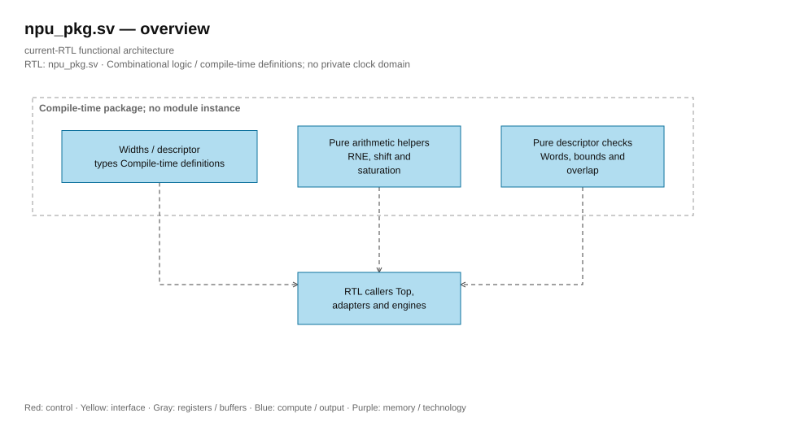
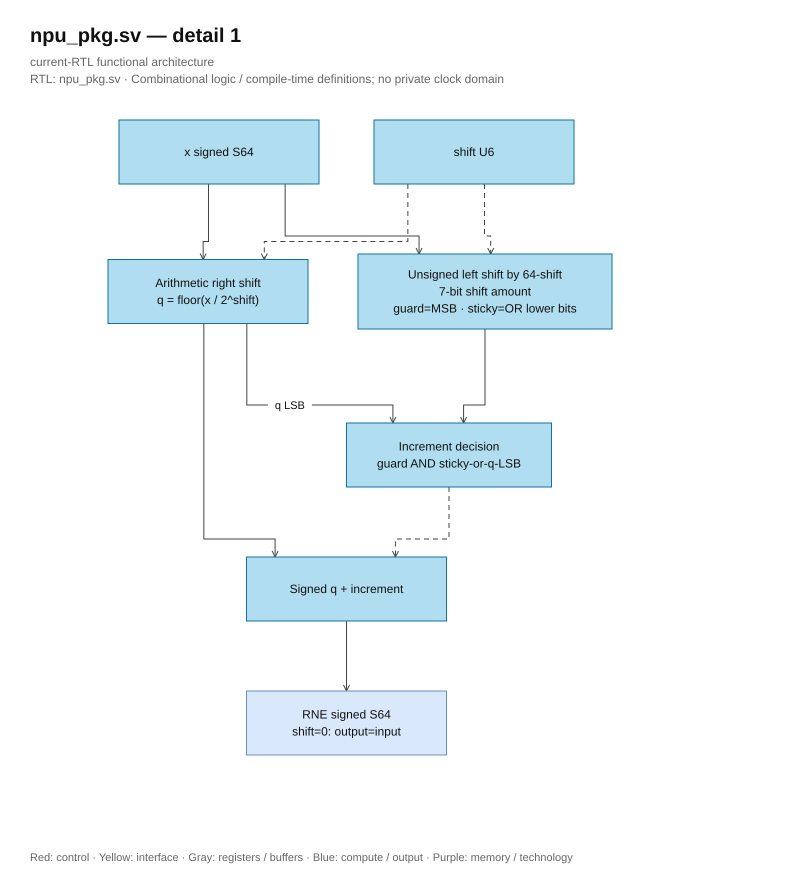

# npu_pkg.sv — Data types, saturation, and rounding

<!-- reading-navigation:start -->
[Documentation](../../README.md) → [02 · Architecture](../../02-architecture/README.md) → [Module catalog](README.md)

| Reading guide | Document |
|---|---|
| Read first | [Full RTL graph](../full_graph.md) |
| Related implementation | [llm_pkg.sv](llm_pkg.sv.md) |
<!-- reading-navigation:end -->

> **Category: GUIDE. Scope: CURRENT (may also have legacy callers).** RTL is authoritative; diagrams use the [shared visual style](../../diagrams/diagram_style.md).

**Status:** In use — common package.

**Source:** [npu_pkg.sv](<../../../Verilog%20Source%20code/npu_pkg.sv>).

## At a glance

| Item | Description |
|---|---|
| Responsibility | Package standardizes tensor format, layout descriptor, and arithmetic functions. This is the place to read before the datapaths. `logic signed` has the sign bit within the recorded width; S16 includes the sign bit. `struct packed` combines fields into a continuous bit vector in declaration order. |

## Overall Architecture Diagram

[Editable draw.io — npu_pkg.sv — overview](../../diagrams/architecture.drawio) · Page `47_npu_pkg.sv_1`.

## Main flow

`sat_s16/sat_s32` clamps to the display domain. `rne_shift64` performs signed division to create the floor quotient, then uses guard/sticky/LSB to decide whether to add one; the result is ties-to-even for both positive and negative numbers. `rne_shift42` is the width-correct version for postscale S42 multiplication; shift ≥ 42 returns zero with ties-to-even. `scale_shift64` uses RNE S64 when dividing by 2^shift, or left shift when needing to increase raw scale. Workspace check functions calculate the number of words using rounding-up division.

1. Parameters defining the design margins: 256-bit word, 32 ternary lanes, two vector lanes, and a maximum K of 512. Some modules still have literals according to this configuration, so changing the package alone is not enough to reconfigure the entire chip.
2. The workspace descriptor describes address, length, format, and F_t. The matrix descriptor describes weight, bias, K, number of rows, and postscale.
3. `rne_shift64` starts from `q = x >>> shift`. The discarded bits represent the non-negative remainder relative to the floor quotient; the guard/sticky and parity of q determine whether to increase the quotient to select the nearest number, ties-to-even.
4. `sat_s16/sat_s32` clamps after S64 arithmetic, avoiding wrap-around when taking the low bits.
5. `ws_words`, `ws_valid`, and `ranges_overlap` are the memory check layer used by multiple shared execution units.

**Optimized 01/10.** RNE removed two circuits for magnitude sign change and mask in `(1<<shift)-1` format. Left shift raw input with shift amount 7 bits `64-shift` brings the remainder to the MSB to get guard/sticky bits. When shift=0, the 64-bit shift yields zero, so increment=0. All variables are assigned on all paths, ensuring full definition for combinational logic. Regression compared 37,189 cases against independent division/remainder, including S64 min/max and all shifts 0..63.

## Important state / datapath groups

### [Lines 1–17: General parameters](<../../../Verilog%20Source%20code/npu_pkg.sv#L1>)

**Purpose.** 256-bit SRAM, 32 ternary lanes, 2 vector lanes, maximum K 512. Changing individual constants is not enough to reconfigure the entire RTL because some blocks still have fixed widths.

**How this part of the code works.** This group defines interfaces, width, type, or intermediate signals. It creates structures for subsequent processing groups to use, without representing a separate runtime step itself.

### [Lines 18–46: Format and descriptor](<../../../Verilog%20Source%20code/npu_pkg.sv#L18>)

**Purpose.** Length is the number of elements. Matrix rows start on word boundaries; S32 bias packs 8 elements per word.

**Main signals and data.** `base_word`: first 256-word address of the tensor; `length`: number of tensor elements; `frac_bits`: number of fractional bits of input; `reserved`: reserved bit or extension flag according to descriptor type; `weight_base`: base 256-word of weight; `bias_base`: base 256-word of bias; and 5 other auxiliary signals in this code section.

### [Lines 47–58: Saturation](<../../../Verilog%20Source%20code/npu_pkg.sv#L47>)

**Purpose.** Compare in S64 before taking the lower bits, avoiding wrap-around.

**How the code works.** There is a combinational function reused at the call site; the function does not maintain state across cycles.

**Main signals and data.** `x`: input value of the arithmetic function.

### [Lines 59–83: RNE](<../../../Verilog%20Source%20code/npu_pkg.sv#L59>)

**Purpose.** Guard is the bit immediately below the retained part. Sticky OR the lower bits; when exactly half a unit, only increment if the LSB is odd.

**Main signals and data.** `x`: input S64; `shift`: bit number ranging 0..63; `q`: floor quotient S64; `discarded`: remainder bits shifted to MSB; `guard`: most significant remainder bit; `sticky`: OR of lower remainder bits; `inc`: guard && (sticky || q[0]).

**Points to read carefully.** Division must be arithmetic to produce floor even for negative numbers: −3/2 has q=−2 and remainder 1. Tie keeps −2 because q is even; −5/2 has q=−3 odd so add one to get −2. This method avoids taking abs(S64 min) in the datapath.

#### Hardware block diagram of the group

[Editable draw.io — npu_pkg.sv — detail 1](../../diagrams/architecture.drawio) · Page `48_npu_pkg.sv_2`.

### [Lines 84–102: RNE at width S42](<../../../Verilog%20Source%20code/npu_pkg.sv#L84>)

**Purpose.** rne_shift42 maintains signed-floor, guard/sticky/parity on the postscale product S42. With shift≥42, the entire S42 domain rounds toward zero; the smallest value at shift=42 is tie −0.5 and chooses even zero. Does not replace RNE S64 in NORM/rowwise.

**Operation.** Barrel shifter and add-one use 42-bit width. Combinational function assigns enough intermediate signals, adding no latency; ternary_mul places registers at the call site. Postscale regression compares with S128 reference at all shifts 0…63.

### [Lines 103–112: Change scale](<../../../Verilog%20Source%20code/npu_pkg.sv#L103>)

**Purpose.** Positive shift divides and RNE; negative shift multiplies squared. Caller must ensure that the shift range and operand do not overflow.

**Signals and main data.** `x`: input value of the arithmetic function; `shift`: shift to represent scale; the meaning of the sign according to the function being used.

### [Lines 113–128: Memory check](<../../../Verilog%20Source%20code/npu_pkg.sv#L113>)

**Purpose.** Calculate ceil(length/elements_per_word), check the end of the SRAM region and the intersection of two half-open intervals [base, base+size).

**Signals and main data.** `length`: number of tensor elements; `frac_bits`: number of fractional input bits; `base_word`: address of the first 256-word tensor; `a`: operand A; `b`: operand B.
