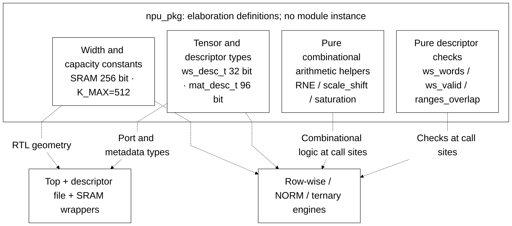
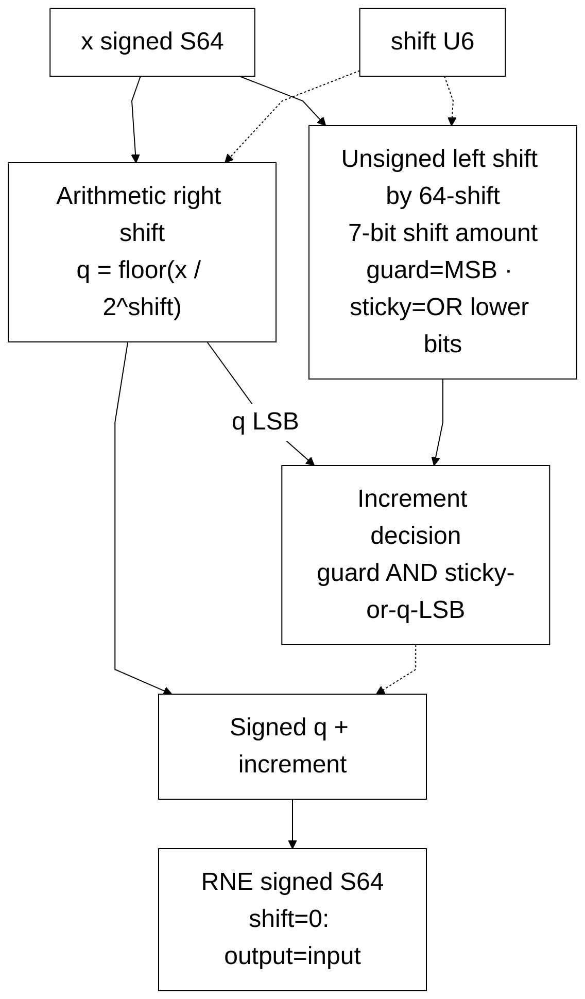

# npu_pkg.sv — Kiểu dữ liệu, saturation và rounding

> **Category: GUIDE. Scope: CURRENT (may also have legacy callers).** RTL is authoritative; diagrams are preserved from the existing guide.
[Tài liệu](../../README.md) → [Source guide](../README.md) → [Mục lục từng file](README.md)

**Trạng thái:** Đang dùng — package chung.

**Source:** [npu_pkg.sv](<../../../Verilog%20Source%20code/npu_pkg.sv>).

## At a glance

| Item | Description |
|---|---|
| Responsibility | Package thống nhất format tensor, layout descriptor và các hàm số học. Đây là chỗ nên đọc trước các datapath. `logic signed` có sign bit nằm trong độ rộng đã ghi; S16 gồm cả bit dấu. `struct packed` ghép các trường thành một vector bit liên tục theo thứ tự khai báo. |

## Sơ đồ kiến trúc tổng quan

## Main flow

`sat_s16/sat_s32` clamp về miền biểu diễn. `rne_shift64` dịch phải số có dấu để tạo thương floor, rồi dùng guard/sticky/LSB quyết định cộng một; kết quả là ties-to-even cho cả số dương và âm. `rne_shift42` là bản đúng độ rộng cho tích postscale S42; shift≥42 trả zero với ties-to-even. `scale_shift64` dùng RNE S64 khi chia cho 2^shift, hoặc shift trái khi phải tăng scale raw. Các hàm kiểm tra workspace tính số word bằng phép chia làm tròn lên.

1. Các parameter xác định biên thiết kế: word 256 bit, 32 ternary lane, hai vector lane và K tối đa 512. Một số module vẫn có literal theo cấu hình này, nên đổi package chưa đủ để tái cấu hình toàn chip.
2. Workspace descriptor mô tả địa chỉ, length, format và F_t. Matrix descriptor mô tả weight, bias, K, số hàng và postscale.
3. `rne_shift64` bắt đầu từ `q = x >>> shift`. Các bit bị bỏ biểu diễn phần dư không âm so với thương floor; guard/sticky và parity của q quyết định tăng thương để chọn số gần nhất, ties-to-even.
4. `sat_s16/sat_s32` clamp sau số học S64, tránh wrap-around khi lấy bit thấp.
5. `ws_words`, `ws_valid` và `ranges_overlap` là lớp kiểm tra memory được nhiều execution unit dùng chung.

**Tối ưu 01/10.** RNE bỏ hai mạch đổi dấu magnitude và mask dạng `(1<<shift)-1`. Dịch trái raw input với shift amount 7 bit `64-shift` đưa phần dư lên MSB để lấy guard/sticky. Khi shift=0, phép dịch 64 bit cho zero, nên increment=0. Mọi biến được gán trên mọi path, giúp logic tổ hợp có định nghĩa đầy đủ. Regression đối chiếu 37.189 trường hợp với phép chia/phần dư độc lập, gồm S64 min/max và mọi shift 0..63.

## Important state / datapath groups

### [Dòng 1–17: Thông số chung](<../../../Verilog%20Source%20code/npu_pkg.sv#L1>)

**Mục đích.** SRAM 256 bit, 32 ternary lane, 2 vector lane, K tối đa 512. Thay hằng số riêng lẻ chưa đủ để tái cấu hình toàn RTL vì một số khối còn width cố định.

**Cách phần code hoạt động.** Nhóm này định nghĩa giao diện, độ rộng, kiểu hoặc tín hiệu trung gian. Nó tạo cấu trúc để các nhóm xử lý sau sử dụng, chưa tự biểu diễn một bước runtime riêng.

### [Dòng 18–46: Format và descriptor](<../../../Verilog%20Source%20code/npu_pkg.sv#L18>)

**Mục đích.** Length là số phần tử. Matrix row bắt đầu trên ranh giới word; bias S32 pack 8 phần tử/word.

**Tín hiệu và dữ liệu chính.** `base_word`: địa chỉ word 256 đầu tensor; `length`: số phần tử tensor; `frac_bits`: số bit phần lẻ của input; `reserved`: bit để dành hoặc flag mở rộng theo loại descriptor; `weight_base`: base word 256 của weight; `bias_base`: base word 256 của bias; và 5 tín hiệu phụ khác trong đoạn code.

### [Dòng 47–58: Saturation](<../../../Verilog%20Source%20code/npu_pkg.sv#L47>)

**Mục đích.** So sánh trong S64 trước khi lấy bit thấp, tránh wrap-around.

**Cách phần code hoạt động.** Có function tổ hợp dùng lại tại nơi gọi; function không giữ trạng thái qua các chu kỳ.

**Tín hiệu và dữ liệu chính.** `x`: giá trị đầu vào hàm số học.

### [Dòng 59–83: RNE](<../../../Verilog%20Source%20code/npu_pkg.sv#L59>)

**Mục đích.** Guard là bit ngay dưới phần giữ lại. Sticky OR các bit thấp hơn; khi đúng nửa đơn vị, chỉ tăng nếu LSB đang lẻ.

**Tín hiệu và dữ liệu chính.** `x`: input S64; `shift`: số bit chia 0..63; `q`: thương floor S64; `discarded`: các bit phần dư được đưa lên MSB; `guard`: bit phần dư cao nhất; `sticky`: OR các bit phần dư thấp hơn; `inc`: guard && (sticky || q[0]).

**Điểm cần đọc kỹ.** Dịch phải arithmetic tạo floor ngay cả với số âm: −3/2 có q=−2 và phần dư 1. Tie giữ −2 vì q chẵn; −5/2 có q=−3 lẻ nên cộng một thành −2. Cách này tránh lấy abs(S64 min) trong datapath.

#### Sơ đồ khối phần cứng của nhóm

### [Dòng 84–102: RNE đúng độ rộng S42](<../../../Verilog%20Source%20code/npu_pkg.sv#L84>)

**Mục đích.** rne_shift42 giữ signed-floor, guard/sticky/parity trên tích postscale S42. Với shift≥42, toàn miền S42 làm tròn về zero; giá trị nhỏ nhất ở shift=42 là tie −0,5 và chọn số chẵn zero. Không thay thế RNE S64 ở NORM/rowwise.

**Cách hoạt động.** Barrel shifter và cộng một dùng độ rộng 42 bit. Hàm tổ hợp gán đủ intermediate, không thêm latency; ternary_mul đặt register tại nơi gọi. Regression postscale đối chiếu với reference S128 ở mọi shift 0…63.

### [Dòng 103–112: Đổi scale](<../../../Verilog%20Source%20code/npu_pkg.sv#L103>)

**Mục đích.** Shift dương chia và RNE; shift âm nhân lũy thừa hai. Caller phải bảo đảm miền shift và operand không tràn.

**Tín hiệu và dữ liệu chính.** `x`: giá trị đầu vào hàm số học; `shift`: độ dịch để biểu diễn scale; ý nghĩa dấu theo hàm đang dùng.

### [Dòng 113–128: Kiểm tra memory](<../../../Verilog%20Source%20code/npu_pkg.sv#L113>)

**Mục đích.** Tính ceil(length/elements_per_word), kiểm tra cuối vùng SRAM và phép giao nhau của hai khoảng nửa mở [base, base+size).

**Tín hiệu và dữ liệu chính.** `length`: số phần tử tensor; `frac_bits`: số bit phần lẻ của input; `base_word`: địa chỉ word 256 đầu tensor; `a`: operand A; `b`: operand B.
