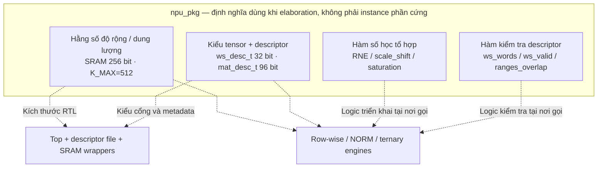
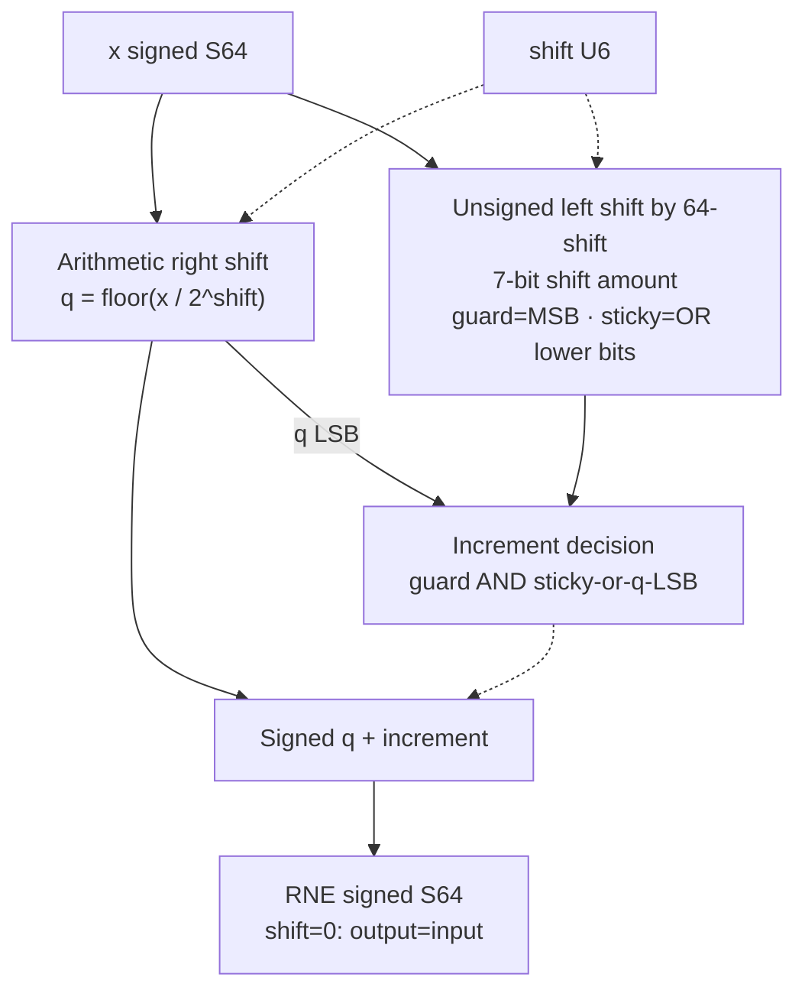

# npu_pkg.sv — Kiểu dữ liệu, saturation và rounding

[Tài liệu](../../README.md) → [Hierarchy RTL](../README.md) → [Mục lục từng file](README.md)

**Trạng thái:** Đang dùng — package chung.

**Source:** [npu_pkg.sv](<../../../Verilog%20Source%20code/npu_pkg.sv>). **Số dòng:** 128. **SHA-256:** `f2914bb24c72644edbf2b57e5eabad9a4f3dbf88d2dd72b79285ccdf8e2b2d86`.

## Khối này làm gì?

Package thống nhất format tensor, layout descriptor và các hàm số học. Đây là chỗ nên đọc trước các datapath. `logic signed` có sign bit nằm trong độ rộng đã ghi; S16 gồm cả bit dấu. `struct packed` ghép các trường thành một vector bit liên tục theo thứ tự khai báo.

## Sơ đồ kiến trúc tổng quan



MUX dùng hình thang rộng ở phía nhiều ngõ vào và thu hẹp về ngõ ra; decoder/demux dùng hình thang ngược lại, mở rộng về phía nhiều ngõ ra. Hình chữ nhật có các vạch ngang biểu diễn bộ nhớ hoặc bank descriptor. Các hình chữ nhật thường là datapath, thanh ghi đơn hoặc giao diện. Nét liền là đường dữ liệu, nét đứt là điều khiển/cấu hình. Mũi tên hồi tiếp biểu diễn kết nối phần cứng. Sơ đồ không biểu diễn thứ tự chu kỳ, trạng thái FSM hoặc các tầng pipeline CPU. Đây là sơ đồ quan hệ định nghĩa RTL: package không tạo một instance phần cứng riêng. Các hàm tổ hợp được triển khai tại từng nơi gọi, không hàm ý một bộ số học dùng chung.

## Cách hoạt động chi tiết

`sat_s16/sat_s32` clamp về miền biểu diễn. `rne_shift64` dịch phải số có dấu để tạo thương floor, rồi dùng guard/sticky/LSB quyết định cộng một; kết quả là ties-to-even cho cả số dương và âm. `rne_shift42` là bản đúng độ rộng cho tích postscale S42; shift≥42 trả zero với ties-to-even. `scale_shift64` dùng RNE S64 khi chia cho 2^shift, hoặc shift trái khi phải tăng scale raw. Các hàm kiểm tra workspace tính số word bằng phép chia làm tròn lên.

1. Các parameter xác định biên thiết kế: word 256 bit, 32 ternary lane, hai vector lane và K tối đa 512. Một số module vẫn có literal theo cấu hình này, nên đổi package chưa đủ để tái cấu hình toàn chip.
2. Workspace descriptor mô tả địa chỉ, length, format và F_t. Matrix descriptor mô tả weight, bias, K, số hàng và postscale.
3. `rne_shift64` bắt đầu từ `q = x >>> shift`. Các bit bị bỏ biểu diễn phần dư không âm so với thương floor; guard/sticky và parity của q quyết định tăng thương để chọn số gần nhất, ties-to-even.
4. `sat_s16/sat_s32` clamp sau số học S64, tránh wrap-around khi lấy bit thấp.
5. `ws_words`, `ws_valid` và `ranges_overlap` là lớp kiểm tra memory được nhiều execution unit dùng chung.

**Tối ưu 01/10.** RNE bỏ hai mạch đổi dấu magnitude và mask dạng `(1<<shift)-1`. Dịch trái raw input với shift amount 7 bit `64-shift` đưa phần dư lên MSB để lấy guard/sticky. Khi shift=0, phép dịch 64 bit cho zero, nên increment=0. Mọi biến được gán trên mọi path, giúp logic tổ hợp có định nghĩa đầy đủ. Regression đối chiếu 37.189 trường hợp với phép chia/phần dư độc lập, gồm S64 min/max và mọi shift 0..63.

## Các nhóm logic trong source

Source được chia theo chức năng. Mỗi nhóm giữ nguyên phạm vi dòng để đối chiếu, nhưng phần giải thích tập trung vào quan hệ giữa các câu lệnh thay vì lặp lại từng dấu ngoặc, khai báo hoặc phép gán.


### [Dòng 1–17: Thông số chung](<../../../Verilog%20Source%20code/npu_pkg.sv#L1>)

<!-- source-range:1:17 -->
```systemverilog
package npu_pkg;
    parameter int SRAM_W = 256;
    parameter int PARAM_AW = 10;
    parameter int WORK_AW = 8;
    parameter int PARAM_DEPTH = 1 << PARAM_AW; // 1024 words = 32 KiB
    parameter int WORK_DEPTH = 1 << WORK_AW; // 256 words = 8 KiB

    parameter int ACT_W = 8;
    parameter int STATE_W = 16;
    parameter int WEIGHT_W = 2;
    parameter int DOT_LANES = 32;
    parameter int VEC_LANES = 2;
    parameter int ACC_W = 18;
    parameter int K_MAX = 512;

    parameter int M_W = 24;
    parameter int SHIFT_W = 6;
```

**Mục đích.** SRAM 256 bit, 32 ternary lane, 2 vector lane, K tối đa 512. Thay hằng số riêng lẻ chưa đủ để tái cấu hình toàn RTL vì một số khối còn width cố định.

**Cách phần code hoạt động.** Nhóm này định nghĩa giao diện, độ rộng, kiểu hoặc tín hiệu trung gian. Nó tạo cấu trúc để các nhóm xử lý sau sử dụng, chưa tự biểu diễn một bước runtime riêng.


### [Dòng 18–46: Format và descriptor](<../../../Verilog%20Source%20code/npu_pkg.sv#L18>)

<!-- source-range:18:46 -->
```systemverilog

    typedef enum logic [1:0] {
    FMT_S8 = 2'h0,
    FMT_S16 = 2'h1,
    FMT_U16 = 2'h2,
    FMT_S32 = 2'h3
    } tensor_fmt_t;

    // Workspace descriptor. length counts logical elements, not SRAM words.
    typedef struct packed {
    logic [7:0] base_word;
    logic [9:0] length;
    tensor_fmt_t fmt;
    logic [4:0] frac_bits;
    logic [6:0] reserved;
    } ws_desc_t; // 32 bits

    // Ternary matrix descriptor. Each output row begins on a 256-bit word boundary.
    // Weight rows use ceil(K/128) words. Biases are S32, 8 values/word.
    typedef struct packed {
    logic [9:0] weight_base;
    logic [9:0] bias_base;
    logic [9:0] k_len;
    logic [9:0] n_rows;
    logic [23:0] scale_m;
    logic [5:0] scale_r;
    logic output_s32; // 0: saturate to S16, 1: saturate to S32
    logic [24:0] reserved; // bit0: dynamic q scale; bit1: no bias
    } mat_desc_t; // 96 bits
```

**Mục đích.** Length là số phần tử. Matrix row bắt đầu trên ranh giới word; bias S32 pack 8 phần tử/word.

**Cách phần code hoạt động.** Nhóm này định nghĩa giao diện, độ rộng, kiểu hoặc tín hiệu trung gian. Nó tạo cấu trúc để các nhóm xử lý sau sử dụng, chưa tự biểu diễn một bước runtime riêng.

**Tín hiệu và dữ liệu chính.** `base_word`: địa chỉ word 256 đầu tensor; `length`: số phần tử tensor; `frac_bits`: số bit phần lẻ của input; `reserved`: bit để dành hoặc flag mở rộng theo loại descriptor; `weight_base`: base word 256 của weight; `bias_base`: base word 256 của bias; và 5 tín hiệu phụ khác trong đoạn code.


### [Dòng 47–58: Saturation](<../../../Verilog%20Source%20code/npu_pkg.sv#L47>)

<!-- source-range:47:58 -->
```systemverilog

    function automatic logic signed [15:0] sat_s16(input logic signed [63:0] x);
        if (x > 64'sh0000_0000_0000_7fff) sat_s16 = 16'sh7fff;
        else if (x < - 64'sh0000_0000_0000_8000) sat_s16 = 16'sh8000;
        else sat_s16 = x[15:0];
    endfunction

    function automatic logic signed [31:0] sat_s32(input logic signed [63:0] x);
        if (x > 64'sh0000_0000_7fff_ffff) sat_s32 = 32'sh7fff_ffff;
        else if (x < - 64'sh0000_0000_8000_0000) sat_s32 = 32'sh8000_0000;
        else sat_s32 = x[31:0];
    endfunction
```

**Mục đích.** So sánh trong S64 trước khi lấy bit thấp, tránh wrap-around.

**Cách phần code hoạt động.** Có function tổ hợp dùng lại tại nơi gọi; function không giữ trạng thái qua các chu kỳ.

**Tín hiệu và dữ liệu chính.** `x`: giá trị đầu vào hàm số học.


### [Dòng 59–83: RNE](<../../../Verilog%20Source%20code/npu_pkg.sv#L59>)

<!-- source-range:59:83 -->
```systemverilog

    // Round-to-nearest-even signed arithmetic right shift, including shift=0.
    // Arithmetic shift gives floor(x/2^shift); discarded bits encode its remainder.
    function automatic logic signed [63:0] rne_shift64(
            input logic signed [63:0] x,
            input logic [5:0] shift
        );
        logic signed [63:0] q;
        logic [63:0] discarded;
        logic guard;
        logic sticky;
        logic inc;
        begin
            // A 7-bit shift amount represents 64: shift=0 discards no bits.
            // This avoids magnitude/sign negators and a variable subtract-one mask.
            q = x >>> shift;
            discarded = $unsigned(x) << (7'd64 - {1'b0, shift});
            guard = discarded[63];
            sticky = |discarded[62:0];
            inc = guard && (sticky || q[0]);
            rne_shift64 = q + $signed({63'h0, inc});
        end
    endfunction

    // RNE for the signed 42-bit postscale product. At shift >= 42 every
```

**Mục đích.** Guard là bit ngay dưới phần giữ lại. Sticky OR các bit thấp hơn; khi đúng nửa đơn vị, chỉ tăng nếu LSB đang lẻ.

**Cách phần code hoạt động.** Có function tổ hợp dùng lại tại nơi gọi; function không giữ trạng thái qua các chu kỳ.

**Tín hiệu và dữ liệu chính.** `x`: input S64; `shift`: số bit chia 0..63; `q`: thương floor S64; `discarded`: các bit phần dư được đưa lên MSB; `guard`: bit phần dư cao nhất; `sticky`: OR các bit phần dư thấp hơn; `inc`: guard && (sticky || q[0]).

**Điểm cần đọc kỹ.** Dịch phải arithmetic tạo floor ngay cả với số âm: −3/2 có q=−2 và phần dư 1. Tie giữ −2 vì q chẵn; −5/2 có q=−3 lẻ nên cộng một thành −2. Cách này tránh lấy abs(S64 min) trong datapath.

#### Sơ đồ khối phần cứng của nhóm




### [Dòng 84–102: RNE đúng độ rộng S42](<../../../Verilog%20Source%20code/npu_pkg.sv#L84>)

<!-- source-range:84:102 -->
```systemverilog
    // S42 value rounds to zero, including the minimum value's even tie.
    function automatic logic signed [41:0] rne_shift42(
            input logic signed [41:0] x,
            input logic [5:0] shift
        );
        logic signed [41:0] q;
        logic [41:0] discarded;
        logic inc;
        begin
            q = x >>> shift;
            discarded = $unsigned(x) << (7'd42 - {1'b0, shift});
            inc = discarded[41] && ((|discarded[40:0]) || q[0]);
            if (shift >= 42) rne_shift42 = '0;
            else rne_shift42 = q + $signed({41'h0, inc});
        end
    endfunction

    // Shift is positive for division, negative for multiplication by a power of two.
    // Callers constrain left shifts to <=24 and operands to at most 33 signed bits.
```

**Mục đích.** rne_shift42 giữ signed-floor, guard/sticky/parity trên tích postscale S42. Với shift≥42, toàn miền S42 làm tròn về zero; giá trị nhỏ nhất ở shift=42 là tie −0,5 và chọn số chẵn zero. Không thay thế RNE S64 ở NORM/rowwise.

**Cách hoạt động.** Barrel shifter và cộng một dùng độ rộng 42 bit. Hàm tổ hợp gán đủ intermediate, không thêm latency; ternary_mul đặt register tại nơi gọi. Regression postscale đối chiếu với reference S128 ở mọi shift 0…63.

### [Dòng 103–112: Đổi scale](<../../../Verilog%20Source%20code/npu_pkg.sv#L103>)

<!-- source-range:103:112 -->
```systemverilog
    function automatic logic signed [63:0] scale_shift64(
            input logic signed [63:0] x, input integer shift
        );
        if (shift >= 0) scale_shift64 = rne_shift64(x, shift[5:0]);
        else scale_shift64 = x <<< $unsigned( - shift);
    endfunction

    function automatic integer ws_words(input ws_desc_t d);
        case (d.fmt)
            FMT_S8 : ws_words = (int'(d.length) + 31) / 32;
```

**Mục đích.** Shift dương chia và RNE; shift âm nhân lũy thừa hai. Caller phải bảo đảm miền shift và operand không tràn.

**Cách phần code hoạt động.** Có function tổ hợp dùng lại tại nơi gọi; function không giữ trạng thái qua các chu kỳ.

**Tín hiệu và dữ liệu chính.** `x`: giá trị đầu vào hàm số học; `shift`: độ dịch để biểu diễn scale; ý nghĩa dấu theo hàm đang dùng.


### [Dòng 113–128: Kiểm tra memory](<../../../Verilog%20Source%20code/npu_pkg.sv#L113>)

<!-- source-range:113:128 -->
```systemverilog
            FMT_S16, FMT_U16 : ws_words = (int'(d.length) + 15) / 16;
            default : ws_words = (int'(d.length) + 7) / 8;
        endcase
    endfunction

    function automatic logic ws_valid(input ws_desc_t d);
        ws_valid = d.length > 0 && d.length <= K_MAX && d.frac_bits <= 24 &&
        int'(d.base_word) + ws_words(d) <= WORK_DEPTH;
    endfunction

    function automatic logic ranges_overlap(input integer a, input integer an,
            input integer b, input integer bn);
        ranges_overlap = a < b + bn && b < a + an;
    endfunction

endpackage
```

**Mục đích.** Tính ceil(length/elements_per_word), kiểm tra cuối vùng SRAM và phép giao nhau của hai khoảng nửa mở [base, base+size).

**Cách phần code hoạt động.** Có function tổ hợp dùng lại tại nơi gọi; function không giữ trạng thái qua các chu kỳ.

**Tín hiệu và dữ liệu chính.** `length`: số phần tử tensor; `frac_bits`: số bit phần lẻ của input; `base_word`: địa chỉ word 256 đầu tensor; `a`: operand A; `b`: operand B.

