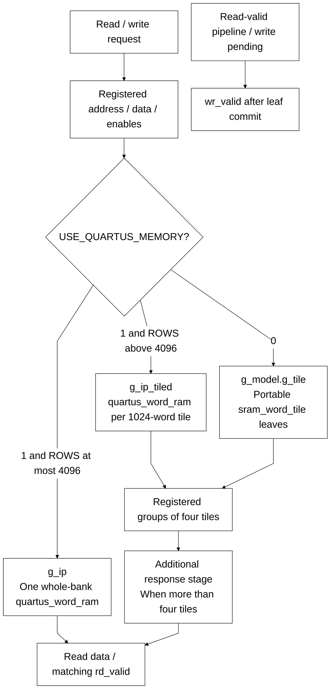

# pipelined_word_ram.sv

> **Category: GUIDE. Scope: CURRENT (may also have legacy callers).** RTL is authoritative; diagrams are preserved from the existing guide.
[Documentation](../../README.md) → [Source guide](../full_graph.md) → [RTL index](README.md)

**Source:** [pipelined_word_ram.sv](<../../../Verilog%20Source%20code/pipelined_word_ram.sv>).

## At a glance

| Item | Description |
|---|---|
| Responsibility | Replaceable SRAM adapter. USE_QUARTUS_MEMORY=1 selects 1024-word Quartus tiles when ROWS exceeds 4096, otherwise one whole-bank Quartus leaf. The portable branch uses 1024-word sram_word_tile leaves. Grouped responses preserve three-edge reads for up to four tiles and four-edge reads for larger banks. Writes commit one edge after capture; reset cancels queued enables and validity while preserving storage. |

## Sơ đồ kiến trúc

