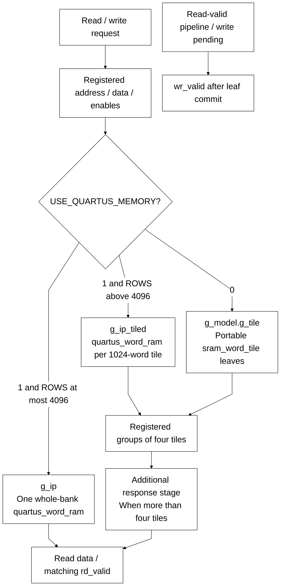

# pipelined_word_ram.sv

[Documentation](../../README.md) → [Source guide](../full_graph.md) → [RTL index](README.md)

**Source:** [pipelined_word_ram.sv](<../../../Verilog%20Source%20code/pipelined_word_ram.sv>). **Số dòng:** 173. **SHA-256:** `691f21844bfe3deae271a26e503b6d667948a70fd742d8b2d9a067039b49162a`.

## Khối này làm gì?

Replaceable SRAM adapter. USE_QUARTUS_MEMORY=1 selects 1024-word Quartus tiles when ROWS exceeds 4096, otherwise one whole-bank Quartus leaf. The portable branch uses 1024-word sram_word_tile leaves. Grouped responses preserve three-edge reads for up to four tiles and four-edge reads for larger banks. Writes commit one edge after capture; reset cancels queued enables and validity while preserving storage.

## Sơ đồ kiến trúc



## Cách hoạt động chi tiết

Replaceable SRAM adapter. USE_QUARTUS_MEMORY=1 selects 1024-word Quartus tiles when ROWS exceeds 4096, otherwise one whole-bank Quartus leaf. The portable branch uses 1024-word sram_word_tile leaves. Grouped responses preserve three-edge reads for up to four tiles and four-edge reads for larger banks. Writes commit one edge after capture; reset cancels queued enables and validity while preserving storage.

## Các nhóm logic trong source

### [Dòng 1–32: Interface, geometry and validity](<../../../Verilog%20Source%20code/pipelined_word_ram.sv#L1>)

<!-- source-range:1:32 -->
```systemverilog
// Replaceable SRAM adapter: tile requests, leaf read, grouped response.
// Read latency is three edges (<=4 tiles), otherwise four. Throughput 1/cycle.
// Writes execute one edge after request capture; same-cycle collision is old-data.
module pipelined_word_ram #(
    parameter int WIDTH = 32,
    parameter int ROWS = 4096,
    parameter int ADDR_W = $clog2(ROWS),
    parameter bit USE_QUARTUS_MEMORY = 0
) (
    input logic clk, rst_n, rd_en, wr_en,
    input logic [ADDR_W - 1:0] rd_addr, wr_addr,
    input logic [WIDTH - 1:0] wr_data,
    output logic [WIDTH - 1:0] rd_data,
    output logic rd_valid, wr_valid
);
    localparam int TILES = (ROWS + 1023) / 1024;
    localparam int GROUPS = (TILES + 3) / 4;
    logic [WIDTH - 1:0] tile_data [0:TILES - 1];
    logic [TILES - 1:0] read_tile_q;
    logic [WIDTH - 1:0] group_data_q [0:GROUPS - 1];
    logic [3:0] read_valid_q;
    logic write_pending_q;
    always_ff @(posedge clk or negedge rst_n) begin
        if (!rst_n) begin read_valid_q <= 0; write_pending_q <= 0; wr_valid <= 0; end
        else begin
            read_valid_q <= {read_valid_q[2:0], rd_en};
            write_pending_q <= wr_en;
            wr_valid <= write_pending_q;
        end
    end
    genvar tile, group_id, member, leaf, node;
    generate
```

### [Dòng 33–91: Deep Quartus tiled memory branch](<../../../Verilog%20Source%20code/pipelined_word_ram.sv#L33>)

<!-- source-range:33:91 -->
```systemverilog
    if (USE_QUARTUS_MEMORY && ROWS > 4096) begin : g_ip_tiled
        // Each deep-memory tile has a local address and enable owner. Write
        // payload is captured once per four-tile group on the same edge.
        logic [WIDTH - 1:0] write_group_q [0:GROUPS - 1];
        for (group_id = 0; group_id < GROUPS; group_id = group_id + 1) begin : g_write_payload
            always_ff @(posedge clk) write_group_q[group_id] <= wr_data;
        end
        for (tile = 0; tile < TILES; tile = tile + 1) begin : g_tile
            localparam int TILE_ROWS = (ROWS - tile * 1024 < 1024) ? ROWS - tile * 1024 : 1024;
            logic [9:0] read_address_q, write_address_q;
            logic read_enable_q, write_enable_q;
            always_ff @(posedge clk) begin
                read_address_q <= 10'(rd_addr);
                write_address_q <= 10'(wr_addr);
            end
            always_ff @(posedge clk or negedge rst_n) begin
                if (!rst_n) begin
                    read_enable_q <= 0; write_enable_q <= 0; read_tile_q[tile] <= 0;
                end else begin
                    read_enable_q <= rd_en && (rd_addr >> 10) == tile;
                    write_enable_q <= wr_en && (wr_addr >> 10) == tile;
                    read_tile_q[tile] <= read_enable_q;
                end
            end
            quartus_word_ram #(.WIDTH(WIDTH), .ROWS(TILE_ROWS), .ADDR_W(10)) u_storage(
                .clk(clk), .rd_en(rst_n && read_enable_q), .wr_en(rst_n && write_enable_q),
                .rd_addr(read_address_q), .wr_addr(write_address_q),
                .wr_data(write_group_q[tile / 4]), .rd_data(tile_data[tile]));
        end
        for (group_id = 0; group_id < GROUPS; group_id = group_id + 1) begin : g_response
            wire [WIDTH - 1:0] member_data [0:3];
            for (member = 0; member < 4; member = member + 1) begin : g_member
                if (group_id * 4 + member < TILES) begin : g_used
                    assign member_data[member] = tile_data[group_id * 4 + member] &
                        {WIDTH{read_tile_q[group_id * 4 + member]}};
                end else begin : g_padding
                    assign member_data[member] = '0;
                end
            end
            always_ff @(posedge clk)
                if (rst_n && read_valid_q[1]) group_data_q[group_id] <=
                    (member_data[0] | member_data[1]) | (member_data[2] | member_data[3]);
        end
        // A padded binary response tree retains four-edge deep read latency.
        localparam int TREE_LEAVES = 1 << $clog2(GROUPS);
        wire [WIDTH - 1:0] response_tree [1:2 * TREE_LEAVES - 1];
        for (leaf = 0; leaf < TREE_LEAVES; leaf = leaf + 1) begin : g_tree_leaf
            if (leaf < GROUPS) begin : g_used
                assign response_tree[TREE_LEAVES + leaf] = group_data_q[leaf];
            end else begin : g_padding
                assign response_tree[TREE_LEAVES + leaf] = '0;
            end
        end
        for (node = 1; node < TREE_LEAVES; node = node + 1) begin : g_tree_node
            assign response_tree[node] = response_tree[2 * node] | response_tree[2 * node + 1];
        end
        always_ff @(posedge clk)
            if (rst_n && read_valid_q[2]) rd_data <= response_tree[1];
        assign rd_valid = read_valid_q[3];
```

### [Dòng 92–116: Whole-bank Quartus memory branch](<../../../Verilog%20Source%20code/pipelined_word_ram.sv#L92>)

<!-- source-range:92:116 -->
```systemverilog
    end else if (USE_QUARTUS_MEMORY) begin : g_ip
        logic [ADDR_W - 1:0] read_address_q, write_address_q;
        (* dont_merge *) logic [WIDTH - 1:0] write_data_q;
        logic [WIDTH - 1:0] raw_data, response_q;
        (* dont_merge *) logic read_enable_q, write_enable_q;
        always_ff @(posedge clk) begin
            read_address_q <= rd_addr; write_address_q <= wr_addr;
            write_data_q <= wr_data;
            if (rst_n && read_valid_q[1]) response_q <= raw_data;
        end
        always_ff @(posedge clk or negedge rst_n)
            if (!rst_n) begin read_enable_q <= 0; write_enable_q <= 0; end
            else begin read_enable_q <= rd_en; write_enable_q <= wr_en; end
        quartus_word_ram #(.WIDTH(WIDTH), .ROWS(ROWS), .ADDR_W(ADDR_W)) u_storage(
            .clk(clk), .rd_en(rst_n && read_enable_q), .wr_en(rst_n && write_enable_q),
            .rd_addr(read_address_q), .wr_addr(write_address_q), .wr_data(write_data_q),
            .rd_data(raw_data));
        if (GROUPS == 1) begin : g_short
            assign rd_data = response_q;
            assign rd_valid = read_valid_q[2];
        end else begin : g_long
            always_ff @(posedge clk)
                if (rst_n && read_valid_q[2]) rd_data <= response_q;
            assign rd_valid = read_valid_q[3];
        end
```

### [Dòng 117–173: Portable tiled SRAM branch](<../../../Verilog%20Source%20code/pipelined_word_ram.sv#L117>)

<!-- source-range:117:173 -->
```systemverilog
    end else begin : g_model
    for (tile = 0; tile < TILES; tile = tile + 1) begin : g_tile
        localparam int TILE_ROWS = (ROWS - tile * 1024 < 1024) ? ROWS - tile * 1024 : 1024;
        (* dont_merge *) logic [9:0] read_address_q, write_address_q;
        logic [WIDTH - 1:0] write_data_q;
        logic read_enable_q, write_enable_q;
        always_ff @(posedge clk) begin
            // Unconditional payload capture avoids address feedback/enable muxes.
            read_address_q <= 10'(rd_addr);
            write_address_q <= 10'(wr_addr);
            write_data_q <= wr_data;
        end
        always_ff @(posedge clk or negedge rst_n) begin
            if (!rst_n) begin read_enable_q <= 0; write_enable_q <= 0; read_tile_q[tile] <= 0; end
            else begin
                read_enable_q <= rd_en && (rd_addr >> 10) == tile;
                write_enable_q <= wr_en && (wr_addr >> 10) == tile;
                read_tile_q[tile] <= read_enable_q;
            end
        end
        sram_word_tile #(.WIDTH(WIDTH), .ROWS(TILE_ROWS)) u_tile(
            .clk(clk), .rd_en(rst_n && read_enable_q), .wr_en(rst_n && write_enable_q),
            .rd_addr(read_address_q), .wr_addr(write_address_q), .wr_data(write_data_q),
            .rd_data(tile_data[tile]));
    end
    for (group_id = 0; group_id < GROUPS; group_id = group_id + 1) begin : g_response
        logic [WIDTH - 1:0] selected;
        always_comb begin
            selected = 0;
            // Four static mux inputs per group; local bounded reduction.
            for (int member = 0; member < 4; member = member + 1)
                if (group_id * 4 + member < TILES)
                    selected = selected | (tile_data[group_id * 4 + member] &
                        {WIDTH{read_tile_q[group_id * 4 + member]}});
        end
        always_ff @(posedge clk)
            if (rst_n && read_valid_q[1]) group_data_q[group_id] <= selected;
    end
    if (GROUPS == 1) begin : g_single_response
        assign rd_data = group_data_q[0];
        assign rd_valid = read_valid_q[2];
    end else begin : g_final_response
        logic [WIDTH - 1:0] selected;
        wire [WIDTH - 1:0] response_mux [0:GROUPS];
        genvar response_group;
        assign response_mux[0] = '0;
        for (response_group = 0; response_group < GROUPS; response_group = response_group + 1) begin : g_mux
            assign response_mux[response_group + 1] = response_mux[response_group] | group_data_q[response_group];
        end
        assign selected = response_mux[GROUPS];
        always_ff @(posedge clk)
            if (rst_n && read_valid_q[2]) rd_data <= selected;
        assign rd_valid = read_valid_q[3];
    end
    end
    endgenerate
endmodule
```
