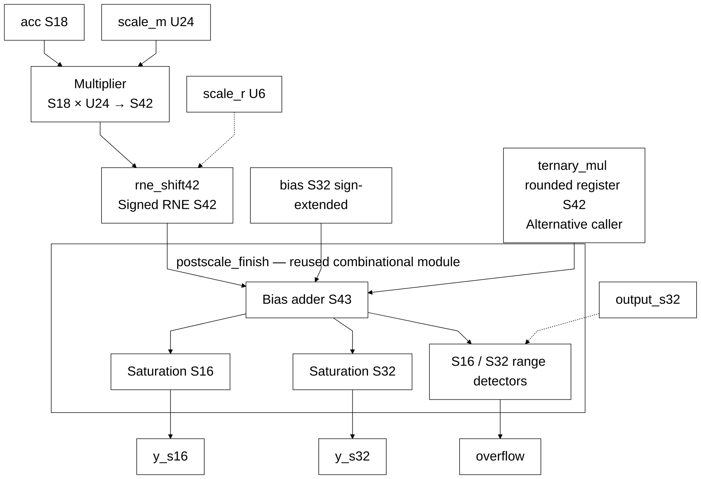
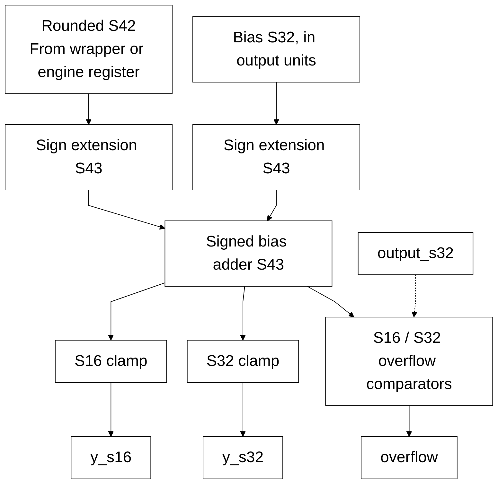

# postscale.sv — Đổi scale, cộng bias và saturation

[Tài liệu](../../README.md) → [Hierarchy RTL](../README.md) → [Mục lục từng file](README.md)

**Trạng thái:** Đang dùng — postscale_finish sau các register trong ternary_mul; postscale giữ interface tổ hợp cho kiểm tra.

**Source:** [postscale.sv](<../../../Verilog%20Source%20code/postscale.sv>). **Số dòng:** 46. **SHA-256:** `b9cb61b7014c037c408340a8042b4c0862ed46997754d9b4dee40056835e7160`.

## Khối này làm gì?

File có hai module. `postscale` giữ interface tổ hợp: accumulator S18 nhân hệ số U24, RNE rồi cộng bias và saturation. `postscale_finish` chỉ nhận rounded S42 rồi cộng bias S32/clamp. Ternary engine chốt product và rounded result trước khi gọi module finish; không instantiate toàn chuỗi tổ hợp nữa.

## Sơ đồ kiến trúc tổng quan



Nét liền là dữ liệu, nét đứt là format/control. Hai module trong file này đều tổ hợp; product/round registers của engine nằm trong [ternary_mul](ternary_mul.sv.md), không nằm trong interface `postscale`.

## Cách hoạt động chi tiết

1. S18×U24 vừa tích S42. M được thêm bit zero trước cast signed để không đổi nghĩa U24.
2. `rne_shift42` giữ thương floor và guard/sticky/parity như RNE S64. Khi r≥42, mọi giá trị S42 làm tròn về zero; S42 min tại r=42 là tie −0,5 và chọn zero chẵn.
3. Rounded S42 cộng bias S32 trong S43, không cắt bit trung gian. Bias đã ở đơn vị output nên cộng sau rounding.
4. `postscale_finish` sign-extend S43 khi gọi hàm saturation chung, đồng thời báo overflow theo format S16/S32 đang chọn.
5. Interface tổ hợp vẫn dùng cho reference regression. Engine gọi `postscale_finish` sau SCALE_PRODUCT → SCALE_ROUND → SCALE, thêm hai clock mỗi output row.

[12.720 ca postscale](../../../tests/results.json) kiểm tra tương đương với reference rộng, gồm shift 0…63, accumulator/M/bias cực trị và clamp. [Timing hub](../../verification/timing/README.md) ghi ảnh hưởng Fmax và chu kỳ model.

## Các nhóm logic trong source

### [Dòng 1–26: Interface postscale tổ hợp](<../../../Verilog%20Source%20code/postscale.sv#L1>)

<!-- source-range:1:26 -->
```systemverilog
`default_nettype none
module postscale (
    input logic signed [17:0] acc,
    input logic [23:0] scale_m,
    input logic [5:0] scale_r,
    input logic signed [31:0] bias,
    input logic output_s32,
    output logic signed [31:0] y_s32,
    output logic signed [15:0] y_s16,
    output logic overflow
);
    import npu_pkg::*;
    logic signed [41:0] product;
    logic signed [41:0] rounded;
    logic_mul #(.A_W(18), .B_W(24), .OUT_W(42), .SIGNED_A(1), .SIGNED_B(0)) u_bit_mul
        (.a(acc), .b(scale_m), .product(product));
    always_comb begin

        rounded = rne_shift42(product, scale_r);
    end
    postscale_finish u_finish(.rounded(rounded), .bias(bias),
        .output_s32(output_s32), .y_s32(y_s32), .y_s16(y_s16),
        .overflow(overflow));
endmodule

// Reused by the combinational reference interface above and the registered
```

**Mục đích.** Wrapper giữ accumulator/M/r/bias ports như trước. Tích S42 được RNE bằng hàm đúng độ rộng; module finish thực hiện cộng bias/clamp. Wrapper không có clock hoặc handshake.

### [Dòng 27–46: Bias adder S43 và saturation dùng chung](<../../../Verilog%20Source%20code/postscale.sv#L27>)

<!-- source-range:27:46 -->
```systemverilog
// ternary datapath. An S42 rounded product plus S32 bias fits exactly in S43.
module postscale_finish (
    input logic signed [41:0] rounded,
    input logic signed [31:0] bias,
    input logic output_s32,
    output logic signed [31:0] y_s32,
    output logic signed [15:0] y_s16,
    output logic overflow
);
    import npu_pkg::*;
    logic signed [42:0] biased;
    always_comb begin
        biased = {rounded[41], rounded} + {{11{bias[31]}}, bias};
        y_s32 = sat_s32(64'(biased));
        y_s16 = sat_s16(64'(biased));
        overflow = output_s32 ? (biased > 43'sd2147483647 || biased < -43'sd2147483648)
         : (biased > 43'sd32767 || biased < -43'sd32768);
    end
endmodule
`default_nettype wire
```

**Mục đích.** Rounded S42 cộng bias S32 trong S43. Hai output được clamp song song; output_s32 chọn miền kiểm tra overflow. Engine registered và wrapper tổ hợp dùng đúng một implementation finish.

#### Sơ đồ khối phần cứng của nhóm


