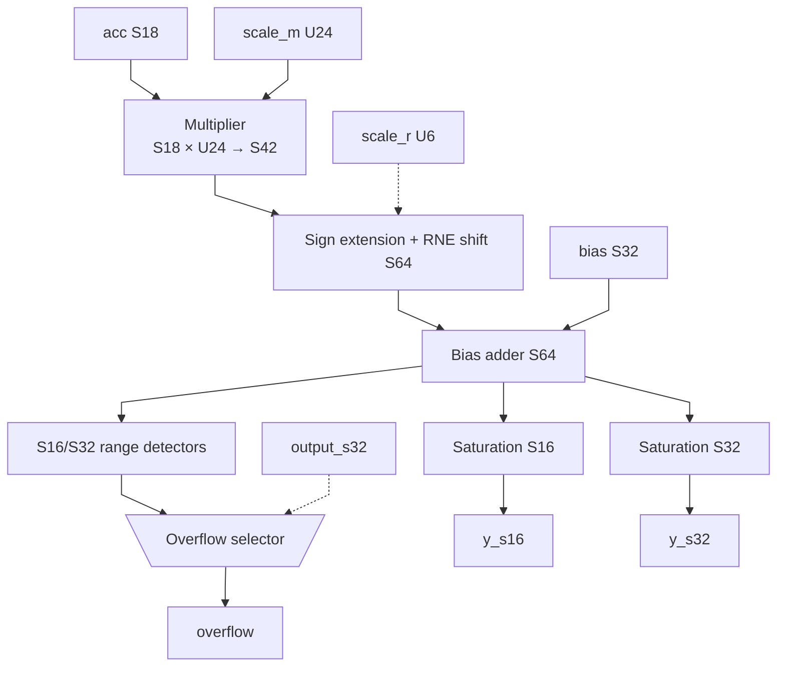
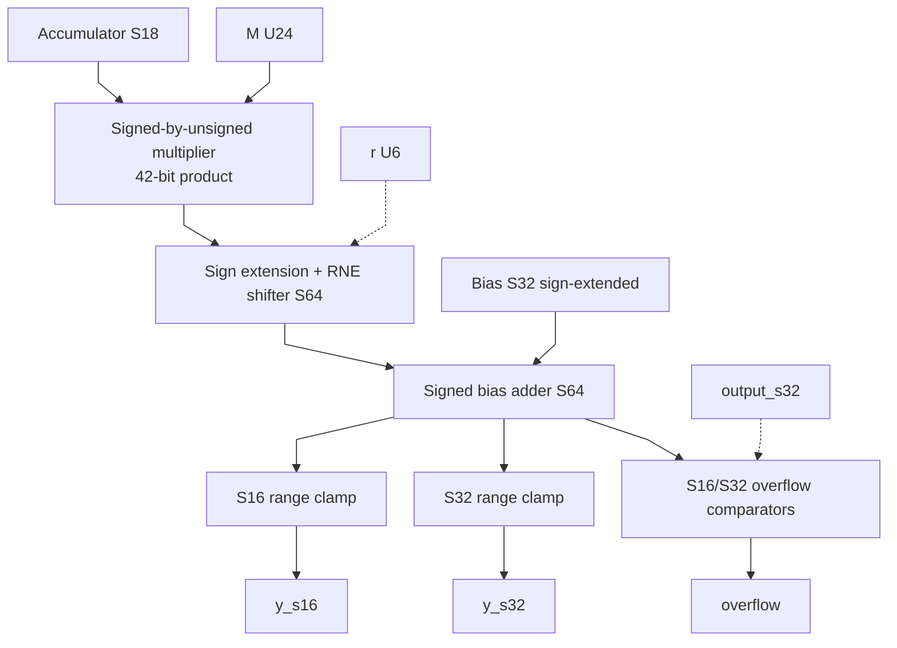

# postscale.sv — Đổi scale, cộng bias và saturation

[Tài liệu](../../README.md) → [Hierarchy RTL](../README.md) → [Mục lục từng file](README.md)

**Trạng thái:** Đang dùng — sau accumulator.

**Source:** [postscale.sv](<../../../Verilog%20Source%20code/postscale.sv>). **Số dòng:** 24. **SHA-256:** `462922989c54f4b4346d27cd05d5cdf342bb56a882c0cb8325ef035c36c7452a`.

## Khối này làm gì?

Accumulator S18 là tổng raw q×ternary. Cần nhân hệ số M/2^r để về đơn vị output, rồi cộng bias S32 đã cùng đơn vị đó. Hai output y_s16/y_s32 được tính đồng thời; flag output_s32 chọn miền kiểm tra overflow.

## Sơ đồ kiến trúc tổng quan



MUX dùng hình thang rộng ở phía nhiều ngõ vào và thu hẹp về ngõ ra; decoder/demux dùng hình thang ngược lại, mở rộng về phía nhiều ngõ ra. Hình chữ nhật có các vạch ngang biểu diễn bộ nhớ hoặc bank descriptor. Các hình chữ nhật thường là datapath, thanh ghi đơn hoặc giao diện. Nét liền là đường dữ liệu, nét đứt là điều khiển/cấu hình. Mũi tên hồi tiếp biểu diễn kết nối phần cứng. Sơ đồ không biểu diễn thứ tự chu kỳ, trạng thái FSM hoặc các tầng pipeline CPU.

## Cách hoạt động chi tiết

Tích S42 → sign-extend S64 → RNE shift r → cộng bias → clamp. Không cộng bias trước scale vì bias đã ở đơn vị output. Module tổ hợp, không tự có start/done; FSM ternary_mul quyết định lúc dùng kết quả.

1. Accumulator S18 nhân M U24; M được zero-extend trước cast signed để bit cao không bị hiểu là dấu.
2. Tích S42 được mở rộng S64 và chia 2^r bằng RNE.
3. Bias S32 đã ở đơn vị output nên được cộng sau rescale. Cộng trước scale sẽ đổi ý nghĩa bias.
4. Hai output clamp S16/S32 được tính song song; `output_s32` chọn miền báo overflow và đường pack.
5. Đây là logic tổ hợp; start/done và thời điểm dùng kết quả thuộc FSM ternary_mul.

## Các nhóm logic trong source

Source được chia theo chức năng. Mỗi nhóm giữ nguyên phạm vi dòng để đối chiếu, nhưng phần giải thích tập trung vào quan hệ giữa các câu lệnh thay vì lặp lại từng dấu ngoặc, khai báo hoặc phép gán.


### [Dòng 1–14: Giao diện và intermediate](<../../../Verilog%20Source%20code/postscale.sv#L1>)

<!-- source-range:1:14 -->
```systemverilog
module postscale (
    input logic signed [17:0] acc,
    input logic [23:0] scale_m,
    input logic [5:0] scale_r,
    input logic signed [31:0] bias,
    input logic output_s32,
    output logic signed [31:0] y_s32,
    output logic signed [15:0] y_s16,
    output logic overflow
);
    import npu_pkg::*;
    logic signed [41:0] product;
    logic signed [63:0] rounded;
    logic signed [63:0] biased;
```

**Mục đích.** U24 M được thêm bit 0 trước cast signed để không bị hiểu nhầm là số âm.

**Cách phần code hoạt động.** Nhóm này định nghĩa giao diện, độ rộng, kiểu hoặc tín hiệu trung gian. Nó tạo cấu trúc để các nhóm xử lý sau sử dụng, chưa tự biểu diễn một bước runtime riêng.

**Tín hiệu và dữ liệu chính.** `acc`: accumulator S18; `scale_m`: multiplier U24 của postscale; `scale_r`: shift U6 của postscale; `bias`: bias S32 theo đơn vị output; `output_s32`: chọn format output S32 thay vì S16; `y_s32`: output clamp S32; và 5 tín hiệu phụ khác trong đoạn code.


### [Dòng 15–24: Số học](<../../../Verilog%20Source%20code/postscale.sv#L15>)

<!-- source-range:15:24 -->
```systemverilog
    always_comb begin
        product = $signed(acc) * $signed({1'b0, scale_m});
        rounded = rne_shift64({{22{product[41]}}, product}, scale_r);
        biased = rounded + {{32{bias[31]}}, bias};
        y_s32 = sat_s32(biased);
        y_s16 = sat_s16(biased);
        overflow = output_s32 ? (biased > 64'sh0000_0000_7fff_ffff || biased < - 64'sh0000_0000_8000_0000)
         : (biased > 64'sh0000_0000_0000_7fff || biased < - 64'sh0000_0000_0000_8000);
    end
endmodule
```

**Mục đích.** Giữ tích đầy đủ, làm tròn rồi cộng bias; overflow cho biết clamp theo format output đang chọn.

**Cách phần code hoạt động.** Có logic tổ hợp: output/intermediate được tính từ input hiện tại; các giá trị mặc định đầu khối giúp tránh suy ra latch.

**Tín hiệu và dữ liệu chính.** `product`: tích trung gian trước rescale; `acc`: accumulator S18; `scale_m`: multiplier U24 của postscale; `rounded`: giá trị sau rounding; `scale_r`: shift U6 của postscale; `biased`: giá trị sau cộng bias; và 5 tín hiệu phụ khác trong đoạn code.

**Điểm cần đọc kỹ.** Bias được định nghĩa theo đơn vị output nên phải cộng sau RNE postscale. Đưa bias vào trước phép nhân M sẽ làm bias bị scale lần nữa.

#### Sơ đồ khối phần cứng của nhóm



