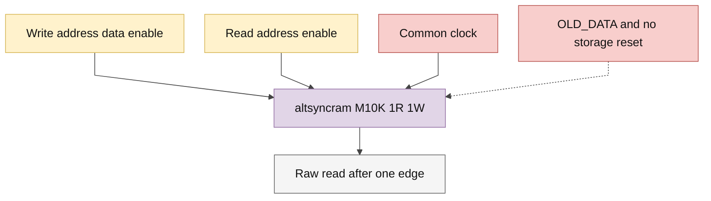

# quartus_word_ram.sv — FPGA memory technology binding

> **Category: GUIDE. Scope: CURRENT (may also have legacy callers).** RTL is authoritative; diagrams use the [shared visual style](../../diagrams/diagram_style.md).
[Tài liệu](../../README.md) → [Source guide](../README.md) → [Mục lục](README.md)

**Source:** [quartus_word_ram.sv](<../../../Verilog%20Source%20code/quartus_word_ram.sv>).

## At a glance

| Item | Description |
|---|---|
| Responsibility | IP duy nhất của Quartus trong graph là altsyncram M10K. Một read và một write dùng chung clock, raw read một cạnh; OLD_DATA khi cùng địa chỉ. Storage/output không reset, không khởi tạo. ASIC thay module này phía sau adapter, giữ nguyên interface và contract. |

## Sơ đồ kiến trúc

## Important state / datapath groups

### [Dòng 1–15: Technology boundary and ports](<../../../Verilog%20Source%20code/quartus_word_ram.sv#L1>)

Compute/control không instantiate vendor primitive. Client chỉ truy cập qua pipelined_word_ram; địa chỉ phải nhỏ hơn ROWS.

### [Dòng 16–29: Memory configuration](<../../../Verilog%20Source%20code/quartus_word_ram.sv#L16>)

Port A write và port B read. Address/read control B chốt CLOCK0; output unregistered giữ raw latency một cạnh. M10K không dùng DSP hay PLL.

### [Dòng 30–39: Clock and port binding](<../../../Verilog%20Source%20code/quartus_word_ram.sv#L30>)

Clock enables bypass và các cổng không dùng tie constant. Reset/cancellation thuộc adapter ngoài; memory không có reset.
