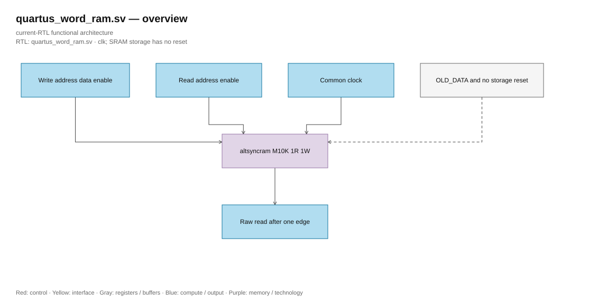

# quartus_word_ram.sv — FPGA memory technology binding

<!-- reading-navigation:start -->
[Documentation](../../README.md) → [02 · Architecture](../../02-architecture/README.md) → [Module catalog](README.md)

| Reading guide | Document |
|---|---|
| New to the subject | [NPU and RTL fundamentals](../../00-start-here/fundamentals.md) · [Glossary](../../00-start-here/glossary.md) |
| Learn the RTL syntax | [How to read the SystemVerilog](../../00-start-here/reading-systemverilog.md) |
| Read first | [Full RTL graph](../full_graph.md) |
| Related implementation | [sram_word_tile.sv](sram_word_tile.sv.md) |
<!-- reading-navigation:end -->

> **Category: GUIDE. Scope: CURRENT (may also have legacy callers).** RTL is authoritative; diagrams use the [shared visual style](../../diagrams/diagram_style.md).

**Source:** [quartus_word_ram.sv](<../../../Verilog%20Source%20code/quartus_word_ram.sv>).

## At a glance

| Item | Description |
|---|---|
| Responsibility | The only Quartus IP in the graph is the altsyncram M10K. One read and one write share the same clock, raw read on one edge; OLD_DATA when the address is the same. Storage/output is not reset, not initialized. ASIC replaces this module behind the adapter, keeping the interface and contract unchanged. |

## Architecture diagram

[Editable draw.io — quartus_word_ram.sv — overview](../../diagrams/architecture.drawio) · Page `53_quartus_word_ram.sv_1`.

## Important state / datapath groups

### [Lines 1–15: Technology boundary and ports](<../../../Verilog%20Source%20code/quartus_word_ram.sv#L1>)

Compute/control does not instantiate vendor primitive. Client only accesses through pipelined_word_ram; address must be less than ROWS.

### [Lines 16–29: Memory configuration](<../../../Verilog%20Source%20code/quartus_word_ram.sv#L16>)

Port A write and port B read. Address/read control B latches CLOCK0; output unregistered keeps raw latency one edge. M10K does not use DSP or PLL.

### [Lines 30–39: Clock and port binding](<../../../Verilog%20Source%20code/quartus_word_ram.sv#L30>)

Clock enables bypass and ports do not use tie constant. Reset/cancellation belongs to external adapter; memory has no reset.
