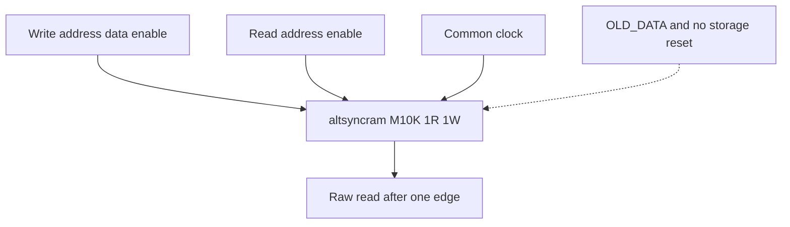

# quartus_word_ram.sv — FPGA memory technology binding

[Tài liệu](../../README.md) → [Source guide](../README.md) → [Mục lục](README.md)

**Source:** [quartus_word_ram.sv](<../../../Verilog%20Source%20code/quartus_word_ram.sv>). **Số dòng:** 39. **SHA-256:** `c38b8642bfb143f71bf89902b767844086f0894a16db11ebc0abe98131709a0b`.

## Khối này làm gì?

IP duy nhất của Quartus trong graph là altsyncram M10K. Một read và một write dùng chung clock, raw read một cạnh; OLD_DATA khi cùng địa chỉ. Storage/output không reset, không khởi tạo. ASIC thay module này phía sau adapter, giữ nguyên interface và contract.

## Sơ đồ kiến trúc



## Cách hoạt động chi tiết

IP duy nhất của Quartus trong graph là altsyncram M10K. Một read và một write dùng chung clock, raw read một cạnh; OLD_DATA khi cùng địa chỉ. Storage/output không reset, không khởi tạo. ASIC thay module này phía sau adapter, giữ nguyên interface và contract.

## Các nhóm logic trong source

### [Dòng 1–15: Technology boundary and ports](<../../../Verilog%20Source%20code/quartus_word_ram.sv#L1>)

<!-- source-range:1:15 -->
```systemverilog
// FPGA memory technology binding only. ASIC integration replaces this module
// behind pipelined_word_ram; compute/control contain no Quartus IP instances.
// One synchronous read and one write, common clock, one-edge raw read latency.
// Mixed-port same-address collision returns OLD_DATA. No storage/output reset.
module quartus_word_ram #(
    parameter int WIDTH = 32,
    parameter int ROWS = 4096,
    parameter int ADDR_W = $clog2(ROWS)
) (
    input logic clk, rd_en, wr_en,
    input logic [ADDR_W - 1:0] rd_addr, wr_addr,
    input logic [WIDTH - 1:0] wr_data,
    output wire [WIDTH - 1:0] rd_data
);
    altsyncram #(
```

Compute/control không instantiate vendor primitive. Client chỉ truy cập qua pipelined_word_ram; địa chỉ phải nhỏ hơn ROWS.

### [Dòng 16–29: Memory configuration](<../../../Verilog%20Source%20code/quartus_word_ram.sv#L16>)

<!-- source-range:16:29 -->
```systemverilog
        .intended_device_family("Cyclone V"),
        .operation_mode("DUAL_PORT"), .ram_block_type("M10K"),
        .width_a(WIDTH), .width_b(WIDTH),
        .widthad_a(ADDR_W), .widthad_b(ADDR_W),
        .numwords_a(ROWS), .numwords_b(ROWS),
        .width_byteena_a(1), .width_byteena_b(1),
        .address_reg_b("CLOCK0"), .rdcontrol_reg_b("CLOCK0"),
        .outdata_reg_b("UNREGISTERED"), .outdata_aclr_b("NONE"),
        .clock_enable_input_a("BYPASS"), .clock_enable_input_b("BYPASS"),
        .clock_enable_output_a("BYPASS"), .clock_enable_output_b("BYPASS"),
        .read_during_write_mode_mixed_ports("OLD_DATA"),
        .power_up_uninitialized("TRUE"), .lpm_type("altsyncram")
    ) u_memory (
        .clock0(clk), .clock1(1'b1),
```

Port A write và port B read. Address/read control B chốt CLOCK0; output unregistered giữ raw latency một cạnh. M10K không dùng DSP hay PLL.

### [Dòng 30–39: Clock and port binding](<../../../Verilog%20Source%20code/quartus_word_ram.sv#L30>)

<!-- source-range:30:39 -->
```systemverilog
        .clocken0(1'b1), .clocken1(1'b1), .clocken2(1'b1), .clocken3(1'b1),
        .aclr0(1'b0), .aclr1(1'b0),
        .address_a(wr_addr), .address_b(rd_addr),
        .addressstall_a(1'b0), .addressstall_b(1'b0),
        .data_a(wr_data), .data_b({WIDTH{1'b0}}),
        .wren_a(wr_en), .wren_b(1'b0), .rden_a(1'b0), .rden_b(rd_en),
        .byteena_a(1'b1), .byteena_b(1'b1),
        .q_a(), .q_b(rd_data), .eccstatus()
    );
endmodule
```

Clock enables bypass và các cổng không dùng tie constant. Reset/cancellation thuộc adapter ngoài; memory không có reset.
