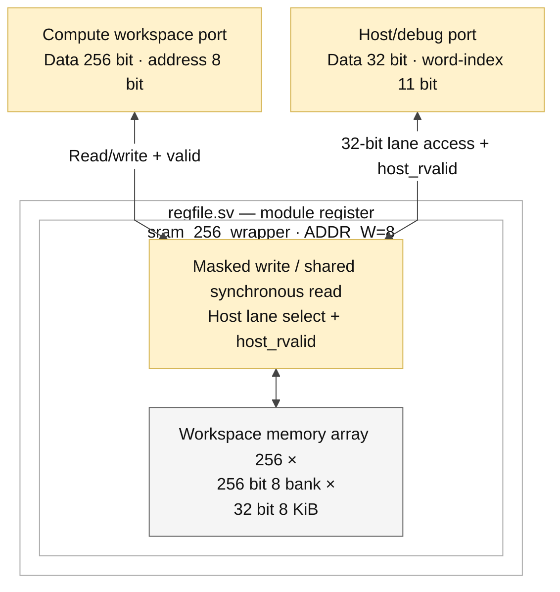

# regfile.sv — Wrapper SRAM 8 KiB

> **Category: GUIDE. Scope: LEGACY.** RTL is authoritative; diagrams use the [shared visual style](../../diagrams/diagram_style.md).
[Tài liệu](../../README.md) → [Hierarchy RTL](<../legacy/README.md>) → [Mục lục từng file](README.md)

**Trạng thái:** Đang dùng.

**Source:** [regfile.sv](<../../../Verilog%20Source%20code/regfile.sv>).

## At a glance

| Item | Description |
|---|---|
| Responsibility | File này giữ interface riêng cho workspace nhưng dùng chung `sram_256_wrapper` với ADDR_W=8. Module có tên `register`; register ở đây là workspace SRAM, không phải một bank 8 thanh ghi vector như tên lịch sử dễ gợi ra. |

## Sơ đồ kiến trúc tổng quan

## Main flow

Compute đọc/ghi word 256; host chọn một slice32. Wrapper không thêm FSM hay đổi latency. Mỗi port được nối một-một vào implementation chung; xem sram_256_wrapper để hiểu timing và write mask.

1. Đây là wrapper workspace; tên module `register` được giữ để tương thích và không phải register file pipeline của thesis.
2. Compute address 8 bit chọn 256 word 256 bit. Host address thêm ba bit để chọn tám lane 32 bit.
3. Port được nối thẳng vào `sram_256_wrapper`; wrapper không thêm storage, latency hoặc arbitration.
4. Timing read, mask write và quy tắc không overlap do implementation chung quyết định.

**Quy ước RTL.** Wrapper nối `host_rvalid` từ SRAM lên top. Backend nhận read/address từ frontend và trả host_rvalid sau hai cạnh lên. Frontend top chốt request/response, nên host ngoài giữ read/address bốn cạnh lên đến host_ready. Memory có tám bank 32 bit, write-enable riêng từng lane. Wrapper chỉ nối cổng, không thêm register hoặc đổi latency. Simulation và synthesis dùng cùng hợp đồng memory. Xem [implementation và sơ đồ SRAM](sram_256_wrapper.sv.md).

## Important state / datapath groups

### [Dòng 1–21: Hai giao diện](<../../../Verilog%20Source%20code/regfile.sv#L1>)

**Mục đích.** Địa chỉ compute đếm word 256, host đếm word 32. Host address byte đã được top bỏ hai bit alignment.

**Cách phần code hoạt động.** Nhóm này định nghĩa giao diện, độ rộng, kiểu hoặc tín hiệu trung gian. Nó tạo cấu trúc để các nhóm xử lý sau sử dụng, chưa tự biểu diễn một bước runtime riêng.

**Tín hiệu và dữ liệu chính.** `rd_en`: request đọc của compute; `rd_addr`: địa chỉ word cần đọc; `rd_data`: word dữ liệu đọc ra; `rd_valid`: response đọc hợp lệ; `wr_en`: cho phép ghi compute; `wr_addr`: địa chỉ word cần ghi; và 6 tín hiệu phụ khác trong đoạn code.

### [Dòng 22–40: Instance SRAM](<../../../Verilog%20Source%20code/regfile.sv#L22>)

**Mục đích.** Parameter ADDR_W quyết định depth; các named port nối trực tiếp cùng chức năng.

**Cách phần code hoạt động.** Có instance module con; named-port ở nhóm này xác định chính xác đường control/data giữa hai cấp hierarchy.

**Tín hiệu và dữ liệu chính.** `rd_en`: request đọc của compute; `rd_addr`: địa chỉ word cần đọc; `rd_data`: word dữ liệu đọc ra; `rd_valid`: response đọc hợp lệ; `wr_en`: cho phép ghi compute; `wr_addr`: địa chỉ word cần ghi; và 6 tín hiệu phụ khác trong đoạn code.
